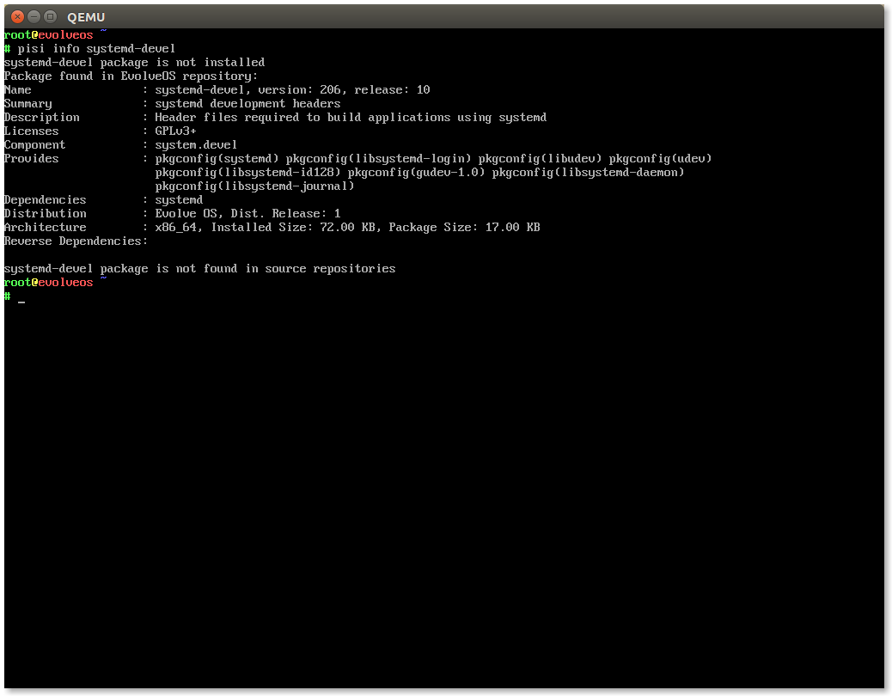

+++
author = "ikey"
categories = [
"News"
]
date =  "2014-06-03T19:19:48Z"

title = "Evolve OS Validation ISO"
url = "/2014/06/03/evolve-os-validation-iso/"
+++

Hello all.

Today I'm releasing a validation ISO for Evolve OS in order to get the ball rolling for a full release. This is a headless (no-desktop) uninstallable ISO which will enable 
people to help me in cleaning/validating the base system before we progress any further.

**UPDATE: This ISO is vulnerable due to [CVE-2014-0198](http://cve.mitre.org/cgi-bin/cvename.cgi?name=CVE-2014-0198) and its not [possible to update the ISO](https://solus-project.com/project/os/issues/OS-4). Download at your own risk!**
<!--more-->

**Main changes**

Networking has been introduced in this ISO and is enabled by default, enabling further testing. Many developer friendly changes have been made to PiSi, such as supporting pkgconfig style dependencies and automatically expanding binary and devel dependencies for packaging. Also note it's now possible to easily boot via Qemu using the '-cdrom' option as the legacy IDE subsystem was disabled in the kernel.


Every package has been rebuilt and is synced with the Evolve OS package repository (enabled by default in the ISO) and packages have far superior dependencies 
to before, making packaging much simpler and ensuring users do not have broken packages.

You'll see how much they've improved by issuing:

```
pisi info glibc
```


And you'll be able to clearly see the reverse dependencies of glibc (automatic). For developers, try:

```
pisi info systemd-devel
```


You'll see automatic exports of pkgconfig names in the output.

**Download URIs: (171MB)**

[Germany (DE)](http://mirror.layerjet.com/evolveos/images/Evolve-OS-Validation.iso)

[France (FR)](http://mirror6.layerjet.com/evolveos/images/Evolve-OS-Validation.iso)

**MD5SUM:**

```
68f52be33f4d2410e782d729870d8673  Evolve-OS-Validation.iso
```

Note that networking is available in this image though firmware isn't available, so it is most beneficial to test the image within Qemu. What to validate:

* Ensure package management behaves as expected
* Ensure there are no service failures or strange log entries
* Ensure no excess files are installed (Identify packages installing files to /usr/include for example, pacakges that must be split. I'm aware of this issue but having a list to 
work with is nice) -- consult `pisi search-file <PATH>`
* Ensure networking, SSL, etc, work as expected.
* Ensure PAM/auth/security is working (using the live account, root, sudo)
* Check that "pisi build" works as expected, and help identify packages that should *not* be in the system.devel component (automatically installed)
* Help me weed out files in /usr/share/ that are just not needed by default (README*, documentation, man pages that aren't crucial, etc) so that we can reduce the 
overall footprint

Any help you can find to help get these base issues will be enormously appreciated! The sooner we can iron out base level issues the sooner we can put out a full release. 
Anyone who is interested in joining the packaging effort, please note this should really just be out of personal/professional interest, there is no official "team" structure, 
and the only form of accepting packaging fixes is via pull requests on our [GitHub repo](https://github.com/solus-project/repository).

**Building a package**

The quickest way to test is by building from our source repo on GitHub:

```
pisi build https://raw.githubusercontent.com/evolve-os/repository/master/system/base/nano/pspec.xml
```

Ensure the package builds and installs (install the resulting .eopkg files) -- remember that the ISO is not persistent! Those interested in helping with packaging and 
cleaning up the repository should drop a comment and I'll introduce them to my KVM build system 🙂

**Testing the ISO**

The preferred method of testing the ISO right now is inside Qemu as we're performing package and base validation, not hardware support. Launch Evolve OS by invoking 
the following command:

```
qemu-system-x86_64 -enable-kvm -m 1024m -cdrom EvolveOS-Validation.iso -vga std
```

Note that "-vga std" is required as we have KMS enabled by default in preparation for the introduction of the desktop.

Login is "live" (with no password, hit enter) or "root:root"

**Feedback/bugs**

For now, please use the comment section to report issues, or drop me an email to ikey DOT doherty AT gmail DOT com

If a bug tracker or forum are genuinely needed, please tell me and I'll get them set up. Please note we don't have an SSL certificate, so HTTPS is completely 
disabled on this server and is a potential issue for supporting login-based systems like forums or bug trackers.

