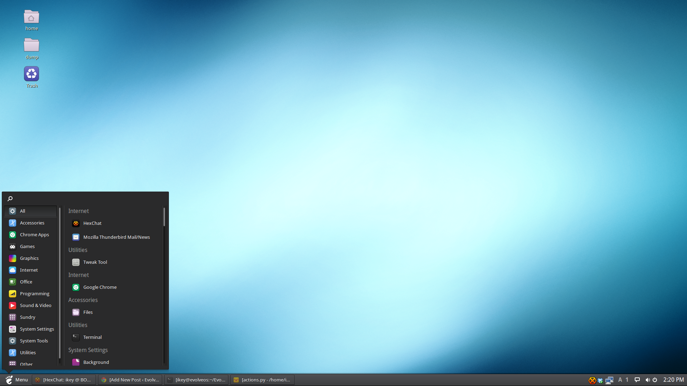

---
authors:
  - name: Ikey Doherty
    link: https://github.com/ikeycode
    image: https://avatars.githubusercontent.com/u/53261402?v=4
categories:
- Budgie
date: "2014-12-07T14:25:58Z"
title: Happy Birthday, Budgie!
url: /2014/12/07/happy-birthday-budgie/
---

As of today, Budgie now one year old! The very first commit was made to the git repository on the 7th of December, 2013. What started out as a simple quest to satisfy 
my own personal needs for a desktop, has evolved over the last year with the help of our fantastic community and contributors.

Here's what Budgie used to look like back then

Back then, we had no proper applet support, and you couldn't even change the location of the applets or panels. In fact, it was a bit of a hard-coded mess.

Skip forward 12 months, and we get this: (using the traditional GNOME2 style)

Or the more well known Budgie style (Chrome OS inspired)

It's been an amazing year so far, and I want to personally thank everyone who has been involved in the project, in whichever capacity, for all of their amazing work.

Now, time to celebrate the Budgie's Birthday! 🙂