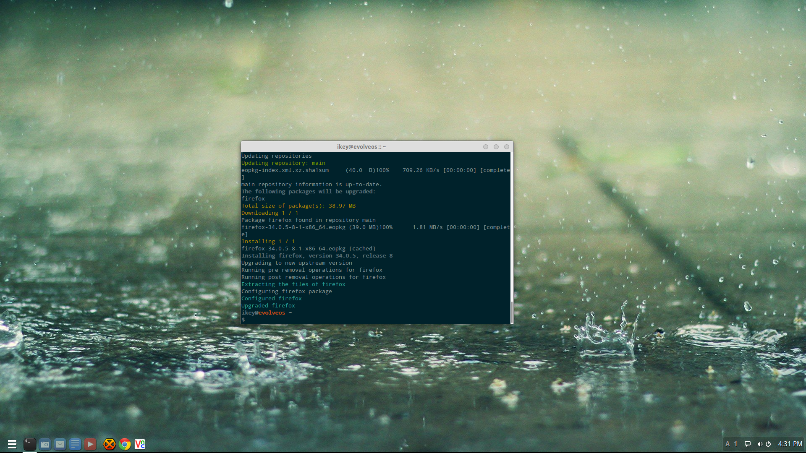

---
authors:
  - name: Ikey Doherty
    link: https://github.com/ikeycode
    image: https://avatars.githubusercontent.com/u/53261402?v=4
tags:
- packages
date: "2014-12-13T16:37:01Z"
title: Firefox 34.0.5 Now Available
url: /2014/12/13/firefox-34-0-5-now-available/
---

Evolve OS users should note that Firefox 34.0.5 is now available in the repositories. To update please issue the following command in your favourite terminal 
emulator (i.e. GNOME Terminal):

```
sudo eopkg up
```

