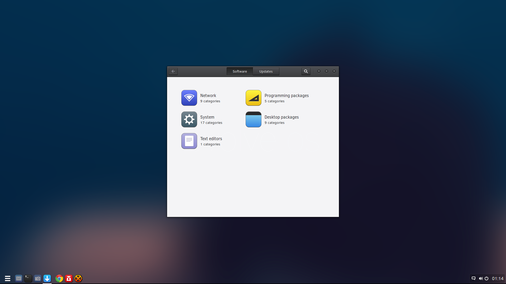

---
authors:
  - name: Ikey Doherty
    link: https://github.com/ikeycode
    image: https://avatars.githubusercontent.com/u/53261402?v=4
tags:
- News
- Releases
date: "2015-01-26T01:40:07Z"
title: Beta 1 Released
url: /2015/01/26/beta-1-released/
---

The Evolve OS team is proud to announce the release of Evolve OS Beta 1. Evolve OS is an independent Linux distribution featuring the Budgie Desktop, aimed at desktop users.

We're cutting the marketing speak and getting right to the point, we want to give you something you can just use, and just works.

### Feature Improvements

Evolve OS now features a preliminary version of evolve-sc, the Evolve OS Software Center. It's aim is to simplify the updating and installation of software, providing a 
simple interface to get the job done. Given its introductory status, we'd appreciate any and all feedback!

Budgie Desktop is currently in sync with our latest development version, and is now built upon the GNOME 3.14.2 stack. Consequently many existing issues with the 
desktop have been resolved, and as such provides a far more stable experience than previous.

Evolve OS now ships by default with support for many formats, and includes many codecs within the ISO download. As an example, H.264. MP3 and DVDs all work right away 
with no configuration, and you can access these using the preinstalled Totem or Rhythmbox packages. During the development process of this beta, we spent some 
considerable time optimising towards desktop usage, and consequently this has led to a spat of "GPU testing" by the team, or "slacking off to play games". After beta1 
we will be pushing automatic driver management and 32-bit support via our update mechanism, however for a sneak preview you can see 
here [Kerbal Space Program](https://kerbalspaceprogram.com/) running perfectly on Evolve OS Beta 1.

### Thanks to

There are an extraordinary amount of people we would like to thank. In no particular order we would like to extend our thanks to the [GNOME Project](http://www.gnome.org/),
 for providing us with a fantastic base to work from, our art team for providing so much on such little notice, Dirk Hohndel for kindly allowing us to use his diving 
 photography within our default art selection, our fantastically supportive (and patient!) community for all the hard work they've put in, and to everyone currently and 
 previously working on open source software, without whom none of this would be possible.

Courtesy of Dirk Hohndel -- CC-BY-3.0

### Getting Evolve OS

Please [just visit this link](https://solus-project.com/download/) to select an appropriate mirror, or torrent. We'd prefer if people opted for torrent, as due to a 
synchronisation issue two of the team members have put their personal resources forward to provide short-notice mirroring, and these locations may have to be 
changed. If we have a strong torrent, then the impact of a change will be negligible.

Once you've downloaded the ISO, either burn to a CD, or write the ISO file to a USB memory stick. For Linux distributions you should use the `dd` command, whilst 
for Windows users it may be suitable to use the [SUSE Image Writer](https://en.opensuse.org/SDB:Create_a_Live_USB_stick_using_Windows#Write_ISO_to_USB)

Once you have downloaded Evolve OS, you may use "Evo Assist" in the menu to find the various links needed to [report bugs](https://solus-project.com/project/os), etc. 
Installation of Evolve OS is achieved by using the "Install OS" shortcut in the main menu.

Note: This ISO is NOT UEFI-compatible. As the installer is not yet replaced, we did not want to confuse users by enabling boot, and not supporting installation, on UEFI 
hardware. For those requiring UEFI support, we ask you to please wait a short while for beta 2, which will feature full UEFI compatibility, LVM and encrypted disk support, 
as well as VPN connections, amongst other TODO items.