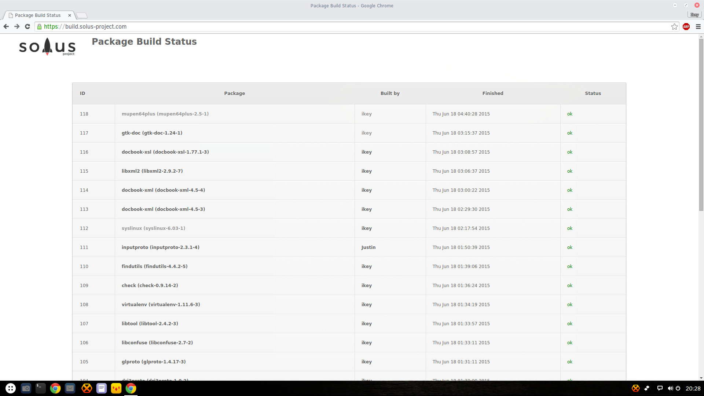
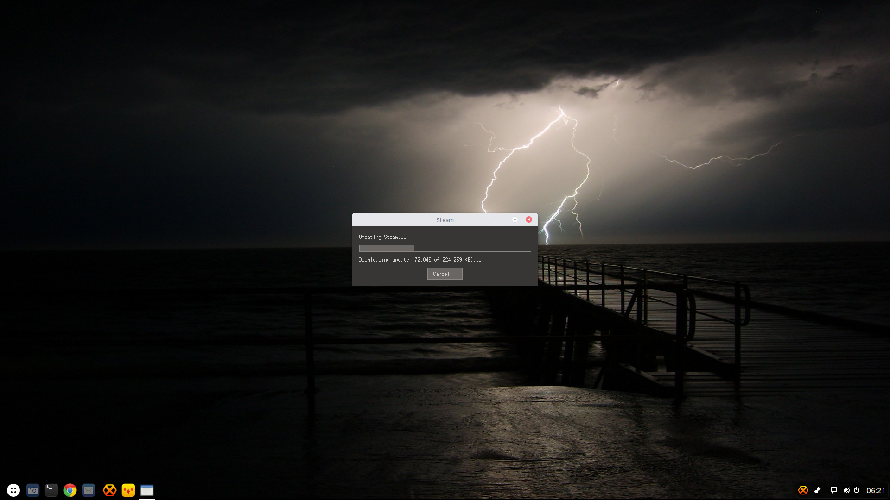

---
authors:
  - name: Ikey Doherty
    link: https://github.com/ikeycode
    image: https://avatars.githubusercontent.com/u/53261402?v=4
categories:
- News
date: "2015-06-18T19:45:40Z"
title: Status Update
url: /2015/06/18/status-update-2/
---

Hello all. It's high time for a status update and I'd like to let you all know where we're at, why there is a delay on releases, and how long things are going to take. 
TL;DR: Don't panic, s'all good. 
<!--more-->
#### Why We're Delaying

For those who are unware, my primary development rig took a nose dive recently. Further analysis shows that the motherboard has suicided. Being an old rig (Q6600) it 
will be getting replaced eventually, as opposed to repaired (cost vs benefit). Currently I'm working on an Intel NUC (you gotta love these little guys) whilst awaiting a 
replacement.

The delay is primarily due to the inaccessibility of required data. The drives are intact, there are backups, however to access them I need a tower or SATA adapters. I've opted 
for the latter, and I'm awaiting their delivery still. This has posed quite the setback as an enormous amount of development was happening on that rig (including, most 
ironically, our backup solution).

During the time I was without real computing power, it swiftly became obvious I'd bottlenecked the project immediately. As is said, the bus factor was incredibly high: if I 
were to be hit by a bus tomorrow (back then) -- it would kill the project stone dead due to tribal knowledge and isolated practices.

#### What I Did About It

The aforementioned bus factor, is an unacceptable factor when working with a longterm strategy. As such, we've completely overhauled the infrastructure. We've moved our 
singular package repository on GitHub to dedicated and owned infrastructure. Every single package has it's own repository, with very specific permissions. As an immediate 
benefit, we're now enabling package owners, for the first time.

This also required a change to how we **build** packages within Solus Project. We switched out our old build systems, and permit package owners to issue a package update 
directly to the unstable repository, by way of [our new build system](https://build.solus-project.com/). Now a package owner merely needs to issue a `make publish` 
command, and our public-key based system will queue their package for build and inclusion into the repository by our own trusted build machines.

This has resulted in an enormous acceleration in Solus development times, with 118 currently recorded builds being issued since Monday morning alone 
(we reset the counter for final deployment, the real figure is around 150).

#### Where We're At

We're actually in an awesome position now. Packages are being continuously maintained and included with no bottleneck or bus factor, a centralised developer 
workflow exists, and we're screaming through our workload with impressive velocity.

An enormous plus for many users: Steam is coming to Solus very soon! **Most of the emul32 work is done**, ready to start syncing into our repositories. Once 
Steam is integrated, we'll add the missing fglrx drivers, and a couple more nvidia driver branches, so that everyone is covered.

We recently included the **broadcom-sta** driver, which is undergoing further integration.

#### Timeline

We're going to need to tack at least 1 more month delay on releases. With your help, we can realise this much faster! Our documentation run is going to be complete in 
the next couple of days, and we want to make it as easy as possible for everyone to join in.

So, if you're running Solus, update update update! The updates are streaming out of the  gates right now, and we need active feedback. Did it break? **Tell us**! 
Need a package included? **Let us know**, or maintain it with us! You'll be able to update the package as and when you need, and we'll pull it in when its tested.

We need to now get **more software** available in Solus. I kicked things off last night by including mupen64plus. What do you need in Solus? We're aware the package 
count is low, but it will only remain that way if you don't get requesting!

#### Links and resources

This section will be updated in due course to reflect the *new* bug tracker.

- [Git Repositories](https://git.solus-project.com/?s=idle)
- [Build System](https://build.solus-project.com)
- [Working with the new infrastructure](https://git.solus-project.com/common/about/)
- [Current Bug Tracker](https://dev.solus-project.com)

#### Lastly..

For those who don't know, we've also launched our own [Patreon](https://www.patreon.com/solus?ty=h) very recently. This enables people to support the project on a 
monthly basis and help us attain our goals in a far shorter time -- which is beneficial to all.

If it becomes successful, we'll be able to host our own **user** repositories, and enable more services for users. Most importantly, if we reach $1000 a month, we will 
convert Solus into a fully registered company, giving ultimate assurance to our users.

**Ultimately**, our mission is to deliver an amazing experience tailored for the desktop. Not a respin, a repackaging, or a derivative thereof. A custom built, highly 
desktop optimised solution for you. We're not here to deliver yet another rethemed desktop, or follow the latest trend, like material design, or Mac, etc. We're here to 
deliver a real solution, with an enormous amount of experience and the technical capability to ensure it rocks your world.   