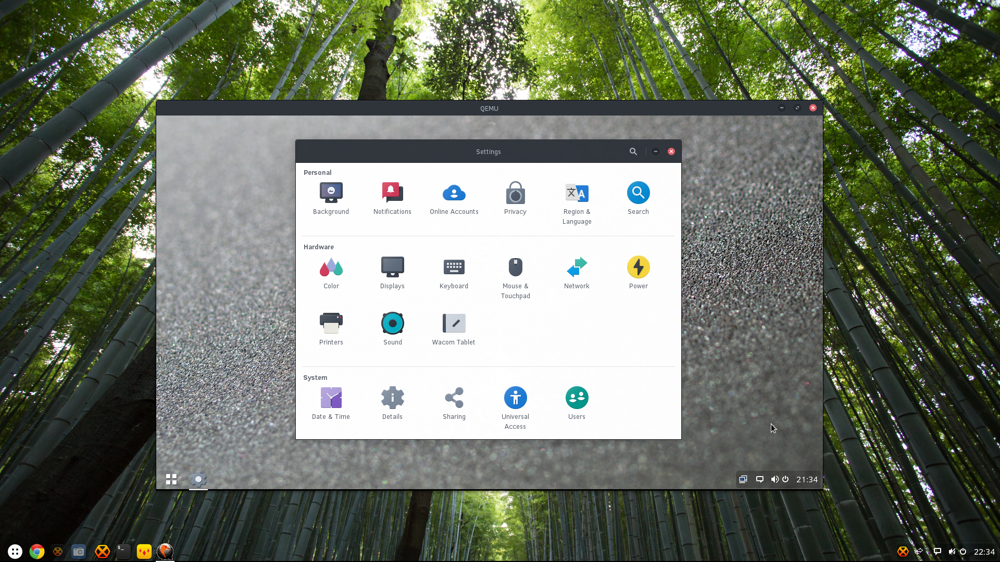

+++
author = "ikey"
categories = [
"News",
"Releases"
]
date =  "2015-07-13T21:39:07Z"
title = "Solus Daily: 0.201529.1.0"
url = "/2015/07/13/solus-daily-0-201529-1-0/"
+++

The latest Solus Operating System Daily ISO is now available for testing. Be reminded this is an unstable development ISO

See our first [daily ISO announcement](https://solus-project.com/2015/06/29/first-unstable-daily-iso/) for instructions on writing this 64-bit, Hybrid, UEFI-compatible ISO to USB medium. Remember, **unetbootin is not supported!**

Head over to the [download page](https://solus-project.com/download) now to obtain the latest daily ISO

Note: No password is required to login. Automatic login is disabled, simply hit the Login button to proceed.

This release also sees the introduction of the Arc-Darker theme as a new default.

#### Changes in this release:

**kernel**

- [Ikey Doherty: Enable CONFIG\_ATH9K\_HTC (Atheros AR9271), bug 22](https://git.solus-project.com/packages/kernel/commit/?id=9cc7c1c)

**lightdm-gtk-greeter**

- [Ikey Doherty: Switch to Arc-Darker](https://git.solus-project.com/packages/lightdm-gtk-greeter/commit/?id=91d7feb)

**freetype2**

- [Ikey Doherty: Split devel files into subpackage](https://git.solus-project.com/packages/freetype2/commit/?id=dd22e67)

**libcap2**

- [Ikey Doherty: Bump for rebuild](https://git.solus-project.com/packages/libcap2/commit/?id=31a73ae)
- [Ikey Doherty: Split devel files into subpackage](https://git.solus-project.com/packages/libcap2/commit/?id=c749d63)

**cairo**

- [Ikey Doherty: Fix issue with relno](https://git.solus-project.com/packages/cairo/commit/?id=0d4d122)
- [Ikey Doherty: Force a runtime dep on -devel for freetype2](https://git.solus-project.com/packages/cairo/commit/?id=19015ae)

**expat**

- [Ikey Doherty: Split devel files into subpackage](https://git.solus-project.com/packages/expat/commit/?id=b8d05c8)

**arc-gtk-theme**

- [Ikey Doherty: Update to 20150711 (dark headers, lightdm changes)](https://git.solus-project.com/packages/arc-gtk-theme/commit/?id=284e6ce)

**libtool**

- [Ikey Doherty: Fix missing files](https://git.solus-project.com/packages/libtool/commit/?id=1ab1d4e)
- [Ikey Doherty: Split development files into subpackage](https://git.solus-project.com/packages/libtool/commit/?id=91f4500)

**libvte**

- [Ikey Doherty: Convert to stateless configuration](https://git.solus-project.com/packages/libvte/commit/?id=1da26be)

**gsettings-desktop-schemas**

- [Ikey Doherty: Switch to Arc Darker](https://git.solus-project.com/packages/gsettings-desktop-schemas/commit/?id=34b55ce)

**bash**

- [Ikey Doherty: Convert to stateless configuration](https://git.solus-project.com/packages/bash/commit/?id=d59a8d9)

**baselayout**

- [Ikey Doherty: Use new etc/profile location, somewhat anti-stateless right now](https://git.solus-project.com/packages/baselayout/commit/?id=7c45701)