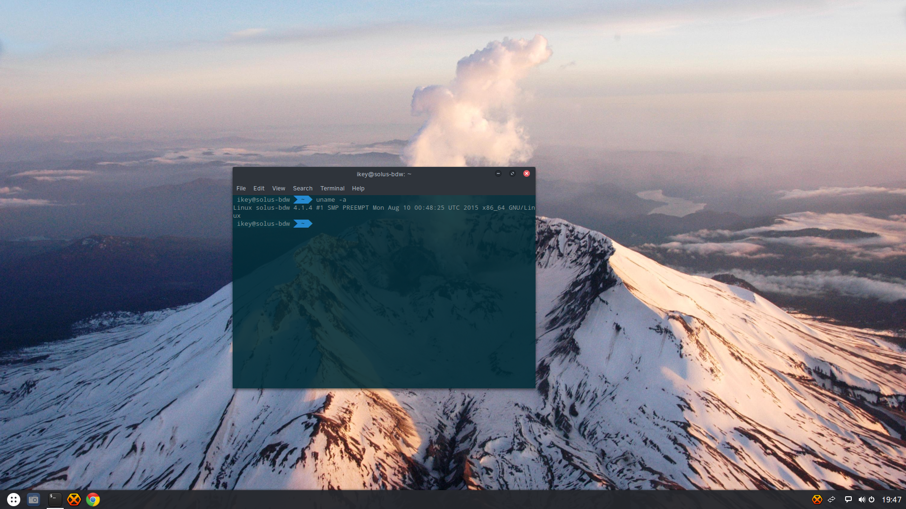

+++
author = "ikey"
categories = [
"News",
"Releases"
]
date =  "2015-08-10T20:57:38Z"
title = "All your drums are belong to us"
url = "/2015/08/10/all-your-drums-are-belong-to-us/"
+++

It's been a while since we've spoken here, the Solus team have been incredibly busy bringing you all kinds of awesome! But.. nobody told you about it. Well, time for some first hand news then! Remember, you can grab the latest daily ISO 
over on our [download page](https://solus-project.com/download/).

### A release date..

Yeah we decided one of these would be kinda handy. We used to have one, but then we hit these things called "setbacks" and "renames". So, we're announcing our new release date for our final version of Solus Operating System 1!

## October 1st, 2015 ← burn this into your eyeballs. You'll want to remember this.

We'll be releasing a new roadmap very soon, but you can be assured it has all the kinds of awesome you're looking for, like integrated backup management, automated driver management, a refurbished software center with appstream 
integration, installer with automatic assistance, partitioning, LVM, encryption, and all that funky goodness your work laptop needs. There's all the usual stuff like hardware enabling to come, support for various network types (mobile broadband, anyone?), 
and, well a few secret nuggets of awesomeness that will be announced separately 🙂

Solus v1 will be supported for 2 years. Solus v2 will be released 1 year after Solus v1, supported for 2 years, and well, you get the idea. You'll be able to upgrade from v1 to v2 without a reinstall, so don't worry yourself about that stuff.

### Some recent updates

Everyone likes new things, right? Well we've been getting a lot of software updated lately, but realised we hadn't really told everyone.. Well, far be it from me to miss an opportunity to brag a lil'.

- Linux Kernel 4.1.4
- Firefox 39.0.3
- LibreOffice 5.0.0.5

We've also made a few security updates lately:

- WebKitGTK+ updated to 2.8.5 -- addressing multiple security concerns
- libxml2 -- patched CVE-2015-1819
- libidn updated to 1.32 -- addressing multiple concerns in older versions
- kernel -- addressed CVE-2015-5697

Some obligatory mentions for other packages we also have:

- rust 1.2.0
- Atom 1.0.5
- Telegram 0.8.48

### Hardware enabling + kernel changes

We've done a huge bout of hardware enabling recently, ensuring the most recent (and some buggy HID) devices work. We've enabled a bunch more I2C touchpads and touchscreens, sensors, etc, to the extent we now have Solus working properly on 
the Asus Aspire R7, and even have initial support for the Surface Pro 3 (touchpad not yet functioning on this device, WIP). We now support a wide range of hardware, even very new GPUs (Broadwell working, and Broadwell+ an active target).

We did some further optimizing in the kernel, and decided to switch from the CFQ I/O scheduler to BFQ by default, for improved I/O performance. Given all of our recent toolchain hardening (with realtime binary analysis happening to flag packages not 
yet compliant), which will make us only too happy to move back to the SLUB allocator, in combination with our NOHZ PREEMPT kernel, performance will only continue to improve for all users alike.

Soon we'll begin to ship [thermald](https://01.org/linux-thermal-daemon/documentation/introduction-thermal-daemon) in our images by default for users of Intel machines, another nice comfort barrier to ensure the system doesn't overheat.

### Some recent changes

In addition to some of the other cool stuff we recently adopted from the [Clear Linux Project for Intel Architecture](https://solus-project.com/2015/07/27/clear-inspiration/), we recently adopted some more! All of our packages are now being rebuilt to ensure 
they are built with full RELRO (relocation read-only), and full stack protection, amongst other toolchain hardening changes. Additionally, we've begun to 
[deprecated insecure SSL ciphers](https://git.solus-project.com/packages/openssl/commit/?id=295bd174ac1c11c52892db274ef1123b37b60739). We'll be expanding this across the rest of the project; you can read more about why this is important, and why 
it should happen, in this [Google+ post by Arjan van de Ven](https://plus.google.com/+ArjanvandeVen/posts/VAK1SRHjTZm). With these continued changes and improvements, we're constantly improving our project.

### Sooo, what can we expect?

Ah ok, got me there 😉 We're continuing to optimize the entire distribution for desktop use, something we can do as we're an independent project. We're making tons of improvements to provide you with a highly optimized desktop operating system, 
built specifically for x86*64 machines. We're going to ensure that you'll be happy to use this system for the next 2 years, and you'll be comfortable in our hands. The OS will keep *out of your way*, but do its job *when it's supposed to*. How a desktop OS 
should be, and not having to worry about all the implementation details (sudo whatnow?)

If it sounds a lot like we've somehow decided to compete with other projects, well, that's mainly because we have. Friendly, of course.. but competition nonetheless 🙂

### Shut up and show me the screenshots

Apart from the wallpaper, this is the default appearance of the latest daily ISOs, using the amazing [Arc GTK theme.](https://github.com/horst3180/Arc-theme) (And you just know we have the latest version.)

