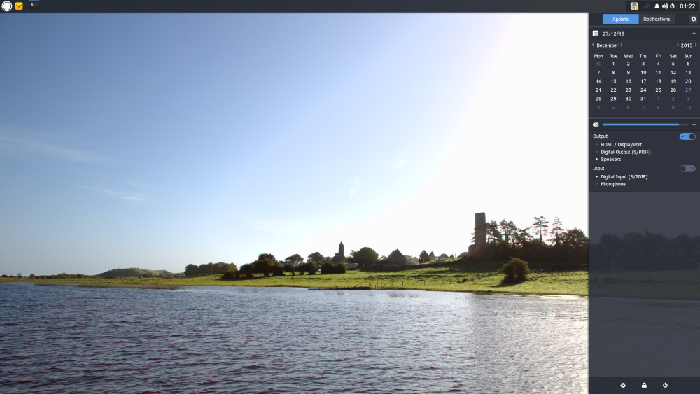

---
authors:
  - name: Joshua Strobl
    link: https://github.com/JoshStrobl
    image: https://avatars.githubusercontent.com/u/156574?v=4
tags:
- Budgie
- News
- Releases
date: "2015-12-27T06:24:44Z"
title: Solus 1.0 Released
url: /2015/12/27/solus-1-0-released/
---

The Solus Project is proud to announce the release of the first version of its operating system, Solus, on 27th of December, 2015. Solus 1.0 is codenamed Shannon after the longest river in Ireland. 

Solus 1.0 is the result of over eight months of work, coalesced from over a dozen contributors, over 2000 package builds, a rewrite of the premier desktop environment Budgie, and more.

### Solus

Solus is a Linux-based operating system built from scratch for the modern desktop and targeting the x86_64 architecture.

#### Budgie

The Solus Project develops a GTK-based desktop environment referred to as Budgie. Budgie ships with a multitude of features, such as the ones below.

##### Accessibility

Budgie has been tested and refined to ensure High Contrast theming works out-of-the-box and enabling usage by individuals with visual impairments.

##### Budgie Menu

This menu enables quick access to your installed programs and offers category and compact views.

##### Raven

Budgie ships with an applet, notification and customization center referred to as Raven. Raven enables you to:

1. Easily access calendar information, sound volume, media player controls, and more via Applets view.
2. Manage incoming application and system notifications via Notifications view
3. Customize your Budgie and system experience by enabling you to: 
  - Toggle system-wide Dark theme.
  - Change GTK and icon theming
  - Add, remove, and modify Budgie panels, their properties as well as their displayed applets.
  - Obtain quick access to system settings and power options such as restart, suspend, and shutdown.

#### Package Management

Solus uses a package manager called eopkg. eopkg supports standard functionality, such as:

- The installing / removing of packages
- Searching of repositories for packages
- Management of repositories

The package management system also separates out packages into components, which are _categories_ and sub-categories that describe what the application or library may provide. For instance, firefox is within the _network.web.browser_ component.

#### Shipped Applications and Packages

##### Applications

Solus 1.0 ships out-of-the-box with numerous applications to enhance the desktop experience. Below are some highlights of applications Solus 1.0 ships:

- firefox 43.0.2
- nautilus 3.18.4
- rhythmbox 3.2.1
- thunderbird 38.5.0
- vlc 2.2.1

##### Firefox, GTK, and Icon Themes

We enhance the out-of-the-box desktop and Firefox experiences by defaulting to the [Arc GTK Theme](https://github.com/horst3180/Arc-theme) as well as [Arc Firefox Theme](https://github.com/horst3180/arc-firefox-theme), and utilize 
the [Moca Icon Theme](https://github.com/moka-project/moka-icon-theme) to spruce up application iconography.

##### System

Solus 1.0 ships with gstreamer media libraries, a multitude of system utilized fonts such as Droid Sans, Symbola, and Dejavu and leverages the most updated GTK 3.18 stack.

Solus 1.0 is UEFI enabled via goofiboot, a distribution-agnostic fork of gummiboot, to ensure a wider variety of modern hardware is capable of using Solus, and further hardware enablement with the shipping of Linux kernel 4.3.3.

#### Download

Solus 1.0 ISOs can be downloaded across official and community-supported mirrors internationally, as well as via BitTorrent, [here](https://solus-project.com/1-0/). Follow the 
[Installation Guide](https://wiki.solus-project.com/Installation) and ensure you're using the correct tools to write the downloaded ISO to your DVD or USB.

#### Known Issues

Below is a list of known issues associated with Solus 1.0:

1. AMD proprietary drivers do not support Linux kernel versions above 3.19 nor versions of Xorg above 1.17. This is an ongoing issue that we are currently investigating.
2. The Steam runtime currently requires a workaround for non-NVIDIA systems. We anticipate landing a fix within the next couple weeks and a workaround is published [here](https://solus-project.com/forums/viewtopic.php?f=17&t=886&p=5281#p5281).
3. HP Printers currently are non-functional due to python-related issues in the hplip package. We anticipate landing a fix within the next couple weeks. Solus core team members have the necessary hardware on hand to bring HP Printer support to fruition as soon as possible.
4. Software Center is currently requiring an upgrade to resolve issues, land UX improvements, and greater app integration via appstream. We anticipate landing this upgrade in the next couple weeks.

#### Press

Press media assets (no PDF) available [here](https://solus-project.com/1-0-media/).

Press media package (assets and PDF) available for download as [.zip](https://drive.google.com/file/d/0B5Ymf8oYXx-PVjhxaWYyakxoWGM/view?usp=sharing), [.tar.gz](https://drive.google.com/file/d/0B5Ymf8oYXx-PSmhTTTZnSUNXNVE/view?usp=sharing), [.tar.xz](https://drive.google.com/file/d/0B5Ymf8oYXx-PelhHLTAxYXktcjA/view?usp=sharing)