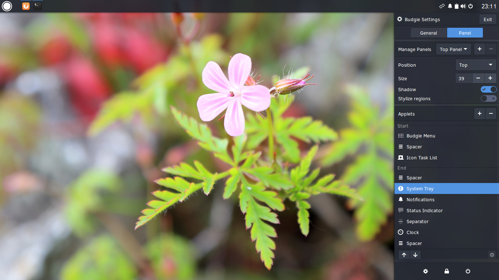

---
authors:
  - name: Joshua Strobl
    link: https://github.com/JoshStrobl
    image: https://avatars.githubusercontent.com/u/156574?v=4
categories:
- Budgie
- News
date: "2016-03-27T20:53:21Z"
title: Budgie 10.2.5 Released
url: /2016/03/27/budgie-10-2-5-released/
---

We are happy to announce the release of Budgie 10.2.5. This release builds upon our vision of a desktop environment focused on simplicity and elegance, by introducing further refinements to the user experience while expanding options for enabling a 
more tailored desktop experience. 

#### Focusing on the small details

We have introduced a multitude of refinements to make Budgie really stand out. We now use an elegant slide-in animation for the first launch of the panel, ensure we only show it when the panel is fully loaded, and while loading we ensure that applets will 
show up in their correct order.

Alongside those panel improvements, we've increased the spacing between panel applets. When applications are launched or closed, we now provide stylish animations for revealing or hiding icons, and you should now notice that application icons remain 
consistent, whether or not the application is running.

<video src="/2016/03/27/budgie-10-2-5-released/Animation-2016-03-27_23.28.16.mp4" autoplay="autoplay" loop="loop" width="394" height="36"></video>

When you launch Raven, you are greeted by more accurate sound device names. This should help demystify what devices are available to you and enable easier selection of input/output devices. You can see this in the image below.

We have introduced a new applet for managing your Bluetooth devices, including setting Bluetooth to "Airplane mode".

We also improved the tile preview animation, so it originates at the window being tiled.

#### Tailoring Your Experience

Budgie is just as much about enabling you to tailor your experience than it is providing a sane out-of-the-box experience. We have expanded on desktop experience options by providing you the ability to:

-  Enable desktop icons
-  Select different cursor themes
-  Select different fonts for things like Window Titles, Interface, etc.

You now have the option to disable the region theming for the panel as well, as shown in the image below.

#### Other Improvements

All the changes above accompany an abundance of other improvements, some transparent to the user but equally important to the experience.

-  Budgie is now stateless.
-  Built-in theme has been ported to GTK 3.20. 
  - As a result, we select the correct theme based on the GTK version.
-  Fix window accountancy errors in budgie-wm, fixes several Steam titles
-  LightDM lock screen functionality has been restored.
-  Resolved instances where budgie-panel wouldn't render across the entire display, as well as fixing rare instances where budgie-panel would have a titlebar.  