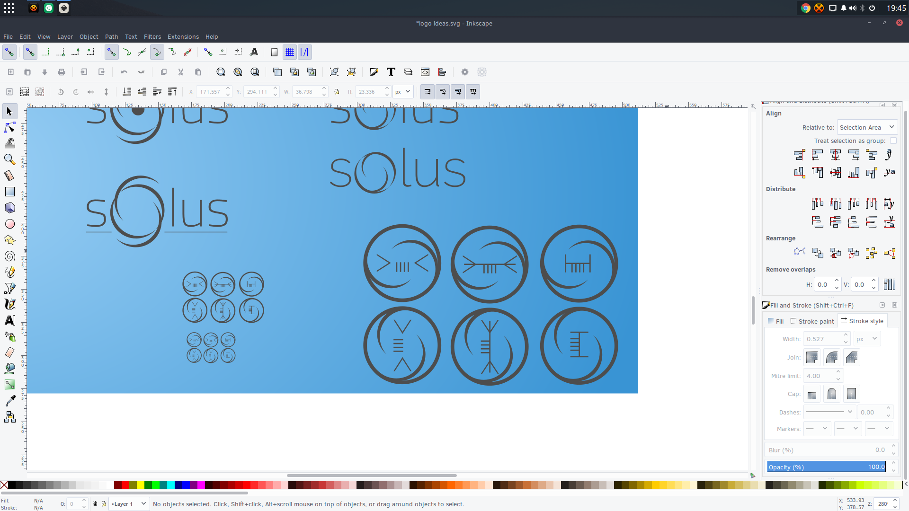
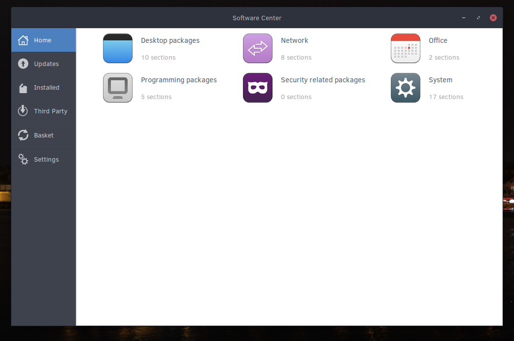
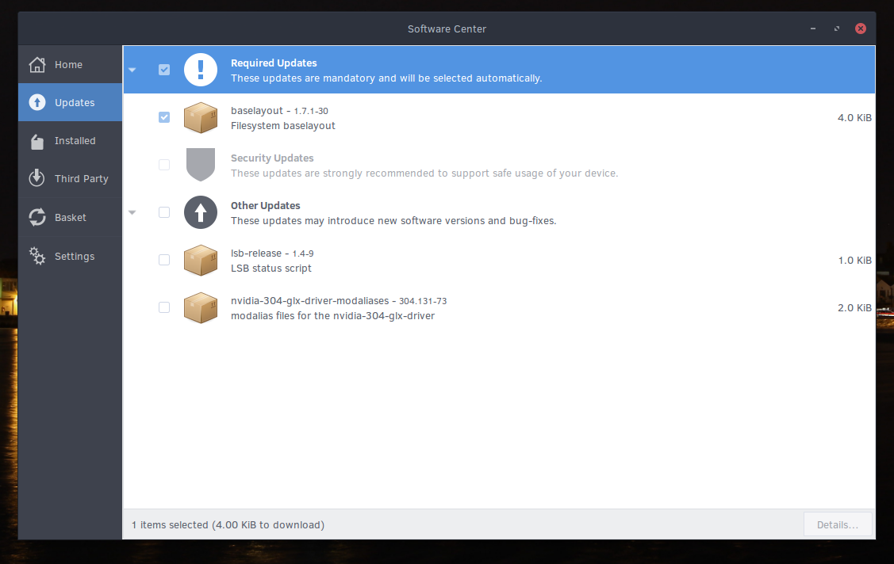
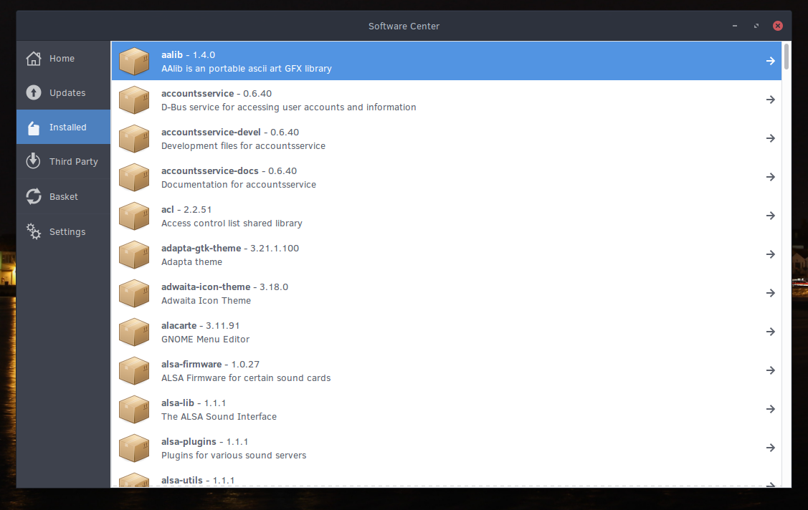
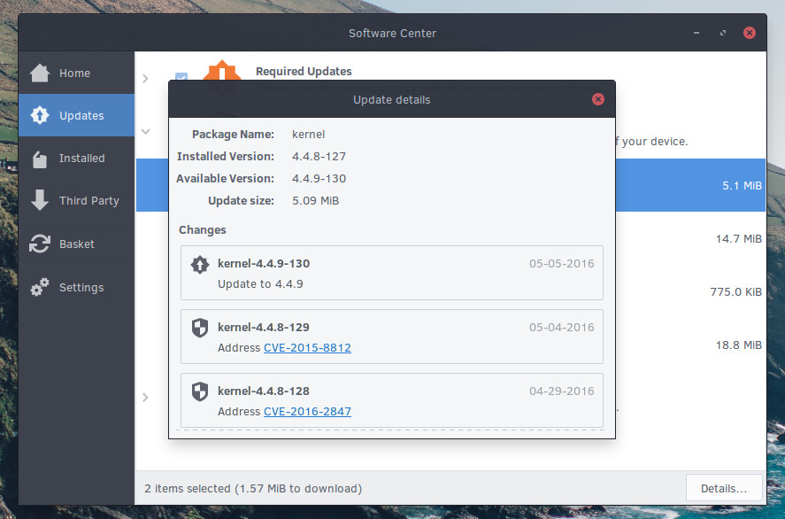

+++
author = "joshua"
categories = [
"Budgie",
"News",
"TWIS"
]
date =  "2016-05-09T16:28:47Z"
title = "This Week in Solus -- Install #28"
url = "/2016/05/09/this-week-in-solus-install-28/"
+++ 

Welcome to the 28th installation of This Week in Solus. **I'm all about that Software Center.** 

### Branding

We're currently reaching out to the community to help us establish a consistent brand that reflects the ethos, power and mind of Solus. Message from our benevolent dictator, Ikey, follows:

> For those that don't know, Solus as a project builds technology, and as part of that we build "Solus" the operating system, and the "Budgie" desktop.
>
> The most important part is the OS. This is where we lack brand distinction.
>
> There is an ongoing theme in Solus of exploration, innovation. We also have ties to Irish themes (naturally), with Solus being the Irish word for "light". In Latin this means "alone". Representatively speaking, Solus is the lonely light in the harbour, 
ferrying people across safely to a better destination, taking routes that others dared not take.
>
> We're a bold project, and contest convention on a regular basis.
>
> Our OS takes a no-BS approach to design and development, giving the user something that is optimised solely for their experience. In our case, that's consumer grade devices, desktop class. There is no lowest-common-denominator approach.
>
> I see Solus as the exploratory ship, and furthering on that sea-faring theme, our 1.x branch is named Shannon, after the Irish River.
>
> Note also whilst it's a nice thought to integrate Budgie into the logo, we must remember that Budgie is a part of Solus, not the other way around. We created Budgie for Solus, as opposed to remixing something that already existed to provide a slightly 
different desktop experience.

If you would like to help contribute to this undertaking, feel free to drop a comment [via IRC](https://wiki.solus-project.com/Getting_Involved#IRC) or let Ikey know [here](https://plus.google.com/u/0/+Solus-Project/posts/QjACFNNdMXo).. 
Otherwise we're going to need to go with some design that Ikey has created, and I assure you, you don't want that. He's a coder, not a designer. Example follows:

### Budgie

It wouldn't be a **real** This Week in Solus without talking about our cute little birdy, umm I mean our desktop environment.

Ikey has worked on improving out-of-tree Budgie desktop extension development, as well as providing examples across C, Python, and Vala for those wanting to get into development! These examples are available on the 
[budgie-desktop-examples](https://github.com/solus-project/budgie-desktop-examples) repository!

Go forth my minions, spread the good word of Budgie and make some pretty applets.

### Software Center

There is no getting around the fact that the Software Center in Solus 1.1 sucks. Software discoverability and ease-of-use for installation of software is incredibly important to us and we want to tackle it with **urgency**. So we're doing something about it 
now, this cycle, and it is going to be amazing.

And sometimes the best way to make something better than its predecessor is to completely start from scratch. So that is what Ikey has done, started writing the new Software Center from scratch. Why **not** GNOME Software? We talk about that 
[here](https://github.com/solus-project/solus-sc/blob/master/README.rst).

#### Walk-through

Let's get started with a general walk-through of the different parts of the new Software Center. Note that all of this is a work-in-progress and subject to change before release.

##### Home

This is the Home section of the Software Center. This section will provide categories of applications available for installation and in the future, enable us to provide rich imagery and details on featured applications.

##### Updates

This is the Updates section of the Software Center. Here, you can see a list of updates for your system across a range of categories, such as Required, Security, and "Other". We provide immediate information on how large the total updates selected will be, 
and enable you to get package details as well. **We'll get into package details later.**

##### Installed

This is the Installed section of the Software Center. I think it is pretty self-explanatory.

##### Third Party

**No screenshot because it isn't implemented yet.**

You shouldn't have to drop down to a Terminal in order to install third-party applications like Chrome. In this section, you'll be able to discover third-party applications available for installation, and the Software Center will handle updating them. For users, 
this means simply typing "Google Chrome" and installing. **(Chrome is an example, this also applies to applications like Skype in the future). **No wiki workarounds, no need for the Terminal.**

##### Basket

**No screenshot because it isn't implemented yet.**

Basket is a section of the Software Center for pending / outgoing operations. Currently other sections are being focused on, so this will be elaborated on in the future.

##### Settings

**No screenshot because it isn't implemented yet.**

The Settings section of the Software Center will enable a wide range of configuration for the Software Center and updates:

- Enabling / disabling of notifications for available updates.
- Repo selection
- Update frequency

##### Package Details

Transparency about package changes is important to us. We want you to be just as informed about changes to your system as we are! Each package update will provide:

- All the details for releases from your installed version to the one in the repository.
- The commit message of the release, including: 
- Clickable links to CVEs.

- We're also currently deciding on an identifier for bugs on [our bug tracker](https://bugs.solus-project.com) and plan on adding clickable links for those too.

The details of package updates will be available via the Updates section as well as individual package views, such as via the Installed section.

---

#### Package Updates

Here is a highlight of updates that have happened this week.

New:

- [fontforge 20160404](https://git.solus-project.com/packages/fontforge/commit/?id=66b820a4cd74a211c9986641be3733927a11d50f)
- [menulibre 2.1.3](https://git.solus-project.com/packages/menulibre/commit/?id=a223ea364bafc40ee11b62fa79350513caad4e24)
- [woff-tools 1.0](https://git.solus-project.com/packages/woff-tools/commit/?id=772b5ad85e5e20858e7d5f1bcb00bd860e74d57b)

Updated: 

- [adapta-gtk-theme 3.21.1.100](https://git.solus-project.com/packages/adapta-gtk-theme/commit/?id=cbfbf58769e21db0702751f391165d39430508c4)
- [conky 1.10.2](https://git.solus-project.com/packages/conky/commit/?id=57e98ca5a28bf8a6db372152b9f033bb3f9f41fe)
- [darktable 2.0.4](https://git.solus-project.com/packages/darktable/commit/?id=8b98369ca3d082862c6ed920f673cb710bb6c21a)
- [erlang 18.3.3](https://git.solus-project.com/packages/erlang/commit/)
- [hexchat 2.12.1](https://git.solus-project.com/packages/hexchat/commit/?id=51f8d15f0abd63438f8c6146267f2a88b091ec0c)
- [keepass 2.33](https://git.solus-project.com/packages/keepass/commit/?id=fec8052dd92b7dbdcbbadbb0aa356a37c1946114)
- [kernel 4.4.9](https://git.solus-project.com/packages/kernel/commit/?id=b7ad5aa45c3dd3dffb5896bf957f041f72346b78)
- [lollypop 0.9.104](https://git.solus-project.com/packages/lollypop/commit/?id=ddc6f69d8dede3e7f9590c012461966108b95d45)
- [mpv: Ensure OpenGL features are enabled.](https://git.solus-project.com/packages/mpv/commit/?id=11116438439bb3e907bea4a533df32a062589fd5)
- [n1 0.4.33](https://git.solus-project.com/packages/n1/commit/?id=5aa74d85ce01c0849a60e8dde5544388e70672a4)
- [nodejs 5.11.1](https://git.solus-project.com/packages/nodejs/commit/?id=f5d4b4dfbd69e360e8c742f9d7bce864b4a132c9)
- [nvidia-304-glx-driver: Disable mtrr](https://git.solus-project.com/packages/nvidia-304-glx-driver/commit/?id=9bf874ca0e0a098389f1e1a2c38ab3bea389665b)
- [openssl 1.0.2h](https://git.solus-project.com/packages/openssl/commit/?id=22461ec9f07e7c6293aeab0f8813e451b2b6cbe3)
- [peerunity 0.2.2](https://git.solus-project.com/packages/peerunity/commit/?id=ad78e2317d7af5fef8cc6d06d40055f100cf8bb7)
- [r 3.3.0](https://git.solus-project.com/packages/r/commit/?id=678700159e24ccfd4e2a1cf7051f8a6744aaadf3)
- [retroarch 1.3.4](https://git.solus-project.com/packages/retroarch/commit/?id=6c645199cf3f23084108f5feb488ef97c39bdfc5)
- [subversion 1.9.4](https://git.solus-project.com/packages/subversion/commit/?id=705eeaea7d81f20747afa15d417da061c20f5f9f)
- [vlc 2.2.3](https://git.solus-project.com/packages/vlc/commit/?id=24272515b1341028952c3c2d5ee2413f043b5d11)
- [weechat 1.5](https://git.solus-project.com/packages/weechat/commit/?id=e9373af2396987283e3c44d62159a1c9824e76fe)
