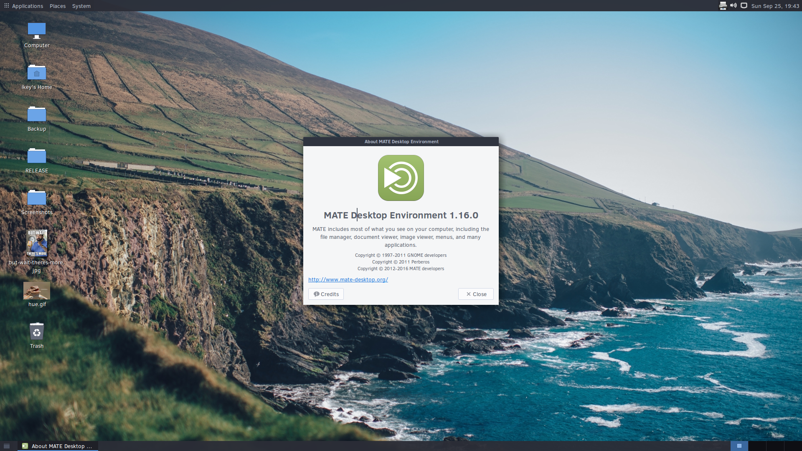

---
authors:
  - name: Joshua Strobl
    link: https://github.com/JoshStrobl
    image: https://avatars.githubusercontent.com/u/156574?v=4
tags:
- news
- packages
- twis
date: "2016-09-26T22:13:25Z"
title: 'This Week in Solus -- Install #36'
url: /2016/09/26/this-week-in-solus-install-36/
---
 

Welcome to the 36th installation of This Week in Solus. 

#### MATE

We're happy to report the landing of MATE 1.16.0 in the Solus unstable repository. This MATE release improved GTK3 support and improvements to MATE applications such as:

- caja now will always show the right-arrow button, now uses GtkAboutDialog.
- engrampa now having p7zip-rar support
- mate-polkit dropping GTK2 code.
- mate-terminal dropping GTK2 code and moving to using GtkAboutDialog.

Hats off to the MATE community for the fantastic release. For their full release announcement, [click here](http://mate-desktop.com/blog/2016-09-21-mate-1-16-released/).

#### Solus Packaging Series

The Solus Packaging video series has finally been redone to reflect ypkg 2.0 and all the various improvements to the packaging and submission process throughout the months. You can check out the playlist below!

#### Package Highlights

Here is a highlight of additions and updates to packages in the last week(ish), excluding all the MATE loveliness:

New:

- [amule 2.3.2](https://git.solus-project.com/packages/amule/commit/?id=d57d3613f40358ddff89f2d750b8d84e6c3b10b3)
- [ethtool 4.6](https://git.solus-project.com/packages/ethtool/commit/?id=07b9567a9e566f3becc6e5606c31fd6edc22a04a)
- [font-awesome-ttf 4.6](https://git.solus-project.com/packages/font-awesome-ttf/commit/?id=6662b90da33f4c3404c14e02f3cd274f302e152e)
- [glabels 3.4.0](https://git.solus-project.com/packages/glabels/commit/?id=7f9798dbc10d4e0cf238cf553bb3f7d253a3868d)
- [gnote 3.20.1](https://git.solus-project.com/packages/gnote/commit/?id=fa19ad0c59bd9ea1090a4ff54ec5e593c13d503d)
- [nethogs 0.8.5](https://git.solus-project.com/packages/nethogs/commit/?id=95506eb50197bb8de85829c63eb47246539195cd)
- [nitroshare-desktop 0.3.3](https://git.solus-project.com/packages/nitroshare-desktop/commit/?id=6dfa4d54efb9f353f7c4ecaae7017e05a4395dc4)
- [nxcomp 3.5.0](https://git.solus-project.com/packages/nxcomp/commit/?id=e71831716c19c44c4116a6b5e8d3666eae21789b)
- [rmlint 2.4.4](https://git.solus-project.com/packages/rmlint/commit/?id=7550a7b5d311ad24e8ed3ad78df83c7ce48cb528)
- [platformio 3.0.1](https://git.solus-project.com/packages/platformio/commit/?id=933702915d749e41572de72c4e35c045b1a71194)
- [shotcut 16.09](https://git.solus-project.com/packages/shotcut/commit/?id=1b2f04ac342f4660b0a55a418e50614bed7c55b8)
- [sl 5.02](https://git.solus-project.com/packages/sl/commit/?id=59ef1d008edf2ff4f78e1ddf6d2a30f4f6007e3c)
- [solaar 0.9.2](https://git.solus-project.com/packages/solaar/commit/?id=9d89f49e67dd65e16dc837e7d8ed9305f197d3d5)
- [veracrypt 1.18](https://git.solus-project.com/packages/veracrypt/commit/?id=706fd3dc9209b731df9cec6d8a6332d181fc7435)
- [vsftpd 3.0.3](https://git.solus-project.com/packages/vsftpd/commit/?id=0142fc9b324b8f3ed6bc971c43677db5ef8ae621)
- [x2goclient 4.0.5.1](https://git.solus-project.com/packages/x2goclient/commit/?id=5811a5ab0e709d3f047df84c85c7751afaff97b6)
- [x2goserver 4.0.1.19](https://git.solus-project.com/packages/x2goserver/commit/?id=5b97112d1d137f24dd61935d30ac27e44c1f6bab)
- [xdo 0.5.3](https://git.solus-project.com/packages/xdo/commit/?id=807436f1a5350f2f07a5db2f9ee40931afed898c)
- [xtitle 0.3](https://git.solus-project.com/packages/xtitle/commit/?id=a0770d1c2b4fd69405358a6a5d0d359d4c4bd50a)

Updated:

- [adapta-gtk-theme 3.22.0.28](https://git.solus-project.com/packages/adapta-gtk-theme/commit/?id=328b21f1bb3ad584b9b658a015a09cb09816837a)
- [arc-firefox-theme 49.20160919](https://git.solus-project.com/packages/arc-firefox-theme/commit/?id=c6d08d6459f2e9468d357bbdd22d9b24b37cfc2c)
- [aria2 1.27.1](https://git.solus-project.com/packages/aria2/commit/?id=64f5171a33bb6db404207388be96dfee77205dcc)
- [audacious 3.8](https://git.solus-project.com/packages/audacious/commit/?id=ee6512345d961b6a297a46078dda0908a026e48e)
- [audacious-plugins 3.8](https://git.solus-project.com/packages/audacious-plugins/commit/?id=cf0519bec8297d318e683fd7bda5dfae5790c2b5)
- [elementary-icon-theme 4.0.1](https://git.solus-project.com/packages/elementary-icon-theme/commit/?id=2700cccdd028765379c015300ceab19e447502c8)
- [firefox 49.0](https://git.solus-project.com/packages/firefox/commit/?id=ab97972a38379720c7516eae787b048a230f6d3f)
- [focuswriter 1.6.1](https://git.solus-project.com/packages/focuswriter/commit/?id=057af8e705011fd052abb8eb9f6961408d62a723)
- [glances 2.7.1.1](https://git.solus-project.com/packages/glances/commit/?id=fdbdcdc5ced51424138de6b35d0316c4a002e34a)
- [granite 0.4.0.1](https://git.solus-project.com/packages/granite/commit/?id=7789d54ab11cf62f4f08eb2a6ab5223692c5054e)
- [irssi: Update to 0.8.20 to resolve CVE-2016-7044 and CVE-2016-7045](https://git.solus-project.com/packages/irssi/commit/?id=12bcb369d0de0d37f4f37fd92f5e4a28714ca122)
- kernel: 
  - [Enable CONFIG_B43_PHY_N per issue T651](https://git.solus-project.com/packages/kernel/commit/?id=5ac898321e29a80b382096f030770456ad9210ba) 
  - This option enables N generation (type 4) devices to work with our B43 driver.
  - Update to the latest upstream release, 4.7.5
  - [Enable CONFIG_RCU_FAST_NO_HZ](https://git.solus-project.com/packages/kernel/commit/?id=ae86f909a3500f175a706984c471bf794cfec4d4)
  - [Move to voluntary-preempt, enable BPF JIT, other micro-optimisations](https://git.solus-project.com/packages/kernel/commit/?id=ba85a08f7b6ac3b77db226ad74c6b3d4e154566f)
- [kodi 17.0-b2](https://git.solus-project.com/packages/kodi/commit/?id=0b9f8e229d44371a093ebfb5feb0ba23f7f39869)
- [krita: Include Krita locales.](https://git.solus-project.com/packages/krita/commit/?id=3f130ab5a2fec88994e23074c097a53b16f5d743)
- [lemonbar: Add xtitle as a rundep to draw tasklist.](https://git.solus-project.com/packages/lemonbar/commit/?id=610e4054fc347f26b6bc9c327972ec78f3482ce0)
- [lmms: Add fltk, rebuild against Qt4 and GCC changes.](https://git.solus-project.com/packages/lmms/commit/?id=f23b8c6e948a431dc6b93ec5f6156ab906c29896)
- [lollypop 0.9.205](https://git.solus-project.com/packages/lollypop/commit/?id=1641ca10fdb9649fa5e04e5665498b1a5dd818c4)
- mesalib: 
  - [Sync with git](https://git.solus-project.com/packages/mesalib/commit/?id=119413de2ac27d0e82e4f99b9487afa8f83bbded)
  - [Update to latest upstream version for Intel i965 changes](https://git.solus-project.com/packages/mesalib/commit/?id=80633e00e1bdaa12513400208e6057636b827dd1)
- [ncmpcpp: Enable outputs and visualizer.](https://git.solus-project.com/packages/ncmpcpp/commit/?id=3c3f711301bedffb42dd7e94acdcb7953f0bb03e)
- [noise 0.4](https://git.solus-project.com/packages/noise/commit/?id=480df50cd38ed178545e7baa167087c876375dc7)
- [openal: Fix crash when toggling HRTF in Devil Daggers](https://git.solus-project.com/packages/openal/commit/?id=6abc261b3488356047925622ae7478f7b20388b8)
- [openssl: Update to 1.0.2i to address numerous CVEs](https://git.solus-project.com/packages/openssl/commit/?id=5a606cf775e6aecae60b5c90500711a822f97141)
- [pantheon-terminal 0.4](https://git.solus-project.com/packages/pantheon-terminal/commit/?id=ec0e82fe9e9ab44b21d74c3e5cbcec1e00aed723)
- [paper-icon-theme 1.3.3](https://git.solus-project.com/packages/paper-icon-theme/commit/?id=20e74affa5b1cb623743356089a258f5ee6ab33e)
- [python-babel: Fix locale support](https://git.solus-project.com/packages/python-babel/commit/?id=11763e99c52b5daa9d41c5126ca5048593f505c7)
- [solus-hardware-config: Dropped tlp as a rundep to reduce boot times.](https://git.solus-project.com/packages/solus-hardware-config/commit/?id=42a5d134581e0267fc9514597aecd14d93dfb6f1)
- [sxhkd: Ensure xdo is a rundep](https://git.solus-project.com/packages/sxhkd/commit/?id=b73aa4ee7d05908a7a9f3e0fb23e49d21b1c5ff6)
- [telegram 0.10.7](https://git.solus-project.com/packages/telegram/commit/?id=740aad9f8fb0ec4f7645481546255eadcb29dff9)
- [vim 8.0.0014](https://git.solus-project.com/packages/vim/commit/?id=5cc7bca937bed320b3794bee8ec900ef8b766f4e)
- [VLC: Landed x265, realrtsp, libdvbpsi support.](https://git.solus-project.com/packages/vlc/commit/?id=0eda1dc1777ad6b56a79b85058a1601820eda4fd)
- vulkan: 
  - [Enable smoketest, vulkaninfo, and layers](https://git.solus-project.com/packages/vulkan/commit/?id=a99e339a35e2f2391107c01a375b29af30509996)
  - [Update to 1.0.26.0](https://git.solus-project.com/packages/vulkan/commit/?id=89786b37641a7f07bb768ad113a297a763bf2f88)
- [vscode 1.5.3](https://git.solus-project.com/packages/vscode/commit/?id=340b200f09ef49e84f1bf0203695ed679c033710)
- [xorg-driver-video-intel: Sync with git for cursor/ kaby lake, etc, fixes](https://git.solus-project.com/packages/xorg-driver-video-intel/commit/?id=78b3c4deb902eb97d587b495725334f2bd264db2)
- [youtube-dl 2016.09.24](https://git.solus-project.com/packages/youtube-dl/commit/?id=dc349e9f7d445265f882e451ea3581d4e50fe54d)
- [ypkg: Sync with git for avx2 support.](https://git.solus-project.com/packages/ypkg/commit/?id=f746a2547aaf8eab97009d31ebd6dbd84c6f352b)