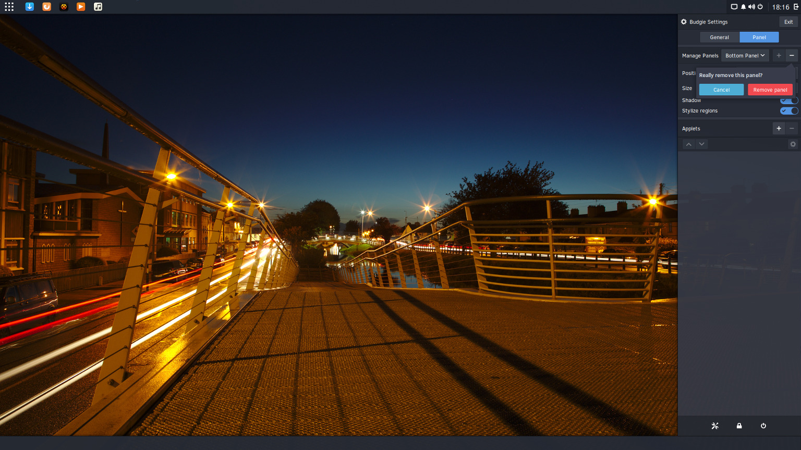

---
authors:
  - name: Joshua Strobl
    link: https://github.com/JoshStrobl
    image: https://avatars.githubusercontent.com/u/156574?v=4
categories:
- Budgie
- News
date: "2016-12-16T17:18:07+02:00"
featuredimage: /budgie-10-2-9.jpg
title: Budgie 10.2.9 Released
url: /2016/12/16/budgie-10-2-9-released
---

We're happy to announce the release of Budgie 10.2.9. This is solely a bug fix release, tackling some niggling issues before our focus shifts to development of Budgie 11.

## Widgets

Numerous fixes have been made to our various panel widgets.

### Icon Tasklist

Thanks to investigative work that occurred during our development of [Brisk Menu](https://solus-project.com/2016/12/11/this-week-in-solus-install-40/), an issue with the spinning wheel 
that would persist for 30 seconds during the launching of an application has been resolved. Some previous hacks have been eliminated and we now use per-button GdkAppLaunchContext and 
correctly "turn off" the notify via Gdk to stop the spinning wheel.

### Keyboard Layout

We have resolved an issue in the Keyboard Layout widget where we didn't manage to retrieve a language name from libgnome-desktop for the zh_CN locale. This resulted in rendering an odd label 
for the libpinyin IBUS engine, i.e. "(null) (libpinyin)". Now, when we fail to get a language based on the language code, we fall back to locale detection.

### Places

Multiple fixes have landed for the Places widget.

- MTP mounts have been fixed.
- Root directory bookmark detection has been fixed.
- The duplicate checking of directories with accented characters in their name has been resolved.

## Panel & Raven

Prior to Budgie 10.2.9, it was easy to accidentally remove a panel. Now, we show a confirmation popover when clicking the removal button, to ensure accidentally panel removal doesn't occur.

Additionally, if you have found yourself with a panel configuration not to your liking, or desire to reset, you can now easily do that! Our `budgie-panel` binary now has a `--reset` option. When using 
this option, the entire Budgie Panel configuration will be wiped clean from GSettings and loads the default panel layout and widgets, providing a recovery method.

**Note:** For this to function properly, one must also pass the `--replace` option.

## Run Dialog

We now monitor dbus names to see when an application has actually launched, as opposed to the prior behavior of naively immediately quitting. For "normal" applications, we obey the 
[Startup Notification Spec](https://specifications.freedesktop.org/startup-notification-spec/startup-notification-0.1.txt) and wait for them to either launch (or fail to do so), then quit the Run Dialog. This 
resolves an issue with some applications such as Corebird and gedit either failing to launch or inconsistently launching via the Run Dialog.

## Other Goodies

Our community has made a lot of incredible contributions to internationalizing Budgie.

- Arabic is now a supported language.
- Chinese is now a supported language, both in Chinese (Traditional) as well as Chinese (Taiwan).
- Multiple languages have received translation improvements:
  - Basque
  - Dutch and Dutch (Belgium)
  - Finnish
  - French
  - Japanese (Japan)
  - Polish
  - Portuguese (Brazil)
  - Spanish (Argentina)
  - Swedish (Sweden)

 HiDPI has improved for Budgie 10.2.9. When we detect a HiDPI change, whether it be from the user, or system, deciding to enforce a new scaling factor for the UI, we now re-assert our struts and position.