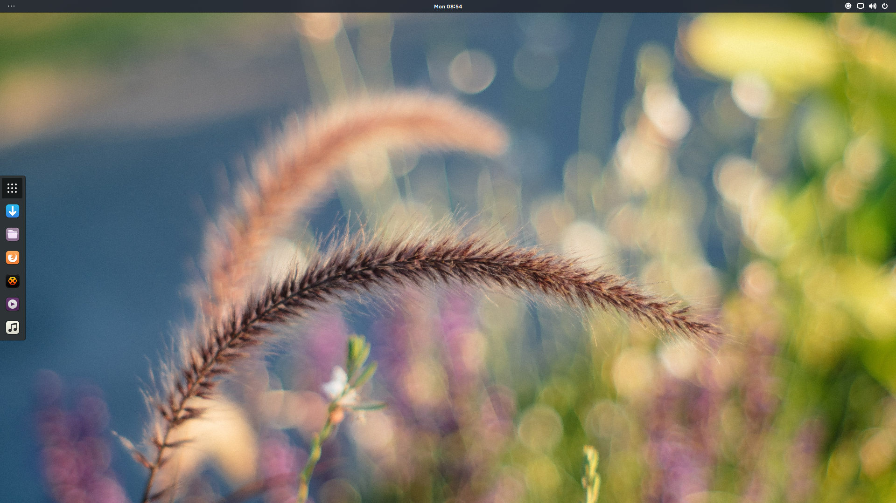
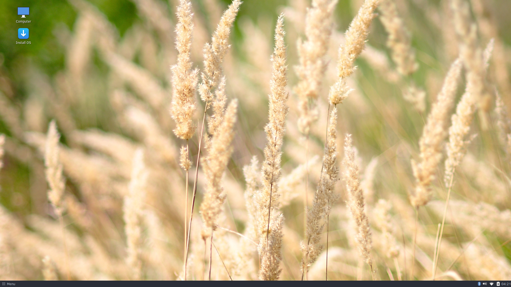

+++
author = "joshua"
categories = [
"Budgie",
"News",
"Releases"
]
date = "2017-04-18T19:41:53+03:00"
featuredimage = "/Snapshot_Featured_Image.jpg"
title = "Solus Releases ISO Snapshot 2017.04.18.0"
url = "/2017/04/18/solus-releases-iso-snapshot-20170418-0"
+++

We're proud to announce our second ISO snapshot, 2017.04.18.0, across our Budgie and MATE editions, as well as our new GNOME edition!

This snapshot is the culmination of months of work across nearly every aspect of our operating system, ranging from multiple under the hood upgrades and changes to improvements to our desktop experiences.

## Core Improvements

This snapshot features a multitude of new improvements and upgrades to almost every package that ships on any of our ISO snapshots.

### Bulletproof Boot Management

This snapshot is the first to deliver bulletproof boot management out-of-the-box, leveraging [clr-boot-manager](/2017/03/26/clr-boot-manager-now-available-in-solus) to enable  the maintenance and garbage collection of kernels, as well as configuration of the bootloader (across GRUB2 for Legacy Boot and goofiboot for UEFI boot).

Furthermore, clr-boot-manager enables the retention of known-working kernels, so you can always rollback to a prior kernel if a kernel upgrade results in the inability to boot. This gives users even more confidence in upgrading their system, and ensures that their running systems will just keep working as expected.

clr-boot-manager also provides a pathway to supporting **multiple** kernels. By default, we provide the LTS kernel to our users, however we now have the flexibility to provide multiple kernels without "branch jumping" existing users onto a mainline kernel, something we plan on adding in the future.

### GNOME Stack

Our GNOME Stack has been upgraded to the 3.24 series. We have also done further refinements by:

- Adding back the Enter Location menu option for Nautilus
- Enabling EGLDevice for EGLStreams in Mutter, as well as disabling `NET_WM_PING` dialogs, which could break many SDL games or some applications. Such applications are just slower to start, such as Thunderbird, or GL-locked (SDL), and as a result displaying a "not responsive" window unnecessarily would break focus, input, etc. when the application is in fact working.
- Including a patch to resolve items not appearing via gnome-menus
- Updating libgnomekbd to resolve schemas from a prior release.

### Graphics Stack and Kernel Enablement

Many improvements have been made to our graphics stack and enablement of the Linux kernel for this snapshot, as well as shipping the latest Mesa, 17.0.4.

#### Linux Driver Management

This snapshot features [Linux Driver Management](https://github.com/solus-project/linux-driver-management), which is a **modern, open source** solution developed by us to enable NVIDIA Optimus support and paves the way towards supporting dynamic, switchable graphics across all hardware vendors in the future.

#### Kernel Enablement

This snapshot features Linux kernel 4.9.22, the latest of the longterm branch at the time of release. Alongside the wide variety of improvements brought by using the latest kernel, we have enabled a substantial set of hardware / devices, such as:

- NVME Enablement and Improvements
  - Backporting support for Macbook Pro 2016 SSD (NVME, really)
  - NVME SCSI emulation to resolve some minor NVME bugs
  - We now use NVME patches, backported from 4.11, provided by [linux-nvme](https://github.com/damige/linux-nvme)
- Webcam Enablement
  - GSCPA ZC3XX class webcams (Creative, etc.)
  - GSPCA STV06XX class webcams (Logitech QuickCam, etc.)
- Other
  - Baytrail sound card support (SoC)
  - Dell All In one WMI (hotkeys, etc)
  - Enabling `/proc/config.gz`
  - Enabling Macbook gmux for Macbook backlight support.
  - Mayflash (ACRUX) game controller support (gamecube, etc)
  - Ricoh NAND and SDX/MMC
  - Samsung Q10 platform support

With the latest changes to solus-hardware-config and our linux-lts package, we'll now dynamically select the appropriate power saving CPU frequency governor after the system is booted. During boot we default to the performance setting, to ensure a rapid startup, however we'll now switch to the appropriate scaling setting to conserve battery life (`powersave` for `intel_pstate` and `ondemand` for `cpufreq`).

### Multimedia Upgrades

This snapshot delivers upgraded multimedia libraries and a new Pulseaudio. We are now shipping with ffmpeg 3.2.4, including patches to VLC for ffmpeg 3 support. ffmpeg 3 features a large set of improvements, such as:

- New filters
- VP9 hardware acceleration
- Support for SDL2

Our gstreamer-1.0 packages have been updated to 1.10.4, which is the latest in their 1.10 stable series. 

Pulseaudio has been upgrade to 10.0, enabling improvements to Bluetooth A2DP and HSP profiles and hotplugging support for USB sound cards.

## Default Applications

### All Editions

All of our editions feature:

- Firefox 52.0.2
- Rhythmbox 3.4.1
- Thunderbird 52.0.1

We also now ship with a default office suite across all editions, LibreOffice 5.3.2.2!

### Default Video Player

Our Budgie and GNOME editions ship with GNOME MPV as the new default video player. GNOME MPV was chosen to be our new default for these two editions as it:

- Fits into the general aesthetic of both Budgie and GNOME
- In our opinion provides a simpler experience for watching video content

Our MATE edition will maintain the use of VLC, preserving a more traditional user experience.

## Budgie

This snapshot features the brand new Budgie 10.3.1 release. Budgie 10.3 is the last incarnation of the 10.x series, with only minor updates to the 10.3 releases being planned, and opening the door for development of the Qt 5-based Budgie 11.

### Alt+Tab

Budgie 10.3 features our new Alt+Tab implementation, eliminating previous issues with our alt+tab and enabling a faster, prettier, and more reliable window switching experience. This implementation is thanks to a significant community contribution, done during our first implementation competition that provided a monetary award of 500 EUR, and further improvements done to the user interface of it.

### Customization

Clock Applet received customization options in this release, enabling the ability to show the date, seconds, as well as the option for 24 hour time.

We have also added the ability to choose between left and right window button layouts via Budgie Settings.

### Fixes for GTK 3.22

Budgie 10.3 features numerous fixes for GTK 3.22. For starters, Budgie Menu and other popovers will no longer appear to move from the top to the bottom of your screen when the Budgie panel is located on the bottom. We have also resolved an animation issue from GTK 3.22 where popovers would animate twice.

Lastly, the Run Dialog will no longer appear "stumpy" on GTK 3.22.

### MPRIS Artwork

In Budgie 10.3, we now support the downloading of artwork for our MprisClient and adding code to prevent such artwork from being loaded twice. This can be noticed the most when playing content via Spotify!

### Other Fixes and Improvements

On the Budgie applets front, we have:

- Resolved the inability to pin GNOME Twitch via the Icon Tasklist
- Resolved incorrect vertical alignment of the Clock Applet
- Now ensure tray icons are evenly spaced, as a result of syncing our natray with upstream gnome-panel.
- Improvements have been made to the Places applet
  - Support for encrypted volumes and remote (S/FTP, SMB) shares.
  - Clicking on S/FTP bookmarks now open them in the default file manager.

For Raven, we fixed the notification spam that'd occur during start up notifying the user they're connected to the network. No more red notification bell on startup!

For `budgie-wm`, a crash has been fixed that would occur when the current locale was deleted.

## GNOME

We're proud to formally announce the release of our Solus GNOME edition. This edition fulfills our desire to make GNOME a first class experience, instead of a hybrid Budgie / GNOME setup, and introduces a near-stock GNOME experience with sane defaults and some shipped extensions. 

Our GNOME edition ships with GNOME 3.24 and features the GNOME theme provided by Arc, providing a cleaner and more modern look to GNOME. Furthermore, we ship and have enabled several sensible extensions so you can spend less time tweaking and more time just using the system.

- Dash To Dock is installed to enable faster access to your applications. We provide subtle styling changes as well as set defaults such as:
  - Setting the Applications icon on the top of the dock
  - Setting the default click action of running applications to minimize
  - Reducing the hide delay
  - Changing the maximum icon size to better utilize screen real estate.
- Impatience enables faster animations for GNOME Shell. In our edition, you can expect animations to take only half the time!
- TopIcons is shipped by default to merge the locations of application tray icons into a single place, as opposed to it being separated by the "Legacy Tray" and the top tray icons.
- We provide the chrome-gnome-shell package out-of-the-box so installation of extensions via Chrome are painless, and installation via Firefox is simpler, by only requiring the installation of Firefox support provided via the GNOME Extensions website.

## MATE

Solus MATE edition delivers the latest 1.18 release from the MATE project as well as shipping with a new [Brisk menu](https://github.com/solus-project/brisk-menu).

Brisk Menu 0.3.5 offers:

- Standardized CSS usage and fixes broken assets
- Enables a rollover behavior via gsettings
- Adds a context menu for editing menus

Ongoing support of development of Brisk Menu has been provided by Martin Wimpress and the Ubuntu MATE project and they have our thanks for helping to enable a modern, efficient menu for the MATE Desktop Environment.

Several issues relating to keyboard layouts have now been resolved, ensuring layouts are "sticky" and switch dynamically. The control center is now able to display the system layouts, as well as the MATE 1.18 stack update introducing support for libinput.

---

## Full Changelog (Primary Image)

### Packages added to this release:

  - breeze-cursor-theme
  - clr-boot-manager
  - coinmp
  - dbus-launch
  - fdk-aac
  - fftw
  - glew
  - gnome-autoar
  - gnome-backgrounds
  - gnome-mpv
  - gnome-tweak-tool
  - gnome-user-docs
  - hwdata
  - isl
  - kernel-glue
  - libabw
  - libboost
  - libcdr
  - libcmis
  - libe-book
  - libetonyek
  - libexttextcat
  - libfreehand
  - libixion
  - liblangtag
  - libmspub
  - libmwaw
  - libodfgen
  - liborcus
  - libpagemaker
  - libreoffice-calc
  - libreoffice-common
  - libreoffice-draw
  - libreoffice-impress
  - libreoffice-writer
  - librevenge
  - libunistring
  - libvisio
  - libwpd
  - libwpg
  - libwps
  - libxscrnsaver
  - linux-driver-management
  - linux-lts
  - linux-tools-cpupower
  - mpv-libs
  - mythes
  - nautilus-extension
  - neon
  - npth
  - pcre2
  - stoken
  - uchardet
  - vapoursynth
  - youtube-dl
  - zimg

### Packages removed from this release:

- breeze-snow-cursor-theme
- faac
- gl-driver-switch
- groff
- json-c
- kernel
- kernel-modules
- libdc1394
- libdvbpsi
- libebml
- libidn
- libmatroska
- libmodplug
- libpth
- libraw1394
- libsamplerate
- libssh2
- libupnp
- libwebkit3-gtk
- libxvmc
- qt5-base
- qt5-x11extras
- rfkill
- sdl1
- sdl1-image
- thermald
- tlp
- vlc
- xorg-driver-video-intel

### Changes in this release:

**libao**

  - [Ikey Doherty: Rebuild for Pulse](https://git.solus-project.com/packages/libao/commit/?id=4036864)
  - [Bryan T. Meyers: Rebuild for alsa](https://git.solus-project.com/packages/libao/commit/?id=c91d56d)

**appstream-glib**

  - [Ikey Doherty: Update to 0.6.12](https://git.solus-project.com/packages/appstream-glib/commit/?id=86b706d)
  - [Pierre-Yves: Update to 0.6.11](https://git.solus-project.com/packages/appstream-glib/commit/?id=2696de3)

**colord**

  - [Bryan T. Meyers: Updated to 1.3.4](https://git.solus-project.com/packages/colord/commit/?id=81e86e3)
  - [Bryan T. Meyers: Remove component.xml and generate ABI report](https://git.solus-project.com/packages/colord/commit/?id=e92df94)

**less**

  - [Pierre-Yves: Update to 487](https://git.solus-project.com/packages/less/commit/?id=d6b5cd1)

**budgie-desktop-branding**

  - [Ikey Doherty: Update to v9](https://git.solus-project.com/packages/budgie-desktop-branding/commit/?id=83315d7)
  - [Ikey Doherty: Update to v8](https://git.solus-project.com/packages/budgie-desktop-branding/commit/?id=000f55e)
  - [Ikey Doherty: Update to v7](https://git.solus-project.com/packages/budgie-desktop-branding/commit/?id=092ab69)
  - [Ikey Doherty: Sync with git](https://git.solus-project.com/packages/budgie-desktop-branding/commit/?id=88ccf65)
  - [Ikey Doherty: Stop disabling the icon now](https://git.solus-project.com/packages/budgie-desktop-branding/commit/?id=dff2dab)
  - [Ikey Doherty: Sync with git to disable ibus tray icon](https://git.solus-project.com/packages/budgie-desktop-branding/commit/?id=fe00c0c)
  - [Ikey Doherty: Wild idea: Actually depend on Budgie Desktop itself.](https://git.solus-project.com/packages/budgie-desktop-branding/commit/?id=1189dd9)
  - [Ikey Doherty: Sync with git for Nautilus fixes](https://git.solus-project.com/packages/budgie-desktop-branding/commit/?id=ecb8dbf)
  - [Ikey Doherty: Sync with git for the next snapshot's branding](https://git.solus-project.com/packages/budgie-desktop-branding/commit/?id=347c097)

**totem-pl-parser**

  - [Peter O'Connor: Update to 3.10.7](https://git.solus-project.com/packages/totem-pl-parser/commit/?id=c26cd8c)
  - [Peter O'Connor: Add abireport](https://git.solus-project.com/packages/totem-pl-parser/commit/?id=5b764b6)

**xinit**

  - [Peter O'Connor: Update to 1.3.4, convert to yml](https://git.solus-project.com/packages/xinit/commit/?id=486ef47)

**evince**

  - [Joshua Strobl: Update to 3.24.0](https://git.solus-project.com/packages/evince/commit/?id=70b3522)
  - [Peter O'Connor: Update to 3.22.1](https://git.solus-project.com/packages/evince/commit/?id=100953d)

**gd**

  - [Ikey Doherty: Update to 2.2.4 to address numerous CVEs:](https://git.solus-project.com/packages/gd/commit/?id=17d0a61)

**libnspr**

  - [Ikey Doherty: Update to 4.14](https://git.solus-project.com/packages/libnspr/commit/?id=1920cc3)
  - [Ikey Doherty: Update to 4.13.1](https://git.solus-project.com/packages/libnspr/commit/?id=2292f36)

**gstreamer-1.0-plugins-good**

  - [Ikey Doherty: Rebuild for pulse](https://git.solus-project.com/packages/gstreamer-1.0-plugins-good/commit/?id=7831476)
  - [Ikey Doherty: Update to 1.10.4](https://git.solus-project.com/packages/gstreamer-1.0-plugins-good/commit/?id=f593e85)

**x264**

  - [Ikey Doherty: Update to 20170411.2245 stable snapshot](https://git.solus-project.com/packages/x264/commit/?id=962a9b9)
  - [Ikey Doherty: Conduct ABI report](https://git.solus-project.com/packages/x264/commit/?id=7548f68)

**x265**

  - [Ikey Doherty: Rebuild for new yasm + cflags](https://git.solus-project.com/packages/x265/commit/?id=6a3c726)
  - [Joshua Strobl: Update to 2.3](https://git.solus-project.com/packages/x265/commit/?id=673397f)

**gdbm**

  - [Ikey Doherty: Update to 1.13](https://git.solus-project.com/packages/gdbm/commit/?id=36f0331)
  - [Ikey Doherty: Conduct ABI report](https://git.solus-project.com/packages/gdbm/commit/?id=31921f2)
  - [Justin Zobel: Convert to package.yml](https://git.solus-project.com/packages/gdbm/commit/?id=62a4360)

**gstreamer-1.0-plugins-base**

  - [Ikey Doherty: Update to 1.10.4](https://git.solus-project.com/packages/gstreamer-1.0-plugins-base/commit/?id=1ba5386)
  - [Bryan T. Meyers: Rebuild for alsa](https://git.solus-project.com/packages/gstreamer-1.0-plugins-base/commit/?id=61fe818)

**gpgme**

  - [Michael Meinertzhagen: Update to 1.9.0](https://git.solus-project.com/packages/gpgme/commit/?id=177ba0f)
  - [Peter O'Connor: Update to 1.8.0](https://git.solus-project.com/packages/gpgme/commit/?id=bb595d0)

**gobject-introspection**

  - [Joshua Strobl: Update to 1.52.0](https://git.solus-project.com/packages/gobject-introspection/commit/?id=353aea5)
  - [Ikey Doherty: Update to 1.50.0](https://git.solus-project.com/packages/gobject-introspection/commit/?id=f40d307)

**libsndfile**

  - [Ikey Doherty: Update to 1.0.28 to fix buffer overruns in FLAC and ID3 handling code.](https://git.solus-project.com/packages/libsndfile/commit/?id=eca385a)
  - [Bryan T. Meyers: Rebuild for alsa, remove component.xml](https://git.solus-project.com/packages/libsndfile/commit/?id=844a212)

**samba**

  - [Peter O'Connor: Rebuild for perl 5.24.1](https://git.solus-project.com/packages/samba/commit/?id=7cd00de)
  - [Joshua Strobl: Update to 4.3.13, added com_err so samba will no longer build and use its own. Added popt and organized builddeps.](https://git.solus-project.com/packages/samba/commit/?id=94b0b42)
  - [Ikey Doherty: Add abireport](https://git.solus-project.com/packages/samba/commit/?id=7a72393)

**xorg-driver-video-amdgpu**

  - [Ikey Doherty: Rebuild against xorg 1.18](https://git.solus-project.com/packages/xorg-driver-video-amdgpu/commit/?id=223ef86)
  - [Ikey Doherty: Update to 1.3.0](https://git.solus-project.com/packages/xorg-driver-video-amdgpu/commit/?id=ac20a1b)

**libpwquality**

  - [Ikey Doherty: Clean off the furballs](https://git.solus-project.com/packages/libpwquality/commit/?id=04d0a3b)
  - [Ikey Doherty: Conduct ABI report](https://git.solus-project.com/packages/libpwquality/commit/?id=302193b)

**glibmm**

  - [Joshua Strobl: Update to 2.51.6](https://git.solus-project.com/packages/glibmm/commit/?id=90c429c)
  - [Ikey Doherty: Update to 2.50.0](https://git.solus-project.com/packages/glibmm/commit/?id=6197171)

**gstreamer-1.0**

  - [Michael Meinertzhagen: Update to 1.10.4](https://git.solus-project.com/packages/gstreamer-1.0/commit/?id=70f0cd2)

**gnome-calendar**

  - [Joshua Strobl: Update to 3.24.0](https://git.solus-project.com/packages/gnome-calendar/commit/?id=58939dc)
  - [Peter O'Connor: Update to 3.22.3](https://git.solus-project.com/packages/gnome-calendar/commit/?id=ba8b39f)
  - [Ikey Doherty: Update to 3.22.2](https://git.solus-project.com/packages/gnome-calendar/commit/?id=1334a42)

**gdk-pixbuf**

  - [Joshua Strobl: Update to 2.36.6](https://git.solus-project.com/packages/gdk-pixbuf/commit/?id=e8ce76c)
  - [Ikey Doherty: Fix broken ABI files](https://git.solus-project.com/packages/gdk-pixbuf/commit/?id=5300990)
  - [Zach Bacon: Updated gdk-pixbuf to 2.36.4](https://git.solus-project.com/packages/gdk-pixbuf/commit/?id=61f3d29)

**xorg-driver-input-libinput**

  - [Ikey Doherty: Rebuild against xorg 1.18](https://git.solus-project.com/packages/xorg-driver-input-libinput/commit/?id=fcf567f)
  - [Ikey Doherty: Update to 0.25.0](https://git.solus-project.com/packages/xorg-driver-input-libinput/commit/?id=c738173)

**openvpn**

  - [Bryan T. Meyers: Added missing systemd file](https://git.solus-project.com/packages/openvpn/commit/?id=8a2e7fc)

**solus-artwork**

  - [Ikey Doherty: Update to v16, convert to modern ypkg format](https://git.solus-project.com/packages/solus-artwork/commit/?id=3673b7a)

**solus-sc**

  - [Ikey Doherty: Update to v17](https://git.solus-project.com/packages/solus-sc/commit/?id=3dbbf96)
  - [Ikey Doherty: Sync with git for minor fixes including notification handling](https://git.solus-project.com/packages/solus-sc/commit/?id=e520ec7)
  - [Joshua Strobl: Move to desktop component. Doesn't make much sense to have a shared app across our images be in desktop.budgie.](https://git.solus-project.com/packages/solus-sc/commit/?id=8f83f81)
  - [Ikey Doherty: Update to v16](https://git.solus-project.com/packages/solus-sc/commit/?id=7aebdcd)

**gmp**

  - [Ikey Doherty: Update to 6.1.2](https://git.solus-project.com/packages/gmp/commit/?id=ad80b9f)
  - [Ikey Doherty: Conduct ABI report](https://git.solus-project.com/packages/gmp/commit/?id=5bd8d40)

**baselayout**

  - [Ikey Doherty: Update os-release for 2017.04.18.0](https://git.solus-project.com/packages/baselayout/commit/?id=fa8f325)
  - [Ikey Doherty: Update OS version to 2017.04.17.0](https://git.solus-project.com/packages/baselayout/commit/?id=b0543c5)
  - [Ikey Doherty: Drop the legacy /boot/boot -> . link](https://git.solus-project.com/packages/baselayout/commit/?id=fbe2a55)

**inetutils**

  - [Ikey Doherty: Update to 1.9.4, convert to modern ypkg format](https://git.solus-project.com/packages/inetutils/commit/?id=1db642d)

**lsb-release**

  - [Ikey Doherty: Update OS version to 2017.04.18.0](https://git.solus-project.com/packages/lsb-release/commit/?id=51166fb)
  - [Ikey Doherty: Update version to 2017.04.17.0](https://git.solus-project.com/packages/lsb-release/commit/?id=4eb7875)

**unzip**

  - [Ikey Doherty: Restore missing patches](https://git.solus-project.com/packages/unzip/commit/?id=1b46819)

**mpc**

  - [Ikey Doherty: Update to 1.0.3](https://git.solus-project.com/packages/mpc/commit/?id=77660c8)
  - [Ikey Doherty: Conduct ABI report](https://git.solus-project.com/packages/mpc/commit/?id=5a0f971)

**mesalib**

  - [Ikey Doherty: Update to 17.0.4](https://git.solus-project.com/packages/mesalib/commit/?id=ab71f69)
  - [Ikey Doherty: Update to v17.0.3](https://git.solus-project.com/packages/mesalib/commit/?id=32018c5)
  - [Ikey Doherty: Update to 17.0.2](https://git.solus-project.com/packages/mesalib/commit/?id=25885d7)
  - [Ikey Doherty: Migrate to linux-driver-management](https://git.solus-project.com/packages/mesalib/commit/?id=72d79eb)
  - [Ikey Doherty: Update to 17.0.1](https://git.solus-project.com/packages/mesalib/commit/?id=ee0262e)
  - [Ikey Doherty: Enable virgl, osmesa gallium, disable swr, lto. Please don't cause me pain.](https://git.solus-project.com/packages/mesalib/commit/?id=e290790)
  - [Ikey Doherty: Update to 17.0 -  Pedro shall be our testguydude!](https://git.solus-project.com/packages/mesalib/commit/?id=ee7fa4f)
  - [Ikey Doherty: Update to 13.0.4](https://git.solus-project.com/packages/mesalib/commit/?id=c01a020)
  - [Ikey Doherty: Add missing build-dependency](https://git.solus-project.com/packages/mesalib/commit/?id=65a5353)
  - [Ikey Doherty: Update to 13.0.3 and rebuild against LLVM](https://git.solus-project.com/packages/mesalib/commit/?id=46d1875)

**geoclue**

  - [Peter O'Connor: Update to 2.4.4](https://git.solus-project.com/packages/geoclue/commit/?id=bce2ab8)
  - [Peter O'Connor: Add abireport](https://git.solus-project.com/packages/geoclue/commit/?id=039d6ae)

**python**

  - [Michael Meinertzhagen: Update to 2.7.13](https://git.solus-project.com/packages/python/commit/?id=c7fad3d)

**python-dbus**

  - [Ikey Doherty: Update to 1.2.4](https://git.solus-project.com/packages/python-dbus/commit/?id=df5e51a)
  - [Ikey Doherty: Force into system.base..](https://git.solus-project.com/packages/python-dbus/commit/?id=392aa82)
  - [Ikey Doherty: Rebuild against new Python 2.7](https://git.solus-project.com/packages/python-dbus/commit/?id=795e09a)
  - [Justin Zobel: Rebuild for python 3.5](https://git.solus-project.com/packages/python-dbus/commit/?id=4707a82)
  - [Joshua Strobl: Bumped python(3) dbus to be compatible with build of python-3.4](https://git.solus-project.com/packages/python-dbus/commit/?id=0b9907f)
  - [Ikey Doherty: Update to 1.2.0, remove python3-dbus from system.base to resolve bootstrap](https://git.solus-project.com/packages/python-dbus/commit/?id=e50cc27)

**cpio**

  - [Ikey Doherty: Update to 2.12, rebase patches, fix with glibc 2.25](https://git.solus-project.com/packages/cpio/commit/?id=51b92c2)
  - [Justin Zobel: Convert to package.yml](https://git.solus-project.com/packages/cpio/commit/?id=468e25b)

**bash-completion**

  - [Pierre-Yves: update to 2.5](https://git.solus-project.com/packages/bash-completion/commit/?id=a747ebe)

**gtk3**

  - [Ikey Doherty: Update to 3.22.12](https://git.solus-project.com/packages/gtk3/commit/?id=6a19988)
  - [Joshua Strobl: Update to 3.22.11](https://git.solus-project.com/packages/gtk3/commit/?id=cbca043)
  - [Ikey Doherty: Update to 3.20.9](https://git.solus-project.com/packages/gtk3/commit/?id=d8ee533)
  - [Ikey Doherty: Add missing dependencies](https://git.solus-project.com/packages/gtk3/commit/?id=3d89e83)
  - [Zach Bacon: Updated gtk to 3.22.7](https://git.solus-project.com/packages/gtk3/commit/?id=9e7255b)

**libwacom**

  - [Ikey Doherty: Update to 0.24.0](https://git.solus-project.com/packages/libwacom/commit/?id=86c5ab0)
  - [Bryan T. Meyers: Updated to 0.23](https://git.solus-project.com/packages/libwacom/commit/?id=8c524eb)

**xorg-driver-input-wacom**

  - [Ikey Doherty: Rebuild against xorg 1.18](https://git.solus-project.com/packages/xorg-driver-input-wacom/commit/?id=bb9a77f)
  - [Ikey Doherty: Update to 0.34.2](https://git.solus-project.com/packages/xorg-driver-input-wacom/commit/?id=db84ec8)

**libdrm**

  - [Ikey Doherty: Update to 2.4.76](https://git.solus-project.com/packages/libdrm/commit/?id=79f87b7)

**libnotify**

  - [Ikey Doherty: Update to 0.7.7](https://git.solus-project.com/packages/libnotify/commit/?id=800c43e)
  - [Ikey Doherty: Add abi report](https://git.solus-project.com/packages/libnotify/commit/?id=f441e92)

**gnutls**

  - [Ikey Doherty: Update to 3.5.11](https://git.solus-project.com/packages/gnutls/commit/?id=82d977e)
  - [Ikey Doherty: Add missing rundeps](https://git.solus-project.com/packages/gnutls/commit/?id=ab9dbc8)
  - [Ikey Doherty: Attempt to unbreak linking](https://git.solus-project.com/packages/gnutls/commit/?id=a0f77c3)
  - [Peter O'Connor: Update to 3.5.8 to address following CVEs:](https://git.solus-project.com/packages/gnutls/commit/?id=c1b7d97)

**pango**

  - [Ikey Doherty: Update to 1.40.5](https://git.solus-project.com/packages/pango/commit/?id=be58571)
  - [Ikey Doherty: Nuke old shitty packaging](https://git.solus-project.com/packages/pango/commit/?id=1d454d0)
  - [Zach Bacon: Updated pango but build issues](https://git.solus-project.com/packages/pango/commit/?id=6743f80)

**util-linux**

  - [Ikey Doherty: Test downgrade to "fix" installer](https://git.solus-project.com/packages/util-linux/commit/?id=fb3fd4c)
  - [Ikey Doherty: Remove nasty hack now that fakeroot is healthy](https://git.solus-project.com/packages/util-linux/commit/?id=9c9be52)
  - [Ikey Doherty: Fix stupid uid 1000 bug](https://git.solus-project.com/packages/util-linux/commit/?id=1a42e84)
  - [Ikey Doherty: Fix file conflicts with bash-completion package](https://git.solus-project.com/packages/util-linux/commit/?id=1243731)
  - [Ikey Doherty: Update to 2.29.1](https://git.solus-project.com/packages/util-linux/commit/?id=bed7dab)
  - [Mitchell Fossen: Update to 2.28](https://git.solus-project.com/packages/util-linux/commit/?id=037e024)
  - [Ikey Doherty: Conduct abireport](https://git.solus-project.com/packages/util-linux/commit/?id=26f247f)

**alsa-plugins**

  - [Ikey Doherty: Rebuild for stack changes](https://git.solus-project.com/packages/alsa-plugins/commit/?id=5db2f15)
  - [Bryan T. Meyers: Updated to 1.1.1](https://git.solus-project.com/packages/alsa-plugins/commit/?id=79ef8c1)

**atkmm**

  - [Joshua Strobl: Rebuild against glibmm](https://git.solus-project.com/packages/atkmm/commit/?id=a6d95e6)
  - [Ikey Doherty: Update to 2.24.2](https://git.solus-project.com/packages/atkmm/commit/?id=a96b3ac)

**ca-certs**

  - [Ikey Doherty: Update to 20170411](https://git.solus-project.com/packages/ca-certs/commit/?id=8bf356e)
  - [Ikey Doherty: Update to 20170217 snapshot](https://git.solus-project.com/packages/ca-certs/commit/?id=89a4c99)
  - [Ikey Doherty: Update to 20170125](https://git.solus-project.com/packages/ca-certs/commit/?id=58b8771)

**font-hack-ttf**

  - [Joshua Strobl: Update to 2.020](https://git.solus-project.com/packages/font-hack-ttf/commit/?id=fbbd7a5)

**libmtp**

  - [Peter O'Connor: Update to 1.1.13](https://git.solus-project.com/packages/libmtp/commit/?id=e769860)

**ghostscript**

  - [Joshua Strobl: Update to 9.21](https://git.solus-project.com/packages/ghostscript/commit/?id=77504e4)
  - [Joshua Strobl: Resolve CVE-2017-7207](https://git.solus-project.com/packages/ghostscript/commit/?id=6c262c9)

**libp11-kit**

  - [Ikey Doherty: Refresh packaging](https://git.solus-project.com/packages/libp11-kit/commit/?id=a9e1e96)

**comar**

  - [Ikey Doherty: Patch the polkit config for updating repos](https://git.solus-project.com/packages/comar/commit/?id=c3731d0)
  - [Ikey Doherty: Rebuild](https://git.solus-project.com/packages/comar/commit/?id=db65e9b)

**hexchat**

  - [Peter O'Connor: Rebuild for perl 5.24.1](https://git.solus-project.com/packages/hexchat/commit/?id=aef259f)
  - [Patrick Griffis: Misc package improvements](https://git.solus-project.com/packages/hexchat/commit/?id=73b9d43)

**libcairo**

  - [Ikey Doherty: Update to 1.14.8](https://git.solus-project.com/packages/libcairo/commit/?id=69715ce)
  - [Ikey Doherty: Conduct abi report](https://git.solus-project.com/packages/libcairo/commit/?id=d78f5b7)

**xorg-server**

  - [Ikey Doherty: Bump to include revert in repos](https://git.solus-project.com/packages/xorg-server/commit/?id=b884e71)
  - [Ikey Doherty: Revert "Update to 1.19.3 - disable LTO as it's problematic"](https://git.solus-project.com/packages/xorg-server/commit/?id=84de07d)
  - [Ikey Doherty: Update to 1.19.3 - disable LTO as it's problematic](https://git.solus-project.com/packages/xorg-server/commit/?id=79229c2)
  - [Ikey Doherty: Replace gl-driver-switch with linux-driver-management](https://git.solus-project.com/packages/xorg-server/commit/?id=adf116d)
  - [Ikey Doherty: Require dbus-launch at runtime for X11 session activation](https://git.solus-project.com/packages/xorg-server/commit/?id=0f24612)

**dbus**

  - [Ikey Doherty: Update to 1.10.18](https://git.solus-project.com/packages/dbus/commit/?id=6e1152f)
  - [Matthias Eliasson: Update to 1.10.16](https://git.solus-project.com/packages/dbus/commit/?id=e6d3a0d)
  - [Ikey Doherty: Split dbus-launch into separate package for X11 launching](https://git.solus-project.com/packages/dbus/commit/?id=f2986d4)
  - [Ikey Doherty: Disable X11 launching for now](https://git.solus-project.com/packages/dbus/commit/?id=1fd8b6a)
  - [Ikey Doherty: Convert to ypkg, update to latest version](https://git.solus-project.com/packages/dbus/commit/?id=92c4ed7)
  - [Ikey Doherty: Add abireport](https://git.solus-project.com/packages/dbus/commit/?id=5bf7bcd)

**dconf-editor**

  - [Peter O'Connor: Update to 3.22.3](https://git.solus-project.com/packages/dconf-editor/commit/?id=53f8a4a)

**xdpyinfo**

  - [Peter O'Connor: Update to 1.3.2, convert to yml](https://git.solus-project.com/packages/xdpyinfo/commit/?id=c9b08c8)

**gnome-control-center**

  - [Ikey Doherty: Rebuild for PA](https://git.solus-project.com/packages/gnome-control-center/commit/?id=b126d0f)
  - [Joshua Strobl: Update to 3.24.1](https://git.solus-project.com/packages/gnome-control-center/commit/?id=68295e2)
  - [Joshua Strobl: Update to 3.24.0](https://git.solus-project.com/packages/gnome-control-center/commit/?id=0a8f61d)
  - [Joshua Strobl: Rebuild against samba 4.3.13. Precautionary measure.](https://git.solus-project.com/packages/gnome-control-center/commit/?id=04bef61)
  - [Joshua Strobl: Rebuild against e2fsprogs](https://git.solus-project.com/packages/gnome-control-center/commit/?id=d4ad5fe)
  - [Joshua Strobl: Fix rogue 1 in Nettkontoer translation.](https://git.solus-project.com/packages/gnome-control-center/commit/?id=8329df1)
  - [Joshua Strobl: Backported upstream Norweigen translation fixes.](https://git.solus-project.com/packages/gnome-control-center/commit/?id=13e31c8)
  - [Ikey Doherty: Update to 3.22.1](https://git.solus-project.com/packages/gnome-control-center/commit/?id=b94cb71)
  - [Bryan T. Meyers: Rebuild for NetworkManager](https://git.solus-project.com/packages/gnome-control-center/commit/?id=b8f24f7)

**gnome-system-monitor**

  - [Joshua Strobl: Update to 3.24.0](https://git.solus-project.com/packages/gnome-system-monitor/commit/?id=1f5354f)
  - [Peter O'Connor: Update to 3.22.2](https://git.solus-project.com/packages/gnome-system-monitor/commit/?id=88f2e37)

**gnome-online-accounts**

  - [Joshua Strobl: Update to 3.24.0](https://git.solus-project.com/packages/gnome-online-accounts/commit/?id=dd25b6a)
  - [Peter O'Connor: Safety rebuild for libwebkit-gtk](https://git.solus-project.com/packages/gnome-online-accounts/commit/?id=6798676)
  - [Peter O'Connor: Update to 3.22.5](https://git.solus-project.com/packages/gnome-online-accounts/commit/?id=fa1cf47)
  - [Ikey Doherty: Fix symbols and builddeps, etc.](https://git.solus-project.com/packages/gnome-online-accounts/commit/?id=d5bf720)
  - [Zach Bacon: Updated gnome-online-accounts 3.22.4](https://git.solus-project.com/packages/gnome-online-accounts/commit/?id=9d1ea33)
  - [Peter O'Connor: Rebuild against libwebkit-gtk, rm component.xml](https://git.solus-project.com/packages/gnome-online-accounts/commit/?id=a10e440)

**dejavu-fonts-ttf**

  - [Michael Meinertzhagen: Update to 2.37](https://git.solus-project.com/packages/dejavu-fonts-ttf/commit/?id=08ba396)

**espeak-ng**

  - [Ikey Doherty: Update to 1.49.1](https://git.solus-project.com/packages/espeak-ng/commit/?id=5dfe528)

**libvorbis**

  - [Peter O'Connor: Enable PGO](https://git.solus-project.com/packages/libvorbis/commit/?id=57c85a6)

**pangomm**

  - [Joshua Strobl: Rebuild against glibmm and cairomm](https://git.solus-project.com/packages/pangomm/commit/?id=cd30fbd)
  - [Ikey Doherty: Update to 2.40.1](https://git.solus-project.com/packages/pangomm/commit/?id=1237548)

**orca**

  - [Joshua Strobl: Update to 3.24.0](https://git.solus-project.com/packages/orca/commit/?id=fa1d93a)

**shared-mime-info**

  - [Peter O'Connor: Update to 1.8](https://git.solus-project.com/packages/shared-mime-info/commit/?id=862b8c4)
  - [Ikey Doherty: Update to 1.7](https://git.solus-project.com/packages/shared-mime-info/commit/?id=783cd66)
  - [Ikey Doherty: Conduct abi report](https://git.solus-project.com/packages/shared-mime-info/commit/?id=ce0b2c5)

**gnome-disk-utility**

  - [Joshua Strobl: Update to 3.24.0](https://git.solus-project.com/packages/gnome-disk-utility/commit/?id=32f6ea7)
  - [Peter O'Connor: Update to 3.22.1](https://git.solus-project.com/packages/gnome-disk-utility/commit/?id=9031c85)

**gspell**

  - [Joshua Strobl: Update to 1.4.0](https://git.solus-project.com/packages/gspell/commit/?id=c8b498e)
  - [Ikey Doherty: Update to 1.2.2](https://git.solus-project.com/packages/gspell/commit/?id=ea29376)

**vino**

  - [Joshua Strobl: Rebuild against gtk3 3.22.11](https://git.solus-project.com/packages/vino/commit/?id=b1f0631)
  - [Ikey Doherty: Update to 3.22.0](https://git.solus-project.com/packages/vino/commit/?id=80bba69)

**iso-codes**

  - [Peter O'Connor: Update to 3.74](https://git.solus-project.com/packages/iso-codes/commit/?id=3a675a4)

**popt**

  - [Ikey Doherty: Switch to the rpm5 official source](https://git.solus-project.com/packages/popt/commit/?id=dbb558f)

**attr**

  - [Ikey Doherty: Update to 2.4.47](https://git.solus-project.com/packages/attr/commit/?id=0d6e8fc)
  - [Ikey Doherty: Conduct ABI report](https://git.solus-project.com/packages/attr/commit/?id=86fdbe5)

**libpciaccess**

  - [Ikey Doherty: Update to 0.13.5 and use hwdata](https://git.solus-project.com/packages/libpciaccess/commit/?id=056b1a7)

**bluez**

  - [Ikey Doherty: Update to 5.44](https://git.solus-project.com/packages/bluez/commit/?id=0007030)
  - [Peter O'Connor: Rebuild for libical](https://git.solus-project.com/packages/bluez/commit/?id=40cfe72)

**setxkbmap**

  - [Peter O'Connor: Update to 1.3.1, convert to yml](https://git.solus-project.com/packages/setxkbmap/commit/?id=05532ab)

**libinput**

  - [Bryan T. Meyers: Rebuild for libwacom](https://git.solus-project.com/packages/libinput/commit/?id=8098bfd)
  - [Ikey Doherty: Update to 1.6.0](https://git.solus-project.com/packages/libinput/commit/?id=3b0a3fe)

**libwebp**

  - [Joshua Strobl: Upgrade to libwebp](https://git.solus-project.com/packages/libwebp/commit/?id=fefeb5f)

**libxslt**

  - [Joshua Strobl: Resolve CVE-2015-9019. Added ABI files.](https://git.solus-project.com/packages/libxslt/commit/?id=2d412d2)
  - [Ikey Doherty: Delete dead patch](https://git.solus-project.com/packages/libxslt/commit/?id=52f07db)

**libgtksourceview**

  - [Joshua Strobl: Update to 3.24.0](https://git.solus-project.com/packages/libgtksourceview/commit/?id=453bce8)
  - [Ikey Doherty: Update to 3.22.2](https://git.solus-project.com/packages/libgtksourceview/commit/?id=5b9ea7b)

**udisks**

  - [Ikey Doherty: Back to 2.1.8 with acl](https://git.solus-project.com/packages/udisks/commit/?id=4434935)
  - [Ikey Doherty: Roll back to 2.1.7](https://git.solus-project.com/packages/udisks/commit/?id=e694167)
  - [Ikey Doherty: Temporarily disable ACL support again](https://git.solus-project.com/packages/udisks/commit/?id=cfac235)
  - [Ikey Doherty: Update to 2.1.8](https://git.solus-project.com/packages/udisks/commit/?id=0eee451)
  - [Ikey Doherty: Add ABI report](https://git.solus-project.com/packages/udisks/commit/?id=cb53dfb)

**glib-networking**

  - [Ikey Doherty: Underp deps](https://git.solus-project.com/packages/glib-networking/commit/?id=0f0a076)
  - [Ikey Doherty: Update to 2.50.0](https://git.solus-project.com/packages/glib-networking/commit/?id=4f02734)

**pulseaudio**

  - [Ikey Doherty: Update to v10.0](https://git.solus-project.com/packages/pulseaudio/commit/?id=db81d21)
  - [Bryan T. Meyers: Rebuild for ALSA and ABI report](https://git.solus-project.com/packages/pulseaudio/commit/?id=9734469)

**v4l-utils**

  - [Ikey Doherty: Update to 1.12.3](https://git.solus-project.com/packages/v4l-utils/commit/?id=81195e6)
  - [Ikey Doherty: Conduct ABI report](https://git.solus-project.com/packages/v4l-utils/commit/?id=20aa77b)

**pisi**

  - [Ikey Doherty: Sync up flags](https://git.solus-project.com/packages/pisi/commit/?id=01ace46)
  - [Ikey Doherty: Sync with git for Clear Linux cflag sync](https://git.solus-project.com/packages/pisi/commit/?id=af9843b)
  - [Ikey Doherty: Update to v3.5](https://git.solus-project.com/packages/pisi/commit/?id=81ad1a4)
  - [Ikey Doherty: Enable ccache by default in config for solbuild](https://git.solus-project.com/packages/pisi/commit/?id=fdddb1e)

**xorg-driver-video-fbdev**

  - [Ikey Doherty: Rebuild for xorg 1.19](https://git.solus-project.com/packages/xorg-driver-video-fbdev/commit/?id=e2c19fc)
  - [Ikey Doherty: Rebuild against new xorg-server](https://git.solus-project.com/packages/xorg-driver-video-fbdev/commit/?id=d435c4e)

**iptables**

  - [Ikey Doherty: Cleanup package for use with Docker](https://git.solus-project.com/packages/iptables/commit/?id=a9caf9a)
  - [Ikey Doherty: Conduct abireport](https://git.solus-project.com/packages/iptables/commit/?id=a64e985)

**librest**

  - [Ikey Doherty: Update to 0.8.0](https://git.solus-project.com/packages/librest/commit/?id=bf81a69)
  - [Ikey Doherty: Conduct ABI report](https://git.solus-project.com/packages/librest/commit/?id=aa7da0e)

**elfutils**

  - [Ikey Doherty: Address the following CVEs:](https://git.solus-project.com/packages/elfutils/commit/?id=a0fa33d)
  - [Ikey Doherty: Fix program prefix for flatpak](https://git.solus-project.com/packages/elfutils/commit/?id=f56fd98)
  - [Ikey Doherty: Update to 0.168](https://git.solus-project.com/packages/elfutils/commit/?id=b52b6f8)
  - [Ikey Doherty: Add abireport](https://git.solus-project.com/packages/elfutils/commit/?id=b20b6ed)

**libproxy**

  - [Peter O'Connor: Update to 0.4.14](https://git.solus-project.com/packages/libproxy/commit/?id=399344a)
  - [Peter O'Connor: Add abireport](https://git.solus-project.com/packages/libproxy/commit/?id=a233be5)

**inotify-tools**

  - [Ikey Doherty: Convert to modern ypkg format](https://git.solus-project.com/packages/inotify-tools/commit/?id=4155de1)
  - [Ikey Doherty: Conduct ABI report](https://git.solus-project.com/packages/inotify-tools/commit/?id=3be6b6a)

**libgpg-error**

  - [Ikey Doherty: Update to 1.27](https://git.solus-project.com/packages/libgpg-error/commit/?id=8c4f0d1)
  - [Ikey Doherty: Update to 1.26](https://git.solus-project.com/packages/libgpg-error/commit/?id=5fbff60)
  - [Ikey Doherty: Conduct ABI report](https://git.solus-project.com/packages/libgpg-error/commit/?id=6456e09)

**arc-firefox-theme**

  - [Peter O'Connor: Update to 52.20170311 for firefox 52](https://git.solus-project.com/packages/arc-firefox-theme/commit/?id=bde3a85)
  - [Ikey Doherty: Update to v51.20170123](https://git.solus-project.com/packages/arc-firefox-theme/commit/?id=78a8651)

**linux-firmware**

  - [Ikey Doherty: Sync with April 4th git](https://git.solus-project.com/packages/linux-firmware/commit/?id=8acfec8)
  - [Ikey Doherty: Sync for latest Pascal GP10x firmware](https://git.solus-project.com/packages/linux-firmware/commit/?id=f85fe84)
  - [Ikey Doherty: Routine sync of firmware to 20170223 snapshot](https://git.solus-project.com/packages/linux-firmware/commit/?id=ba3671a)
  - [Ikey Doherty: Update to latest git snapshot, convert to ypkg](https://git.solus-project.com/packages/linux-firmware/commit/?id=1195eca)

**libpng**

  - [Peter O'Connor: Update to 1.5.28 to address CVE-2016-10087](https://git.solus-project.com/packages/libpng/commit/?id=cb9c8d2)
  - [Peter O'Connor: Add abireport](https://git.solus-project.com/packages/libpng/commit/?id=ab26393)

**nvidia-304-glx-driver**

  - [Ikey Doherty: Rebuild for 4.9.22-17.lts](https://git.solus-project.com/packages/nvidia-304-glx-driver/commit/?id=7b51de3)
  - [Ikey Doherty: Rebuild for 4.9.22-16.lts](https://git.solus-project.com/packages/nvidia-304-glx-driver/commit/?id=80b632c)
  - [Ikey Doherty: Rebuild for 4.9.22-15.lts](https://git.solus-project.com/packages/nvidia-304-glx-driver/commit/?id=eda6a19)
  - [Ikey Doherty: Rebuild against kernel](https://git.solus-project.com/packages/nvidia-304-glx-driver/commit/?id=2fb0085)
  - [Ikey Doherty: Rebuild for 4.9.21-13.lts](https://git.solus-project.com/packages/nvidia-304-glx-driver/commit/?id=42a6c5c)
  - [Ikey Doherty: Rebuild for 4.9.20-12.lts](https://git.solus-project.com/packages/nvidia-304-glx-driver/commit/?id=223d54f)
  - [Ikey Doherty: Integrate with clr-boot-manager](https://git.solus-project.com/packages/nvidia-304-glx-driver/commit/?id=2deac83)
  - [Ikey Doherty: Port to the linux-lts package](https://git.solus-project.com/packages/nvidia-304-glx-driver/commit/?id=7f7a57d)
  - [Ikey Doherty: Rebuild for 4.9.16](https://git.solus-project.com/packages/nvidia-304-glx-driver/commit/?id=531d824)
  - [Ikey Doherty: Stop calling nvidia-xconfig](https://git.solus-project.com/packages/nvidia-304-glx-driver/commit/?id=cb5f76d)
  - [Ikey Doherty: Port to linux-driver-management](https://git.solus-project.com/packages/nvidia-304-glx-driver/commit/?id=7db415d)
  - [Ikey Doherty: Rebuild for 4.9.13](https://git.solus-project.com/packages/nvidia-304-glx-driver/commit/?id=2e10171)
  - [Ikey Doherty: Update to 304.135](https://git.solus-project.com/packages/nvidia-304-glx-driver/commit/?id=219f2df)
  - [Ikey Doherty: Rebuild for 4.9.12](https://git.solus-project.com/packages/nvidia-304-glx-driver/commit/?id=8c1792e)
  - [Ikey Doherty: Rebuild for kernel](https://git.solus-project.com/packages/nvidia-304-glx-driver/commit/?id=1d00546)
  - [Ikey Doherty: Rebuild for 4.9.7](https://git.solus-project.com/packages/nvidia-304-glx-driver/commit/?id=0163c91)
  - [Ikey Doherty: Rebuild for 4.9.6](https://git.solus-project.com/packages/nvidia-304-glx-driver/commit/?id=7687160)

**libwebkit-gtk**

  - 
  - 

**gnupg**

  - [Pierre-Yves: Update to 2.1.20](https://git.solus-project.com/packages/gnupg/commit/?id=fc849d4)
  - [Pierre-Yves: Update to 2.1.19](https://git.solus-project.com/packages/gnupg/commit/?id=df7c910)
  - [Ikey Doherty: Update to 2.1.18 to unbreak new Duplicity](https://git.solus-project.com/packages/gnupg/commit/?id=2742446)

**gnome-terminal**

  - [Joshua Strobl: Update to 3.24.0, as well as new title and transparency patch.](https://git.solus-project.com/packages/gnome-terminal/commit/?id=b05bd9b)
  - [Peter O'Connor: Update to 3.22.1](https://git.solus-project.com/packages/gnome-terminal/commit/?id=1b0ef22)

**libcap2**

  - [Ikey Doherty: Update to 2.25 for gvfs](https://git.solus-project.com/packages/libcap2/commit/?id=5c1e50d)
  - [Ikey Doherty: Conduct ABI report](https://git.solus-project.com/packages/libcap2/commit/?id=d28c4f5)

**gnome-screenshot**

  - [Joshua Strobl: Rebuild against gtk3 3.22.11](https://git.solus-project.com/packages/gnome-screenshot/commit/?id=70330fc)
  - [Peter O'Connor: Update to 3.22.0](https://git.solus-project.com/packages/gnome-screenshot/commit/?id=abdd5b6)

**sharutils**

  - [Ikey Doherty: Update to 4.15.2, convert to modern ypkg format](https://git.solus-project.com/packages/sharutils/commit/?id=515f1dd)

**coreutils**

  - [Ikey Doherty: Update to 8.26, convert to ypkg, enable attr+acl](https://git.solus-project.com/packages/coreutils/commit/?id=bb68402)
  - [Ikey Doherty: Add abireport](https://git.solus-project.com/packages/coreutils/commit/?id=d40016d)

**gnome-bluetooth**

  - [Joshua Strobl: Rebuild against gtk3 3.22.11](https://git.solus-project.com/packages/gnome-bluetooth/commit/?id=f42833b)
  - [Peter O'Connor: Update to 3.20.1](https://git.solus-project.com/packages/gnome-bluetooth/commit/?id=49cfbcc)
  - [Ikey Doherty: Rebuild for the lulz](https://git.solus-project.com/packages/gnome-bluetooth/commit/?id=068507a)

**gawk**

  - [Joshua Strobl: Bump rel.](https://git.solus-project.com/packages/gawk/commit/?id=498a931)
  - [Joshua Strobl: Update to 4.1.4. Symlink gawk to awk for man pages.](https://git.solus-project.com/packages/gawk/commit/?id=28e2f9b)
  - [Joshua Strobl: Added ABI Used Libs.](https://git.solus-project.com/packages/gawk/commit/?id=91b1866)

**libsigc++**

  - [Ikey Doherty: Update to 2.10.0](https://git.solus-project.com/packages/libsigc++/commit/?id=61b2a17)

**libbluray**

  - [Ikey Doherty: Update to 1.0.0 and enable bdplus](https://git.solus-project.com/packages/libbluray/commit/?id=8e0c403)

**lightdm-gtk-greeter**

  - [Ikey Doherty: Update branding for ISO](https://git.solus-project.com/packages/lightdm-gtk-greeter/commit/?id=b35991f)

**orc**

  - [Ikey Doherty: Update to 0.4.26](https://git.solus-project.com/packages/orc/commit/?id=6ce0283)

**bash**

  - [Ikey Doherty: Resync flags](https://git.solus-project.com/packages/bash/commit/?id=9c376f2)
  - [Ikey Doherty: Enhance default compiler flags for environment based compilations](https://git.solus-project.com/packages/bash/commit/?id=5e85719)

**libnss**

  - [Ikey Doherty: Update to 3.30.1](https://git.solus-project.com/packages/libnss/commit/?id=a1a436c)
  - [Joshua Strobl: Update to 3.28.3 for Firefox.](https://git.solus-project.com/packages/libnss/commit/?id=9541c74)
  - [Ikey Doherty: Update to 3.28.1](https://git.solus-project.com/packages/libnss/commit/?id=41987cd)

**doflicky**

  - [Ikey Doherty: Sync with git to fix signal name issue](https://git.solus-project.com/packages/doflicky/commit/?id=9cc09d3)
  - [Joshua Strobl: Move to system.utils since it is a shared app between our images. Doesn't make sense to have it in desktop.budgie.](https://git.solus-project.com/packages/doflicky/commit/?id=2a66817)

**pcaudiolib**

  - [Ikey Doherty: Rebuild for pulse](https://git.solus-project.com/packages/pcaudiolib/commit/?id=aed16a0)
  - [Bryan T. Meyers: Rebuild for alsa](https://git.solus-project.com/packages/pcaudiolib/commit/?id=0ea134a)

**libxkbcommon**

  - [Ikey Doherty: Update to 0.7.1](https://git.solus-project.com/packages/libxkbcommon/commit/?id=4e23691)
  - [Ikey Doherty: Add abireport](https://git.solus-project.com/packages/libxkbcommon/commit/?id=45f57db)

**seahorse**

  - [Ikey Doherty: Rebuild for Nautilus](https://git.solus-project.com/packages/seahorse/commit/?id=551d2eb)

**openssh**

  - [Ikey Doherty: Update to 7.5_p1 (T2955) and enable ssh-copy-id (T2684)](https://git.solus-project.com/packages/openssh/commit/?id=a759e01)

**baobab**

  - [Joshua Strobl: Update to 3.24.0](https://git.solus-project.com/packages/baobab/commit/?id=74d8068)
  - [Peter O'Connor: Update to 3.22.1](https://git.solus-project.com/packages/baobab/commit/?id=9a188c6)

**openssl**

  - [Ikey Doherty: Update to 1.0.2k](https://git.solus-project.com/packages/openssl/commit/?id=4d1973e)

**foomatic-db-engine**

  - [Peter O'Connor: Rebuild for perl 5.24.1](https://git.solus-project.com/packages/foomatic-db-engine/commit/?id=08211b4)

**libarchive**

  - [Ikey Doherty: Update to v3.3.1](https://git.solus-project.com/packages/libarchive/commit/?id=0ddcf3d)
  - [Joshua Strobl: Update to 3.3.0](https://git.solus-project.com/packages/libarchive/commit/?id=bb81e90)
  - [Peter O'Connor: Update to 3.2.2](https://git.solus-project.com/packages/libarchive/commit/?id=2f1aa4d)

**mutagen**

  - [Federico Damián Schonborn: Update to 1.36](https://git.solus-project.com/packages/mutagen/commit/?id=cf67fef)

**cairomm**

  - [Joshua Strobl: Rebuild](https://git.solus-project.com/packages/cairomm/commit/?id=a6810f5)
  - [Ikey Doherty: Update to 1.12.2](https://git.solus-project.com/packages/cairomm/commit/?id=2dfdd33)

**accountsservice**

  - [Ikey Doherty: Drop bad files](https://git.solus-project.com/packages/accountsservice/commit/?id=55be045)
  - [Zach Bacon: Updated accountservices](https://git.solus-project.com/packages/accountsservice/commit/?id=c85ff28)

**openldap**

  - [Joshua Strobl: Fix old usage of sudo from evobuild days.](https://git.solus-project.com/packages/openldap/commit/?id=095baff)
  - [Joshua Strobl: Rebuild against e2fsprogs](https://git.solus-project.com/packages/openldap/commit/?id=de15f0e)

**libgweather**

  - [Joshua Strobl: Update to 3.24.0](https://git.solus-project.com/packages/libgweather/commit/?id=70d9848)
  - [Ikey Doherty: Update to 3.20.4](https://git.solus-project.com/packages/libgweather/commit/?id=0e3d296)

**libgusb**

  - [Ikey Doherty: Update to 0.2.10](https://git.solus-project.com/packages/libgusb/commit/?id=04a81b5)

**glib2**

  - [Joshua Strobl: Update to 2.52.1](https://git.solus-project.com/packages/glib2/commit/?id=ddf433c)
  - [Ikey Doherty: Update to 2.50.2](https://git.solus-project.com/packages/glib2/commit/?id=ceaf3fd)

**lua**

  - [Joshua Strobl: Revert to 5.1.5](https://git.solus-project.com/packages/lua/commit/?id=33be894)
  - [Joshua Strobl: Upgrade to 5.3.4](https://git.solus-project.com/packages/lua/commit/?id=dc08cd1)

**at-spi2-atk**

  - [Joshua Strobl: Rebuild and added dbus-1 pkgconfigs.](https://git.solus-project.com/packages/at-spi2-atk/commit/?id=bd5210b)
  - [Bryan T. Meyers: Updated to 2.22.0](https://git.solus-project.com/packages/at-spi2-atk/commit/?id=8a2f4f1)
  - [Bryan T. Meyers: Generate ABI Report](https://git.solus-project.com/packages/at-spi2-atk/commit/?id=061c5b2)

**libplist**

  - [Joshua Strobl: Resolve the following CVEs: - CVE-2017-6437 - CVE-2017-6438 - CVE-2017-6440](https://git.solus-project.com/packages/libplist/commit/?id=501101f)
  - [Joshua Strobl: Added nopatch for CVE-2017-6439 since this was already patched prior to the HEAD commit we use.](https://git.solus-project.com/packages/libplist/commit/?id=4bacb2a)
  - [Joshua Strobl: Resolve the following CVEs: - CVE-2017-6435 - CVE-2017-6436 - CVE-2017-6439](https://git.solus-project.com/packages/libplist/commit/?id=4b4b84a)
  - [Joshua Strobl: Use a post-CVE fix commit as our new checkout point, since it would be more work to apply a diff set on top of 1.12 up until latest CVE. This update resolves: - CVE-2017-5209 - CVE-2017-5545](https://git.solus-project.com/packages/libplist/commit/?id=019e0c0)

**firefox**

  - [Ikey Doherty: Rebuild for stack consistency](https://git.solus-project.com/packages/firefox/commit/?id=11dfd2e)
  - [Ikey Doherty: Update to 52.0.2](https://git.solus-project.com/packages/firefox/commit/?id=d13eb86)
  - [Ikey Doherty: Bump langpaks to 52.0.2](https://git.solus-project.com/packages/firefox/commit/?id=c377a00)
  - [Joshua Strobl: Update to 52.0.1](https://git.solus-project.com/packages/firefox/commit/?id=b9970b3)
  - [Joshua Strobl: Update langpacks for 52.0.1](https://git.solus-project.com/packages/firefox/commit/?id=97b7fef)
  - [Joshua Strobl: Determine if use of system ICU for Firefox 52 causes crash.](https://git.solus-project.com/packages/firefox/commit/?id=58ab078)
  - [Joshua Strobl: Update to 52.0](https://git.solus-project.com/packages/firefox/commit/?id=4a41160)
  - [Joshua Strobl: Update langpacks for 52.0](https://git.solus-project.com/packages/firefox/commit/?id=98fa472)
  - [Ikey Doherty: Rebuild with new nss/nspr](https://git.solus-project.com/packages/firefox/commit/?id=91cf60d)
  - [Ikey Doherty: Fix dodgy hash](https://git.solus-project.com/packages/firefox/commit/?id=49c278f)
  - [Ikey Doherty: Update to 51.0.1](https://git.solus-project.com/packages/firefox/commit/?id=72bac5f)
  - [Ikey Doherty: Update langpacks for 51.0.1](https://git.solus-project.com/packages/firefox/commit/?id=75db9cb)
  - [Ikey Doherty: prefs: Set the homepage to be the Solus blog](https://git.solus-project.com/packages/firefox/commit/?id=e3eb832)
  - [Peter O'Connor: Revert optimizations as can still crash](https://git.solus-project.com/packages/firefox/commit/?id=c2965bb)
  - [Ikey Doherty: Disable LTO as it's *still* broken with higher optimisation levels](https://git.solus-project.com/packages/firefox/commit/?id=19afbdb)
  - [Ikey Doherty: Fix build issue with sed 4.3](https://git.solus-project.com/packages/firefox/commit/?id=6c7ee85)
  - [Ikey Doherty: Enable LTO within Firefox build (canary testing)](https://git.solus-project.com/packages/firefox/commit/?id=9719b03)

**libgnome-menus**

  - [Ikey Doherty: Sync Ubuntu patch to fix latent items not appearing in menu](https://git.solus-project.com/packages/libgnome-menus/commit/?id=86d7c75)
  - [Ikey Doherty: Rebuild to fix broken introspection support](https://git.solus-project.com/packages/libgnome-menus/commit/?id=5d7b57b)

**gnome-themes-standard**

  - [Ikey Doherty: Update to 3.22.2](https://git.solus-project.com/packages/gnome-themes-standard/commit/?id=3b443a8)

**lvm2**

  - [Marius Nestor: Update to 2.02.168](https://git.solus-project.com/packages/lvm2/commit/?id=b99abcf)

**libtiff**

  - [Joshua Strobl: Fix up patch names, resolved the following CVEs: - CVE-2016-10092 - CVE-2016-10093 - CVE-2016-10094](https://git.solus-project.com/packages/libtiff/commit/?id=4b6d0bb)
  - [Ikey Doherty: Sync Fedora security patches for multiple CVEs](https://git.solus-project.com/packages/libtiff/commit/?id=e232781)
  - [Joshua Strobl: Rename CVE-2017-5525 to CVE-2017-5225.](https://git.solus-project.com/packages/libtiff/commit/?id=1b54246)
  - [Ikey Doherty: Address CVE-2017-5525](https://git.solus-project.com/packages/libtiff/commit/?id=a5c05fe)

**harfbuzz**

  - [Joshua Strobl: Update to 1.4.5](https://git.solus-project.com/packages/harfbuzz/commit/?id=0803ffe)
  - [Joshua Strobl: Add freetype2 as a builddep. Build locally.](https://git.solus-project.com/packages/harfbuzz/commit/?id=974916e)
  - [Joshua Strobl: Change pkgconfig to icu-io](https://git.solus-project.com/packages/harfbuzz/commit/?id=0849d00)
  - [Joshua Strobl: Rebuild against libicu 58.2. Deprecate component.xml](https://git.solus-project.com/packages/harfbuzz/commit/?id=174b547)

**xz**

  - [Ikey Doherty: Update to 5.2.3 and borrow some Clear Linux improvements](https://git.solus-project.com/packages/xz/commit/?id=60d157c)

**ntfs-3g**

  - [Michael Meinertzhagen: Update to 2017.3.23](https://git.solus-project.com/packages/ntfs-3g/commit/?id=1861796)
  - [Peter O'Connor: Address CVE-2017-0358](https://git.solus-project.com/packages/ntfs-3g/commit/?id=7a9e396)

**xkeyboard-config**

  - [Ikey Doherty: Revert symlink hackery](https://git.solus-project.com/packages/xkeyboard-config/commit/?id=c78d7c8)

**font-droid-ttf**

  - [Joshua Strobl: Add Fallback TTF for characters not covered by Droid Sans and Droid Sans Japanese.](https://git.solus-project.com/packages/font-droid-ttf/commit/?id=c2041e0)
  - [Joshua Strobl: Resolve support for some UTF-8 characters, including Japanese support.](https://git.solus-project.com/packages/font-droid-ttf/commit/?id=4d6c43d)
  - [Joshua Strobl: Eliminate old package format. Use our own self-hosted file.](https://git.solus-project.com/packages/font-droid-ttf/commit/?id=deae301)

**libvpx**

  - [Ikey Doherty: Update to 1.6.1](https://git.solus-project.com/packages/libvpx/commit/?id=e3ddb13)

**wget**

  - [Joshua Strobl: Resolve CVE-2017-6508.](https://git.solus-project.com/packages/wget/commit/?id=bd425a7)
  - [Matthias Eliasson: Update to 1.19.1](https://git.solus-project.com/packages/wget/commit/?id=ed20cc2)
  - [Matthias Eliasson: Update to 1.19](https://git.solus-project.com/packages/wget/commit/?id=f32a91a)

**libjson-glib**

  - [Ikey Doherty: Update to v1.2.8](https://git.solus-project.com/packages/libjson-glib/commit/?id=03ed461)
  - [Bryan T. Meyers: Updated to 1.2.2](https://git.solus-project.com/packages/libjson-glib/commit/?id=f655c00)
  - [Bryan T. Meyers: Generate ABI report](https://git.solus-project.com/packages/libjson-glib/commit/?id=7b99693)

**cups**

  - [Ikey Doherty: Update to 2.2.3](https://git.solus-project.com/packages/cups/commit/?id=1b7e498)
  - [Ikey Doherty: Add abireport](https://git.solus-project.com/packages/cups/commit/?id=32c0346)

**xorg-driver-video-qxl**

  - [Ikey Doherty: Rebuild for xorg 1.18](https://git.solus-project.com/packages/xorg-driver-video-qxl/commit/?id=b1f2b26)
  - [Ikey Doherty: Sync with git for full 1.19 support](https://git.solus-project.com/packages/xorg-driver-video-qxl/commit/?id=0c863d8)

**libvte**

  - [Joshua Strobl: Update to 0.48.2](https://git.solus-project.com/packages/libvte/commit/?id=2cb11ca)
  - [Joshua Strobl: Update to 0.48.1, update patch.](https://git.solus-project.com/packages/libvte/commit/?id=e294681)
  - [Ikey Doherty: Update to 0.46.1](https://git.solus-project.com/packages/libvte/commit/?id=95baaa6)

**font-symbola-ttf**

  - [Joshua Strobl: Only install hinted Symbola ttf.](https://git.solus-project.com/packages/font-symbola-ttf/commit/?id=1af9c2b)
  - [Joshua Strobl: Update to 9.0, drop component.xml](https://git.solus-project.com/packages/font-symbola-ttf/commit/?id=f8598a6)

**openconnect**

  - [Joshua Strobl: Eliminate whitespace.](https://git.solus-project.com/packages/openconnect/commit/?id=3d28cca)
  - [Tristan: Add rsa token support](https://git.solus-project.com/packages/openconnect/commit/?id=9ad0fd6)
  - [Bryan T. Meyers: Updated to 7.08](https://git.solus-project.com/packages/openconnect/commit/?id=018a68e)
  - [Bryan T. Meyers: Rebuild for ABI report and component field](https://git.solus-project.com/packages/openconnect/commit/?id=e4344dc)

**zenity**

  - [Joshua Strobl: Update to 3.24.0](https://git.solus-project.com/packages/zenity/commit/?id=e90e618)
  - [Ikey Doherty: Update to 3.22.0](https://git.solus-project.com/packages/zenity/commit/?id=5ec2237)

**wayland**

  - [Zach Bacon: Updated wayland incase new gtk needs it](https://git.solus-project.com/packages/wayland/commit/?id=af7e146)

**python3-gobject**

  - [Joshua Strobl: Update to 3.24.1](https://git.solus-project.com/packages/python3-gobject/commit/?id=e1e4b0d)
  - [Ikey Doherty: Update to 3.20.0](https://git.solus-project.com/packages/python3-gobject/commit/?id=82a583f)

**networkmanager-openvpn**

  - [Joshua Strobl: Rebuild against gtk3 3.22.11](https://git.solus-project.com/packages/networkmanager-openvpn/commit/?id=639e334)
  - [Peter O'Connor: Update to 1.2.8](https://git.solus-project.com/packages/networkmanager-openvpn/commit/?id=6cb9c06)
  - [Ikey Doherty: Add missing users](https://git.solus-project.com/packages/networkmanager-openvpn/commit/?id=c14eb49)
  - [Bryan T. Meyers: Updated to 1.2.6](https://git.solus-project.com/packages/networkmanager-openvpn/commit/?id=8f454fb)

**perl**

  - [Peter O'Connor: Update perl to 5.24.1](https://git.solus-project.com/packages/perl/commit/?id=5811006)
  - [Ikey Doherty: Enable threading for webkit build](https://git.solus-project.com/packages/perl/commit/?id=10e6f23)

**tzdata**

  - [Ikey Doherty: Update to 2017b](https://git.solus-project.com/packages/tzdata/commit/?id=c3822c9)

**opus**

  - [Joshua Strobl: Update to 1.1.4](https://git.solus-project.com/packages/opus/commit/?id=a8863c6)
  - [Joshua Strobl: Add ABI reports.](https://git.solus-project.com/packages/opus/commit/?id=4f17c4f)

**libva**

  - [Ikey Doherty: Update to 1.8.1](https://git.solus-project.com/packages/libva/commit/?id=3162b50)
  - [Auston Stewart: Adding abireport info](https://git.solus-project.com/packages/libva/commit/?id=097a392)
  - [Auston Stewart: Updating to upstream libva 1.7.3 and eliminating legacy component.xml](https://git.solus-project.com/packages/libva/commit/?id=27aaf84)

**libpeas**

  - [Joshua Strobl: Rebuild against gtk3 3.22.11](https://git.solus-project.com/packages/libpeas/commit/?id=5eb7f36)
  - [Ikey Doherty: Update to 1.20.0](https://git.solus-project.com/packages/libpeas/commit/?id=5388f15)
  - [Ikey Doherty: Conduct ABI report](https://git.solus-project.com/packages/libpeas/commit/?id=0292e2a)

**speech-dispatcher**

  - [Ikey Doherty: Update to 0.8.6](https://git.solus-project.com/packages/speech-dispatcher/commit/?id=783d833)
  - [Bryan T. Meyers: Rebuild for alsa](https://git.solus-project.com/packages/speech-dispatcher/commit/?id=efd0e66)

**libexempi**

  - [Ikey Doherty: Update to 2.4.0](https://git.solus-project.com/packages/libexempi/commit/?id=9274b2e)
  - [Ikey Doherty: Add abireport](https://git.solus-project.com/packages/libexempi/commit/?id=b6f9b9f)

**libpcre**

  - [Peter O'Connor: Resolve CVE-2017-7186](https://git.solus-project.com/packages/libpcre/commit/?id=9269e3f)
  - [Ikey Doherty: Update to 8.40](https://git.solus-project.com/packages/libpcre/commit/?id=b829768)

**dracut**

  - [Ikey Doherty: I don't even.](https://git.solus-project.com/packages/dracut/commit/?id=6956dc1)
  - [Ikey Doherty: Convert to ypkg, drop all the COMAR jankiness](https://git.solus-project.com/packages/dracut/commit/?id=1751436)

**libvdpau**

  - [Ikey Doherty: Rebuild using new stack + ypkg](https://git.solus-project.com/packages/libvdpau/commit/?id=97edbbc)

**procps-ng**

  - [Ikey Doherty: Disable modern top in accordance with T3117](https://git.solus-project.com/packages/procps-ng/commit/?id=2b7a3df)
  - [Ikey Doherty: Convert to ypkg and update to 3.3.12](https://git.solus-project.com/packages/procps-ng/commit/?id=b6ab4c1)
  - [Ikey Doherty: Conduct ABI report](https://git.solus-project.com/packages/procps-ng/commit/?id=ac58c3a)

**libxklavier**

  - [Ikey Doherty: Update to 5.4, enable xkbfile + xi to unbreak MATE](https://git.solus-project.com/packages/libxklavier/commit/?id=ae51ffa)

**nvidia-glx-driver**

  - [Ikey Doherty: Rebuild for 4.9.22-17.lts](https://git.solus-project.com/packages/nvidia-glx-driver/commit/?id=0f34bff)
  - [Ikey Doherty: Rebuild for 4.9.22-16.lts](https://git.solus-project.com/packages/nvidia-glx-driver/commit/?id=e5a28ab)
  - [Ikey Doherty: Rebuild for 4.9.22-15.lts](https://git.solus-project.com/packages/nvidia-glx-driver/commit/?id=e2ace2f)
  - [Ikey Doherty: Rebuild against new kernel](https://git.solus-project.com/packages/nvidia-glx-driver/commit/?id=fae7760)
  - [Ikey Doherty: Rebuild for 4.9.21-13.lts](https://git.solus-project.com/packages/nvidia-glx-driver/commit/?id=e1f4e64)
  - [Ikey Doherty: Rebuild for 4.9.20-12.lts](https://git.solus-project.com/packages/nvidia-glx-driver/commit/?id=5641447)
  - [Ikey Doherty: Integrate with clr-boot-manager](https://git.solus-project.com/packages/nvidia-glx-driver/commit/?id=6e6e415)
  - [Ikey Doherty: Port to the linux-lts package](https://git.solus-project.com/packages/nvidia-glx-driver/commit/?id=a30ec54)
  - [Ikey Doherty: Rebuild for 4.9.16 kernel](https://git.solus-project.com/packages/nvidia-glx-driver/commit/?id=0f53c4b)
  - [Ikey Doherty: Stop calling nvidia-xconfig](https://git.solus-project.com/packages/nvidia-glx-driver/commit/?id=a58efc3)
  - [Ikey Doherty: Port to linux-driver-management](https://git.solus-project.com/packages/nvidia-glx-driver/commit/?id=608f551)
  - [Ikey Doherty: Rebuild for 4.9.13](https://git.solus-project.com/packages/nvidia-glx-driver/commit/?id=b9713ad)
  - [Ikey Doherty: Update to 375.39](https://git.solus-project.com/packages/nvidia-glx-driver/commit/?id=8cd00d9)
  - [Ikey Doherty: Rebuild for 4.9.12 kernel](https://git.solus-project.com/packages/nvidia-glx-driver/commit/?id=6d51a73)
  - [Ikey Doherty: Rebuild for kernel](https://git.solus-project.com/packages/nvidia-glx-driver/commit/?id=f9593a4)
  - [Ikey Doherty: Rebuild for 4.9.7](https://git.solus-project.com/packages/nvidia-glx-driver/commit/?id=59f431a)
  - [Ikey Doherty: Rebuild for 4.9.6 kernel](https://git.solus-project.com/packages/nvidia-glx-driver/commit/?id=dba748c)

**kerberos**

  - [Joshua Strobl: Rebuild against e2fsprogs](https://git.solus-project.com/packages/kerberos/commit/?id=b4006b7)

**file-roller**

  - [Joshua Strobl: Update to 3.24.0](https://git.solus-project.com/packages/file-roller/commit/?id=e4f60d3)
  - [Peter O'Connor: Update to 3.22.3](https://git.solus-project.com/packages/file-roller/commit/?id=29af3f5)
  - [Ikey Doherty: Rebuild for Nautilus](https://git.solus-project.com/packages/file-roller/commit/?id=4dda10a)
  - [Peter O'Connor: Update to 3.22.2](https://git.solus-project.com/packages/file-roller/commit/?id=9aa3243)

**mutter**

  - [Ikey Doherty: Disable disastrous NET_WM_PING dialogs, enable EGLDevice for EGL Streams](https://git.solus-project.com/packages/mutter/commit/?id=c12c173)
  - [Ikey Doherty: Update to 3.24.1](https://git.solus-project.com/packages/mutter/commit/?id=403b871)
  - [Joshua Strobl: Update to 3.24.0](https://git.solus-project.com/packages/mutter/commit/?id=47bb36b)
  - [Matthias Eliasson: Update to 3.22.3](https://git.solus-project.com/packages/mutter/commit/?id=9cfcbed)
  - [Ikey Doherty: Fix symbols and enable Wacom](https://git.solus-project.com/packages/mutter/commit/?id=a7e079e)
  - [Zach Bacon: Updated mutter to 3.22.2](https://git.solus-project.com/packages/mutter/commit/?id=cda87e8)

**ibus**

  - [Ikey Doherty: Ensure the system keyboard layout is respected](https://git.solus-project.com/packages/ibus/commit/?id=fea846e)
  - [Joshua Strobl: Rebuild against gtk3 3.22.11](https://git.solus-project.com/packages/ibus/commit/?id=75993ef)

**libevdev**

  - [Ikey Doherty: Update to 1.5.6](https://git.solus-project.com/packages/libevdev/commit/?id=0e554c2)
  - [Ikey Doherty: Conduct ABI report](https://git.solus-project.com/packages/libevdev/commit/?id=8983163)

**libusb**

  - [Ikey Doherty: Update to 1.0.21](https://git.solus-project.com/packages/libusb/commit/?id=7e07fc2)
  - [Ikey Doherty: Add ABI report](https://git.solus-project.com/packages/libusb/commit/?id=c7f6f45)

**xkbcomp**

  - [Peter O'Connor: Update to 1.3.1, convert to yml](https://git.solus-project.com/packages/xkbcomp/commit/?id=f4cd667)

**gstreamer-1.0-plugins-ugly**

  - [Ikey Doherty: Update to 1.10.4](https://git.solus-project.com/packages/gstreamer-1.0-plugins-ugly/commit/?id=4999dae)

**eog**

  - [Joshua Strobl: Update to 3.24.0](https://git.solus-project.com/packages/eog/commit/?id=cc7778e)
  - [Peter O'Connor: Update to 3.20.5](https://git.solus-project.com/packages/eog/commit/?id=10cef46)

**libksba**

  - [Ikey Doherty: Update to 1.3.5 and convert to ypkg](https://git.solus-project.com/packages/libksba/commit/?id=274b55b)
  - [Ikey Doherty: Conduct ABI report](https://git.solus-project.com/packages/libksba/commit/?id=6297b99)

**evolution-data-server**

  - [Joshua Strobl: Update to 3.24.1](https://git.solus-project.com/packages/evolution-data-server/commit/?id=cfc1b64)
  - [Joshua Strobl: Update to 3.24.0](https://git.solus-project.com/packages/evolution-data-server/commit/?id=be8ae39)
  - [Peter O'Connor: Safety rebuild for libwebkit-gtk](https://git.solus-project.com/packages/evolution-data-server/commit/?id=38e107a)
  - [Peter O'Connor: Update to 3.22.6](https://git.solus-project.com/packages/evolution-data-server/commit/?id=75be845)
  - [Joshua Strobl: Rebuild against libicu 58.2](https://git.solus-project.com/packages/evolution-data-server/commit/?id=f9a19ef)
  - [Matthias Eliasson: Update to 3.22.5](https://git.solus-project.com/packages/evolution-data-server/commit/?id=7260f66)
  - [Peter O'Connor: Update to 3.22.4](https://git.solus-project.com/packages/evolution-data-server/commit/?id=54e7ce9)
  - [Peter O'Connor: Add abireport](https://git.solus-project.com/packages/evolution-data-server/commit/?id=6ff158c)

**grilo**

  - [Joshua Strobl: Update to 0.3.3](https://git.solus-project.com/packages/grilo/commit/?id=d29e9ad)
  - [Peter O'Connor: Update to 0.3.2](https://git.solus-project.com/packages/grilo/commit/?id=4f3f8ee)
  - [Peter O'Connor: Add abireport](https://git.solus-project.com/packages/grilo/commit/?id=22549c3)

**grep**

  - [Joshua Strobl: Update to 3.0](https://git.solus-project.com/packages/grep/commit/?id=61bca25)
  - [Matthias Eliasson: Update to 2.28](https://git.solus-project.com/packages/grep/commit/?id=d4fbd3c)

**nvidia-340-glx-driver**

  - [Ikey Doherty: Rebuild for 4.9.22-17.lts](https://git.solus-project.com/packages/nvidia-340-glx-driver/commit/?id=cfe2aed)
  - [Ikey Doherty: Rebuild for 4.9.22-16.lts](https://git.solus-project.com/packages/nvidia-340-glx-driver/commit/?id=00bc422)
  - [Ikey Doherty: Rebuild for 4.9.22-15.lts](https://git.solus-project.com/packages/nvidia-340-glx-driver/commit/?id=0e75d4a)
  - [Ikey Doherty: Rebuild against kernel](https://git.solus-project.com/packages/nvidia-340-glx-driver/commit/?id=f596291)
  - [Ikey Doherty: Rebuild for 4.9.21-13.lts](https://git.solus-project.com/packages/nvidia-340-glx-driver/commit/?id=d92c47b)
  - [Ikey Doherty: Rebuild for 4.9.20-12.lts](https://git.solus-project.com/packages/nvidia-340-glx-driver/commit/?id=c0da6b3)
  - [Ikey Doherty: Integrate with clr-boot-manager](https://git.solus-project.com/packages/nvidia-340-glx-driver/commit/?id=1ac25e5)
  - [Ikey Doherty: Port to linux-lts package](https://git.solus-project.com/packages/nvidia-340-glx-driver/commit/?id=c35d58a)
  - [Ikey Doherty: Rebuild for 4.9.16](https://git.solus-project.com/packages/nvidia-340-glx-driver/commit/?id=5810c1a)
  - [Ikey Doherty: Bump for LDM migration](https://git.solus-project.com/packages/nvidia-340-glx-driver/commit/?id=3617d08)
  - [Ikey Doherty: Port to linux-driver-management](https://git.solus-project.com/packages/nvidia-340-glx-driver/commit/?id=c84974e)
  - [Ikey Doherty: Rebuild for 4.9.13](https://git.solus-project.com/packages/nvidia-340-glx-driver/commit/?id=d8be5ef)
  - [Ikey Doherty: Update to 340.102](https://git.solus-project.com/packages/nvidia-340-glx-driver/commit/?id=4ecc588)
  - [Ikey Doherty: Rebuild for 4.9.12](https://git.solus-project.com/packages/nvidia-340-glx-driver/commit/?id=8ad748f)
  - [Ikey Doherty: Rebuild for kernel](https://git.solus-project.com/packages/nvidia-340-glx-driver/commit/?id=902a9b8)
  - [Ikey Doherty: Rebuild for 4.9.7 kernel](https://git.solus-project.com/packages/nvidia-340-glx-driver/commit/?id=f54c8d9)
  - [Ikey Doherty: Rebuild for 4.9.6 kernel](https://git.solus-project.com/packages/nvidia-340-glx-driver/commit/?id=905deea)

**zlib**

  - [Peter O'Connor: Remove speed optimizations](https://git.solus-project.com/packages/zlib/commit/?id=c43ef31)
  - [Peter O'Connor: Update to 1.2.11 to address following CVEs:](https://git.solus-project.com/packages/zlib/commit/?id=9a0154f)
  - [Peter O'Connor: Add abireport](https://git.solus-project.com/packages/zlib/commit/?id=c8f540c)

**libtasn1**

  - [Peter O'Connor: Update to 4.10](https://git.solus-project.com/packages/libtasn1/commit/?id=10a7be1)
  - [Peter O'Connor: Add abireport](https://git.solus-project.com/packages/libtasn1/commit/?id=3f7f169)

**network-manager-applet**

  - [Joshua Strobl: Rebuild against gtk3 3.22.11](https://git.solus-project.com/packages/network-manager-applet/commit/?id=8b9a830)
  - [Bryan T. Meyers: Updated to 1.4.2](https://git.solus-project.com/packages/network-manager-applet/commit/?id=d8ef851)
  - [Bryan T. Meyers: Removed component.xml, gen ABI report, fix deps](https://git.solus-project.com/packages/network-manager-applet/commit/?id=de0d537)

**networkmanager-openconnect**

  - [Joshua Strobl: Rebuild against gtk3 3.22.11](https://git.solus-project.com/packages/networkmanager-openconnect/commit/?id=fc6c4c2)
  - [Bryan T. Meyers: Update to 1.2.4](https://git.solus-project.com/packages/networkmanager-openconnect/commit/?id=5fbcd68)

**sed**

  - [Matthias Eliasson: Update to 4.4](https://git.solus-project.com/packages/sed/commit/?id=da7b5a2)
  - [Joshua Strobl: Update to 4.3, convert to package.yml.](https://git.solus-project.com/packages/sed/commit/?id=1cd1a5b)

**upower**

  - [Ikey Doherty: Update with new ypkg, restore manpages](https://git.solus-project.com/packages/upower/commit/?id=1fec761)

**ffmpeg**

  - [Ikey Doherty: Rebuild for Pulseaudio](https://git.solus-project.com/packages/ffmpeg/commit/?id=1faae89)
  - [Pierre-Yves: Update to 3.2.4](https://git.solus-project.com/packages/ffmpeg/commit/?id=5cba7b9)
  - [Joshua Strobl: Rebuild against x265 2.3](https://git.solus-project.com/packages/ffmpeg/commit/?id=90f5af7)
  - [Peter O'Connor: Update to 2.8.11](https://git.solus-project.com/packages/ffmpeg/commit/?id=013f2d5)
  - [Bryan T. Meyers: Rebuild for alsa](https://git.solus-project.com/packages/ffmpeg/commit/?id=3b60ed1)
  - [Auston Stewart: Add VAAPI support](https://git.solus-project.com/packages/ffmpeg/commit/?id=3698128)

**python-gobject**

  - [Ikey Doherty: Update to 3.24.1](https://git.solus-project.com/packages/python-gobject/commit/?id=32480c9)
  - [Ikey Doherty: Update to 3.22.0](https://git.solus-project.com/packages/python-gobject/commit/?id=806b449)

**libcanberra**

  - [Ikey Doherty: Rebuild for pulse](https://git.solus-project.com/packages/libcanberra/commit/?id=f6b01bb)
  - [Joshua Strobl: Rebuild against gtk3 upgrade.](https://git.solus-project.com/packages/libcanberra/commit/?id=f3c83f7)
  - [Bryan T. Meyers: Rebuild for alsa](https://git.solus-project.com/packages/libcanberra/commit/?id=912c56a)

**gstreamer-1.0-libav**

  - [Ikey Doherty: Update to 1.10.4](https://git.solus-project.com/packages/gstreamer-1.0-libav/commit/?id=f3563e5)
  - [Ikey Doherty: Conduct ABI report](https://git.solus-project.com/packages/gstreamer-1.0-libav/commit/?id=a3856f1)

**alsa-utils**

  - [Bryan T. Meyers: Updated to 1.1.3](https://git.solus-project.com/packages/alsa-utils/commit/?id=dd8e061)

**inxi**

  - [Michael Meinertzhagen: Update to 2.3.7](https://git.solus-project.com/packages/inxi/commit/?id=0af1e31)

**nautilus**

  - [Joshua Strobl: Reintroduce Enter Location option that was removed by upstream.](https://git.solus-project.com/packages/nautilus/commit/?id=02ccc8e)
  - [Joshua Strobl: Update to 3.24.0 and drop patches that are no longer needed.](https://git.solus-project.com/packages/nautilus/commit/?id=5c9c43a)
  - [Ikey Doherty: Backport the "safe desktop files" patch from git](https://git.solus-project.com/packages/nautilus/commit/?id=ff1062d)
  - [Ikey Doherty: Drop Tracker out of Nautilus - complete CPU whore](https://git.solus-project.com/packages/nautilus/commit/?id=cf49e12)
  - [Ikey Doherty: Bump to get Nautilus 3.22 back in the game](https://git.solus-project.com/packages/nautilus/commit/?id=862a771)
  - [Ikey Doherty: Revert "Roll back to 3.20.4 due to segfaults with desktop icons"](https://git.solus-project.com/packages/nautilus/commit/?id=904232b)
  - [Ikey Doherty: Roll back to 3.20.4 due to segfaults with desktop icons](https://git.solus-project.com/packages/nautilus/commit/?id=4e089fb)
  - [Ikey Doherty: Underp the derpy defaults](https://git.solus-project.com/packages/nautilus/commit/?id=706e8bf)
  - [Ikey Doherty: Rebuild against new Tracker](https://git.solus-project.com/packages/nautilus/commit/?id=e0d6071)
  - [Ikey Doherty: Update to 3.22.2 and split packaging to permit Tracker integration](https://git.solus-project.com/packages/nautilus/commit/?id=550babf)

**libassuan**

  - [Peter O'Connor: Update to 2.4.3](https://git.solus-project.com/packages/libassuan/commit/?id=bed9f14)
  - [Peter O'Connor: Add abireport](https://git.solus-project.com/packages/libassuan/commit/?id=391aa6d)

**gmime**

  - [Peter O'Connor: Update to 2.6.23](https://git.solus-project.com/packages/gmime/commit/?id=54825fa)
  - [Peter O'Connor: Add abireport](https://git.solus-project.com/packages/gmime/commit/?id=c5b683c)

**sudo**

  - [Ikey Doherty: Update to 1.8.19_p2, convert to ypkg](https://git.solus-project.com/packages/sudo/commit/?id=9760f55)

**xorg-driver-video-vmware**

  - [Ikey Doherty: Rebuild for xorg 1.18](https://git.solus-project.com/packages/xorg-driver-video-vmware/commit/?id=76505e8)
  - [Ikey Doherty: Rebuild for xorg-server update](https://git.solus-project.com/packages/xorg-driver-video-vmware/commit/?id=1e01a3f)

**cups-filters**

  - [Matthias Eliasson: Update to 1.13.4](https://git.solus-project.com/packages/cups-filters/commit/?id=dae0f19)

**gedit**

  - [Joshua Strobl: Rebuild against gtk3 3.22.11](https://git.solus-project.com/packages/gedit/commit/?id=2b53387)
  - [Ikey Doherty: Update to 3.22.0](https://git.solus-project.com/packages/gedit/commit/?id=797147e)

**clutter-gtk**

  - [Joshua Strobl: Rebuild against gtk3 3.22.11](https://git.solus-project.com/packages/clutter-gtk/commit/?id=f74bb17)
  - [Ikey Doherty: Bump and fix symbols](https://git.solus-project.com/packages/clutter-gtk/commit/?id=78a832e)
  - [Zach Bacon: point release update of clutter-gtk](https://git.solus-project.com/packages/clutter-gtk/commit/?id=48a30e5)

**libgcrypt**

  - [Ikey Doherty: Rebuild against gpg-error](https://git.solus-project.com/packages/libgcrypt/commit/?id=89555f5)
  - [Ikey Doherty: Update to 1.7.6](https://git.solus-project.com/packages/libgcrypt/commit/?id=64cade8)
  - [Ikey Doherty: Add abireport](https://git.solus-project.com/packages/libgcrypt/commit/?id=cb59175)

**systemd**

  - [Ikey Doherty: Fix race condition for PAM and systemd user sessions](https://git.solus-project.com/packages/systemd/commit/?id=94b1642)
  - [Ikey Doherty: Disable automount of the ESP](https://git.solus-project.com/packages/systemd/commit/?id=de860ae)

**clutter**

  - [Joshua Strobl: Rebuild against gtk3 3.22.11](https://git.solus-project.com/packages/clutter/commit/?id=3e31bd1)
  - [Ikey Doherty: Rebuild for consistency](https://git.solus-project.com/packages/clutter/commit/?id=fb3d723)

**file**

  - [Matthias Eliasson: Update to 5.30](https://git.solus-project.com/packages/file/commit/?id=2e3a981)

**xauth**

  - [Peter O'Connor: Update to 1.0.10, convert to yml](https://git.solus-project.com/packages/xauth/commit/?id=e370967)

**gsettings-desktop-schemas**

  - [Joshua Strobl: Update to 3.24.0](https://git.solus-project.com/packages/gsettings-desktop-schemas/commit/?id=768a01e)
  - [Ikey Doherty: Update to 3.22.0](https://git.solus-project.com/packages/gsettings-desktop-schemas/commit/?id=75ba810)

**wavpack**

  - [Peter O'Connor: Update to 5.1.0 to address following CVEs:](https://git.solus-project.com/packages/wavpack/commit/?id=7f38e1b)

**libtelepathy-glib**

  - [Joshua Strobl: Rebuild and add dbus-glib-1 as builddep.](https://git.solus-project.com/packages/libtelepathy-glib/commit/?id=36a8b70)

**libtool**

  - [Ikey Doherty: Update to 2.4.6](https://git.solus-project.com/packages/libtool/commit/?id=2c0c044)
  - [Ikey Doherty: Conduct ABI report](https://git.solus-project.com/packages/libtool/commit/?id=f331d95)

**curl**

  - [Peter O'Connor: Address CVE-2017-7407 and add check](https://git.solus-project.com/packages/curl/commit/?id=78402f2)
  - [Ikey Doherty: Update to 7.53.1](https://git.solus-project.com/packages/curl/commit/?id=aef4075)
  - [Matthias Eliasson: Update to 7.53.0 and fix CVE-2017-2629](https://git.solus-project.com/packages/curl/commit/?id=1ebd426)

**dbus-glib**

  - [Ikey Doherty: Update to 0.108 and rebuild against new d-bus](https://git.solus-project.com/packages/dbus-glib/commit/?id=d011f14)
  - [Ikey Doherty: Add abireport](https://git.solus-project.com/packages/dbus-glib/commit/?id=e1c772f)

**acl**

  - [Ikey Doherty: Update to 2.2.52](https://git.solus-project.com/packages/acl/commit/?id=a12c3d2)
  - [Ikey Doherty: Conduct abireport](https://git.solus-project.com/packages/acl/commit/?id=d0c4ea7)

**gcc**

  - [Ikey Doherty: Force default flags to a small, specific preset](https://git.solus-project.com/packages/gcc/commit/?id=08cf479)
  - [Ikey Doherty: Ensure requested optimization level is respected](https://git.solus-project.com/packages/gcc/commit/?id=cd4ba00)
  - [Ikey Doherty: Enable ISL for Graphite Loop optimisations](https://git.solus-project.com/packages/gcc/commit/?id=d3db0a7)
  - [Ikey Doherty: Enable proper LTO plugin and gold support](https://git.solus-project.com/packages/gcc/commit/?id=297b9fa)
  - [Peter O'Connor: Enable profiledbootstrap](https://git.solus-project.com/packages/gcc/commit/?id=20fcc01)

**solus-hardware-config**

  - [Ikey Doherty: Update to v12](https://git.solus-project.com/packages/solus-hardware-config/commit/?id=922882c)
  - [Ikey Doherty: Update to v11 to allow supporting cpufreq/intel_pstate](https://git.solus-project.com/packages/solus-hardware-config/commit/?id=fb59a74)
  - [Ikey Doherty: Update to v10 and enable on-demand-cpupower.service](https://git.solus-project.com/packages/solus-hardware-config/commit/?id=9f49289)
  - [Ikey Doherty: Update to v9](https://git.solus-project.com/packages/solus-hardware-config/commit/?id=4e2541c)
  - [Ikey Doherty: Remove hard dependency on xorg-driver-input-libinput](https://git.solus-project.com/packages/solus-hardware-config/commit/?id=2c5a481)

**usbutils**

  - [Ikey Doherty: Update to 008 and integrate with hwdata](https://git.solus-project.com/packages/usbutils/commit/?id=1349f35)

**libgtkmm-3**

  - [Joshua Strobl: Rebuild against updated harfbuzz](https://git.solus-project.com/packages/libgtkmm-3/commit/?id=ee6a4d2)
  - [Peter O'Connor: Update to 3.22.0](https://git.solus-project.com/packages/libgtkmm-3/commit/?id=342a96f)
  - [Peter O'Connor: Add abireport](https://git.solus-project.com/packages/libgtkmm-3/commit/?id=bacb06f)

**libflac**

  - [Joshua Strobl: Remove component.xml](https://git.solus-project.com/packages/libflac/commit/?id=62b5a4e)
  - [Michael Meinertzhagen: Update to 1.3.2](https://git.solus-project.com/packages/libflac/commit/?id=9a66ae3)
  - [Joshua Strobl: Added ABI reports for 1.3.1](https://git.solus-project.com/packages/libflac/commit/?id=95ceca9)

**alsa-lib**

  - [Bryan T. Meyers: Updated to 1.1.3](https://git.solus-project.com/packages/alsa-lib/commit/?id=072779a)
  - [Bryan T. Meyers: Generated ABI report](https://git.solus-project.com/packages/alsa-lib/commit/?id=a76b634)

**xorg-driver-video-radeon**

  - [Ikey Doherty: Rebuild for xorg 1.18](https://git.solus-project.com/packages/xorg-driver-video-radeon/commit/?id=bbcdead)
  - [Ikey Doherty: Update to 7.9.0](https://git.solus-project.com/packages/xorg-driver-video-radeon/commit/?id=ae9b6bd)

**libgnome-desktop**

  - [Joshua Strobl: Update to 3.24.0](https://git.solus-project.com/packages/libgnome-desktop/commit/?id=d918e29)
  - [Ikey Doherty: Update to 3.22.2](https://git.solus-project.com/packages/libgnome-desktop/commit/?id=713df40)
  - [Ikey Doherty: Add ABI report](https://git.solus-project.com/packages/libgnome-desktop/commit/?id=c3a36c9)

**xorg-driver-video-nouveau**

  - [Ikey Doherty: Rebuild for xorg 1.18](https://git.solus-project.com/packages/xorg-driver-video-nouveau/commit/?id=0ddb712)
  - [Ikey Doherty: Update to 1.0.14+1 with Pascal support](https://git.solus-project.com/packages/xorg-driver-video-nouveau/commit/?id=8092027)
  - [Ikey Doherty: Sync with git for Maxwell fixes](https://git.solus-project.com/packages/xorg-driver-video-nouveau/commit/?id=95de6bb)

**budgie-desktop**

  - [Ikey Doherty: Update to 10.3.1](https://git.solus-project.com/packages/budgie-desktop/commit/?id=237b41b)
  - [Ikey Doherty: Update to 10.3](https://git.solus-project.com/packages/budgie-desktop/commit/?id=96ce521)
  - [Ikey Doherty: Resync with git for more fixes/stability](https://git.solus-project.com/packages/budgie-desktop/commit/?id=4b17e12)
  - [Ikey Doherty: Sync with git to fix broken pkgconfig includes](https://git.solus-project.com/packages/budgie-desktop/commit/?id=1aac7ea)
  - [Ikey Doherty: Sync with git for moar tray/tab fixes](https://git.solus-project.com/packages/budgie-desktop/commit/?id=f75857f)
  - [Ikey Doherty: Sync with git. But not with stable. Josh. Hint here.](https://git.solus-project.com/packages/budgie-desktop/commit/?id=22968b5)
  - [Ikey Doherty: Sync with git for more fixes](https://git.solus-project.com/packages/budgie-desktop/commit/?id=aa8841a)
  - [Ikey Doherty: Sync with git to fix buggy alt+tab](https://git.solus-project.com/packages/budgie-desktop/commit/?id=a79859d)
  - [Ikey Doherty: Sync with git to fix popovers for bottom panels](https://git.solus-project.com/packages/budgie-desktop/commit/?id=348e17a)
  - [Ikey Doherty: Sync with git for alt+tab for Patron ISO test](https://git.solus-project.com/packages/budgie-desktop/commit/?id=3b026f7)
  - [Ikey Doherty: Rebuild for PA](https://git.solus-project.com/packages/budgie-desktop/commit/?id=35b3d7c)
  - [Ikey Doherty: Sync with git for menu restoration + dbus name fixes](https://git.solus-project.com/packages/budgie-desktop/commit/?id=075975c)
  - [Ikey Doherty: Sync with git for ungtk of wm](https://git.solus-project.com/packages/budgie-desktop/commit/?id=6fdec1a)
  - [Ikey Doherty: Sync with git for GNOME 3.24 fixes](https://git.solus-project.com/packages/budgie-desktop/commit/?id=067f6f8)
  - [Joshua Strobl: Temporarily change mutter pkgconfig via sed, added xtst to builddeps.](https://git.solus-project.com/packages/budgie-desktop/commit/?id=3a35d7c)
  - [Ikey Doherty: Fix animations](https://git.solus-project.com/packages/budgie-desktop/commit/?id=96fc4db)
  - [Ikey Doherty: Rebuild for new mutter..](https://git.solus-project.com/packages/budgie-desktop/commit/?id=cea1031)

**gparted**

  - [Matthias Eliasson: Update to 0.28.0](https://git.solus-project.com/packages/gparted/commit/?id=a1f5920)

**network-manager**

  - [Joshua Strobl: Safety rebuild.](https://git.solus-project.com/packages/network-manager/commit/?id=38745fb)
  - [Bryan T. Meyers: Updated to 1.4.4](https://git.solus-project.com/packages/network-manager/commit/?id=98675bd)
  - [Bryan T. Meyers: Removed component.xml and generated ABI report](https://git.solus-project.com/packages/network-manager/commit/?id=d3584c8)

**gcr**

  - [Joshua Strobl: Rebuild against gtk3 3.22.11](https://git.solus-project.com/packages/gcr/commit/?id=a9ae304)

**libsecret**

  - [Ikey Doherty: Update to 0.18.5](https://git.solus-project.com/packages/libsecret/commit/?id=ee884ba)
  - [Ikey Doherty: Add abireport](https://git.solus-project.com/packages/libsecret/commit/?id=493c750)

**twolame**

  - [Peter O'Connor: Rebuild with optimizations](https://git.solus-project.com/packages/twolame/commit/?id=2cc50e6)

**which**

  - [Ikey Doherty: Update to 2.21, convert to modern ypkg format](https://git.solus-project.com/packages/which/commit/?id=def0198)

**libatk**

  - [Joshua Strobl: Revert to 2.22.0](https://git.solus-project.com/packages/libatk/commit/?id=45bf94f)
  - [Joshua Strobl: Update to 2.24.0](https://git.solus-project.com/packages/libatk/commit/?id=5228148)
  - [Ikey Doherty: Update to 2.22.0](https://git.solus-project.com/packages/libatk/commit/?id=6f3461b)

**sqlite3**

  - [Ikey Doherty: Update to 3.18.0](https://git.solus-project.com/packages/sqlite3/commit/?id=f9901d7)
  - [Bryan T. Meyers: Update to 3.17.0](https://git.solus-project.com/packages/sqlite3/commit/?id=36ef4f5)
  - [Peter O'Connor: Update to 3.16.2](https://git.solus-project.com/packages/sqlite3/commit/?id=156733b)

**xorg-driver-video-vesa**

  - [Ikey Doherty: Rebuild for xorg 1.18](https://git.solus-project.com/packages/xorg-driver-video-vesa/commit/?id=9bae894)
  - [Ikey Doherty: Rebuild for new xorg](https://git.solus-project.com/packages/xorg-driver-video-vesa/commit/?id=a2ef7c7)

**gvfs**

  - [Ikey Doherty: Rebuild against new libbluray](https://git.solus-project.com/packages/gvfs/commit/?id=2eaabcc)
  - [Joshua Strobl: Update to 1.32.0](https://git.solus-project.com/packages/gvfs/commit/?id=fa0e910)
  - [Joshua Strobl: Rebuild against samba 4.3.13. Sort builddeps.](https://git.solus-project.com/packages/gvfs/commit/?id=118ef11)
  - [Ikey Doherty: Update to 1.30.3, enable libarchive](https://git.solus-project.com/packages/gvfs/commit/?id=3c42e78)

**libsoup**

  - [Ikey Doherty: Update to 2.56.0](https://git.solus-project.com/packages/libsoup/commit/?id=c087e98)
  - [Ikey Doherty: Add abireport](https://git.solus-project.com/packages/libsoup/commit/?id=7ddae18)

**libicu**

  - [Joshua Strobl: Update to 58.2.](https://git.solus-project.com/packages/libicu/commit/?id=548db67)
  - [Ikey Doherty: Create abireport](https://git.solus-project.com/packages/libicu/commit/?id=ebb0bc6)

**gstreamer-1.0-plugins-bad**

  - [Ikey Doherty: Switch dodgy libfaac for fdk-aac](https://git.solus-project.com/packages/gstreamer-1.0-plugins-bad/commit/?id=b89ab49)
  - [Ikey Doherty: Update to 1.10.4](https://git.solus-project.com/packages/gstreamer-1.0-plugins-bad/commit/?id=1a0ae3c)
  - [Joshua Strobl: Rebuild against x265 2.3](https://git.solus-project.com/packages/gstreamer-1.0-plugins-bad/commit/?id=96c07ae)
  - [Joshua Strobl: Rebuild against gtk3 3.22.11](https://git.solus-project.com/packages/gstreamer-1.0-plugins-bad/commit/?id=74fb97f)
  - [Joshua Strobl: Rebuild against libwebp 0.6.0](https://git.solus-project.com/packages/gstreamer-1.0-plugins-bad/commit/?id=e4cfcee)

**llvm**

  - [Ikey Doherty: Build with GCC again](https://git.solus-project.com/packages/llvm/commit/?id=2511acd)
  - [Ikey Doherty: Fix broken pink icons on amdgpu](https://git.solus-project.com/packages/llvm/commit/?id=95bd836)
  - [Ikey Doherty: Rebuild clang with clang](https://git.solus-project.com/packages/llvm/commit/?id=ed1d183)
  - [Ikey Doherty: Update to 3.9.1](https://git.solus-project.com/packages/llvm/commit/?id=2754356)
  - [Ikey Doherty: Drop flags from environment](https://git.solus-project.com/packages/llvm/commit/?id=1107eec)
  - [Ikey Doherty: Attempt unbreak of compiler (performance)](https://git.solus-project.com/packages/llvm/commit/?id=28c50eb)

**iproute2**

  - [Ikey Doherty: Convert to a fully stateless package](https://git.solus-project.com/packages/iproute2/commit/?id=0a1e279)
  - [Mitchell Fossen: Update to 4.9.0](https://git.solus-project.com/packages/iproute2/commit/?id=fccc324)

**pinentry**

  - [Joshua Strobl: Revert back to using gtk2 instead of GNOME3 pinentry. Otherwise pinentry will fail to show if the user is using Budgie with GDM.](https://git.solus-project.com/packages/pinentry/commit/?id=b96814b)
  - [Ikey Doherty: Convert to ypkg, update to 1.0.0, use "GNOME3" (ugh) UI](https://git.solus-project.com/packages/pinentry/commit/?id=b1fb88d)

**gnome-calculator**

  - [Joshua Strobl: Update to 3.24.0](https://git.solus-project.com/packages/gnome-calculator/commit/?id=3b7b632)
  - [Peter O'Connor: Update to 3.22.3](https://git.solus-project.com/packages/gnome-calculator/commit/?id=fab5ccc)
  - [Peter O'Connor: Update to 3.22.2](https://git.solus-project.com/packages/gnome-calculator/commit/?id=f4f7f76)

**adwaita-icon-theme**

  - [Joshua Strobl: Update to 3.24.0](https://git.solus-project.com/packages/adwaita-icon-theme/commit/?id=83a0b0c)
  - [Ikey Doherty: Update to 3.22.0](https://git.solus-project.com/packages/adwaita-icon-theme/commit/?id=5fa0cc2)

**polkit**

  - [Ikey Doherty: Revert broken active checks with systemd](https://git.solus-project.com/packages/polkit/commit/?id=3e4dbd5)
  - [Ikey Doherty: Update to 0.113](https://git.solus-project.com/packages/polkit/commit/?id=7e19510)
  - [Ikey Doherty: Conduct ABI report](https://git.solus-project.com/packages/polkit/commit/?id=2ad7c23)

**fuse**

  - [Bryan T. Meyers: Removed component.xml and added missing newline to fuse.conf](https://git.solus-project.com/packages/fuse/commit/?id=0accba9)

**libogg**

  - [Peter O'Connor: Enable PGO](https://git.solus-project.com/packages/libogg/commit/?id=a9723b9)

**gnome-settings-daemon**

  - [Ikey Doherty: Rebuild for PA](https://git.solus-project.com/packages/gnome-settings-daemon/commit/?id=a0d4f17)
  - [Joshua Strobl: Update to 3.24.1](https://git.solus-project.com/packages/gnome-settings-daemon/commit/?id=7d63504)
  - [Joshua Strobl: Update to 3.24.0](https://git.solus-project.com/packages/gnome-settings-daemon/commit/?id=01d68b4)
  - [Ikey Doherty: Update to 3.22.1 and enable ALSA, dropping PackageKit for now](https://git.solus-project.com/packages/gnome-settings-daemon/commit/?id=3c11ae4)
  - [Bryan T. Meyers: Removed component.cml and rebuilt for NetworkManager](https://git.solus-project.com/packages/gnome-settings-daemon/commit/?id=8bbb420)

**libffi**

  - [Ikey Doherty: Update to 3.2.1](https://git.solus-project.com/packages/libffi/commit/?id=693d0c5)
  - [Ikey Doherty: Conduct abi report](https://git.solus-project.com/packages/libffi/commit/?id=597bcc0)

**mpfr**

  - [Ikey Doherty: Update to 3.1.5](https://git.solus-project.com/packages/mpfr/commit/?id=252f678)
  - [Ikey Doherty: Conduct ABI report](https://git.solus-project.com/packages/mpfr/commit/?id=e3d6c86)

**libwnck**

  - [Joshua Strobl: Rebuild against gtk3 3.22.11 and added ABI files.](https://git.solus-project.com/packages/libwnck/commit/?id=a6441c6)

**mobile-broadband-provider-info**

  - [Peter O'Connor: Update to 20170310](https://git.solus-project.com/packages/mobile-broadband-provider-info/commit/?id=3b98a18)

**gnome-color-manager**

  - [Joshua Strobl: Update to 3.24.0](https://git.solus-project.com/packages/gnome-color-manager/commit/?id=59f4d1e)
  - [Zach Bacon: updated gnome-color-manager](https://git.solus-project.com/packages/gnome-color-manager/commit/?id=d473f2b)

**liblcms2**

  - [Bryan T. Meyers: Cleanup and rebuild](https://git.solus-project.com/packages/liblcms2/commit/?id=742f7f2)

**nano**

  - [Pierre-Yves: Update to 2.8.1](https://git.solus-project.com/packages/nano/commit/?id=ac29138)
  - [Ikey Doherty: Suicide build test](https://git.solus-project.com/packages/nano/commit/?id=c24a152)
  - [Matthias Eliasson: Update to 2.7.5](https://git.solus-project.com/packages/nano/commit/?id=2433529)
  - [Ikey Doherty: Canary build for toolchain validation](https://git.solus-project.com/packages/nano/commit/?id=460f7a5)
  - [Michael Meinertzhagen: Update to 2.7.3](https://git.solus-project.com/packages/nano/commit/?id=3a68dc1)
  - [Joshua Strobl: Infrastructure migration test.](https://git.solus-project.com/packages/nano/commit/?id=27dd43d)

**yelp**

  - [Peter O'Connor: Safety rebuild for libwebkit-gtk](https://git.solus-project.com/packages/yelp/commit/?id=61dbaf4)
  - [Ikey Doherty: Update to 3.22.0](https://git.solus-project.com/packages/yelp/commit/?id=8dfaa5b)
  - [Peter O'Connor: Rebuild against libwebkit-gtk](https://git.solus-project.com/packages/yelp/commit/?id=f3a75cc)

**os-installer**

  - [Ikey Doherty: Resync gdm config](https://git.solus-project.com/packages/os-installer/commit/?id=290a0ed)
  - [Ikey Doherty: Include original pristine gdm config](https://git.solus-project.com/packages/os-installer/commit/?id=56905d4)
  - [Ikey Doherty: Sync with git for GNOME branding fixes](https://git.solus-project.com/packages/os-installer/commit/?id=c3d857f)
  - [Ikey Doherty: Sync with git and use %apply_patches now](https://git.solus-project.com/packages/os-installer/commit/?id=01f65c9)
  - [Ikey Doherty: Resync with git](https://git.solus-project.com/packages/os-installer/commit/?id=e5c3ada)
  - [Ikey Doherty: Sync with git again](https://git.solus-project.com/packages/os-installer/commit/?id=a361539)
  - [Ikey Doherty: Sync with git](https://git.solus-project.com/packages/os-installer/commit/?id=57a75f1)
  - [Ikey Doherty: Sync with git again](https://git.solus-project.com/packages/os-installer/commit/?id=af31365)
  - [Ikey Doherty: Sync with git again](https://git.solus-project.com/packages/os-installer/commit/?id=a32d95b)
  - [Ikey Doherty: Sync with git](https://git.solus-project.com/packages/os-installer/commit/?id=20720ab)
  - [Ikey Doherty: Sync with git to remove GRUB_BACKGROUND handling support](https://git.solus-project.com/packages/os-installer/commit/?id=3b65590)
  - [Ikey Doherty: Initial test release of the CBM port](https://git.solus-project.com/packages/os-installer/commit/?id=d6ff41d)

**libgnomekbd**

  - [Ikey Doherty: Update to 3.22.0.1 to fix missing schemas](https://git.solus-project.com/packages/libgnomekbd/commit/?id=02b0a73)
  - [Joshua Strobl: Update to 3.22.0](https://git.solus-project.com/packages/libgnomekbd/commit/?id=4a6a928)

**thunderbird**

  - [Pierre-Yves: Update to 52.0.1](https://git.solus-project.com/packages/thunderbird/commit/?id=d0ea238)
  - [Ikey Doherty: Update langpacks for 52.0.1 update](https://git.solus-project.com/packages/thunderbird/commit/?id=695658c)
  - [Joshua Strobl: Update to 52.0](https://git.solus-project.com/packages/thunderbird/commit/?id=b76ef34)
  - [Joshua Strobl: Update langpacks to 52.0](https://git.solus-project.com/packages/thunderbird/commit/?id=ed3269e)
  - [Joshua Strobl: Disable use of system ICU to resolve crash on search.](https://git.solus-project.com/packages/thunderbird/commit/?id=b81db94)
  - [Joshua Strobl: Update to 45.8.0](https://git.solus-project.com/packages/thunderbird/commit/?id=9c1db8e)
  - [Joshua Strobl: Update langpacks to 45.8.0](https://git.solus-project.com/packages/thunderbird/commit/?id=1d70951)
  - [Ikey Doherty: Update to 45.7.0](https://git.solus-project.com/packages/thunderbird/commit/?id=4d3594b)
  - [Ikey Doherty: Update langpacks for 45.7.0](https://git.solus-project.com/packages/thunderbird/commit/?id=350ed31)

**alsa-firmware**

  - [Bryan T. Meyers: Converted and updated to 1.0.29](https://git.solus-project.com/packages/alsa-firmware/commit/?id=8e59cbf)

**e2fsprogs**

  - [Matthias Eliasson: Update to 1.43.4](https://git.solus-project.com/packages/e2fsprogs/commit/?id=f94ff31)

**libical**

  - [Peter O'Connor: Update to 2.0.0](https://git.solus-project.com/packages/libical/commit/?id=d5f740e)
  - [Peter O'Connor: Add abireport](https://git.solus-project.com/packages/libical/commit/?id=934d44d)

**nettle**

  - [Ikey Doherty: Update to 3.3](https://git.solus-project.com/packages/nettle/commit/?id=9e93c1e)
  - [Ikey Doherty: Conduct ABI Report](https://git.solus-project.com/packages/nettle/commit/?id=ecc46db)

**arc-gtk-theme**

  - [Ikey Doherty: Update to 20170302 for GTK 3.22.9 fixes (ty Horst!)](https://git.solus-project.com/packages/arc-gtk-theme/commit/?id=d1a3e9c)
  - [Ikey Doherty: Enable GNOME 3.22](https://git.solus-project.com/packages/arc-gtk-theme/commit/?id=9b23f5e)

**gnome-session**

  - [Joshua Strobl: Update to 3.24.1](https://git.solus-project.com/packages/gnome-session/commit/?id=b79dda3)
  - [Joshua Strobl: Update to 3.24.0](https://git.solus-project.com/packages/gnome-session/commit/?id=870aeb1)
  - [Peter O'Connor: Update to 3.22.3](https://git.solus-project.com/packages/gnome-session/commit/?id=9981fd1)
  - [Ikey Doherty: Fix symbols](https://git.solus-project.com/packages/gnome-session/commit/?id=9e98953)
  - [Zach Bacon: Updated gnome-session to 3.22.2](https://git.solus-project.com/packages/gnome-session/commit/?id=3fce61c)

**pciutils**

  - [Ikey Doherty: Update to 3.5.4 and port to hwdata package, in line with Fedora](https://git.solus-project.com/packages/pciutils/commit/?id=8f6008b)
  - [Ikey Doherty: Conduct ABI report](https://git.solus-project.com/packages/pciutils/commit/?id=a3be247)

**gzip**

  - [Ikey Doherty: Update to 1.8](https://git.solus-project.com/packages/gzip/commit/?id=9af480a)

**at-spi2**

  - [Joshua Strobl: Revert back to 2.22.0](https://git.solus-project.com/packages/at-spi2/commit/?id=2d438ac)
  - [Joshua Strobl: Update to 2.24.0](https://git.solus-project.com/packages/at-spi2/commit/?id=210d64e)
  - [Ikey Doherty: Update to 2.22.0](https://git.solus-project.com/packages/at-spi2/commit/?id=3476719)

**glibc**

  - [Ikey Doherty: Update to v2.25](https://git.solus-project.com/packages/glibc/commit/?id=8b5410a)

**bzip2**

  - [Peter O'Connor: Unroll loops](https://git.solus-project.com/packages/bzip2/commit/?id=6e1caaa)

