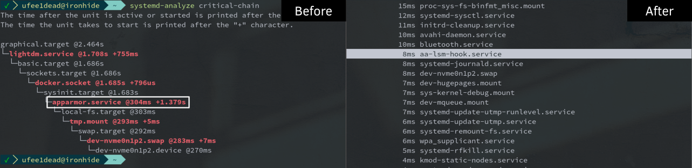

Welcome to The Roundup #3, your bytes of Solus news. In this roundup, we're talking MATE Desktop 1.20 upgrade, Plasma updates, Python 3 upgrade, and an update on boot optimizations.
<!--more-->

## MATE Desktop

Ikey has been hard at work upgrading MATE Desktop in Solus to the latest announced release, [MATE 1.20](https://mate-desktop.org/blog/2018-02-07-mate-1-20-released/). We recommend checking out their blog post for full details, but here's some of the exciting bits (at least in our opinions) that this release brings:

- Support for HiDPI displays with dynamic detection and scaling, as well as HiDPI hints for Qt applications being pushed to the environment to improve cross toolkit integration.
- Marco now supports drag to quadrant window tiling.
- Support for Global Menu providers such as vala-panel-appmenu has been added.
- Solarized themes are now available in MATE Terminal
- Accessibility support for visually impaired users has been improved in Atril.
- Caja 1.20.0 adds column autoresizing
- Engrampa 1.20.0 has multiple 7z fixes.
- Pluma 1.20.0 will now hide tabs if we are using the sidebar.

MATE 1.20 will be available to **all** Solus users on our Friday sync!

## Plasma Updates

Last week we announced the Plasma Early Access ISO. The feedback and community engagement has been really incredible (*special thanks to folcred for all the help*) and Peter has been hard at work addressing various items, as well as evaluating tweaks like reducing the timer for shutdown / restart. Additionally, he's upgraded Plasma to the latest [5.12 LTS](https://www.kde.org/announcements/plasma-5.12.0.php), which features items like:

- Usability improvements for the global menu
- KRunner can now be used with on-screen readers
- The weather applet can now show the temperature next to the weather status icon

## Python 3 Upgrade

Last week Peter and kyrios performed an upgrade of our Python 3 from 3.5 to 3.6.4. This stack upgrade went fairly smoothly and we gave ourselves a few more days to stabilize the repositories before syncing to stable. This week we've been keeping an eye out for any other packages that may need to be updated, patched, or rebuilt for Python 3.6, and aside a `docker-compose` issue was that [addressed](https://dev.solus-project.com/T5753) with an upgrade (and available in the unstable repos currently), it's been smooth sailing so far.

## Update on Boot Optimizations

As mentioned in [The Roundup #2](/2018/01/30/upgrades-cleanups-and-optimizations) last week, we wanted to dedicate some time on addressing boot speeds and optimizing early boot services, primarily around speeding up slow units such as AppArmor.

Ikey worked on a [simple project](https://github.com/solus-project/aa-lsm-hook) called `aa-lsm-hook`, which simplifies AppArmor LSM integration by means of portable, agnostic binaries that can be called on boot and during package transactions when the AppArmor profiles reload.

This project eliminates the use of legacy bash scripts to manage the lifetime of AppArmor profiles, performs ahead-of-time compilation of AppArmor profiles (*leveraging apparmor_parser*) via `aa-lsm-hook-compile` during package operations and avoids boot time regressions by loading only from a cache via `aa-lsm-hook-load` (and only recompiling if the cache is invalid or unable to load).

With Ikey's local testing and a working ahead-of-time cache, we went from 1.3 seconds with the AppArmor service (`apparmor.service`) to **around 8ms** with the aa-lsm-hook service, as shown in the comparison below.

Furthermore, [we've reduced the startup time](https://github.com/linuxmint/slick-greeter/commit/ef83fca41562884cad61059975e4e56a10f5a1a3) of the display manager by ensuring the Pythonic helper to set the keyboard layout is only executed on Debian/Ubuntu systems, as this adds unnecessary startup penalties on Solus. We plan on tackling the remaining Pythonic helper for HiDPI detection.

Last but not least, we had [a new release](https://github.com/solus-project/solus-hardware-config/releases/tag/v15) of `solus-hardware-config`. The most important change is replacing the old shell script "on-demand-cpupower-switch" service with a C binary to transition the CPU governor from performance to powersave or ondemand, depending on whether intel_pstate is used.

On Ikey's local system, this reduced the unit execution time from 109ms to 39ms, and we've enabled this to be a parallel lazy unit, so it no longer holds up the critical boot chain.

Additionally, you can start/stop `cpu-powersave.service` to transition in and out of performance mode. The Solus kernel boots by default in `performance`, and we'll lazily enter powersave mode to ensure we have rapid boots **and** are still power conservative during userspace runtime.

For future changes, our last major change in userspace will be areas of networking and the display manager, then Ikey will be moving onto kernel/initrd. We'll have more news on those items in future issues of The Roundup!