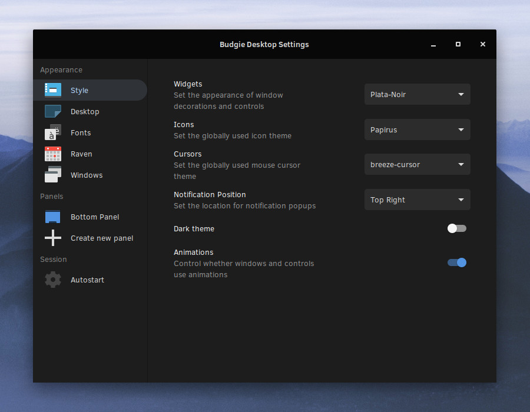
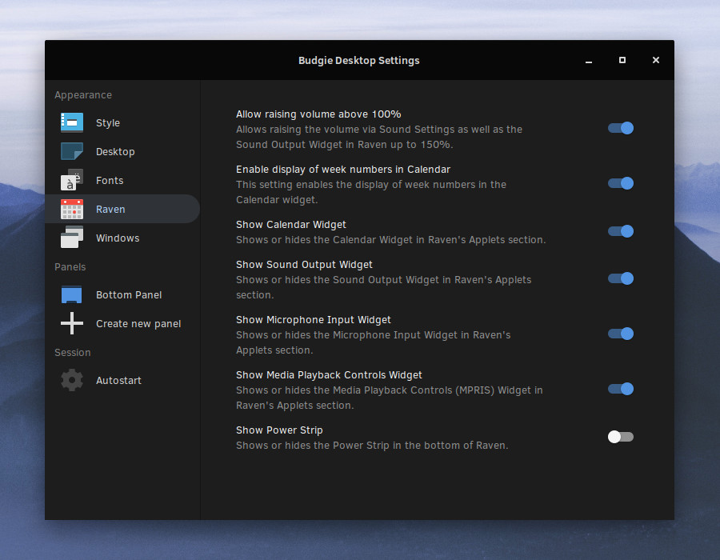
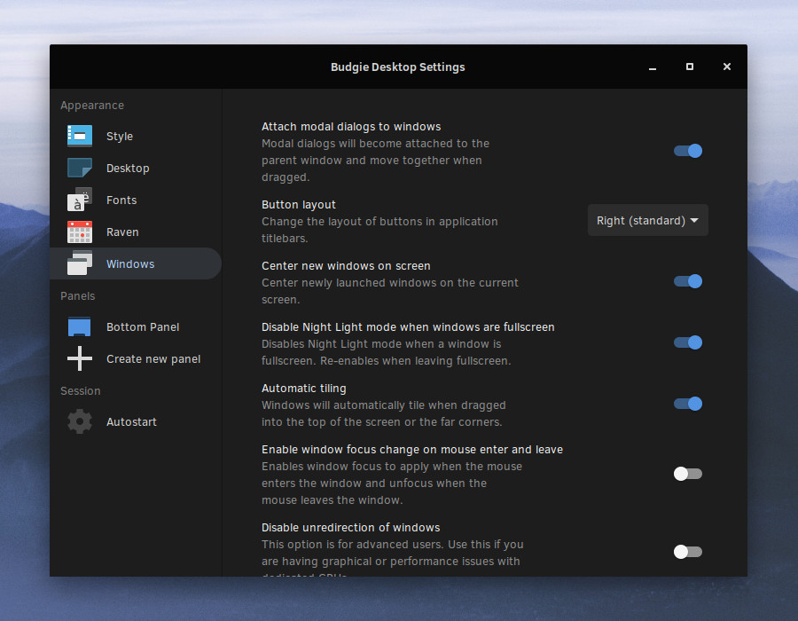

---
authors:
- image: https://avatars.githubusercontent.com/u/156574?v=4
  link: https://github.com/JoshStrobl
  name: Joshua Strobl
tags:
- budgie
- news
- releases
date: "2019-03-17T23:06:48+02:00"
featuredimage: /solus-4-featured.jpg
title: Solus 4 Fortitude Released
url: /2019/03/17/solus-4-released
---

We are proud to announce the immediate availability of Solus 4 Fortitude, a new major release of the Solus operating system. This release delivers a brand new Budgie experience, updated sets of default applications and theming, and hardware enablement.
<!--more-->

## General

### Default Applications

All our editions feature:

- Firefox 65.0.1
- LibreOffice 6.2.1.2
- Rhythmbox 3.4.3 with the latest release of the Alternate Toolbar extension
- Thunderbird 60.5.2

Our Budgie and GNOME Editions ship with GNOME MPV 0.16 and our MATE Edition ships with VLC 3.0.6

### Hardware and Kernel Enablement

This release of Solus ships with Linux kernel 4.20.16, enabling us to provide support for AMD Picasso and Raven2 APUs, AMD Vega20 and broader Vega10 enablement, as well as improved support for Intel Coffee Lake and Ice Lake CPUs.

Furthermore, Linux kernel 4.20 expands our support for other hardware devices, such as touchpad support for the Lenovo IdeaPad 130-15IKB and 330-15ARR.

Mesa has been upgraded to the latest release, 19.0.0, enabling us to provide OpenGL 4.5 API support (for supported cards) as well as support for newer AMD Polaris, Vega10, Vega20, and VegaM cards.

### Multimedia Upgrades

This release ships with ffmpeg 4.1.1, the latest of the 4.x series. This release has enabled us to deliver improved VAAPI MPEG and VP8 decoding as well as support for AOM AV1 encoding, decoding, and parsing.

We've also enabled support in VLC for dav1d, an open source AV1 decoder.

### Software Center

The Software Center has seen some minor refinements and fixes ahead of our planned rewrite. Specifically, we have fixed instances where search results may not show the package summary or description when an ampersand is used in it.

Additionally WPS Office has been removed from Third Party due to the introduction of an unenforceable EULA by the developers.

## Budgie

Solus ships with our brand new release of the Budgie 10.x series, Budgie 10.5, as well as complimenting this release by shipping Solus 4 out-of-the-box with the Plata (Noir) GTK Theme.

### Applets

#### Budgie Menu

This Budgie release introduces a few refinements to Budgie Menu. We no longer show applications multiple times in non-compact mode when headers are turned off. We will also attempt to eliminate the "Sundry" category by automatically moving them to an "Other" category if the category is available.

#### Caffeine Mode

Budgie 10.5 introduces a new applet called Caffeine Mode. Caffeine Mode is designed to ensure your system does not automatically suspend, lock, or dim when you're hard at work.

Caffeine Mode supports:

- Notifications when it is turned on or off
- Setting a timer to automatically turn off Caffeine Mode
- Turning up your display brightness to max or a designated brightness level

We'd like to thank [yursan9](https://github.com/yursan9) for their amazing work on this applet!

#### Icon Tasklist

Budgie 10.5 provides a massive upgrade to the IconTasklist applet. Our new IconTasklist applet has improved application detection to more consistently group applications and introduces a brand new IconTasklist popover experience.

This new popover design enables you to:

- Close all instances of the selected application
- Easily access per-window controls for marking it always on top, maximizing / unmaximizing, minimizing, and moving it to various workspaces.
- Quickly favorite / unfavorite apps
- Quickly launch a new instance of the selected application
- Scroll up or down on an IconTasklist button when a single window is open to activate and bring it into focus, or minimize it, based on the scroll direction.
- Toggle to minimize and unminimize various application windows

Additionally, this new popover design enables you to take advantage of custom application actions by supported apps, such as launching a private window in Firefox, composing a new message in Geary, and more!

### Raven

Raven, our widget and notification center, has seen improvements in Budgie 10.5.

#### Calendar

You can now enable week numbers for the Calendar widget in Raven. This can be done easily by going to the Raven section of Budgie Desktop Settings and toggling on "Enable display of week numbers in Calendar".

#### Notifications

Budgie 10.5 introduces improved notification management. With this release, notification management is no longer a "clear all or nothing" scenario. Notifications are grouped on a per-app basis and you're in control of whether or not you want to:

1. Clear all notifications
2. Clear all notifications **for a specific app**
3. Clear a specific notification for an app

Building on this, notification summaries and descriptions are now properly summarized in their Notification popups. We will also no longer store notifications for:

1. Power, such as automatic suspend and wake-from-suspend notifications
2. Printer notifications, such as those for network printers

#### Sound

Our Sound widgets have been completely rewritten and redesigned! We've broken up the widgets into Sound Output and Sound Input, fixed some long-standing bugs, and introduced long sought after features.

For Sound Output, you can now enable the "Allow raising volume above 100%" option to crank up your volume to 150%! Great for parties or movie watching.

Controlling your volume on a per-application basis has never been easier. With our new Sound Output widget, you can now control each application as well as mute them right from Raven! No longer do you need need to dive into the Sound settings in GNOME Control Center or install a third-party tool like pavucontrol. Applications which utilize ALSA for sound playback will also have less verbose names, so you can expect to see applications like mocp (music-on-console player) showing up as "mocp" rather than "ALSA plug-in [mocp]"

With both the Sound Output and Input widgets, you can easily switch between devices, and the functionality for device switching has been rewritten to be more reliable in cases of plugging in a new device or removing an existing one.

Last but not least, in the event you have no output or input devices, we'll automatically hide the respective widget in Raven! Plug in a device and they'll automatically show up!

### Personalization

We strongly believe that Budgie should provide a balanced, curated desktop experience for our users, enabling a reasonable level of personalization out-of-the-box and empower our users (and downstreams such as Ubuntu Budgie) to open up a world of possibilities with Budgie applets.

Budgie 10.5 introduces a wider array of personalization options via our Budgie Desktop Settings application. Let's go over the various sections which have been refinements!

#### Style

Budgie 10.5 builds on our existing support for selecting various cursor, icon, and widget (GTK) themes by ensuring that the options we present to users for icons and widgets are more likely to work well with Budgie.

To do this, we have implemented a blacklist of Icon and GTK themes which are known to not provide our users the most optimal experience. For GTK Themes, we blacklist themes such as Adwaita, Clearlooks, Industrial, etc. which are provided by GNOME and are largely aimed at supporting GNOME Shell. For Icon Themes, we blacklist Breeze and the Solus SC Icon Theme (largely leverages Papirus). Should you desire, you can still switch to these themes through a third-party tool such as GNOME Tweaks.

Thanks to the hard work of [EbonJaeger](https://github.com/EbonJaeger), you can choose the position in which Notification pop-ups are displayed. By default, Notifications will display in the top right of your screen, however that can now be changed to any corner of your screen!

For vendors, we now provide the gschema key to hide the "Built-in theme" option. For Solus 4, we leverage this option to hide such built-in "internal" theme and prioritize our work on surfacing third-party GTK themes such as Plata.

#### Raven

Budgie 10.5 introduces a new section to Budgie Desktop Settings for personalizing Raven. This is where you would go to allow raising volume above 100% as well as toggle various widgets. We provide options for:

- Allowing the raising the volume above 100%
- Enabling the display of week numbers in the Calendar widget
- Toggling Raven widgets
  - Calendar
  - Sound Output
  - Microphone / Sound Input
  - Media Playback Controls (MPRIS)
  - Power Strip (Quick Access to Budgie Desktop Settings, Lock, and Logout)

#### Windows

The Windows section of Budgie Desktop Settings introduces options for:

- Center new windows on screen (when possible).
- Disabling Night Light mode when a window becomes full-screen. This option will automatically re-enable Night Light mode when leaving fullscreen. This is great for late night gaming or movie watching.
- Enabling window focus change on mouse enter and leave instead of based on clicking on a window.

### Other

Some other changes / fixes of note:

- Added dedicated CSS classes for Sound widgets (`apps-list`, `devices-list`, `sound-devices`) as well as various popovers to make it easier for theme developers.
- We now prevent the dragging of desktop icons into the IconTasklist, given its purpose is to show favorited and/or active windows.

## GNOME

Our GNOME experience has seen some refinements to our out-of-the-box default experience.

- Gedit will now default to using the Oblivion theme
- We now default to the Plata (Noir) GTK Theme.

## MATE

Our MATE experience has seen some refinements to our out-of-the-box default experience.

- We now default to Plata GTK Theme for improved system theming
- We've resolved an issue with password setting in the About Me of MATE Control Center
- Due to various issues with broken user management, we have decided to temporarily remove the packages responsible for providing this functionality, which are `gnome-system-tools` , `system-tools-backend`,  and `liboobs`. We are actively working with the developer of an [alternative tool](https://github.com/zhuyaliang/user-admin) to resolve various issues (such as avatar and language setting) and we are optimistic we'll have a solution to deliver to our users. When this tooling is considered ready for production, we will deploy it automatically to our MATE users.

Our MATE ISO ships with latest of the MATE 1.20 series, which has numerous improvements and fixes such as:

- Applet fixes in Cpufreq and Eyes
- Numerous fixes in MATE Tweak
- Numerous fixes in MATE Panel such as for the Clock and na-tray
- Support for background fallback on HiDPI in mate-desktop
- You now double-click instead of single-click to edit keyboard shortcuts in MATE Control Center

## Plasma

Thanks to the hard work by Friedrich von Gellhorn (Girtablulu) and the groundwork laid by Peter O'Connor (sunnyflunk), we're happy to introduce the availability of a new Plasma Testing ISO. This new Plasma Testing ISO features the latest of the Plasma Desktop [5.15](https://kde.org/announcements/plasma-5.15.0.php) series, [5.15.2](https://kde.org/announcements/plasma-5.15.2.php), and is complemented by KDE Frameworks 5.56, KDE Applications 18.12.2, and Qt 5.12.1.

This Plasma Testing ISO features various performance improvements, as well as reduced QML Engine Memory usage thanks to Qt 5.12 by upwards of 30%. It also features improvements from the latest Plasma Desktop and KDE Applications such as:

- Crash fixes for Dolphin
- Full support for emoji characters, including color emojis.
- KDE Plasma 5.15 is starting up now faster.
- Some new / improved icons.

We have also refined our default experience so windows now open in the center of the desktop, as well as the addition of a new default keyboard shortcut for showing your desktop (Meta+D).

You can download the new Plasma Testing ISO [here](https://mirrors.rit.edu/solus/images/4.0/Solus-Plasma-Testing.iso)

## Thank You

We would like to thank everyone that has supported and contributed to Solus and its endeavors, including Budgie Desktop. It's you, our community, that has made this release possible. Whether you've filed bugs, fixed software, contributed code, translated Budgie Desktop, or shared Solus releases with your colleagues, friends, and family, you've helped shape this release and improved the project for everyone.

Thank you for believing in our shared vision for the project. We look forward to working alongside all of you on many more releases in the future.

## Download

To download our latest Editions, you can go to our [Download](/download) page, where direct links and torrents are available!

---

## Changelog of ISO (Budgie)

### Packages added to this release:

  - aom
  - ldns
  - libpcap
  - nvidia-390-glx-driver-modaliases
  - ppp
  - solus-sc-icons
  - wireless-regdb
  - zstd

### Packages removed from this release:

- font-indic-ttf
- font-lateef-ttf
- nvidia-304-glx-driver-modaliases

### Changes in this release:

**libao**

  - [Bryan T. Meyers: Update to 1.2.2 and switch to github source](https://dev.getsol.us/source/libao/browse/master/;91addfb)

**ldb**

  - [Rune Morling: Update ldb to 1.3.6 as part of the Samba 4.8.x stack update.](https://dev.getsol.us/source/ldb/browse/master/;a96d777)

**libmbim**

  - [Pierre-Yves: Update libmbim to 1.18.0](https://dev.getsol.us/source/libmbim/browse/master/;f8279f2)

**libwpg**

  - [Pierre-Yves: Update libwpg to 0.3.3](https://dev.getsol.us/source/libwpg/browse/master/;81423a6)

**libwpd**

  - [Pierre-Yves: Update libwpd to 0.10.3](https://dev.getsol.us/source/libwpd/browse/master/;9add70d)
  - [Peter O'Connor: Address CVE-2018-19208](https://dev.getsol.us/source/libwpd/browse/master/;55974a2)

**qtstyleplugins**

  - [F. von Gellhorn: Rebuild for QT 5.12.1](https://dev.getsol.us/source/qtstyleplugins/browse/master/;fe47009)
  - [Peter O'Connor: Disable Qt scaling with gtk2 theme so it doesn't scale twice](https://dev.getsol.us/source/qtstyleplugins/browse/master/;90cc2fc)
  - [Peter O'Connor: Rebuild for Qt5 5.11.2](https://dev.getsol.us/source/qtstyleplugins/browse/master/;eec17af)

**lz4**

  - [Pierre-Yves: Force -j1 for unit tests](https://dev.getsol.us/source/lz4/browse/master/;54cb5ee)
  - [Pierre-Yves: Update lz4 to 1.8.3](https://dev.getsol.us/source/lz4/browse/master/;319f28f)

**libxres**

  - [Bryan T. Meyers: Rebuild for xorgproto](https://dev.getsol.us/source/libxres/browse/master/;ca7014f)
  - [Peter O'Connor: Rebuild for xorgproto merge](https://dev.getsol.us/source/libxres/browse/master/;45c7010)

**xmlsec1**

  - [Bryan T. Meyers: Update to 1.2.27, temporarily disable tests since a few are failing (minor)](https://dev.getsol.us/source/xmlsec1/browse/master/;31425bf)

**libxtst**

  - [Peter O'Connor: Rebuild for xorgproto merge](https://dev.getsol.us/source/libxtst/browse/master/;0cbbaab)

**gstreamer-1.0-plugins-ugly**

  - [Pierre-Yves: Update gstreamer-1.0-plugins-ugly to 1.14.4](https://dev.getsol.us/source/gstreamer-1.0-plugins-ugly/browse/master/;004f601)
  - [Pierre-Yves: Update gstreamer-1.0-plugins-ugly to 1.14.3](https://dev.getsol.us/source/gstreamer-1.0-plugins-ugly/browse/master/;b670d26)

**libnspr**

  - [Pierre-Yves: Update libnspr to 4.20](https://dev.getsol.us/source/libnspr/browse/master/;30f2d4f)

**gstreamer-1.0-plugins-good**

  - [Pierre-Yves: Update gstreamer-1.0-plugins-good to 1.14.4](https://dev.getsol.us/source/gstreamer-1.0-plugins-good/browse/master/;3e053c6)
  - [Pierre-Yves: Update gstreamer-1.0-plugins-good to 1.14.3](https://dev.getsol.us/source/gstreamer-1.0-plugins-good/browse/master/;fe4f489)

**x265**

  - [Pierre-Yves: Update x265 to 3.0](https://dev.getsol.us/source/x265/browse/master/;b2f1b4e)
  - [Joey Riches: Update to 2.9](https://dev.getsol.us/source/x265/browse/master/;af6cd19)

**libxshmfence**

  - [Bryan T. Meyers: Rebuild for xorgproto](https://dev.getsol.us/source/libxshmfence/browse/master/;2327ce4)
  - [Peter O'Connor: Rebuild for xorgproto update](https://dev.getsol.us/source/libxshmfence/browse/master/;2c42875)

**gstreamer-1.0-plugins-base**

  - [Pierre-Yves: Update gstreamer-1.0-plugins-base to 1.14.4](https://dev.getsol.us/source/gstreamer-1.0-plugins-base/browse/master/;eca23d3)
  - [Pierre-Yves: Update gstreamer-1.0-plugins-base to 1.14.3](https://dev.getsol.us/source/gstreamer-1.0-plugins-base/browse/master/;ba9fcc0)

**libglvnd**

  - [Peter O'Connor: Update to 1.1.0](https://dev.getsol.us/source/libglvnd/browse/master/;1884b83)
  - [Peter O'Connor: Rebuild for xorgproto update](https://dev.getsol.us/source/libglvnd/browse/master/;8d37d98)

**tevent**

  - [Rune Morling: Update tevent to 0.9.37 as part of the Samba 4.8.x stack update.](https://dev.getsol.us/source/tevent/browse/master/;e42a865)

**gmime**

  - [Bryan T. Meyers: Update to 3.2.3](https://dev.getsol.us/source/gmime/browse/master/;08a3dd5)

**gpgme**

  - [Pierre-Yves: Update gpgme to 1.12.0](https://dev.getsol.us/source/gpgme/browse/master/;aa1d7e5)

**libsndfile**

  - [Joshua Strobl: Resolves the following CVEs:](https://dev.getsol.us/source/libsndfile/browse/master/;5170c84)

**libxdmcp**

  - [Bryan T. Meyers: Rebuild for xorgproto](https://dev.getsol.us/source/libxdmcp/browse/master/;0abe2d0)
  - [Peter O'Connor: Rebuild for xorgproto merge](https://dev.getsol.us/source/libxdmcp/browse/master/;956c9ca)

**xorg-driver-video-amdgpu**

  - [Fabio Forni: Update xorg-driver-video-amdgpu to 19.0.0](https://dev.getsol.us/source/xorg-driver-video-amdgpu/browse/master/;9de0bad)
  - [Bryan T. Meyers: Rebuild for xorgproto](https://dev.getsol.us/source/xorg-driver-video-amdgpu/browse/master/;313d83b)
  - [Peter O'Connor: Update to 18.1.0](https://dev.getsol.us/source/xorg-driver-video-amdgpu/browse/master/;307631d)

**libvisio**

  - [Joey Riches: Rebuild against libicu](https://dev.getsol.us/source/libvisio/browse/master/;da37bba)

**gstreamer-1.0**

  - [Pierre-Yves: Update gstreamer-1.0 to 1.14.4](https://dev.getsol.us/source/gstreamer-1.0/browse/master/;225872a)
  - [Pierre-Yves: Update gstreamer-1.0 to 1.14.3](https://dev.getsol.us/source/gstreamer-1.0/browse/master/;da969c4)

**xset**

  - [Bryan T. Meyers: Rebuild for xorgproto](https://dev.getsol.us/source/xset/browse/master/;1e4a4ee)
  - [Peter O'Connor: Rebuild for xorgproto update](https://dev.getsol.us/source/xset/browse/master/;2016e32)

**gstreamer-1.0-libav**

  - [Pierre-Yves: Rebuild for gstreamer-1.0-libav for ffmpeg 4.1](https://dev.getsol.us/source/gstreamer-1.0-libav/browse/master/;6174475)
  - [Pierre-Yves: Update gstreamer-1.0-libav to 1.14.4](https://dev.getsol.us/source/gstreamer-1.0-libav/browse/master/;cbd17c8)
  - [Pierre-Yves: Update gstreamer-1.0-libav to 1.14.3](https://dev.getsol.us/source/gstreamer-1.0-libav/browse/master/;d870e6b)

**libgxps**

  - [Pierre-Yves: Update libgxps to 0.3.1](https://dev.getsol.us/source/libgxps/browse/master/;fedb74b)

**wayland**

  - [Bryan T. Meyers: Switch to gitlab source](https://dev.getsol.us/source/wayland/browse/master/;a283c88)
  - [Joshua Strobl: Update Wayland to 1.16.0. Release announcement available [here](http://lists.freedesktop.org/archives/wayland-devel/2018-August/039358.html).](https://dev.getsol.us/source/wayland/browse/master/;79272d5)

**python-asn1crypto**

  - [Pierre-Yves: Update python-asn1crypto to 0.24.0](https://dev.getsol.us/source/python-asn1crypto/browse/master/;1b25129)

**papirus-icon-theme**

  - [Jacob Alzén: Update papirus-icon-theme to 20190302](https://dev.getsol.us/source/papirus-icon-theme/browse/master/;f231797)
  - [Jacob Alzén: Update papirus-icon-theme to '20190203' and remove Adapta versions](https://dev.getsol.us/source/papirus-icon-theme/browse/master/;4ac1f87)
  - [Joshua Strobl: Add additional icons for new Third Party items added into SC.](https://dev.getsol.us/source/papirus-icon-theme/browse/master/;a02525f)
  - [Joshua Strobl: Drop most inherits for Solus SC Icons.](https://dev.getsol.us/source/papirus-icon-theme/browse/master/;451599d)
  - [Joshua Strobl: Initial implementation of solus-sc-icons leveraging Papirus.](https://dev.getsol.us/source/papirus-icon-theme/browse/master/;b83541e)

**xorg-driver-input-libinput**

  - [Pierre-Yves: Update xorg-driver-input-libinput to 0.28.2](https://dev.getsol.us/source/xorg-driver-input-libinput/browse/master/;3491093)
  - [Pierre-Yves: Update xorg-driver-input-libinput to 0.28.1](https://dev.getsol.us/source/xorg-driver-input-libinput/browse/master/;53609f1)
  - [Peter O'Connor: Rebuild for xorg-server 1.20.1](https://dev.getsol.us/source/xorg-driver-input-libinput/browse/master/;77c8949)

**solus-artwork**

  - [Joshua Strobl: Update to 23.0](https://dev.getsol.us/source/solus-artwork/browse/master/;067df84)
  - [Joshua Strobl: Update to 22.0: A Colorful Chaos](https://dev.getsol.us/source/solus-artwork/browse/master/;5d78b76)

**solus-sc**

  - [Joshua Strobl: Sync with git](https://dev.getsol.us/source/solus-sc/browse/master/;b42193d)
  - [Joshua Strobl: Sync with git. Drops WPS Office from Third Party.](https://dev.getsol.us/source/solus-sc/browse/master/;6480fd5)
  - [Joshua Strobl: Add Desktop Action for going to Updates view.](https://dev.getsol.us/source/solus-sc/browse/master/;979bf78)
  - [Joshua Strobl: Update to 22.](https://dev.getsol.us/source/solus-sc/browse/master/;c79be7f)
  - [Joshua Strobl: Attempt to force solus-sc for Third Party icons.](https://dev.getsol.us/source/solus-sc/browse/master/;0632e3b)
  - [Joshua Strobl: Add a couple additional fixes via git and start having a rundep on solus-sc-icons.](https://dev.getsol.us/source/solus-sc/browse/master/;3fd2cd4)
  - [Joshua Strobl: Switch to git for Plasma testing.](https://dev.getsol.us/source/solus-sc/browse/master/;5cbd209)
  - [Joshua Strobl: Start using GetSolus fork.](https://dev.getsol.us/source/solus-sc/browse/master/;8b68489)

**nghttp2**

  - [Joshua Strobl: Update to 1.36.0](https://dev.getsol.us/source/nghttp2/browse/master/;19d270c)
  - [Pierre-Yves: Update nghttp2 to 1.35.0](https://dev.getsol.us/source/nghttp2/browse/master/;ab9194e)

**lm_sensors**

  - [Pierre-Yves: Update lm-sensors to 3.5.0](https://dev.getsol.us/source/lm_sensors/browse/master/;ac491a2)

**libheif**

  - [Pierre-Yves: Rebuild libheif for x265 3.0](https://dev.getsol.us/source/libheif/browse/master/;d1fb75e)
  - [Joey Riches: Rebuild against x265](https://dev.getsol.us/source/libheif/browse/master/;78da73b)

**libboost**

  - [Joey Riches: Rebuild against libicu](https://dev.getsol.us/source/libboost/browse/master/;98d34b7)

**baselayout**

  - [Joshua Strobl: Revert change.](https://dev.getsol.us/source/baselayout/browse/master/;79f6f13)
  - [Joshua Strobl: Do a thing.](https://dev.getsol.us/source/baselayout/browse/master/;f2e4565)

**volume_key**

  - [Bryan T. Meyers: Switch to github source](https://dev.getsol.us/source/volume_key/browse/master/;d16e6a8)

**libmtp**

  - [Pierre-Yves: Update libmtp to 1.1.16](https://dev.getsol.us/source/libmtp/browse/master/;3b94788)

**python-setuptools**

  - [Pierre-Yves: Update python-setuptools to 40.5.0](https://dev.getsol.us/source/python-setuptools/browse/master/;2735242)

**unzip**

  - [Bryan T. Meyers: Force off lchmod support, resolves T7412](https://dev.getsol.us/source/unzip/browse/master/;456e8f5)
  - [Peter O'Connor: Prevent unsigned overflow](https://dev.getsol.us/source/unzip/browse/master/;13544c3)

**libxv**

  - [Bryan T. Meyers: Rebuild for xorgproto](https://dev.getsol.us/source/libxv/browse/master/;7b3af1c)
  - [Peter O'Connor: Rebuild for xorgproto merge](https://dev.getsol.us/source/libxv/browse/master/;ae7d549)

**youtube-dl**

  - [paessi: Update youtube-dl to 2019.03.09](https://dev.getsol.us/source/youtube-dl/browse/master/;d92ea2d)
  - [paessi: Update youtube-dl to 2019.03.01](https://dev.getsol.us/source/youtube-dl/browse/master/;8cd90db)
  - [paessi: Update youtube-dl to 2019.02.18](https://dev.getsol.us/source/youtube-dl/browse/master/;7daddc4)
  - [F. von Gellhorn: Update youtube-dl to 2019.02.08](https://dev.getsol.us/source/youtube-dl/browse/master/;5f85464)
  - [F. von Gellhorn: Update youtube-dl to 2019.01.30.1](https://dev.getsol.us/source/youtube-dl/browse/master/;7004e60)
  - [F. von Gellhorn: Update youtube-dl to 2019.01.27](https://dev.getsol.us/source/youtube-dl/browse/master/;23fccbd)
  - [paessi: Update youtube-dl to 2019.01.24](https://dev.getsol.us/source/youtube-dl/browse/master/;190ff8e)
  - [paessi: Update youtube-dl to 2019.01.17](https://dev.getsol.us/source/youtube-dl/browse/master/;695614b)
  - [paessi: Update youtube-dl to 2019.01.02](https://dev.getsol.us/source/youtube-dl/browse/master/;cbc12ec)
  - [paessi: Update youtube-dl to 2018.12.31](https://dev.getsol.us/source/youtube-dl/browse/master/;6e39456)
  - [paessi: Update youtube-dl to 2018.12.17](https://dev.getsol.us/source/youtube-dl/browse/master/;5d22060)
  - [paessi: Update youtube-dl to 2018.12.09](https://dev.getsol.us/source/youtube-dl/browse/master/;72126ba)
  - [paessi: Update youtube-dl to 2018.12.03](https://dev.getsol.us/source/youtube-dl/browse/master/;9a4baf3)
  - [paessi: Update youtube-dl to 2018.11.23](https://dev.getsol.us/source/youtube-dl/browse/master/;cfc639f)
  - [paessi: Update youtube-dl to 2018.11.18](https://dev.getsol.us/source/youtube-dl/browse/master/;2715dda)
  - [paessi: Update youtube-dl to 2018.11.07](https://dev.getsol.us/source/youtube-dl/browse/master/;b743009)
  - [paessi: Update youtube-dl to 2018.10.29](https://dev.getsol.us/source/youtube-dl/browse/master/;17254cf)
  - [paessi: Update youtube-dl to 2018.10.05](https://dev.getsol.us/source/youtube-dl/browse/master/;0e03cf0)
  - [paessi: Update youtube-dl to 2018.09.26 (for real this time)](https://dev.getsol.us/source/youtube-dl/browse/master/;b8bf979)
  - [paessi: Update youtube-dl to 2018.09.26](https://dev.getsol.us/source/youtube-dl/browse/master/;8a42772)
  - [xeals: Update to 2018.09.18](https://dev.getsol.us/source/youtube-dl/browse/master/;5b206ee)

**geoclue**

  - [Joshua Strobl: Reverted to older geoclue again.](https://dev.getsol.us/source/geoclue/browse/master/;353ca3a)
  - [Joshua Strobl: Revert "Update to 2.4.12"](https://dev.getsol.us/source/geoclue/browse/master/;de0f6c8)
  - [Bryan T. Meyers: Update to 2.4.12](https://dev.getsol.us/source/geoclue/browse/master/;339405d)

**python**

  - [Pierre-Yves: Update python to 2.7.16](https://dev.getsol.us/source/python/browse/master/;9d5e390)
  - [Peter O'Connor: Address CVE-2018-1000802 and CVE-2018-14647](https://dev.getsol.us/source/python/browse/master/;3074731)

**python-dbus**

  - [Pierre-Yves: devel: add python3-dbus as dependency](https://dev.getsol.us/source/python-dbus/browse/master/;e06f5b6)

**tracker-miners**

  - [Joshua Strobl: Rebuild because I want a working system.](https://dev.getsol.us/source/tracker-miners/browse/master/;6374f38)

**aa-lsm-hook**

  - [Bryan T. Meyers: Disable musl to fix apparmor compile](https://dev.getsol.us/source/aa-lsm-hook/browse/master/;c5b2b13)
  - [Joshua Strobl: Revert prior action. Solbuild really didn't like that.](https://dev.getsol.us/source/aa-lsm-hook/browse/master/;d7ea280)
  - [Joshua Strobl: Have apparmor be an explicit rundep, seeing as this is for **AppArmor** system integration.](https://dev.getsol.us/source/aa-lsm-hook/browse/master/;238d1fa)

**cpio**

  - [Bryan T. Meyers: Switch to GNU mirror source](https://dev.getsol.us/source/cpio/browse/master/;2086984)

**bash-completion**

  - [Yurizal Susanto: Speed up eopkg completion](https://dev.getsol.us/source/bash-completion/browse/master/;e794434)
  - [Joey Riches: Update eopkg completions for autoremove and remove-orphans](https://dev.getsol.us/source/bash-completion/browse/master/;bce795b)

**mpv**

  - [Rune Morling: Safety rebuild for samba-4.8.8](https://dev.getsol.us/source/mpv/browse/master/;1773270)
  - [Bryan T. Meyers: bump](https://dev.getsol.us/source/mpv/browse/master/;574498e)
  - [Mateusz Mikuła: Rebuild with Nvidia Video Codec API enabled](https://dev.getsol.us/source/mpv/browse/master/;721fc40)
  - [Pierre-Yves: Update mpv to 0.29.1 & rebuild for ffmpeg 4.1](https://dev.getsol.us/source/mpv/browse/master/;533dcf9)
  - [Joshua Strobl: Safety rebuild against samba](https://dev.getsol.us/source/mpv/browse/master/;d820507)

**xorg-driver-input-wacom**

  - [Bryan T. Meyers: Rebuild for xorgproto](https://dev.getsol.us/source/xorg-driver-input-wacom/browse/master/;ff55bb4)
  - [Peter O'Connor: Rebuild for xorg-server 1.20.1](https://dev.getsol.us/source/xorg-driver-input-wacom/browse/master/;dfd29ed)

**libdrm**

  - [Joshua Strobl: Update to 2.4.97](https://dev.getsol.us/source/libdrm/browse/master/;07eee3e)
  - [Bryan T. Meyers: Temporarily disable tests](https://dev.getsol.us/source/libdrm/browse/master/;261cb8a)
  - [Bryan T. Meyers: Updated to 2.4.96](https://dev.getsol.us/source/libdrm/browse/master/;3aab9d2)

**xorg-driver-video-intel**

  - [Bryan T. Meyers: Rebuild for xorgproto](https://dev.getsol.us/source/xorg-driver-video-intel/browse/master/;934de89)
  - [Peter O'Connor: Sync with latest git](https://dev.getsol.us/source/xorg-driver-video-intel/browse/master/;610e38c)

**harfbuzz**

  - [Joey Riches: Bump for rebuild](https://dev.getsol.us/source/harfbuzz/browse/master/;c68d890)
  - [Joey Riches: Downbump rel no](https://dev.getsol.us/source/harfbuzz/browse/master/;44fd802)
  - [Joey Riches: Rebuild against libicu](https://dev.getsol.us/source/harfbuzz/browse/master/;38513b5)

**shadow**

  - [Bryan T. Meyers: Move PAM configs to stateless dir](https://dev.getsol.us/source/shadow/browse/master/;b15ebc3)
  - [Bryan T. Meyers: Round two of PAM cleanup](https://dev.getsol.us/source/shadow/browse/master/;00c6f32)
  - [Bryan T. Meyers: More PAM fixes](https://dev.getsol.us/source/shadow/browse/master/;3fe7352)

**xdpyinfo**

  - [Bryan T. Meyers: Rebuild for xorgproto](https://dev.getsol.us/source/xdpyinfo/browse/master/;b725860)
  - [Peter O'Connor: Rebuild for xorgproto update](https://dev.getsol.us/source/xdpyinfo/browse/master/;485aada)

**libixion**

  - [Jan Baudisch: Update libixion to 0.14.1](https://dev.getsol.us/source/libixion/browse/master/;cedfff1)
  - [Bryan T. Meyers: Switch to gitlab source](https://dev.getsol.us/source/libixion/browse/master/;8262b40)

**gnutls**

  - [Pierre-Yves: Update gnutls to 3.6.5](https://dev.getsol.us/source/gnutls/browse/master/;d5f1b36)
  - [Pierre-Yves: Update gnutls to 3.6.4](https://dev.getsol.us/source/gnutls/browse/master/;817375b)

**onboard**

  - [Pierre-Yves: Rebuild onboard for libhunspell 1.7.0](https://dev.getsol.us/source/onboard/browse/master/;4ffd67b)

**util-linux**

  - [Philipp Trulson: Update util-linux to 2.33.1](https://dev.getsol.us/source/util-linux/browse/master/;a757ccb)
  - [Joey Riches: Update to 2.33](https://dev.getsol.us/source/util-linux/browse/master/;a6f6c9d)

**libdaemon**

  - [Bryan T. Meyers: Switch to git source](https://dev.getsol.us/source/libdaemon/browse/master/;5fa50cb)

**libxscrnsaver**

  - [Bryan T. Meyers: Rebuild for xorgproto](https://dev.getsol.us/source/libxscrnsaver/browse/master/;824f50f)
  - [Peter O'Connor: Rebuild for xorgproto merge](https://dev.getsol.us/source/libxscrnsaver/browse/master/;6f8b06c)

**ca-certs**

  - [Pierre-Yves: Update system certificates to 20190130](https://dev.getsol.us/source/ca-certs/browse/master/;45faece)
  - [Pierre-Yves: Update ca-certs to 20181020](https://dev.getsol.us/source/ca-certs/browse/master/;23d1f08)

**ffmpeg**

  - [Pierre-Yves: Update ffmpeg to 4.1.1](https://dev.getsol.us/source/ffmpeg/browse/master/;821c594)
  - [Pierre-Yves: Rebuild ffmpeg for x265 3.0](https://dev.getsol.us/source/ffmpeg/browse/master/;bedec25)
  - [Bryan T. Meyers: Rebuild for fdk-aac](https://dev.getsol.us/source/ffmpeg/browse/master/;3a773fa)
  - [Pierre-Yves: ffmpeg: enable aom AV1 encoding/decoding](https://dev.getsol.us/source/ffmpeg/browse/master/;4a84b4e)
  - [Mateusz Mikuła: Rebuild with Nvidia Video Codec API enabled](https://dev.getsol.us/source/ffmpeg/browse/master/;1220be2)
  - [Pierre-Yves: [WIP] Update ffmpeg to 4.1](https://dev.getsol.us/source/ffmpeg/browse/master/;30f8d98)
  - [Joey Riches: Rebuild against x265](https://dev.getsol.us/source/ffmpeg/browse/master/;06c149a)
  - [Pierre-Yves: Rebuild ffmpeg for libssh 0.8.4](https://dev.getsol.us/source/ffmpeg/browse/master/;19af047)
  - [Joshua Strobl: Add nopatch files to resolve false reporting by cve-check-tool. These CVEs were resolved in 3.4.x releases.](https://dev.getsol.us/source/ffmpeg/browse/master/;c3c7397)

**osinfo-db**

  - [Bryan T. Meyers: Update to 20181214 and fix pathing, resolves T7432](https://dev.getsol.us/source/osinfo-db/browse/master/;b9572d5)
  - [Bryan T. Meyers: Switch to gitlab source](https://dev.getsol.us/source/osinfo-db/browse/master/;5c6f812)

**libcaca**

  - [Bryan T. Meyers: Switch to github source](https://dev.getsol.us/source/libcaca/browse/master/;03498be)

**ghostscript**

  - [Peter O'Connor: Update to 9.25 to address CVE-2018-16802](https://dev.getsol.us/source/ghostscript/browse/master/;41862f2)

**libp11-kit**

  - [Pierre-Yves: Update libp11-kit to 0.23.15](https://dev.getsol.us/source/libp11-kit/browse/master/;cc80abd)

**luajit**

  - [Bryan T. Meyers: Switch to github source](https://dev.getsol.us/source/luajit/browse/master/;de54ce7)

**hexchat**

  - [Pierre-Yves: Rebuild hexchat for perl 5.28.0](https://dev.getsol.us/source/hexchat/browse/master/;78f0294)

**libcairo**

  - [Pierre-Yves: Update libcairo to 1.16.0](https://dev.getsol.us/source/libcairo/browse/master/;eda5778)

**system-config-printer**

  - [Bryan T. Meyers: Rebuild for gutenprint](https://dev.getsol.us/source/system-config-printer/browse/master/;158ed26)
  - [Peter O'Connor: Safety rebuild for ghostscript](https://dev.getsol.us/source/system-config-printer/browse/master/;7f41d54)

**xorg-server**

  - [Pierre-Yves: Safety rebuild xorg-server for libunwind to 1.3.1](https://dev.getsol.us/source/xorg-server/browse/master/;f865d1b)
  - [Bryan T. Meyers: Updated to 1.20.3 to fix CVE-2018-14665](https://dev.getsol.us/source/xorg-server/browse/master/;6b85b6f)
  - [Peter O'Connor: Update to 1.20.2](https://dev.getsol.us/source/xorg-server/browse/master/;12efa0b)
  - [Peter O'Connor: Update to 1.20.1, resolves T7041](https://dev.getsol.us/source/xorg-server/browse/master/;8f63b94)

**dbus**

  - [Joey Riches: Update to 1.12.10](https://dev.getsol.us/source/dbus/browse/master/;9a55a26)

**comar-api**

  - [Bryan T. Meyers: Fix source, switch to component key](https://dev.getsol.us/source/comar-api/browse/master/;59505b9)
  - [Ikey Doherty: Fix component](https://dev.getsol.us/source/comar-api/browse/master/;335113f)
  - [Ikey Doherty: Rebuild](https://dev.getsol.us/source/comar-api/browse/master/;e9b1306)
  - [Justin Zobel: Convert to yml](https://dev.getsol.us/source/comar-api/browse/master/;3f74f0f)

**talloc**

  - [Rune Morling: Update talloc to 2.1.14 as part of the Samba 4.8.x stack update.](https://dev.getsol.us/source/talloc/browse/master/;c0e0ccf)

**python-requests**

  - [F. von Gellhorn: Update python-request to 2.21.0](https://dev.getsol.us/source/python-requests/browse/master/;a922d2f)
  - [Peter O'Connor: Backport patch to address CVE-2018-18074](https://dev.getsol.us/source/python-requests/browse/master/;28bde1e)

**python-certifi**

  - [Pierre-Yves: Update python-certifi to 2018.10.15](https://dev.getsol.us/source/python-certifi/browse/master/;76f1608)

**python-idna**

  - [Pierre-Yves: Update python-idna to 2.8](https://dev.getsol.us/source/python-idna/browse/master/;750fe1d)

**libxcomposite**

  - [Bryan T. Meyers: Rebuild for xorgproto](https://dev.getsol.us/source/libxcomposite/browse/master/;bda44c6)
  - [Peter O'Connor: Rebuild for xorgproto merge](https://dev.getsol.us/source/libxcomposite/browse/master/;c66c830)

**gnome-control-center**

  - [Rune Morling: Safety rebuild for samba-4.8.8](https://dev.getsol.us/source/gnome-control-center/browse/master/;300b63c)
  - [Joshua Strobl: Safety rebuild against samba.](https://dev.getsol.us/source/gnome-control-center/browse/master/;50d6789)

**dejavu-fonts-ttf**

  - [Bryan T. Meyers: Switch to github source](https://dev.getsol.us/source/dejavu-fonts-ttf/browse/master/;8bd3030)

**libsm**

  - [Pierre-Yves: Update libsm to 1.2.3](https://dev.getsol.us/source/libsm/browse/master/;0ee80b3)
  - [Peter O'Connor: Rebuild for xorgproto merge](https://dev.getsol.us/source/libsm/browse/master/;347b0d5)

**findutils**

  - [Bryan T. Meyers: Switch findutils to a GNU mirror source](https://dev.getsol.us/source/findutils/browse/master/;4aa9198)

**zlib**

  - [Bryan T. Meyers: Switch to github source](https://dev.getsol.us/source/zlib/browse/master/;db85d1f)

**libzmf**

  - [Joey Riches: Rebuild against libicu](https://dev.getsol.us/source/libzmf/browse/master/;0ad2174)

**xcb-util-image**

  - [Bryan T. Meyers: Rebuild for xorgproto](https://dev.getsol.us/source/xcb-util-image/browse/master/;91c6d2e)
  - [Peter O'Connor: Rebuild for xorgproto update](https://dev.getsol.us/source/xcb-util-image/browse/master/;68eb69e)

**xhost**

  - [Pierre-Yves: Update xhost to 1.0.8](https://dev.getsol.us/source/xhost/browse/master/;b58d58c)
  - [Bryan T. Meyers: Rebuild for xorgproto](https://dev.getsol.us/source/xhost/browse/master/;1fce648)
  - [Peter O'Connor: Rebuild for xorgproto update](https://dev.getsol.us/source/xhost/browse/master/;045e6e2)
  - [Peter O'Connor: Update abireport](https://dev.getsol.us/source/xhost/browse/master/;60a1c63)

**xdg-user-dirs-gtk**

  - [Bryan T. Meyers: Switch to better mirror](https://dev.getsol.us/source/xdg-user-dirs-gtk/browse/master/;4c0efbc)

**attr**

  - [Pierre-Yves: Update attr to 2.4.48](https://dev.getsol.us/source/attr/browse/master/;e569c22)

**sed**

  - [Pierre-Yves: Update sed to 4.7](https://dev.getsol.us/source/sed/browse/master/;8cbc62c)
  - [Fabio Forni: Update sed to 4.6](https://dev.getsol.us/source/sed/browse/master/;400e54c)

**libinput**

  - [Pierre-Yves: Update libinput to 1.12.6](https://dev.getsol.us/source/libinput/browse/master/;85aa6c9)
  - [Pierre-Yves: Update libinput to 1.12.5](https://dev.getsol.us/source/libinput/browse/master/;43cd40a)
  - [Pierre-Yves: Update libinput to 1.12.3](https://dev.getsol.us/source/libinput/browse/master/;b13113b)
  - [Pierre-Yves: Update libinput to 1.12.2](https://dev.getsol.us/source/libinput/browse/master/;af902cd)
  - [Pierre-Yves: Update libinput to 1.12.1](https://dev.getsol.us/source/libinput/browse/master/;c742a44)
  - [Pierre-Yves: Update libinput to 1.12.0](https://dev.getsol.us/source/libinput/browse/master/;a94cee7)

**libwebp**

  - [Pierre-Yves: Update libwebp to 1.0.2](https://dev.getsol.us/source/libwebp/browse/master/;86822e4)
  - [Pierre-Yves: Update libwebp to 1.0.1](https://dev.getsol.us/source/libwebp/browse/master/;b8f87cd)

**libxslt**

  - [Bryan T. Meyers: Switch to github](https://dev.getsol.us/source/libxslt/browse/master/;4a7bb9a)

**libglu**

  - [Bryan T. Meyers: Fix freedesktop source](https://dev.getsol.us/source/libglu/browse/master/;9301712)
  - [Peter O'Connor: Update abireport](https://dev.getsol.us/source/libglu/browse/master/;89d4521)

**freeglut**

  - [Bryan T. Meyers: Switch to github source](https://dev.getsol.us/source/freeglut/browse/master/;30881e9)

**pyparsing**

  - [Pierre-Yves: Update pyparsing to 2.3.1](https://dev.getsol.us/source/pyparsing/browse/master/;82b5b09)
  - [Pierre-Yves: Update pyparsing to 2.3.0](https://dev.getsol.us/source/pyparsing/browse/master/;218c3aa)

**python-cryptography**

  - [Joey Riches: Update to 2.3.1](https://dev.getsol.us/source/python-cryptography/browse/master/;f2b3ca8)

**libxau**

  - [Pierre-Yves: Update libxau to 1.0.9](https://dev.getsol.us/source/libxau/browse/master/;45f2eba)
  - [Bryan T. Meyers: Rebuild for xorgproto](https://dev.getsol.us/source/libxau/browse/master/;094b81b)
  - [Peter O'Connor: Rebuild for xorgproto merge](https://dev.getsol.us/source/libxau/browse/master/;8f50a00)

**libaio**

  - [Bryan T. Meyers: Rebuild for ABI and component.xml](https://dev.getsol.us/source/libaio/browse/master/;bcc315a)

**exiv2**

  - [Pierre-Yves: Rebuild exiv2 for libssh 0.8.4](https://dev.getsol.us/source/exiv2/browse/master/;d039d66)
  - [Peter O'Connor: Address the following CVEs:](https://dev.getsol.us/source/exiv2/browse/master/;694c998)

**v4l-utils**

  - [Pierre-Yves: Update v4l-utils to 1.16.2](https://dev.getsol.us/source/v4l-utils/browse/master/;ce35ebe)
  - [Joey Riches: Update to 1.16.1](https://dev.getsol.us/source/v4l-utils/browse/master/;cc2e054)

**pisi**

  - [Peter O'Connor: Remove 3rd party fallback and sort common symbols by alignment](https://dev.getsol.us/source/pisi/browse/master/;2ce9927)

**xorg-driver-video-fbdev**

  - [Bryan T. Meyers: Rebuild for xorgproto](https://dev.getsol.us/source/xorg-driver-video-fbdev/browse/master/;9e27575)
  - [Peter O'Connor: Rebuild for xorg-server 1.20.1](https://dev.getsol.us/source/xorg-driver-video-fbdev/browse/master/;177c62c)

**psmisc**

  - [Pierre-Yves: Update psmisc to 23.2](https://dev.getsol.us/source/psmisc/browse/master/;16ca43c)
  - [Peter O'Connor: Add abireport and component](https://dev.getsol.us/source/psmisc/browse/master/;5eb2680)

**hwdata**

  - [Philipp Trulson: Update hwdata to 0.320](https://dev.getsol.us/source/hwdata/browse/master/;2da794f)

**elfutils**

  - [Pierre-Yves: Update elfutils/libelf to 0.175 to fix CVEs](https://dev.getsol.us/source/elfutils/browse/master/;204ebb2)
  - [Peter O'Connor: Update to 0.174, convert to package.yml](https://dev.getsol.us/source/elfutils/browse/master/;df95164)

**libproxy**

  - [Pierre-Yves: Rebuild libproxy for perl 5.28.0](https://dev.getsol.us/source/libproxy/browse/master/;c37eda3)

**libetonyek**

  - [Pierre-Yves: Update libetonyek to 0.1.9](https://dev.getsol.us/source/libetonyek/browse/master/;919921d)

**libevdev**

  - [Pierre-Yves: Update libevdev to 1.6.0](https://dev.getsol.us/source/libevdev/browse/master/;0546cb1)

**libgpg-error**

  - [Pierre-Yves: Update libgpg-error to 1.35](https://dev.getsol.us/source/libgpg-error/browse/master/;4423d6e)
  - [Pierre-Yves: Update libgpg-error to 1.34](https://dev.getsol.us/source/libgpg-error/browse/master/;8bc0781)
  - [Pierre-Yves: Update libgpg-error to 1.33](https://dev.getsol.us/source/libgpg-error/browse/master/;0585230)

**poppler**

  - [Bryan T. Meyers: Switch to gitlab source](https://dev.getsol.us/source/poppler/browse/master/;14e2bce)
  - [Peter O'Connor: Address CVE-2018-19149](https://dev.getsol.us/source/poppler/browse/master/;0e1a4a2)

**libice**

  - [Bryan T. Meyers: Rebuild for xorgproto](https://dev.getsol.us/source/libice/browse/master/;d0feabc)
  - [Peter O'Connor: Rebuild for xorgproto merge](https://dev.getsol.us/source/libice/browse/master/;a3141d8)

**enchant**

  - [Pierre-Yves: Rebuild enchant for libhunspell 1.7.0](https://dev.getsol.us/source/enchant/browse/master/;da7aa72)

**libosinfo**

  - [Bryan T. Meyers: Switch to gitlab source](https://dev.getsol.us/source/libosinfo/browse/master/;7e892a6)

**tracker**

  - [Joshua Strobl: Rebuild against libicu so I can actually have a working system again.](https://dev.getsol.us/source/tracker/browse/master/;1583037)

**libxt**

  - [Peter O'Connor: Rebuild for xorgproto merge](https://dev.getsol.us/source/libxt/browse/master/;ace7b89)

**gnome-mpv**

  - [Jacob Alzén: Update gnome-mpv to version 0.16](https://dev.getsol.us/source/gnome-mpv/browse/master/;560fdac)
  - [Jacalz: Update gnome-mpv to 0.15, fixes T7187](https://dev.getsol.us/source/gnome-mpv/browse/master/;2ac8b1c)

**linux-firmware**

  - [Bryan T. Meyers: Update to 20190312](https://dev.getsol.us/source/linux-firmware/browse/master/;6b1a0b8)
  - [Bryan T. Meyers: Update to 20190213](https://dev.getsol.us/source/linux-firmware/browse/master/;b717ca9)
  - [Bryan T. Meyers: Updated to 20190118](https://dev.getsol.us/source/linux-firmware/browse/master/;4fa8b91)
  - [Bryan T. Meyers: Update to 20181218](https://dev.getsol.us/source/linux-firmware/browse/master/;2f721de)
  - [Bryan T. Meyers: Remove large firmware blobs that a normal desktop user would never need](https://dev.getsol.us/source/linux-firmware/browse/master/;09427c2)
  - [Bryan T. Meyers: Update to latest, add support for new Intel/Qualcomm Wifi cards and the Nvidia GV100](https://dev.getsol.us/source/linux-firmware/browse/master/;f7b9119)

**tdb**

  - [Rune Morling: Update tdb to 1.3.16 as part of the Samba 4.8.x stack update.](https://dev.getsol.us/source/tdb/browse/master/;46167d8)

**libpng**

  - [Pierre-Yves: Update libpng to 1.6.36](https://dev.getsol.us/source/libpng/browse/master/;7e53328)

**modem-manager**

  - [Philipp Trulson: Update modem-manager to 1.10.0](https://dev.getsol.us/source/modem-manager/browse/master/;f402c6e)

**libxext**

  - [Bryan T. Meyers: Rebuild for xorgproto](https://dev.getsol.us/source/libxext/browse/master/;4e7d7d9)
  - [Peter O'Connor: Rebuild for xorgproto merge](https://dev.getsol.us/source/libxext/browse/master/;751d41d)

**perl-xml-twig**

  - [Pierre-Yves: Rebuild perl-xml-twig for perl 5.28.0](https://dev.getsol.us/source/perl-xml-twig/browse/master/;8af1f64)

**libxdamage**

  - [Bryan T. Meyers: Rebuild for xorgproto](https://dev.getsol.us/source/libxdamage/browse/master/;d3563df)
  - [Peter O'Connor: Rebuild for xorgproto merge](https://dev.getsol.us/source/libxdamage/browse/master/;dbe9875)

**libwebkit-gtk**

  - [Joshua Strobl: Revert clang change. Had private ABI removals, no rebuilds, and no details on perf changes.](https://dev.getsol.us/source/libwebkit-gtk/browse/master/;76a33cc)
  - [Joshua Strobl: Revert "Build with clang"](https://dev.getsol.us/source/libwebkit-gtk/browse/master/;2e80059)
  - [Joey Riches: Build with clang](https://dev.getsol.us/source/libwebkit-gtk/browse/master/;ea6c1a9)
  - [Peter O'Connor: Update to 2.22.4 to address CVE-2018-4372](https://dev.getsol.us/source/libwebkit-gtk/browse/master/;f390d52)
  - [Joey Riches: Update abireport](https://dev.getsol.us/source/libwebkit-gtk/browse/master/;3e645cc)
  - [Joey Riches: Update to 2.22.3](https://dev.getsol.us/source/libwebkit-gtk/browse/master/;cc3a7b2)
  - [Joey Riches: Rebuild against libicu](https://dev.getsol.us/source/libwebkit-gtk/browse/master/;cb73850)
  - [Peter O'Connor: Update to 2.22.2 to resolve multiple CVEs:](https://dev.getsol.us/source/libwebkit-gtk/browse/master/;a0f5ad4)

**imagemagick**

  - [Pierre-Yves: Update imagemagick to 7.0.8-33](https://dev.getsol.us/source/imagemagick/browse/master/;bd8e56f)
  - [Pierre-Yves: Update imagemagick to 7.0.8-32](https://dev.getsol.us/source/imagemagick/browse/master/;159767a)
  - [Pierre-Yves: Update imagemagick to 7.0.8_29](https://dev.getsol.us/source/imagemagick/browse/master/;de9356f)
  - [Pierre-Yves: Update imagemagick to 7.0.8-28](https://dev.getsol.us/source/imagemagick/browse/master/;5367f91)
  - [Pierre-Yves: Update imagemagick to 7.0.8-27](https://dev.getsol.us/source/imagemagick/browse/master/;ca4cbf1)
  - [Pierre-Yves: Update imagemagick to 7.0.8-26](https://dev.getsol.us/source/imagemagick/browse/master/;96694a2)
  - [Pierre-Yves: Update imagemagick to 7.0.8-25](https://dev.getsol.us/source/imagemagick/browse/master/;a4c43c5)
  - [Pierre-Yves: Update imagemagick to 7.0.8-23](https://dev.getsol.us/source/imagemagick/browse/master/;8676659)
  - [Pierre-Yves: Update imagemagick to 7.0.8-21](https://dev.getsol.us/source/imagemagick/browse/master/;a0b012d)
  - [Pierre-Yves: Update imagemagick to 7.0.8-20](https://dev.getsol.us/source/imagemagick/browse/master/;6b3c0c0)
  - [Pierre-Yves: Update imagemagick to 7.0.8-19](https://dev.getsol.us/source/imagemagick/browse/master/;02b4175)
  - [Pierre-Yves: Update imagemagick to 7.0.8-18](https://dev.getsol.us/source/imagemagick/browse/master/;be8624a)
  - [Pierre-Yves: Update imagemagick to 7.0.8-16](https://dev.getsol.us/source/imagemagick/browse/master/;fc4c35b)
  - [Pierre-Yves: Update imagemagick to 7.0.8-15](https://dev.getsol.us/source/imagemagick/browse/master/;8dc5de2)
  - [Pierre-Yves: Rebuild imagemagick for perl 5.28.0 & update to 7.0.8-14](https://dev.getsol.us/source/imagemagick/browse/master/;f4ee1e0)
  - [Pierre-Yves: Update imagemagick to 7.0.8-12](https://dev.getsol.us/source/imagemagick/browse/master/;6b0cdaa)

**gnupg**

  - [Pierre-Yves: Update gnupg to 2.2.13](https://dev.getsol.us/source/gnupg/browse/master/;e6056db)
  - [Pierre-Yves: Update gnupg to 2.2.12](https://dev.getsol.us/source/gnupg/browse/master/;12c53bf)
  - [Pierre-Yves: Update gnupg to 2.2.11](https://dev.getsol.us/source/gnupg/browse/master/;d4c719c)

**perl-x11-protocol**

  - [Pierre-Yves: Rebuild perl-x11-protocol for perl 5.28.0](https://dev.getsol.us/source/perl-x11-protocol/browse/master/;20d9cb0)

**dotconf**

  - [Bryan T. Meyers: Refresh](https://dev.getsol.us/source/dotconf/browse/master/;29b5490)

**libcap2**

  - [Pierre-Yves: Update libcap2 to 2.26](https://dev.getsol.us/source/libcap2/browse/master/;8f4328a)

**python-cparser**

  - [Pierre-Yves: Update python-cparser to 2.19](https://dev.getsol.us/source/python-cparser/browse/master/;6cee671)

**libqmi**

  - [Pierre-Yves: Update libqmi to 1.22.0](https://dev.getsol.us/source/libqmi/browse/master/;0d59fbc)

**cyrus-sasl**

  - [Bryan T. Meyers: Switch to github source](https://dev.getsol.us/source/cyrus-sasl/browse/master/;7ec4e41)
  - [Peter O'Connor: Update abireport](https://dev.getsol.us/source/cyrus-sasl/browse/master/;a8984bf)

**systemd**

  - [Bryan T. Meyers: Make PAM config stateless](https://dev.getsol.us/source/systemd/browse/master/;0052870)
  - [Bryan T. Meyers: Round 3 of PAM cleanup](https://dev.getsol.us/source/systemd/browse/master/;8dae8bd)
  - [Bryan T. Meyers: Round 2 of PAM cleanup](https://dev.getsol.us/source/systemd/browse/master/;9180cec)
  - [Bryan T. Meyers: Fixed build for meson and standardized PAM config](https://dev.getsol.us/source/systemd/browse/master/;e6000c3)
  - [Peter O'Connor: Make dynamic users less dynamic (and working). Resolves T6935](https://dev.getsol.us/source/systemd/browse/master/;ee8c236)

**curl**

  - [Pierre-Yves: Update curl to 7.64.0 to address multiple CVEs](https://dev.getsol.us/source/curl/browse/master/;e35c5f9)
  - [Bryan T. Meyers: Switch to github source](https://dev.getsol.us/source/curl/browse/master/;ca424ef)
  - [Pierre-Yves: Update curl to 7.63.0](https://dev.getsol.us/source/curl/browse/master/;505e6ef)
  - [Pierre-Yves: Update curl to 7.62.0 to address multiple CVEs](https://dev.getsol.us/source/curl/browse/master/;e8d5944)

**python-urllib3**

  - [Pierre-Yves: Revert python-urllib3 to 1.22](https://dev.getsol.us/source/python-urllib3/browse/master/;a29a8a8)
  - [Pierre-Yves: Update python-urllib3 to 1.24.1](https://dev.getsol.us/source/python-urllib3/browse/master/;ec7d37f)

**sbc**

  - [Philipp Trulson: Update sbc to 1.4](https://dev.getsol.us/source/sbc/browse/master/;e180684)
  - [Peter O'Connor: Update abireport](https://dev.getsol.us/source/sbc/browse/master/;de4dab5)

**samba**

  - [Rune Morling: Update Samba to 4.8.8 (security and bug fixes)](https://dev.getsol.us/source/samba/browse/master/;f357e44)
  - [Pierre-Yves: Rebuild samba for perl 5.28.0](https://dev.getsol.us/source/samba/browse/master/;815d42e)
  - [Bryan T. Meyers: Fixup PAM config and make stateless](https://dev.getsol.us/source/samba/browse/master/;e9a68a4)
  - [Rune Morling: Update Samba from the 4.7.x branch to the 4.8.x branch (T6851).](https://dev.getsol.us/source/samba/browse/master/;5db3478)

**gutenprint**

  - [Justin Berthault: Update to 5.3.1](https://dev.getsol.us/source/gutenprint/browse/master/;a0dc7ea)

**clr-boot-manager**

  - [F. von Gellhorn: Update clr-boot-manager to 3.1.0](https://dev.getsol.us/source/clr-boot-manager/browse/master/;44b4280)
  - [Peter O'Connor: Revert clr-boot-manager to 1.5.5](https://dev.getsol.us/source/clr-boot-manager/browse/master/;972a3d1)
  - [Bryan T. Meyers: Updated clr-boot-manager to 3.0.0](https://dev.getsol.us/source/clr-boot-manager/browse/master/;e60471d)

**openal-soft**

  - [Bryan T. Meyers: Switch to github source](https://dev.getsol.us/source/openal-soft/browse/master/;a2061c4)

**python-cffi**

  - [Pierre-Yves: Update python-cffi to 1.11.5 & use macros](https://dev.getsol.us/source/python-cffi/browse/master/;4858998)

**libgcrypt**

  - [Pierre-Yves: Update libgcrypt to 1.8.4](https://dev.getsol.us/source/libgcrypt/browse/master/;fb63cfc)

**libnss**

  - [Pierre-Yves: Update libnss to 3.42.1 for CVE-2018-18508](https://dev.getsol.us/source/libnss/browse/master/;ea0c1b4)
  - [Pierre-Yves: Update libnss to 3.42](https://dev.getsol.us/source/libnss/browse/master/;f4db4af)
  - [Pierre-Yves: Update libnss to 3.41.1](https://dev.getsol.us/source/libnss/browse/master/;1d14582)
  - [Pierre-Yves: Update libnss to 3.41](https://dev.getsol.us/source/libnss/browse/master/;d932423)
  - [Pierre-Yves: Update libnss to 3.40.1 to address CVE-2018-12404](https://dev.getsol.us/source/libnss/browse/master/;ceed9f5)
  - [Pierre-Yves: Update libnss to 3.39 for CVE-2018-12384](https://dev.getsol.us/source/libnss/browse/master/;16ab8e8)

**libcmis**

  - [Pierre-Yves: Update libcmis to 0.5.2](https://dev.getsol.us/source/libcmis/browse/master/;d771c5a)

**postgresql**

  - [Pierre-Yves: Update postgresql to 10.6 to address CVE-2018-16850](https://dev.getsol.us/source/postgresql/browse/master/;415fbac)

**doflicky**

  - [Peter O'Connor: Move to git to enable nvidia 390 drivers detection](https://dev.getsol.us/source/doflicky/browse/master/;a073441)
  - [Joshua Strobl: Add patch to drop 304 support.](https://dev.getsol.us/source/doflicky/browse/master/;e8979e6)
  - [Bryan T. Meyers: Remove dependency on nvidia-304-glx-driver-modaliases](https://dev.getsol.us/source/doflicky/browse/master/;b9654cf)

**libedit**

  - [Pierre-Yves: Update libedit to 20181209.3.1](https://dev.getsol.us/source/libedit/browse/master/;2c26f70)

**exfat-utils**

  - [Pierre-Yves: Update extfat-utils to 1.3.0](https://dev.getsol.us/source/exfat-utils/browse/master/;7fc24e5)

**vapoursynth**

  - [Pierre-Yves: Rebuild for vapoursynth for ffmpeg 4.1](https://dev.getsol.us/source/vapoursynth/browse/master/;b0d0084)
  - [Pierre-Yves: Update vapoursynth to R45.1](https://dev.getsol.us/source/vapoursynth/browse/master/;e01d9ef)
  - [Pierre-Yves: Rebuild vapoursynth for imagemagick 7.0.8-12](https://dev.getsol.us/source/vapoursynth/browse/master/;d81003a)

**openssh**

  - [Longwu Ou: Enable libedit support for sftp. Resolves T6273.](https://dev.getsol.us/source/openssh/browse/master/;3daa4ae)
  - [Bryan T. Meyers: Fix missing builddep for manpages](https://dev.getsol.us/source/openssh/browse/master/;a170bed)
  - [Bryan T. Meyers: Switch to github source](https://dev.getsol.us/source/openssh/browse/master/;029799e)
  - [Silke Hofstra: Enable DNSSEC support with ldns](https://dev.getsol.us/source/openssh/browse/master/;41f2ac7)
  - [Bryan T. Meyers: Updated PAM config and moved it to the stateless directory](https://dev.getsol.us/source/openssh/browse/master/;ee5fba8)

**hplip**

  - [Peter O'Connor: Revert to 3.18.6...again](https://dev.getsol.us/source/hplip/browse/master/;684fd20)
  - [Pierre-Yves: Update hplip to 3.18.12](https://dev.getsol.us/source/hplip/browse/master/;5715b43)

**openssl**

  - [Pierre-Yves: Update openssl to 1.0.2r](https://dev.getsol.us/source/openssl/browse/master/;1b5a142)
  - [Pierre-Yves: Update openssl to 1.0.2q to address CVEs](https://dev.getsol.us/source/openssl/browse/master/;c31db39)

**pyatspi2**

  - [Pierre-Yves: Update pyatspi2 to 2.30.0 & fix a rundep](https://dev.getsol.us/source/pyatspi2/browse/master/;e7e7d5f)

**libarchive**

  - [Joshua Strobl: Safety rebuild against glibc 2.29](https://dev.getsol.us/source/libarchive/browse/master/;0de2313)
  - [Pierre-Yves: Update libarchive to 3.3.3](https://dev.getsol.us/source/libarchive/browse/master/;80fb63e)

**jansson**

  - [Bryan T. Meyers: Switch to github source](https://dev.getsol.us/source/jansson/browse/master/;ca3b3ec)

**accountsservice**

  - [Bryan T. Meyers: Update to 0.6.54 and fixup patches](https://dev.getsol.us/source/accountsservice/browse/master/;dd8557b)

**bind-utils**

  - [Pierre-Yves: Update bind-utils to 9.11.5-P1](https://dev.getsol.us/source/bind-utils/browse/master/;e02cd39)
  - [Peter O'Connor: Update to 9.11.4-p2](https://dev.getsol.us/source/bind-utils/browse/master/;9650303)

**libcdr**

  - [Pierre-Yves: Update libcdr to 0.1.5](https://dev.getsol.us/source/libcdr/browse/master/;dbf17b3)
  - [Joey Riches: Rebuild against libicu](https://dev.getsol.us/source/libcdr/browse/master/;b273e77)

**libxinerama**

  - [Bryan T. Meyers: Rebuild for xorgproto](https://dev.getsol.us/source/libxinerama/browse/master/;9272b8a)
  - [Peter O'Connor: Rebuild for xorgproto merge](https://dev.getsol.us/source/libxinerama/browse/master/;b12e4ca)

**libxfont2**

  - [Bryan T. Meyers: Rebuild for xorgproto](https://dev.getsol.us/source/libxfont2/browse/master/;32b7ac1)
  - [Peter O'Connor: Rebuild for xorgproto merge](https://dev.getsol.us/source/libxfont2/browse/master/;e16e24d)

**python3**

  - [Pierre-Yves: Update python3 to 3.6.8](https://dev.getsol.us/source/python3/browse/master/;4e1980e)
  - [Pierre-Yves: Update python to 3.6.7](https://dev.getsol.us/source/python3/browse/master/;81f3209)
  - [Peter O'Connor: Update to 3.6.6 and address CVE-2018-14647](https://dev.getsol.us/source/python3/browse/master/;5e922cc)

**libxxf86vm**

  - [Bryan T. Meyers: Rebuild for xorgproto](https://dev.getsol.us/source/libxxf86vm/browse/master/;0a11088)
  - [Peter O'Connor: Rebuild for xorgproto merge](https://dev.getsol.us/source/libxxf86vm/browse/master/;cb45176)

**snapd**

  - [F. von Gellhorn: Update snapd to 2.37.4](https://dev.getsol.us/source/snapd/browse/master/;be19d57)
  - [F. von Gellhorn: Update snapd to 2.37.3](https://dev.getsol.us/source/snapd/browse/master/;da23ff1)
  - [Joshua Strobl: Make apparmor a rundep of snapd. Ensures you can't nuke apparmor and potentially bork it.](https://dev.getsol.us/source/snapd/browse/master/;ea6ab62)
  - [Joshua Strobl: Safety rebuild against all the glibc stuff.](https://dev.getsol.us/source/snapd/browse/master/;2dd10e5)
  - [F. von Gellhorn: Update snapd to 2.37.2](https://dev.getsol.us/source/snapd/browse/master/;8906558)
  - [F. von Gellhorn: Update snapd to 2.37.1](https://dev.getsol.us/source/snapd/browse/master/;24c542f)
  - [F. von Gellhorn: Update snapd to 2.37 and fix patches](https://dev.getsol.us/source/snapd/browse/master/;b724fab)
  - [F. von Gellhorn: Update Snapd to 2.36.3](https://dev.getsol.us/source/snapd/browse/master/;4503683)
  - [F. von Gellhorn: Update snapd to 2.36.2](https://dev.getsol.us/source/snapd/browse/master/;ee31e23)
  - [F. von Gellhorn: Fixes snap issues not starting after a reboot](https://dev.getsol.us/source/snapd/browse/master/;24e76dd)
  - [Joshua Strobl: Update to 2.36.1](https://dev.getsol.us/source/snapd/browse/master/;0b65956)
  - [Peter O'Connor: Update to 2.35.4 and attempt to fix permission gremlin](https://dev.getsol.us/source/snapd/browse/master/;f9cbf06)

**firefox**

  - [Pierre-Yves: Update firefox to 65.0.1](https://dev.getsol.us/source/firefox/browse/master/;6f444c0)
  - [Joshua Strobl: Update langpacks to 65.0.1](https://dev.getsol.us/source/firefox/browse/master/;ec0279f)
  - [Pierre-Yves: Update firefox to 65.0](https://dev.getsol.us/source/firefox/browse/master/;28f7b25)
  - [Joshua Strobl: Update langpacks to 65.0](https://dev.getsol.us/source/firefox/browse/master/;be319d6)
  - [Pierre-Yves: Update firefox to 64.0.2](https://dev.getsol.us/source/firefox/browse/master/;f5eafb0)
  - [Joshua Strobl: Update langpacks to 64.0.2](https://dev.getsol.us/source/firefox/browse/master/;5e4e9fb)
  - [Bryan T. Meyers: Add Italian translation in desktop file](https://dev.getsol.us/source/firefox/browse/master/;0bc057b)
  - [Pierre-Yves: Update a translation in the desktop file](https://dev.getsol.us/source/firefox/browse/master/;fe984e0)
  - [Pierre-Yves: Update firefox to 64.0 to address multiple CVEs](https://dev.getsol.us/source/firefox/browse/master/;90a455e)
  - [Joshua Strobl: Update langpacks to 64.0](https://dev.getsol.us/source/firefox/browse/master/;95b44b6)
  - [Pierre-Yves: Disable hardware acceleration as it might cause issue with suspend for some users](https://dev.getsol.us/source/firefox/browse/master/;1d5ec3a)
  - [Pierre-Yves: Update firefox to 63.0.3](https://dev.getsol.us/source/firefox/browse/master/;665b4e3)
  - [Pierre-Yves: Update firefox to 63.0.1](https://dev.getsol.us/source/firefox/browse/master/;29da46a)
  - [Joshua Strobl: Update langpacks to 63.0.1](https://dev.getsol.us/source/firefox/browse/master/;4c82dbc)
  - [Pierre-Yves: Update firefox to 63.0](https://dev.getsol.us/source/firefox/browse/master/;9f8fb65)
  - [Joey Riches: Merge branch 'master' of ssh://dev.getsol.us:2222/source/firefox](https://dev.getsol.us/source/firefox/browse/master/;3a284ee)
  - [Joshua Strobl: Update langpacks to 63.0](https://dev.getsol.us/source/firefox/browse/master/;e4351fd)
  - [Joey Riches: Rebuild against libicu](https://dev.getsol.us/source/firefox/browse/master/;db7b006)
  - [Pierre-Yves: Update firefox to 62.0.3 to address CVEs](https://dev.getsol.us/source/firefox/browse/master/;d539fbe)
  - [Joshua Strobl: Update langpacks to 62.0.3](https://dev.getsol.us/source/firefox/browse/master/;32a7af0)
  - [Peter O'Connor: Bump release number](https://dev.getsol.us/source/firefox/browse/master/;45dc184)
  - [Pierre-Yves: Update firefox to 62.0.2](https://dev.getsol.us/source/firefox/browse/master/;bd112d9)
  - [Joshua Strobl: Update langpacks to 62.0.2](https://dev.getsol.us/source/firefox/browse/master/;3edcdaf)

**python-openssl**

  - [Pierre-Yves: Update python-openssl to 19.0.0](https://dev.getsol.us/source/python-openssl/browse/master/;294b489)
  - [Joey Riches: Update to 18.0.0](https://dev.getsol.us/source/python-openssl/browse/master/;54cbfa7)

**inxi**

  - [Philipp Trulson: Update inxi to 3.0.32](https://dev.getsol.us/source/inxi/browse/master/;504da0b)
  - [Joshua Strobl: Update to 3.0.29](https://dev.getsol.us/source/inxi/browse/master/;77f6835)

**libatasmart**

  - [Bryan T. Meyers: Switch to git source](https://dev.getsol.us/source/libatasmart/browse/master/;1857003)

**libtiff**

  - [Bryan T. Meyers: Switch to gitlab source](https://dev.getsol.us/source/libtiff/browse/master/;14400c9)
  - [Pierre-Yves: Update libtiff to 4.0.10 to address multiple CVEs](https://dev.getsol.us/source/libtiff/browse/master/;ba3b90a)
  - [Peter O'Connor: Allow checks to pass on server even when they fail](https://dev.getsol.us/source/libtiff/browse/master/;d8524ea)
  - [Peter O'Connor: Update to a git snapshot to address CVE-2018-18557](https://dev.getsol.us/source/libtiff/browse/master/;348307b)

**brotli**

  - [Bryan T. Meyers: Update to 1.0.7](https://dev.getsol.us/source/brotli/browse/master/;47bf659)

**libxcursor**

  - [Bryan T. Meyers: Rebuild for xorgproto](https://dev.getsol.us/source/libxcursor/browse/master/;c1a4242)
  - [Peter O'Connor: Rebuild for xorgproto merge](https://dev.getsol.us/source/libxcursor/browse/master/;11ffda8)

**linux-current**

  - [Bryan T. Meyers: Update linux-current to 4.20.16](https://dev.getsol.us/source/linux-current/browse/master/;082ff48)
  - [Bryan T. Meyers: Update linux-current to 4.20.10](https://dev.getsol.us/source/linux-current/browse/master/;e29e8e0)
  - [Bryan T. Meyers: Update linux-current to 4.20.8](https://dev.getsol.us/source/linux-current/browse/master/;57785a6)
  - [Bryan T. Meyers: Update linux-current to 4.20.7](https://dev.getsol.us/source/linux-current/browse/master/;227e59f)
  - [Bryan T. Meyers: Update linux-current to 4.20.3](https://dev.getsol.us/source/linux-current/browse/master/;6073e2f)
  - [Bryan T. Meyers: Update to 4.20.2](https://dev.getsol.us/source/linux-current/browse/master/;d789eab)
  - [Bryan T. Meyers: Update linux-current to 4.19.12](https://dev.getsol.us/source/linux-current/browse/master/;f03f6f1)
  - [Bryan T. Meyers: Update linux-current to 4.19.9](https://dev.getsol.us/source/linux-current/browse/master/;22d6972)
  - [Bryan T. Meyers: Update linux-current to 4.19.8](https://dev.getsol.us/source/linux-current/browse/master/;e814bb3)
  - [Bryan T. Meyers: Update linux-current to 4.19.7](https://dev.getsol.us/source/linux-current/browse/master/;674938e)
  - [Bryan T. Meyers: Update linux-current to 4.19.6](https://dev.getsol.us/source/linux-current/browse/master/;78acd27)
  - [Bryan T. Meyers: Rebuild for config changes](https://dev.getsol.us/source/linux-current/browse/master/;488403c)
  - [Bryan T. Meyers: Update linux-current to 4.19.5](https://dev.getsol.us/source/linux-current/browse/master/;b8606d9)
  - [Bryan T. Meyers: Update linux-current to 4.19.2](https://dev.getsol.us/source/linux-current/browse/master/;bb68305)
  - [Bryan T. Meyers: Update linux-current to 4.19.1](https://dev.getsol.us/source/linux-current/browse/master/;c37bd8c)
  - [Bryan T. Meyers: Undo radeon changes, resolves T7101](https://dev.getsol.us/source/linux-current/browse/master/;8f824c5)
  - [Bryan T. Meyers: Update linux-current to 4.18.16](https://dev.getsol.us/source/linux-current/browse/master/;a78f407)
  - [Bryan T. Meyers: Update linux-current to 4.18.14](https://dev.getsol.us/source/linux-current/browse/master/;7fb1378)
  - [Bryan T. Meyers: Update linux-current to 4.18.12](https://dev.getsol.us/source/linux-current/browse/master/;1245304)
  - [Joshua Strobl: Add open-vm-tools to rebuilds list.](https://dev.getsol.us/source/linux-current/browse/master/;c50850b)
  - [Bryan T. Meyers: Update linux-current to 4.18.11](https://dev.getsol.us/source/linux-current/browse/master/;b034972)
  - [Bryan T. Meyers: Update linux-current to 4.18.9](https://dev.getsol.us/source/linux-current/browse/master/;5dd3ac8)
  - [Joshua Strobl: Enable CONFIG_PINCTRL_AMD for improved detection of AMD controllers and Elantech touchpads. Resolves T6946 and brings linux-current more in line with internal testing against -next.](https://dev.getsol.us/source/linux-current/browse/master/;3b58031)
  - [Bryan T. Meyers: Update linux-current to 4.18.8](https://dev.getsol.us/source/linux-current/browse/master/;6ba748e)

**breeze-cursor-theme**

  - [flinux@vongellhorn.ch: Update to 5.15.2](https://dev.getsol.us/source/breeze-cursor-theme/browse/master/;2230137)

**xkeyboard-config**

  - [Pierre-Yves: Update xkeyboard-config to 2.25](https://dev.getsol.us/source/xkeyboard-config/browse/master/;cf1ff54)

**libndp**

  - [Bryan T. Meyers: switch to github source](https://dev.getsol.us/source/libndp/browse/master/;567d630)
  - [Peter O'Connor: Update abireport](https://dev.getsol.us/source/libndp/browse/master/;134f6aa)

**sane-backends**

  - [Bryan T. Meyers: Switch to gitlab source](https://dev.getsol.us/source/sane-backends/browse/master/;974c4d7)

**libxcb**

  - [Bryan T. Meyers: Rebuild for xorgproto](https://dev.getsol.us/source/libxcb/browse/master/;e832fae)
  - [Pierre-Yves: Update libxcb to 1.13.1](https://dev.getsol.us/source/libxcb/browse/master/;9a9cff5)
  - [Peter O'Connor: Rebuild for xorgproto update](https://dev.getsol.us/source/libxcb/browse/master/;1fda9ef)

**wget**

  - [Pierre-Yves: Update wget to 1.20.1](https://dev.getsol.us/source/wget/browse/master/;f93d21d)
  - [Pierre-Yves: Update wget to 1.20](https://dev.getsol.us/source/wget/browse/master/;c1e21b9)

**libxxf86dga**

  - [Bryan T. Meyers: Rebuild for xorgproto](https://dev.getsol.us/source/libxxf86dga/browse/master/;a12ff0c)
  - [Peter O'Connor: Rebuild for xorgproto merge](https://dev.getsol.us/source/libxxf86dga/browse/master/;d6f4b7c)

**libnfs**

  - [Pierre-Yves: Update libnfs to 3.0.0](https://dev.getsol.us/source/libnfs/browse/master/;3be5af2)

**cups**

  - [Pierre-Yves: Patch cups for CVE-2018-4700](https://dev.getsol.us/source/cups/browse/master/;2d33646)
  - [Bryan T. Meyers: Make PAM config stateless](https://dev.getsol.us/source/cups/browse/master/;37360a2)
  - [Bryan T. Meyers: Make PAM config stateless](https://dev.getsol.us/source/cups/browse/master/;208047d)

**xorg-driver-video-qxl**

  - [Bryan T. Meyers: Rebuild for xorgproto](https://dev.getsol.us/source/xorg-driver-video-qxl/browse/master/;c7020b2)
  - [Peter O'Connor: Rebuild for xorg-server 1.20.1](https://dev.getsol.us/source/xorg-driver-video-qxl/browse/master/;5ce245a)

**python3-cairo**

  - [Pierre-Yves: Update python3-cairo to 1.18.0](https://dev.getsol.us/source/python3-cairo/browse/master/;7cde737)

**openconnect**

  - [Philipp Trulson: Update openconnect to 8.02](https://dev.getsol.us/source/openconnect/browse/master/;639e81b)
  - [Bryan T. Meyers: Switch to github source](https://dev.getsol.us/source/openconnect/browse/master/;4a8225e)

**libssh2**

  - [Bryan T. Meyers: Switch to github source](https://dev.getsol.us/source/libssh2/browse/master/;72d1b37)

**libxft**

  - [Peter O'Connor: Rebuild for xorgproto merge](https://dev.getsol.us/source/libxft/browse/master/;84becbf)

**tar**

  - [Pierre-Yves: Update tar to 1.32](https://dev.getsol.us/source/tar/browse/master/;8ac736f)
  - [Pierre-Yves: Prevent tar to abort during normal operations](https://dev.getsol.us/source/tar/browse/master/;0644dce)
  - [Pierre-Yves: Update tar to 1.31 to address CVE-2018-20482](https://dev.getsol.us/source/tar/browse/master/;f043155)

**qt5-base**

  - [F. von Gellhorn: Add -no-feature-statx to get qt working on kernel 4.9](https://dev.getsol.us/source/qt5-base/browse/master/;e2a47c0)
  - [F. von Gellhorn: Update QT to 5.12.1](https://dev.getsol.us/source/qt5-base/browse/master/;9bddf98)
  - [Peter O'Connor: Backport xdg dialog fix](https://dev.getsol.us/source/qt5-base/browse/master/;fbef57d)
  - [Peter O'Connor: Address CVE-2018-19873](https://dev.getsol.us/source/qt5-base/browse/master/;0444a13)
  - [Pierre-Yves: Safety rebuild for vulkan 1.1.92.0](https://dev.getsol.us/source/qt5-base/browse/master/;a433354)
  - [Joey Riches: Rebuild against libicu](https://dev.getsol.us/source/qt5-base/browse/master/;da40800)
  - [Peter O'Connor: Update to 5.11.2](https://dev.getsol.us/source/qt5-base/browse/master/;b86992d)

**opus**

  - [Pierre-Yves: Update opus to 1.3](https://dev.getsol.us/source/opus/browse/master/;975dfcb)

**gnome-screensaver**

  - [Bryan T. Meyers: Make PAM config stateless](https://dev.getsol.us/source/gnome-screensaver/browse/master/;d09ae50)

**font-tlwg-ttf**

  - [Bryan T. Meyers: Update to 0.7.1](https://dev.getsol.us/source/font-tlwg-ttf/browse/master/;d33bf25)

**unrar**

  - [Pierre-Yves: Update unrar to 5.7.3](https://dev.getsol.us/source/unrar/browse/master/;a451f86)
  - [Pierre-Yves: Update unrar to 5.7.2](https://dev.getsol.us/source/unrar/browse/master/;c6700b4)
  - [Pierre-Yves: Update unrar to 5.7.1](https://dev.getsol.us/source/unrar/browse/master/;c989117)
  - [Pierre-Yves: Update unrar to 5.6.8](https://dev.getsol.us/source/unrar/browse/master/;bebec36)
  - [Pierre-Yves: Update unrar to 5.6.6](https://dev.getsol.us/source/unrar/browse/master/;3a6c9e1)

**adapta-gtk-theme**

  - [paessi: adapta-gtk-theme: Apply patch to fix OSD and link colors](https://dev.getsol.us/source/adapta-gtk-theme/browse/master/;91273e9)
  - [paessi: adapta-gtk-theme: Change suggestion and destruction colors](https://dev.getsol.us/source/adapta-gtk-theme/browse/master/;22310bc)
  - [paessi: Adapta GTK theme: Use #5294E2 as main color](https://dev.getsol.us/source/adapta-gtk-theme/browse/master/;3023926)

**networkmanager-openvpn**

  - [Philipp Trulson: Update networkmanager-openvpn to 1.8.8](https://dev.getsol.us/source/networkmanager-openvpn/browse/master/;91e5abf)

**perl**

  - [Pierre-Yves: Update perl to 5.28.1 to address CVEs](https://dev.getsol.us/source/perl/browse/master/;0bf7313)
  - [Pierre-Yves: Update perl to 5.28.0 to address CVEs](https://dev.getsol.us/source/perl/browse/master/;bd70854)

**tzdata**

  - [Pierre-Yves: Update tzdata to 2018i](https://dev.getsol.us/source/tzdata/browse/master/;485b87f)
  - [Pierre-Yves: Update tzdata to 2018h](https://dev.getsol.us/source/tzdata/browse/master/;b7703e4)
  - [Pierre-Yves: Update tzdata to 2018g](https://dev.getsol.us/source/tzdata/browse/master/;9b1d823)
  - [Pierre-Yves: Update tzdata to 2018f](https://dev.getsol.us/source/tzdata/browse/master/;4b1be39)

**python-pycurl**

  - [Pierre-Yves: python-pycurl: enable unit tests](https://dev.getsol.us/source/python-pycurl/browse/master/;ed7b9fe)
  - [Bryan T. Meyers: Update to latest to try to work better with HTTP/2](https://dev.getsol.us/source/python-pycurl/browse/master/;2fb4f54)
  - [Peter O'Connor: Update abireport](https://dev.getsol.us/source/python-pycurl/browse/master/;c7605fa)

**libva**

  - [Pierre-Yves: Update libva to 2.4.0](https://dev.getsol.us/source/libva/browse/master/;4014612)
  - [Joshua Strobl: Switch back to using tarball as it is now available.](https://dev.getsol.us/source/libva/browse/master/;9811647)
  - [Joshua Strobl: Update to 2.3.0.](https://dev.getsol.us/source/libva/browse/master/;640d11a)
  - [Pierre-Yves: Update libva to 2.2.0](https://dev.getsol.us/source/libva/browse/master/;f5f07bf)

**speech-dispatcher**

  - [F. von Gellhorn: Update speech-dispatcher to 0.9.0](https://dev.getsol.us/source/speech-dispatcher/browse/master/;8f83ce3)
  - [Bryan T. Meyers: Switch to github source](https://dev.getsol.us/source/speech-dispatcher/browse/master/;7f8b8cf)

**libxml2**

  - [Bryan T. Meyers: Switch to github](https://dev.getsol.us/source/libxml2/browse/master/;5c270f7)
  - [Peter O'Connor: Add python3 bindings](https://dev.getsol.us/source/libxml2/browse/master/;da6e1af)

**groff**

  - [Bryan T. Meyers: Update to 1.22.4](https://dev.getsol.us/source/groff/browse/master/;b391352)

**libxrandr**

  - [Peter O'Connor: Rebuild for xorgproto merge](https://dev.getsol.us/source/libxrandr/browse/master/;8848272)

**pycups**

  - [Pierre-Yves: Update pycups to 1.9.74 & drop python 2 bindings](https://dev.getsol.us/source/pycups/browse/master/;6068401)

**libvdpau**

  - [Bryan T. Meyers: Rebuild for xorgproto](https://dev.getsol.us/source/libvdpau/browse/master/;8985c92)
  - [Peter O'Connor: Rebuild for xorgproto update](https://dev.getsol.us/source/libvdpau/browse/master/;8dcfdbd)

**audit**

  - [Bryan T. Meyers: Update to 2.8.4](https://dev.getsol.us/source/audit/browse/master/;ca88458)

**libmspub**

  - [Joey Riches: Rebuild against libicu](https://dev.getsol.us/source/libmspub/browse/master/;d79a1b1)

**sudo**

  - [Pierre-Yves: Update sudo to 1.8.27](https://dev.getsol.us/source/sudo/browse/master/;23d307f)
  - [F. von Gellhorn: Set nano as default editor for sudo](https://dev.getsol.us/source/sudo/browse/master/;7c90424)
  - [Pierre-Yves: Update sudo to 1.8.26](https://dev.getsol.us/source/sudo/browse/master/;640851a)
  - [Bryan T. Meyers: Moved PAM config to stateless directory](https://dev.getsol.us/source/sudo/browse/master/;4aaadb3)
  - [Pierre-Yves: Update sudo to 1.8.25](https://dev.getsol.us/source/sudo/browse/master/;0927d34)

**libgphoto2**

  - [Pierre-Yves: Update libgphoto2 to 2.5.22](https://dev.getsol.us/source/libgphoto2/browse/master/;1ea8580)
  - [Pierre-Yves: Update libgphoto2 to 2.5.20](https://dev.getsol.us/source/libgphoto2/browse/master/;0647929)
  - [Stefan Weiberg: libgphoto2 2.5.19 release](https://dev.getsol.us/source/libgphoto2/browse/master/;9a7e68f)

**nvidia-glx-driver**

  - [Bryan T. Meyers: Update to 418.43](https://dev.getsol.us/source/nvidia-glx-driver/browse/master/;94590fb)
  - [Bryan T. Meyers: Rebuild for kernels](https://dev.getsol.us/source/nvidia-glx-driver/browse/master/;c337c7d)
  - [Bryan T. Meyers: Rebuild for kernels](https://dev.getsol.us/source/nvidia-glx-driver/browse/master/;ecf6b53)
  - [Bryan T. Meyers: Rebuild for kernels](https://dev.getsol.us/source/nvidia-glx-driver/browse/master/;f7b3b58)
  - [Bryan T. Meyers: Update to 415.27](https://dev.getsol.us/source/nvidia-glx-driver/browse/master/;9bab326)
  - [Bryan T. Meyers: Rebuild for kernels](https://dev.getsol.us/source/nvidia-glx-driver/browse/master/;3b4e285)
  - [Bryan T. Meyers: Rebuild for egl-wayland](https://dev.getsol.us/source/nvidia-glx-driver/browse/master/;5d337d7)
  - [Bryan T. Meyers: Rebuild for kernels](https://dev.getsol.us/source/nvidia-glx-driver/browse/master/;0e4f9d7)
  - [Longwu Ou: libEGL_nvidia.so.1 should really have been libEGL_nvidia.so.0](https://dev.getsol.us/source/nvidia-glx-driver/browse/master/;8b623e0)
  - [Thomas Staudinger: Update nvidia-glx-driver to 415.25](https://dev.getsol.us/source/nvidia-glx-driver/browse/master/;61006bf)
  - [Bryan T. Meyers: Update to 415.23](https://dev.getsol.us/source/nvidia-glx-driver/browse/master/;f881614)
  - [Bryan T. Meyers: Rebuild for kernels](https://dev.getsol.us/source/nvidia-glx-driver/browse/master/;67bda0b)
  - [Bryan T. Meyers: Rebuild for kernels](https://dev.getsol.us/source/nvidia-glx-driver/browse/master/;e2861ec)
  - [Bryan T. Meyers: Rebuild for kernels](https://dev.getsol.us/source/nvidia-glx-driver/browse/master/;abac1d4)
  - [Bryan T. Meyers: Rebuild for kernels](https://dev.getsol.us/source/nvidia-glx-driver/browse/master/;0cd83b7)
  - [Bryan T. Meyers: Updated to 410.78](https://dev.getsol.us/source/nvidia-glx-driver/browse/master/;c48e089)
  - [Thomas Staudinger: Update conflicts to include developer driver](https://dev.getsol.us/source/nvidia-glx-driver/browse/master/;33ecc59)
  - [Bryan T. Meyers: Rebuild for kernels](https://dev.getsol.us/source/nvidia-glx-driver/browse/master/;020b663)
  - [Bryan T. Meyers: Fixup xorg config for reliable boot](https://dev.getsol.us/source/nvidia-glx-driver/browse/master/;441cca7)
  - [Thomas Staudinger: Update conflicts, use same scheme as nvidia-beta](https://dev.getsol.us/source/nvidia-glx-driver/browse/master/;e834065)
  - [Bryan T. Meyers: Update to 410.67](https://dev.getsol.us/source/nvidia-glx-driver/browse/master/;abdb778)
  - [Peter O'Connor: Bump package to pull over to shannon without deltas](https://dev.getsol.us/source/nvidia-glx-driver/browse/master/;1ab66d9)
  - [Bryan T. Meyers: Updated to 410.66](https://dev.getsol.us/source/nvidia-glx-driver/browse/master/;954f411)
  - [Bryan T. Meyers: Rebuild for kernels](https://dev.getsol.us/source/nvidia-glx-driver/browse/master/;cf737eb)
  - [Bryan T. Meyers: Rebuild for kernels](https://dev.getsol.us/source/nvidia-glx-driver/browse/master/;5647298)
  - [Bryan T. Meyers: Rebuild for kernels](https://dev.getsol.us/source/nvidia-glx-driver/browse/master/;9e10de3)
  - [Bryan T. Meyers: Rebuild for kernels](https://dev.getsol.us/source/nvidia-glx-driver/browse/master/;3546660)
  - [Bryan T. Meyers: Rebuild for kernels](https://dev.getsol.us/source/nvidia-glx-driver/browse/master/;fc63042)

**openjpeg**

  - [Peter O'Connor: Address CVE-2018-5785, integer overflow in opj_j2k_setup_encoder](https://dev.getsol.us/source/openjpeg/browse/master/;15c9599)
  - [Pierre-Yves: Disable static libs](https://dev.getsol.us/source/openjpeg/browse/master/;c28a2db)

**libusbmuxd**

  - [Bryan T. Meyers: Switch to github source](https://dev.getsol.us/source/libusbmuxd/browse/master/;11e7574)
  - [Peter O'Connor: Update abireport](https://dev.getsol.us/source/libusbmuxd/browse/master/;8b1439c)

**libxi**

  - [Bryan T. Meyers: Rebuild for xorgproto](https://dev.getsol.us/source/libxi/browse/master/;2c7ce53)
  - [Peter O'Connor: Rebuild for xorgproto merge](https://dev.getsol.us/source/libxi/browse/master/;7ef3833)

**kerberos**

  - [Bryan T. Meyers: Update to 1.16.2 and switch to github source](https://dev.getsol.us/source/kerberos/browse/master/;c4bc97b)

**mesalib**

  - [Alexander Vereeken: Update mesalib to 19.0.0](https://dev.getsol.us/source/mesalib/browse/master/;6a5ed89)
  - [Bryan T. Meyers: Update mesa to 18.3.3](https://dev.getsol.us/source/mesalib/browse/master/;0ef0561)
  - [Joshua Strobl: Safety rebuild against libdrm 2.4.97](https://dev.getsol.us/source/mesalib/browse/master/;5da9c1a)
  - [Bryan T. Meyers: Update mesa to 18.3.2](https://dev.getsol.us/source/mesalib/browse/master/;268e2fe)
  - [Bryan T. Meyers: Update mesa to 18.3.1](https://dev.getsol.us/source/mesalib/browse/master/;16613ae)
  - [Live User: Update Mesa to 18.2.6](https://dev.getsol.us/source/mesalib/browse/master/;eb2c407)
  - [Bryan T. Meyers: Update mesa to 18.2.5, resolves T7209](https://dev.getsol.us/source/mesalib/browse/master/;d5fea9c)
  - [Bryan T. Meyers: Update mesa to 18.2.4, resolves T7177](https://dev.getsol.us/source/mesalib/browse/master/;56b0c83)
  - [Bryan T. Meyers: Rebuild for libdrm](https://dev.getsol.us/source/mesalib/browse/master/;c53e1ca)
  - [Peter O'Connor: Rebuild for LLVM 7](https://dev.getsol.us/source/mesalib/browse/master/;6ac2084)
  - [Bryan T. Meyers: Rebuild for xorgproto](https://dev.getsol.us/source/mesalib/browse/master/;dff2d4e)
  - [Joshua Strobl: Update to 18.2.3](https://dev.getsol.us/source/mesalib/browse/master/;62a45a6)
  - [Peter O'Connor: Rebuild for xorgproto update](https://dev.getsol.us/source/mesalib/browse/master/;f80d7b5)
  - [Bryan T. Meyers: Update to 18.2.2. Release notes available [here](https://www.mesa3d.org/relnotes/18.2.2.html). Resolves T7026.](https://dev.getsol.us/source/mesalib/browse/master/;05eff08)
  - [Joshua Strobl: Update to 18.2.1. Release notes available [here](https://www.mesa3d.org/relnotes/18.2.1.html). Resolves T7002.](https://dev.getsol.us/source/mesalib/browse/master/;1b9a14c)

**graphite2**

  - [Pierre-Yves: Update graphite2 to 1.3.13](https://dev.getsol.us/source/graphite2/browse/master/;698b12e)

**libqxp**

  - [Pierre-Yves: Update libqxp to 0.0.2](https://dev.getsol.us/source/libqxp/browse/master/;8cc468d)
  - [Joey Riches: Rebuild against libicu](https://dev.getsol.us/source/libqxp/browse/master/;cd37960)

**python-magic**

  - [Bryan T. Meyers: Update to 0.4.15, remove component.xml](https://dev.getsol.us/source/python-magic/browse/master/;0948986)

**libunwind**

  - [Pierre-Yves: Update libunwind to 1.3.1](https://dev.getsol.us/source/libunwind/browse/master/;08220a1)
  - [Bryan T. Meyers: Switch to github source](https://dev.getsol.us/source/libunwind/browse/master/;a56a8ac)

**xkbcomp**

  - [Peter O'Connor: Rebuild for xorgproto merge](https://dev.getsol.us/source/xkbcomp/browse/master/;23980ab)

**libreoffice**

  - [Pierre-Yves: Update libreoffice to 6.2.1.2](https://dev.getsol.us/source/libreoffice/browse/master/;16b6d86)
  - [Joshua Strobl: Okay, I'm done. You can have networking so I can debug your stinkin' tarballs.](https://dev.getsol.us/source/libreoffice/browse/master/;b354cd1)
  - [Joshua Strobl: Sort out Liberation Sans TTF 2.x](https://dev.getsol.us/source/libreoffice/browse/master/;e5472a3)
  - [Joshua Strobl: Fix LO build.](https://dev.getsol.us/source/libreoffice/browse/master/;27b3638)
  - [Jan Baudisch: Update libreoffice to 6.2.0.3](https://dev.getsol.us/source/libreoffice/browse/master/;d7b4e8c)
  - [Pierre-Yves: Update libreoffice to 6.1.4.2](https://dev.getsol.us/source/libreoffice/browse/master/;9c5cf21)
  - [Pierre-Yves: Rebuild libreoffice for libhunspell 1.7.0](https://dev.getsol.us/source/libreoffice/browse/master/;836d075)
  - [Pierre-Yves: Update libreoffice to 6.1.3.2](https://dev.getsol.us/source/libreoffice/browse/master/;fde0615)
  - [Joey Riches: Rebuild against libicu](https://dev.getsol.us/source/libreoffice/browse/master/;59c30b0)
  - [Pierre-Yves: Update libreoffice to 6.1.2.1](https://dev.getsol.us/source/libreoffice/browse/master/;f3b050d)
  - [Pierre-Yves: Update libreoffice to 6.1.1.2](https://dev.getsol.us/source/libreoffice/browse/master/;2aef145)

**grep**

  - [Pierre-Yves: Update grep to 3.3](https://dev.getsol.us/source/grep/browse/master/;f7010a1)

**wavpack**

  - [Bryan T. Meyers: Switch to github source](https://dev.getsol.us/source/wavpack/browse/master/;44457e0)

**iproute2**

  - [Philipp Trulson: Update iproute2 to 4.20.0](https://dev.getsol.us/source/iproute2/browse/master/;07c7735)

**evolution-data-server**

  - [Joshua Strobl: Rebuild because I want a working system.](https://dev.getsol.us/source/evolution-data-server/browse/master/;24f56cf)

**gvfs**

  - [Rune Morling: Safety rebuild for samba-4.8.8](https://dev.getsol.us/source/gvfs/browse/master/;e88fba1)
  - [Pierre-Yves: Rebuild for libnfs 3.0.0](https://dev.getsol.us/source/gvfs/browse/master/;04c4bc0)
  - [Joshua Strobl: Safety rebuild against samba.](https://dev.getsol.us/source/gvfs/browse/master/;83b80bd)

**pcre2**

  - [Pierre-Yves: Update pcre2 to 10.32](https://dev.getsol.us/source/pcre2/browse/master/;50ae87a)

**bubblewrap**

  - [Pierre-Yves: Update bubblewrap to 0.3.1](https://dev.getsol.us/source/bubblewrap/browse/master/;5d0dd98)
  - [Pierre-Yves: Update bubblewrap to 0.3.0](https://dev.getsol.us/source/bubblewrap/browse/master/;ea2f26e)

**nvidia-340-glx-driver**

  - [Bryan T. Meyers: Rebuild for kernels](https://dev.getsol.us/source/nvidia-340-glx-driver/browse/master/;73c41f4)
  - [Bryan T. Meyers: Rebuild for kernels](https://dev.getsol.us/source/nvidia-340-glx-driver/browse/master/;598ea64)
  - [Bryan T. Meyers: Rebuild for kernels](https://dev.getsol.us/source/nvidia-340-glx-driver/browse/master/;0728ac3)
  - [Bryan T. Meyers: Rebuild for kernels](https://dev.getsol.us/source/nvidia-340-glx-driver/browse/master/;1eaa1b3)
  - [Bryan T. Meyers: Rebuild for kernels](https://dev.getsol.us/source/nvidia-340-glx-driver/browse/master/;d6091d6)
  - [Bryan T. Meyers: Rebuild for kernels](https://dev.getsol.us/source/nvidia-340-glx-driver/browse/master/;dd67dd5)
  - [Bryan T. Meyers: Rebuild for egl-wayland](https://dev.getsol.us/source/nvidia-340-glx-driver/browse/master/;e5a0414)
  - [Bryan T. Meyers: Rebuild for kernels](https://dev.getsol.us/source/nvidia-340-glx-driver/browse/master/;668707d)
  - [Longwu Ou: Use soname to create symlinks for `nvidia-340-glx-driver`](https://dev.getsol.us/source/nvidia-340-glx-driver/browse/master/;360975a)
  - [Bryan T. Meyers: Rebuild for kernels](https://dev.getsol.us/source/nvidia-340-glx-driver/browse/master/;d425140)
  - [Bryan T. Meyers: Rebuild for kernels](https://dev.getsol.us/source/nvidia-340-glx-driver/browse/master/;2aabf87)
  - [Bryan T. Meyers: Rebuild for kernels](https://dev.getsol.us/source/nvidia-340-glx-driver/browse/master/;143fba7)
  - [Bryan T. Meyers: Rebuild for kernels](https://dev.getsol.us/source/nvidia-340-glx-driver/browse/master/;8cdea24)
  - [Bryan T. Meyers: Rebuild for kernels](https://dev.getsol.us/source/nvidia-340-glx-driver/browse/master/;d3635e8)
  - [Bryan T. Meyers: Rebuild for kernels](https://dev.getsol.us/source/nvidia-340-glx-driver/browse/master/;3fef986)
  - [Thomas Staudinger: Update conflicts to include developer driver](https://dev.getsol.us/source/nvidia-340-glx-driver/browse/master/;1caa075)
  - [Bryan T. Meyers: Rebuild for kernels](https://dev.getsol.us/source/nvidia-340-glx-driver/browse/master/;32c7a74)
  - [Bryan T. Meyers: Fixup xorg config for reliable booting](https://dev.getsol.us/source/nvidia-340-glx-driver/browse/master/;f9e937d)
  - [Thomas Staudinger: Update conflicts, use same scheme as nvidia-beta](https://dev.getsol.us/source/nvidia-340-glx-driver/browse/master/;7c08cbc)
  - [Bryan T. Meyers: Rebuild for kernels](https://dev.getsol.us/source/nvidia-340-glx-driver/browse/master/;2cc81fe)
  - [Bryan T. Meyers: Rebuild for kernels](https://dev.getsol.us/source/nvidia-340-glx-driver/browse/master/;c6af4e2)
  - [Bryan T. Meyers: Rebuild for kernels](https://dev.getsol.us/source/nvidia-340-glx-driver/browse/master/;6c7d083)
  - [Bryan T. Meyers: Rebuild for kernels](https://dev.getsol.us/source/nvidia-340-glx-driver/browse/master/;f59ad0c)
  - [Bryan T. Meyers: Rebuild for kernels](https://dev.getsol.us/source/nvidia-340-glx-driver/browse/master/;347b2b8)
  - [Bryan T. Meyers: Rebuild for kernels](https://dev.getsol.us/source/nvidia-340-glx-driver/browse/master/;21d8052)

**faad**

  - [Bryan T. Meyers: Update to 2.8.8](https://dev.getsol.us/source/faad/browse/master/;eb06a06)

**libnl**

  - [Bryan T. Meyers: Switch to github source](https://dev.getsol.us/source/libnl/browse/master/;b45441a)
  - [Peter O'Connor: Update abireport](https://dev.getsol.us/source/libnl/browse/master/;57459a7)

**sdl2**

  - [Pierre-Yves: sdl2: remove HIDAPI dependency as it's causing problems](https://dev.getsol.us/source/sdl2/browse/master/;c939297)
  - [Pierre-Yves: Update sdl2 to 2.0.9](https://dev.getsol.us/source/sdl2/browse/master/;f64901c)

**tree**

  - [Pierre-Yves: Update tree to 1.8.0](https://dev.getsol.us/source/tree/browse/master/;691f234)
  - [F. von Gellhorn: Fixed license to SPDX standard and removed component.xml](https://dev.getsol.us/source/tree/browse/master/;e6ad0d1)
  - [Peter O'Connor: Update abireport](https://dev.getsol.us/source/tree/browse/master/;2504283)

**python-appdirs**

  - [Pierre-Yves: Enable python3](https://dev.getsol.us/source/python-appdirs/browse/master/;fd3d4ed)

**network-manager-applet**

  - [Peter O'Connor: Update to 1.8.18, revert prior patch to resolve T6937](https://dev.getsol.us/source/network-manager-applet/browse/master/;974a0d0)

**coreutils**

  - [Philipp Trulson: Update coreutils to 8.30](https://dev.getsol.us/source/coreutils/browse/master/;c8c5001)

**python-asn1**

  - [Pierre-Yves: Update python-asn1 to 0.4.4](https://dev.getsol.us/source/python-asn1/browse/master/;2970f72)

**libxrender**

  - [Peter O'Connor: Rebuild for xorgproto merge](https://dev.getsol.us/source/libxrender/browse/master/;6343921)

**xcb-util-renderutil**

  - [Bryan T. Meyers: Refresh](https://dev.getsol.us/source/xcb-util-renderutil/browse/master/;148862f)

**libjpeg-turbo**

  - [Justin Berthault: Update libjpeg-turbo to 2.0.1](https://dev.getsol.us/source/libjpeg-turbo/browse/master/;9b5be41)

**libxvmc**

  - [Bryan T. Meyers: Rebuild for xorgproto](https://dev.getsol.us/source/libxvmc/browse/master/;6b9b40e)
  - [Peter O'Connor: Rebuild for xorgproto merge](https://dev.getsol.us/source/libxvmc/browse/master/;a2ef6e9)

**noto-sans-ttf**

  - [F. von Gellhorn: Add some India fonts to get back full fonts support](https://dev.getsol.us/source/noto-sans-ttf/browse/master/;6b8ce70)
  - [F. von Gellhorn: Add Khmer, Myanmar and Sinhala font to noto sans](https://dev.getsol.us/source/noto-sans-ttf/browse/master/;a5c054a)
  - [F. von Gellhorn: Add Noto Sans Gothic to noto-sans-ttf](https://dev.getsol.us/source/noto-sans-ttf/browse/master/;dc3b7db)

**avahi**

  - [Joshua Strobl: Ensure shairplay can start by not splitting SO files. Resolves T6198.](https://dev.getsol.us/source/avahi/browse/master/;6d1793f)

**fdk-aac**

  - [Bryan T. Meyers: Update to 2.0.0](https://dev.getsol.us/source/fdk-aac/browse/master/;88479c8)
  - [Bryan T. Meyers: Switch to github source](https://dev.getsol.us/source/fdk-aac/browse/master/;e5d764d)
  - [Pierre-Yves: Update fdk-aac to 0.1.6](https://dev.getsol.us/source/fdk-aac/browse/master/;f24447c)

**libe-book**

  - [Joey Riches: Rebuild against libicu](https://dev.getsol.us/source/libe-book/browse/master/;759bfd8)

**gnome-terminal**

  - [Joshua Strobl: GNOME Terminal's `--new-tab` is seemingly buggy, as seen [here](https://bugs.launchpad.net/ubuntu/+source/gnome-terminal/+bug/1661211). Reverted change.](https://dev.getsol.us/source/gnome-terminal/browse/master/;72929b0)
  - [Joshua Strobl: Revert "Add supported desktop actions."](https://dev.getsol.us/source/gnome-terminal/browse/master/;07528e9)
  - [Joshua Strobl: Add supported desktop actions.](https://dev.getsol.us/source/gnome-terminal/browse/master/;87c64ca)

**libxkbcommon**

  - [F. von Gellhorn: Update libxkbcommon to 0.8.4](https://dev.getsol.us/source/libxkbcommon/browse/master/;35a301f)
  - [Bryan T. Meyers: Switch to github](https://dev.getsol.us/source/libxkbcommon/browse/master/;4c08101)

**python-chardet**

  - [Pierre-Yves: Enable unit tests and use SPDX 3.x license code](https://dev.getsol.us/source/python-chardet/browse/master/;208b867)

**python-packaging**

  - [Pierre-Yves: Update python-packaging to 19.0](https://dev.getsol.us/source/python-packaging/browse/master/;34bb30f)
  - [James Lee: Update python-packaging to 18.0](https://dev.getsol.us/source/python-packaging/browse/master/;e65b08f)

**libfontenc**

  - [Pierre-Yves: Update libfontenc to 1.1.4](https://dev.getsol.us/source/libfontenc/browse/master/;1d2cfc6)
  - [Bryan T. Meyers: Rebuild for xorgproto](https://dev.getsol.us/source/libfontenc/browse/master/;671cedf)
  - [Peter O'Connor: Rebuild for xorgproto update](https://dev.getsol.us/source/libfontenc/browse/master/;4f8ce2d)

**xcb-util-keysyms**

  - [Peter O'Connor: Rebuild for xorgproto update](https://dev.getsol.us/source/xcb-util-keysyms/browse/master/;e2d2e72)

**eog**

  - [Joshua Strobl: Update to 3.28.4](https://dev.getsol.us/source/eog/browse/master/;f453678)

**qpdf**

  - [Pierre-Yves: Update qpdf to 8.4.0](https://dev.getsol.us/source/qpdf/browse/master/;0c71e28)
  - [Pierre-Yves: Update qpdf to 8.3.0](https://dev.getsol.us/source/qpdf/browse/master/;c2a21d3)

**xcb-util-wm**

  - [Bryan T. Meyers: Refresh](https://dev.getsol.us/source/xcb-util-wm/browse/master/;2c249c1)

**openexr**

  - [Bryan T. Meyers: Switch to github source](https://dev.getsol.us/source/openexr/browse/master/;5c73da4)

**man-db**

  - [Pierre-Yves: Update man-db to 2.8.5](https://dev.getsol.us/source/man-db/browse/master/;a4639ed)

**lightdm**

  - [F. von Gellhorn: Add logind-check-graphical=true to the lightdm.conf](https://dev.getsol.us/source/lightdm/browse/master/;e73b156)
  - [F. von Gellhorn: Update Lightdm to 1.28.0](https://dev.getsol.us/source/lightdm/browse/master/;6fb8122)
  - [Bryan T. Meyers: Make PAM configs stateless](https://dev.getsol.us/source/lightdm/browse/master/;63d6e2e)
  - [Bryan T. Meyers: Fix systemd support for greeter](https://dev.getsol.us/source/lightdm/browse/master/;6686b85)
  - [Bryan T. Meyers: Round 3 of PAM cleanup](https://dev.getsol.us/source/lightdm/browse/master/;b71540d)
  - [Bryan T. Meyers: Round two of PAM cleanup](https://dev.getsol.us/source/lightdm/browse/master/;f80078e)
  - [Bryan T. Meyers: Actually fix PAM, sorry](https://dev.getsol.us/source/lightdm/browse/master/;450f170)
  - [Bryan T. Meyers: Fix PAM for JACK and to be less awful](https://dev.getsol.us/source/lightdm/browse/master/;a3b356f)

**libxmu**

  - [Peter O'Connor: Rebuild for xorgproto merge](https://dev.getsol.us/source/libxmu/browse/master/;719153f)

**xorg-driver-video-vmware**

  - [Bryan T. Meyers: Rebuild for xorgproto](https://dev.getsol.us/source/xorg-driver-video-vmware/browse/master/;216d223)
  - [Peter O'Connor: Rebuild for xorg-server 1.20.1](https://dev.getsol.us/source/xorg-driver-video-vmware/browse/master/;0ba5a10)

**cups-filters**

  - [Pierre-Yves: Update cups-filters to 1.22.1](https://dev.getsol.us/source/cups-filters/browse/master/;6f59efc)
  - [Pierre-Yves: Safety rebuild for qpdf 8.4.0](https://dev.getsol.us/source/cups-filters/browse/master/;ba4b74b)
  - [Pierre-Yves: Update cups-filters to 1.22.0](https://dev.getsol.us/source/cups-filters/browse/master/;73ed6af)
  - [Pierre-Yves: Update cups-filters to 1.21.6](https://dev.getsol.us/source/cups-filters/browse/master/;7700bd2)
  - [Pierre-Yves: Update cups-filters to 1.21.5](https://dev.getsol.us/source/cups-filters/browse/master/;18eee18)
  - [Pierre-Yves: Update cups-filters to 1.21.4](https://dev.getsol.us/source/cups-filters/browse/master/;6f8bc4e)
  - [Pierre-Yves: Update cups-filters to 1.21.3](https://dev.getsol.us/source/cups-filters/browse/master/;6be0045)
  - [Pierre-Yves: Update cups-filters to 1.21.2](https://dev.getsol.us/source/cups-filters/browse/master/;158dd0d)

**pulseaudio**

  - [Joshua Strobl: Drop checks, bork on server.](https://dev.getsol.us/source/pulseaudio/browse/master/;f466780)
  - [paessi: Set default resample-method to soxr-mq](https://dev.getsol.us/source/pulseaudio/browse/master/;b767ad7)

**libffi**

  - [Bryan T. Meyers: Switch to github source](https://dev.getsol.us/source/libffi/browse/master/;dec1445)

**foomatic-db-engine**

  - [Pierre-Yves: Rebuild foomatic-db-engine for perl 5.28.0](https://dev.getsol.us/source/foomatic-db-engine/browse/master/;12051f5)

**file**

  - [Philipp Trulson: Update file to 5.36](https://dev.getsol.us/source/file/browse/master/;a71acf9)

**python-six**

  - [Pierre-Yves: Update python-six to 1.12.0](https://dev.getsol.us/source/python-six/browse/master/;c6370a8)

**slick-greeter**

  - [Joshua Strobl: Update to 1.2.4 (updated locales and Vala compat). Updated default background. Resolves T7390.](https://dev.getsol.us/source/slick-greeter/browse/master/;73bff9d)

**gsettings-desktop-schemas**

  - [Bryan T. Meyers: Update to 3.28.1](https://dev.getsol.us/source/gsettings-desktop-schemas/browse/master/;1942309)

**libgudev**

  - [Bryan T. Meyers: Fix GNOME source](https://dev.getsol.us/source/libgudev/browse/master/;d8aab78)

**gexiv2**

  - [Bryan T. Meyers: Update to 0.10.9](https://dev.getsol.us/source/gexiv2/browse/master/;36356eb)

**libdmx**

  - [Bryan T. Meyers: Rebuild for xorgproto](https://dev.getsol.us/source/libdmx/browse/master/;540c265)
  - [Peter O'Connor: Rebuild for xorgproto merge](https://dev.getsol.us/source/libdmx/browse/master/;9ea6a46)

**rhythmbox**

  - [Jacob Alzén: Update rhythmbox to 3.4.3](https://dev.getsol.us/source/rhythmbox/browse/master/;8741a99)
  - [Joshua Strobl: Safety rebuild against tdb.](https://dev.getsol.us/source/rhythmbox/browse/master/;300912f)

**nettle**

  - [Pierre-Yves: Update nettle to 3.4.1](https://dev.getsol.us/source/nettle/browse/master/;048ace4)

**bzip2**

  - [Peter O'Connor: Actually use shared bzip2 and symlink duplicate files](https://dev.getsol.us/source/bzip2/browse/master/;000bd40)

**libssh**

  - [Pierre-Yves: Update libssh to 0.8.6](https://dev.getsol.us/source/libssh/browse/master/;410ad40)
  - [Pierre-Yves: Update libssh to 0.8.4 to address CVE-2018-10933](https://dev.getsol.us/source/libssh/browse/master/;9f3a585)

**libgtkmm-2**

  - [Bryan T. Meyers: Switch to GNOME source](https://dev.getsol.us/source/libgtkmm-2/browse/master/;a68a063)

**xmodmap**

  - [Pierre-Yves: Update xmodmap to 1.0.10](https://dev.getsol.us/source/xmodmap/browse/master/;11fa4d3)
  - [Bryan T. Meyers: Rebuild for xorgproto](https://dev.getsol.us/source/xmodmap/browse/master/;8efd627)
  - [Peter O'Connor: Rebuild for xorgproto update](https://dev.getsol.us/source/xmodmap/browse/master/;a8ee583)

**libflac**

  - [Bryan T. Meyers: Switch to github source](https://dev.getsol.us/source/libflac/browse/master/;9145279)

**mdadm**

  - [Pierre-Yves: Update mdadm to 4.1](https://dev.getsol.us/source/mdadm/browse/master/;cf5f4d4)
  - [Philipp Trulson: Update mdadm to 4.0](https://dev.getsol.us/source/mdadm/browse/master/;e429b33)
  - [Peter O'Connor: Update abireport](https://dev.getsol.us/source/mdadm/browse/master/;c07790b)

**libtheora**

  - [Bryan T. Meyers: Switch to github](https://dev.getsol.us/source/libtheora/browse/master/;ddac57d)
  - [Peter O'Connor: Update abireport](https://dev.getsol.us/source/libtheora/browse/master/;05a93a7)

**gettext**

  - [Peter O'Connor: Make check errors non-fatal](https://dev.getsol.us/source/gettext/browse/master/;c939b3b)
  - [Peter O'Connor: Address CVE-2018-18751](https://dev.getsol.us/source/gettext/browse/master/;a5685c6)

**budgie-desktop**

  - [Joshua Strobl: Sync with git.](https://dev.getsol.us/source/budgie-desktop/browse/master/;54ea328)
  - [Joshua Strobl: Sync with git.](https://dev.getsol.us/source/budgie-desktop/browse/master/;416628e)
  - [Joshua Strobl: Sync with git.](https://dev.getsol.us/source/budgie-desktop/browse/master/;4c9ec10)
  - [Joshua Strobl: Sync translations.](https://dev.getsol.us/source/budgie-desktop/browse/master/;6e89813)
  - [Joshua Strobl: Sync with git.](https://dev.getsol.us/source/budgie-desktop/browse/master/;8d33741)
  - [Joshua Strobl: Sync with git.](https://dev.getsol.us/source/budgie-desktop/browse/master/;a7f6725)
  - [Joshua Strobl: Sync with git.](https://dev.getsol.us/source/budgie-desktop/browse/master/;9482731)
  - [Joshua Strobl: Sync with git.](https://dev.getsol.us/source/budgie-desktop/browse/master/;12b90ca)
  - [Joshua Strobl: Sync with git.](https://dev.getsol.us/source/budgie-desktop/browse/master/;a89df6f)
  - [Joshua Strobl: Sync with git.](https://dev.getsol.us/source/budgie-desktop/browse/master/;0bd0dc9)
  - [Joshua Strobl: Sync with git for fixes and goodies.](https://dev.getsol.us/source/budgie-desktop/browse/master/;8b7843e)
  - [Joshua Strobl: Sync with git again (yay).](https://dev.getsol.us/source/budgie-desktop/browse/master/;6555d7e)
  - [Joshua Strobl: Sync: Make some refinements to AppSoundControl.](https://dev.getsol.us/source/budgie-desktop/browse/master/;678b81d)
  - [Joshua Strobl: Sync with git.](https://dev.getsol.us/source/budgie-desktop/browse/master/;770d553)
  - [Joshua Strobl: Attempt to fix behavior of icons not being removed when grouping is off.](https://dev.getsol.us/source/budgie-desktop/browse/master/;6a9b6fe)
  - [Joshua Strobl: Further tweaks / refinements to icon removals.](https://dev.getsol.us/source/budgie-desktop/browse/master/;11b477f)
  - [Joshua Strobl: People like their pinned apps remaining I imagine.](https://dev.getsol.us/source/budgie-desktop/browse/master/;cf2a670)
  - [Joshua Strobl: Sorry not sorry. Gotta get this relnum higher.](https://dev.getsol.us/source/budgie-desktop/browse/master/;6d767cb)
  - [Joshua Strobl: Sync with git again (sorry not sorry).](https://dev.getsol.us/source/budgie-desktop/browse/master/;236eac1)
  - [Joshua Strobl: Further sync. I swear, it's all worth it in the end.](https://dev.getsol.us/source/budgie-desktop/browse/master/;a9ddd40)
  - [Joshua Strobl: Sync with git.](https://dev.getsol.us/source/budgie-desktop/browse/master/;d480ed2)
  - [Joshua Strobl: Added fix for when grouping is disabled.](https://dev.getsol.us/source/budgie-desktop/browse/master/;e18f1b9)
  - [Joshua Strobl: Add fix for Nautilus Desktop-type window showing up in Popover.](https://dev.getsol.us/source/budgie-desktop/browse/master/;8adffad)
  - [Joshua Strobl: Introduce a lot of new functionality by updating to latest git, including new IconPopovers.](https://dev.getsol.us/source/budgie-desktop/browse/master/;aba073f)

**gparted**

  - [Bryan T. Meyers: Switch to github source](https://dev.getsol.us/source/gparted/browse/master/;e81c466)
  - [Pierre-Yves: Update gparted to 0.33.0](https://dev.getsol.us/source/gparted/browse/master/;2be8037)

**network-manager**

  - [Peter O'Connor: Add ppp as rundep, is required for all ppp connections](https://dev.getsol.us/source/network-manager/browse/master/;2638026)
  - [paessi: NetworkManager: Set 20-connectivity-solus.conf point to getsol.us](https://dev.getsol.us/source/network-manager/browse/master/;545397b)

**libvoikko**

  - [Pierre-Yves: Update libvoikko to 4.2](https://dev.getsol.us/source/libvoikko/browse/master/;31fbe8e)

**gnome-settings-daemon**

  - [Joshua Strobl: Backport patch for notification desktop-entry setting from 3.30 series.](https://dev.getsol.us/source/gnome-settings-daemon/browse/master/;00bfd3d)

**lsb-release**

  - [Joshua Strobl: Revert change for now.](https://dev.getsol.us/source/lsb-release/browse/master/;83839b1)
  - [Joshua Strobl: Do another thing.](https://dev.getsol.us/source/lsb-release/browse/master/;8530531)

**sqlite3**

  - [Pierre-Yves: Update sqlite3 to 3.27.2](https://dev.getsol.us/source/sqlite3/browse/master/;032f533)
  - [Pierre-Yves: Update sqlite3 to 3.27.1](https://dev.getsol.us/source/sqlite3/browse/master/;79e8cd2)
  - [Pierre-Yves: Update sqlite3 to 3.26.0](https://dev.getsol.us/source/sqlite3/browse/master/;1a69f54)
  - [Pierre-Yves: Update sqlite3 to 3.25.3](https://dev.getsol.us/source/sqlite3/browse/master/;d3ae461)
  - [Pierre-Yves: Update sqlite3 to 3.25.2](https://dev.getsol.us/source/sqlite3/browse/master/;f74851f)

**xorg-driver-video-vesa**

  - [Bryan T. Meyers: Rebuild for xorgproto](https://dev.getsol.us/source/xorg-driver-video-vesa/browse/master/;78640a3)
  - [Peter O'Connor: Rebuild for xorg-server 1.20.1](https://dev.getsol.us/source/xorg-driver-video-vesa/browse/master/;43b6bb2)

**rhythmbox-alternative-toolbar**

  - [Jacob Alzén: Update rhythmbox-alternative-toolbar to 0.18.2](https://dev.getsol.us/source/rhythmbox-alternative-toolbar/browse/master/;06257d5)
  - [Joshua Strobl: Update to 0.18.1](https://dev.getsol.us/source/rhythmbox-alternative-toolbar/browse/master/;5f153d8)

**pam**

  - [Bryan T. Meyers: Move pam.d to /usr/share/defaults/etc](https://dev.getsol.us/source/pam/browse/master/;971d051)
  - [Bryan T. Meyers: Fix doc version](https://dev.getsol.us/source/pam/browse/master/;c461d3b)
  - [Bryan T. Meyers: Actually add new patch](https://dev.getsol.us/source/pam/browse/master/;3e781e7)
  - [Bryan T. Meyers: Updated to 1.3.1](https://dev.getsol.us/source/pam/browse/master/;7625a5f)

**libicu**

  - [Peter O'Connor: Backport patch to make checkImpl static](https://dev.getsol.us/source/libicu/browse/master/;eeec252)
  - [Joey Riches: Update to 63.1](https://dev.getsol.us/source/libicu/browse/master/;a6a3c27)

**gstreamer-1.0-plugins-bad**

  - [Pierre-Yves: Rebuild gstreamer-1.0-plugins-bad for x265 3.0](https://dev.getsol.us/source/gstreamer-1.0-plugins-bad/browse/master/;4b1bea2)
  - [Bryan T. Meyers: Rebuild for fdk-aac](https://dev.getsol.us/source/gstreamer-1.0-plugins-bad/browse/master/;b5c45f8)
  - [Pierre-Yves: Enable AV1 in gstreamer](https://dev.getsol.us/source/gstreamer-1.0-plugins-bad/browse/master/;e25b2f2)
  - [Pierre-Yves: Safety rebuild for vulkan 1.1.92.0](https://dev.getsol.us/source/gstreamer-1.0-plugins-bad/browse/master/;f8999e0)
  - [Joey Riches: Rebuild against x265](https://dev.getsol.us/source/gstreamer-1.0-plugins-bad/browse/master/;de9f777)
  - [Pierre-Yves: Update gstreamer-1.0-plugins-bad to 1.14.4](https://dev.getsol.us/source/gstreamer-1.0-plugins-bad/browse/master/;2316b9f)
  - [Pierre-Yves: Update gstreamer-1.0-plugins-bad to 1.14.3](https://dev.getsol.us/source/gstreamer-1.0-plugins-bad/browse/master/;35f86ca)

**llvm**

  - [Peter O'Connor: Rebootstrap of llvm with clang 7](https://dev.getsol.us/source/llvm/browse/master/;f732e79)
  - [Peter O'Connor: Restore 7.0.0 to repo, resolves T6997](https://dev.getsol.us/source/llvm/browse/master/;8ff5b51)
  - [Peter O'Connor: Rebootstrap compiler with clang build](https://dev.getsol.us/source/llvm/browse/master/;6b3d188)
  - [Peter O'Connor: Build with GCC to disable compiler-rt by default](https://dev.getsol.us/source/llvm/browse/master/;23bed7b)
  - [Peter O'Connor: Rework the build to make it function again](https://dev.getsol.us/source/llvm/browse/master/;4c9a3e4)
  - [Peter O'Connor: Update to 7.0.0 and complete overhaul of clang toolchain](https://dev.getsol.us/source/llvm/browse/master/;d47223b)

**wireless-tools**

  - [Bryan T. Meyers: Switch to github source](https://dev.getsol.us/source/wireless-tools/browse/master/;e561bd0)
  - [Peter O'Connor: Update abireport](https://dev.getsol.us/source/wireless-tools/browse/master/;11bbda6)

**liborcus**

  - [Jan Baudisch: Update liborcus to 0.14.1](https://dev.getsol.us/source/liborcus/browse/master/;122966e)
  - [Bryan T. Meyers: Switch to gitlab source](https://dev.getsol.us/source/liborcus/browse/master/;cc54c14)

**libassuan**

  - [Pierre-Yves: Update libassuan to 2.5.3](https://dev.getsol.us/source/libassuan/browse/master/;80d41a0)
  - [Pierre-Yves: Update libassuan to 2.5.2](https://dev.getsol.us/source/libassuan/browse/master/;e614074)

**font-roboto-ttf**

  - [Bryan T. Meyers: Update to 2.138](https://dev.getsol.us/source/font-roboto-ttf/browse/master/;a9a95f0)

**unixodbc**

  - [Joshua Strobl: Update to 2.3.7](https://dev.getsol.us/source/unixodbc/browse/master/;42c28ab)

**zimg**

  - [Pierre-Yves: Update zimg to 2.8](https://dev.getsol.us/source/zimg/browse/master/;455cde2)

**lzip**

  - [Pierre-Yves: Update lzip to 1.21](https://dev.getsol.us/source/lzip/browse/master/;b004cff)
  - [Pierre-Yves: Update lzip to 1.20](https://dev.getsol.us/source/lzip/browse/master/;05615a7)

**gcab**

  - [Bryan T. Meyers: Fix GNOME source](https://dev.getsol.us/source/gcab/browse/master/;a4faebb)
  - [Peter O'Connor: Update abireport](https://dev.getsol.us/source/gcab/browse/master/;3e76401)

**polkit**

  - [Bryan T. Meyers: Remove original PAM config](https://dev.getsol.us/source/polkit/browse/master/;5a37136)
  - [Bryan T. Meyers: Moved PAM config to stateless directory](https://dev.getsol.us/source/polkit/browse/master/;eb079a6)
  - [Peter O'Connor: Address CVE-2018-1116](https://dev.getsol.us/source/polkit/browse/master/;1497f4e)

**net-snmp**

  - [Pierre-Yves: Rebuild net-snmp for perl 5.28.0](https://dev.getsol.us/source/net-snmp/browse/master/;8cc6128)

**fuse**

  - [Pierre-Yves: Update fuse to 2.9.9](https://dev.getsol.us/source/fuse/browse/master/;7b63e43)

**libogg**

  - [Bryan T. Meyers: Switch to github](https://dev.getsol.us/source/libogg/browse/master/;25ac0ac)

**perl-net-dbus**

  - [Pierre-Yves: Rebuild perl-net-dbus for perl 5.28.0](https://dev.getsol.us/source/perl-net-dbus/browse/master/;580dfa2)

**libhunspell**

  - [Pierre-Yves: Bump release number](https://dev.getsol.us/source/libhunspell/browse/master/;80026e8)
  - [Pierre-Yves: Disable unit tests](https://dev.getsol.us/source/libhunspell/browse/master/;9edddaf)
  - [Pierre-Yves: Update libhunspell to 1.7.0](https://dev.getsol.us/source/libhunspell/browse/master/;9af3d5f)

**mtdev**

  - [Bryan T. Meyers: Switch to github source](https://dev.getsol.us/source/mtdev/browse/master/;7f8bc11)

**mariadb**

  - [Philipp Trulson: Update mariadb to 10.3.13](https://dev.getsol.us/source/mariadb/browse/master/;96bc639)
  - [Philipp Trulson: Update mariadb to 10.3.12](https://dev.getsol.us/source/mariadb/browse/master/;f2f86fb)
  - [Bryan T. Meyers: Rebuild for jemalloc](https://dev.getsol.us/source/mariadb/browse/master/;ab1798f)
  - [Pierre-Yves: Update mariadb to 10.3.11 to address multiple CVEs](https://dev.getsol.us/source/mariadb/browse/master/;fa80bda)
  - [Pierre-Yves: Update mariadb to 10.3.10](https://dev.getsol.us/source/mariadb/browse/master/;2089ec9)

**libxfixes**

  - [Peter O'Connor: Rebuild for xorgproto merge](https://dev.getsol.us/source/libxfixes/browse/master/;a4f0a7e)

**libwnck**

  - [Bryan T. Meyers: Fix GNOME source](https://dev.getsol.us/source/libwnck/browse/master/;54baf6e)
  - [Joshua Strobl: Add patch to sort out some icon changed notifications not triggering.](https://dev.getsol.us/source/libwnck/browse/master/;3300baa)

**perl-xmlparser**

  - [Pierre-Yves: Rebuild perl-xmlparser for perl 5.28.0](https://dev.getsol.us/source/perl-xmlparser/browse/master/;1cd680e)

**libwacom**

  - [Joey Riches: Update to 0.32](https://dev.getsol.us/source/libwacom/browse/master/;5c96c8b)

**glib2**

  - [Peter O'Connor: Backport security patches from master](https://dev.getsol.us/source/glib2/browse/master/;6665100)
  - [Peter O'Connor: Rebuild to generate dbginfo package](https://dev.getsol.us/source/glib2/browse/master/;cbf405f)
  - [Peter O'Connor: Update to 2.56.3 to address CVE-2018-16428 and CVE-2018-16429](https://dev.getsol.us/source/glib2/browse/master/;d441090)

**liblcms2**

  - [Peter O'Connor: Address CVE-2018-16435](https://dev.getsol.us/source/liblcms2/browse/master/;b724822)
  - [Joey Riches: Update to 2.9](https://dev.getsol.us/source/liblcms2/browse/master/;7e9e501)
  - [Joey Riches: Enable tests, update abi symbols](https://dev.getsol.us/source/liblcms2/browse/master/;20d7c86)
  - [Joey Riches: Rebuild to check abi status](https://dev.getsol.us/source/liblcms2/browse/master/;2da026a)

**nano**

  - [Pierre-Yves: Update nano to 3.2](https://dev.getsol.us/source/nano/browse/master/;dcc70f7)
  - [Peter O'Connor: Test build for debug packages](https://dev.getsol.us/source/nano/browse/master/;a8d57a9)
  - [Peter O'Connor: Update to 3.1](https://dev.getsol.us/source/nano/browse/master/;1905891)

**python-pysmbc**

  - [Rune Morling: Safety rebuild for samba-4.8.8](https://dev.getsol.us/source/python-pysmbc/browse/master/;82ff7e7)
  - [Joshua Strobl: Safety rebuild against samba.](https://dev.getsol.us/source/python-pysmbc/browse/master/;656f2c2)

**libbluray**

  - [Pierre-Yves: Update libbluray to 1.1.0](https://dev.getsol.us/source/libbluray/browse/master/;b8ee1f8)

**libx11**

  - [Peter O'Connor: Rebuild for xorgproto merge](https://dev.getsol.us/source/libx11/browse/master/;4e9f603)
  - [Pierre-Yves: Update libx11 to 1.6.7](https://dev.getsol.us/source/libx11/browse/master/;99f5b5e)

**thunderbird**

  - [Pierre-Yves: Update thunderbird to 60.5.2](https://dev.getsol.us/source/thunderbird/browse/master/;8ba45c5)
  - [Pierre-Yves: Update thunderbird to 60.5.1](https://dev.getsol.us/source/thunderbird/browse/master/;d60440b)
  - [Pierre-Yves: Update thunderbird to 60.5.0](https://dev.getsol.us/source/thunderbird/browse/master/;272b92e)
  - [Pierre-Yves: [WIP] Merge thunderbird & lightning langpacks](https://dev.getsol.us/source/thunderbird/browse/master/;bbc9cd9)
  - [Pierre-Yves: Update thunderbird to 60.4.0 & build with clang](https://dev.getsol.us/source/thunderbird/browse/master/;289525d)
  - [Joshua Strobl: Update langpacks to 60.4.0](https://dev.getsol.us/source/thunderbird/browse/master/;645409a)
  - [Pierre-Yves: Update thunderbird to 60.3.3 and add langpacks for lightning](https://dev.getsol.us/source/thunderbird/browse/master/;6001bf6)
  - [Pierre-Yves: Update thunderbird to 60.3.2](https://dev.getsol.us/source/thunderbird/browse/master/;d4a06ec)
  - [Pierre-Yves: Update thunderbird to 60.3.1](https://dev.getsol.us/source/thunderbird/browse/master/;a219ecc)
  - [Pierre-Yves: Update thunderbird to 60.3.0](https://dev.getsol.us/source/thunderbird/browse/master/;5297e7f)
  - [Pierre-Yves: Update thunderbird to 60.2.1](https://dev.getsol.us/source/thunderbird/browse/master/;cb3b992)
  - [Joshua Strobl: Update langpacks to 60.2.1](https://dev.getsol.us/source/thunderbird/browse/master/;1d8f47e)

**libimobiledevice**

  - [Bryan T. Meyers: Switch to github source](https://dev.getsol.us/source/libimobiledevice/browse/master/;0446b72)
  - [Peter O'Connor: Update abireport](https://dev.getsol.us/source/libimobiledevice/browse/master/;9f1b306)

**e2fsprogs**

  - [Philipp Trulson: Update e2fsprogs to 1.44.6](https://dev.getsol.us/source/e2fsprogs/browse/master/;851b873)
  - [Joshua Strobl: Nuke MMP tests. Fail on build server.](https://dev.getsol.us/source/e2fsprogs/browse/master/;ecae97e)
  - [Philipp Trulson: Update e2fsprogs to 1.44.5](https://dev.getsol.us/source/e2fsprogs/browse/master/;3a0c3c6)

**xorg-driver-video-radeon**

  - [Joshua Strobl: Resolve issues around visual corruptions.](https://dev.getsol.us/source/xorg-driver-video-radeon/browse/master/;f974d96)
  - [Jacob Alzén: Update xorg-driver-video-radeon to 19.0.0](https://dev.getsol.us/source/xorg-driver-video-radeon/browse/master/;d4a802c)
  - [Jacalz: Update xorg-driver-video-radeon to 18.1.0](https://dev.getsol.us/source/xorg-driver-video-radeon/browse/master/;10f062c)
  - [Bryan T. Meyers: Rebuild for xorgproto](https://dev.getsol.us/source/xorg-driver-video-radeon/browse/master/;1a66735)
  - [Peter O'Connor: Rebuild for xorg-server 1.20.1](https://dev.getsol.us/source/xorg-driver-video-radeon/browse/master/;97320fa)

**libxkbfile**

  - [Bryan T. Meyers: Rebuild for xorgproto](https://dev.getsol.us/source/libxkbfile/browse/master/;161a35d)
  - [Peter O'Connor: Rebuild for xorgproto merge](https://dev.getsol.us/source/libxkbfile/browse/master/;c72037f)

**xorg-driver-video-nouveau**

  - [Pierre-Yves: Update xorg-driver-video-nouveau to 1.0.16](https://dev.getsol.us/source/xorg-driver-video-nouveau/browse/master/;1195d7c)
  - [Bryan T. Meyers: Rebuild for xorgproto](https://dev.getsol.us/source/xorg-driver-video-nouveau/browse/master/;58f9b4d)
  - [Bryan T. Meyers: Add replaces for 304 driver](https://dev.getsol.us/source/xorg-driver-video-nouveau/browse/master/;c252af5)
  - [Peter O'Connor: Rebuild for xorg-server 1.20.1](https://dev.getsol.us/source/xorg-driver-video-nouveau/browse/master/;e1d335f)

**libraw**

  - [Bryan T. Meyers: Switch to github source](https://dev.getsol.us/source/libraw/browse/master/;1add219)

**binutils**

  - [Joshua Strobl: Safety rebuild against glibc 2.29.](https://dev.getsol.us/source/binutils/browse/master/;67e41ad)

**totem-pl-parser**

  - [Joshua Strobl: Update to 3.26.1](https://dev.getsol.us/source/totem-pl-parser/browse/master/;b6ed6ac)

**gzip**

  - [Pierre-Yves: Update gzip to 1.10](https://dev.getsol.us/source/gzip/browse/master/;d84aea0)

**gptfdisk**

  - [James Lee: Update gptfdisk to 1.0.4](https://dev.getsol.us/source/gptfdisk/browse/master/;91cce88)

**udisks**

  - [Peter O'Connor: Patch to address CVE-2018-17336](https://dev.getsol.us/source/udisks/browse/master/;008e15c)

**glibc**

  - [Joshua Strobl: Update to 2.29](https://dev.getsol.us/source/glibc/browse/master/;92465d8)
  - [Peter O'Connor: Enable AVX2 libs, resolves T4719](https://dev.getsol.us/source/glibc/browse/master/;21f725c)

**vulkan**

  - [Joshua Strobl: Update to 1.1.101](https://dev.getsol.us/source/vulkan/browse/master/;ad7dde3)
  - [Pierre-Yves: Update vulkan-loader to 1.1.92.0](https://dev.getsol.us/source/vulkan/browse/master/;ddabda9)

**python-cairo**

  - [Pierre-Yves: Update python-cairo to 1.18.0](https://dev.getsol.us/source/python-cairo/browse/master/;d973a19)
