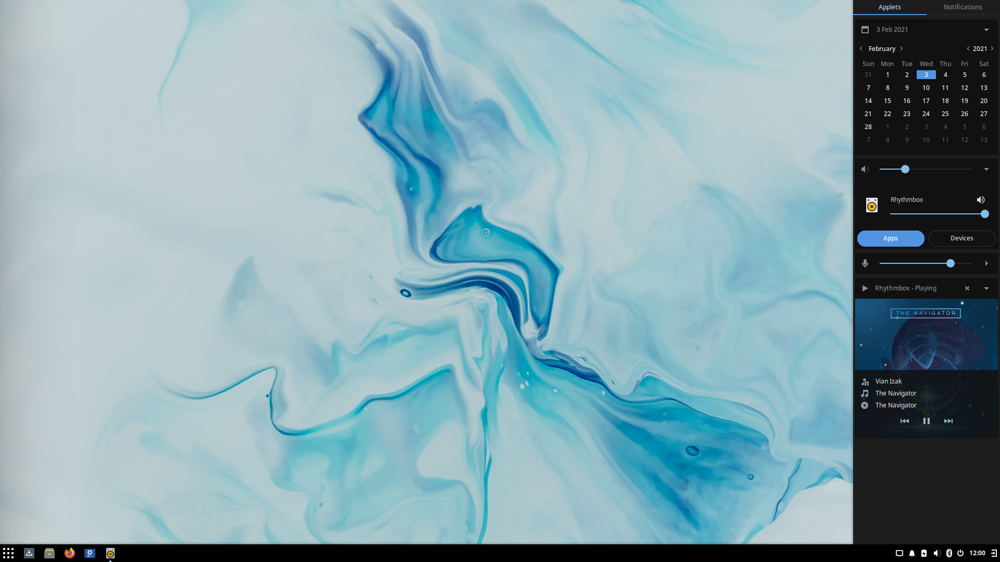
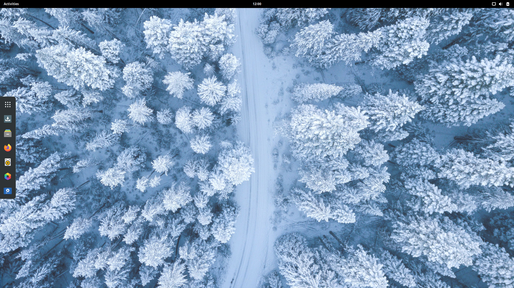
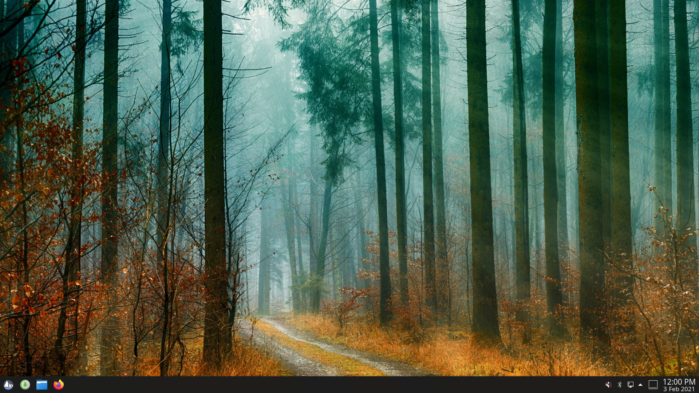

---
authors:
- image: https://avatars.githubusercontent.com/u/156574?v=4
  link: https://github.com/JoshStrobl
  name: Joshua Strobl
categories:
- news
- releases
date: "2021-02-03T10:28:52+02:00"
featuredimage: /solus-4.2-featured.jpg
title: Solus 4.2 Released
url: /2021/02/03/solus-4-2-released
---

We are proud to announce the immediate availability of Solus 4.2, a new Solus 4 "Fortitude" series release. This release delivers new desktop environment updates, software stacks, and hardware enablement.
<!--more-->

## General

### Default Applications

All of our editions feature:

- Firefox 85.0
- LibreOffice 7.0.4.2
- Thunderbird 78.6.1

For audio and video multimedia playback, we offer software out-of-the-box that caters specifically to our desired experience for each edition.

- Budgie, GNOME, and MATE editions all ship with Rhythmbox for audio playback, with the latest release of the Alternate Toolbar extension to provide a more modern user experience.
- Budgie and GNOME ship with GNOME MPV for video playback.
- MATE ships with VLC for video playback.
- Plasma ships with Elisa for audio playback and SMPlayer for video playback.

### Hardware and Kernel Enablement

This release of Solus ships with Linux kernel 5.10.12, enabling us to provide support for a range of the newer hardware, such as:

- Newer AMD Ryzen 5th generation processors, such as the 5600X to 5950X.
- Newer Intel Comet Lake CPUs, such as the Intel Core i9-10850K.

Mesa has been upgraded to 20.3.3. This introduces support for new GPUs, Vulkan 1.2 API support, numerous fixes for the latest gaming titles, and ACO shader compilation is now enabled by default for the RADV Vulkan driver.

Solus 4.2 introduces support for many new features and hardware capabilities through our continuous kernel enablement, such as:

- AMD RAPL MSR based Energy driver
- AMD Renoir Audio Co-processor support
- AMD SoC SPI controller driver support
- Enabled ACPI and HID ambient light sensors
- Enabled `CONFIG_DRM_LOAD_EDID_FIRMWARE`
- Enabled NVMe hardware monitoring via `CONFIG_NVME_HWMON`
- Enabled various modules required for software such as CTParental, Mininet, and ROCm
- Enabled early KMS for amdgpu, i915, qxl, radeon, and virtio-gpu
- Fast charge control for iOS devices.
- Improved exFAT file system support
- Intel Broxton PMICs
- Intel Classmate accelerometer, backlight, and input device support
- Intel Haswell and Broadcom support with I2S codec present
- Intel Jasper Lake PCH pinctrl and GPIO drivers
- Realtek 8723DE and 8821CD PCI wireless network adapters
- Several new USB cameras
- Support for setup / unlock / lock Locking ranges for SED devices using the Opal protocol.
- Support for Solarflare NICs
- Surface 3 battery platform driver support
- XFS Online Repair
- We have retained XFS v4 Format support to ensure compatibility with any existing XFS filesystems

### Multimedia Upgrades

This release ships with ffmpeg 4.3.1, the latest in the 4.3 series.  This enables us to provide support for:

- AMD AMF Vulkan-based encoding
- AV1 encoding via librav1e
- Intel QSV-accelerated VP8 decoding
- SoX resampler support
- Support for TrueHD in MP4
- VDPAU VP9 hardware acceleration
- Vulkan-accelerated filters

Solus 4.2 ships with the latest dav1d AV1 decoder, version 0.8.1, offering significant performance improvements and optimizations for decoding compared to its original inclusion in Solus 4.1.

Solus ships with the latest release of gstreamer, 1.18.2. This release features many improvements and fixes, such as:

- Enhancements to High Dynamic Range (HDR) representation and signaling
- Improvements to playback rate changes.
- Renegotiation support in webrtcbin
- gstreamer plugins "good": avidemux can handle now H.265 video

You can see all the latest news on GStreamer 1.18 [here](https://gstreamer.freedesktop.org/releases/1.18/).

Solus 4.2 ships with Pulseaudio 14.1, which features some key improvements such as:

- Automatic switching to HDMI being disabled by default
- Support for more USB gaming headets
- "flat volumes" being disabled by default

## Budgie

Solus ships with the latest release of our flagship desktop environment, [Budgie 10.5.2](/2020/12/02/budgie-10-5-2-released). 

Budgie 10.5.2 introduced [budgie-desktop-view](https://github.com/getsolus/budgie-desktop-view), our new desktop icons implementation. In releases dating back to the beginning of Budgie 10, we had been using Nautilus' (now legacy) desktop icons implementation to provide such support. When Nautilus removed their desktop icons support, Solus used an older version of Nautilus to retain it, while some other downstream consumers of Budgie used alternative file managers with similar features to that version of Nautilus, such as Nemo.

We recognized that Desktop Icons was an important part of the workflow of many users, so we spent considerable time during this development cycle ensuring there was a solution for them as well as our downstream users of Budgie. Expanding on this, Solus 4.2 defaults to having desktop icons enabled to make Solus more approachable to new users.

Budgie Menu has received various refinements:

1. Budgie Menu introduces additional checks for an application's DesktopAppInfo, ensuring that we consistently skip apps and exclude them from calculations when they have `Hidden` or `NoDisplay` set, as well as if the `NotShowIn` contains `Budgie`.
2. Budgie Menu will no longer show empty categories, a common occurrence when installing applications via WINE.
3. Budgie Menu will now alphabetically sort category names, which is useful when you have custom user desktop directories for applications. They are no longer forced to be below default system-wide desktop directories such as Internet / Networking, Office, Sound & Video, etc.
4. Applications which utilize `pkexec` in their desktop info will now spawn an asynchronous process, with `pkexec` being the command and passing the rest of the command line content as arguments.

Budgie 10.5.2 saw a complete rewrite of its System Tray implementation. Since the days of Budgie 7 in 2017, Budgie had been using an `na-tray` implementation also seen in desktop environments such as Cinnamon for the creation and management of system tray icons. With our new System Trays implementation leveraging the XEmbed Protocol, we've been able to fix numerous issues such as:

- Background icons not refreshing, resulting in instances where it may appear that multiple icons are overlapping.
- Tray icons not consistently hiding when a panel hides (during "Intelligent" mode).
- Tray icons blinking when panel transparency is set to "Dynamic"
- Tray icons getting hidden when switching icon themes.

The Sound applet has seen a redesign and now features a dedicated button for mute toggling, as well as leveraging iconography for the System Settings button rather than text.

You can now choose which side of the screen Raven, our notification and widget center, appears. Prior to Budgie 10.5.2, Raven would always appear on the left side when the main panel and trigger were on the left, and appear on the right when the main panel was anywhere else. Users will be able to choose between this behaviour, called "Automatic", as well as left and right sides!

There was so many other improvements and fixes in this new release. Check our [our dedicated blog post](/2020/12/02/budgie-10-5-2-released) for more information!

## GNOME

Solus 4.2 GNOME Edition ships with the latest release of the GNOME 3.38 Stack, 3.38.3. GNOME 3.38.3 introduces various fixes to the GNOME experience such as:

- A brand new major release of Tracker, GNOME's search engine and database for local and remote content.
- Disks will now always show other filesystem format choices and has fixes for drive unmounting and partition creation.
- GNOME Shell
  - "Boot Options" support to restart dialog.
  - Items can now be re-arranged in the app picker.
  - Restart has been moved into a separate menu item / dialog.
  - Screen recordings are now added to recent items.
- Music has numerous bug fixes and a rework of art retrieval.
- Mutter
  - Improvements to performance thanks to optimized resource scale computation, painting of backgrounds, offscreen effect cache invalidation, and more
    - Night Light fixes after DPMS (Display Power Management Signaling).
  - Support for custom keyboard layouts under `$XDG_CONFIG_HOME/xkb`.
  - Numerous X11 fixes for button scrolling, IM handling, overview key when using multiple keyboard layouts.
  - WINE copy & paste
- Photos now has a new image filter called Trencin, similar to Instagram's Clarendon filter.

Solus GNOME Edition continues to ship with our curated out-of-the-box experience leveraging a multitude of extensions, such as:

- Dash to Dock for quick and easy access to favorited and running applications
- Drive Menu for quick access to plugged-in devices (such as USB thumb drives)
- Impatience for faster animations
- Top Icons for system tray icon support out-of-the-box

## MATE

Solus 4.2 MATE Edition ships with MATE 1.24, which contains [numerous bug fixes and under-the-hood improvements](https://mate-desktop.org/blog/2020-02-10-mate-1-24-released/). Some of the highlights include:

- Caja can now show thumbnails in its list view.
- Engrampa now has support for more formats.
- MATE Control Center will now display its icons correctly on HiDPI displays.
- New window decoration themes in Marco.
- The alt+tab max columns is now configurable and considers window label width.
- The Mouse app now supports acceleration profiles.
- The Indicator applet has improved interaction with oddly-sized icons.
- There is now a webp files eom-thumbnailer.
- The window list applet now supports window thumbnails on hover.
- Pluma plugins are now fully switched to Python 3.

### Brisk Menu

Solus 4.2 also ships with Brisk Menu 0.6.2. This release features:

- applet: Re-create applet menu when changing window-type
  - Currently changing window types (between 'classic' and 'dash') requires restarting Brisk Menu. This leads to software like MATE Tweak to have to kill the brisk-menu process to ensure a smooth transition between panel layouts.
- backend: Hide menu when rebuilding menu items 
  - Since we have a monitor to update the menu whenever the desktop files are updated, the list of filtered menu items can change while the user is actively navigating through it. This causes the GtkListBox filters to segfault. Hiding the menu whenever the GAppInfoMonitor fires the "changed" signal clears out the GtkListBox, and so no filtering is happening. This only happens when installing or removing applications while browsing the menu, so it should not be generally disruptive, and will prevent the menu from crashing.
- frontend: Allow keyboard navigation
  - Instead of disabling focus, we reuse the rollover functionality to enable listening for focus events, then we activate the corresponding category.

## Plasma

Solus 4.2 Plasma Edition ships with the latest Plasma Desktop 5.20.5, KDE Frameworks 5.78, KDE Applications 20.12.1 and QT 5.15.2, which brings many new features, some highlighted below:

- New System Tray layout
- Switched the Task Manager default to Icons only
- Night Color
- Various improvements to System Settings & Info Center such as SMART support, improved layout, and highlighting of changed settings

The Solus-specific Plasma integration has received various refinements, specifically:

- Fixes in SolusDark Coloring for better visibility
- Solus Wallpaper in different sizes
- A new Window will open where the mouse is
- Change dolphin to always open in the HOME dir

## Download

To download our latest Editions, you can go to our [Download](/download) page, where direct links and torrents are available!

---

## Changelog of ISO (Budgie)

### Packages Added

 - budgie-desktop-branding-fortitude-plus
 - budgie-desktop-view
 - exfatprogs
 - graphviz
 - gts
 - iio-sensor-proxy
 - jbig2dec
 - libinstpatch
 - libmaxminddb
 - liburing
 - libuv
 - libxaw
 - network-manager-applet
 - network-manager-livecd
 - python-libevdev
 - raqm
 - srt
 - yt-dlc

### Packages Removed

- cmocka
- exfat-utils
- gnome-online-miners
- gom
- libgrss
- libtelepathy-glib
- libzapojit
- vino
- youtube-dl

### Changes

**ldb**

 - [Rune Morling: ldb: Update to 2.1.4 (samba 4.12.x stack upgrade)](https://dev.getsol.us/source/ldb/browse/master/;5262b83)

**gnome-doc-utils**

 - [Joshua Strobl: Safety rebuild](https://dev.getsol.us/source/gnome-doc-utils/browse/master/;97f47c7)

**libgeocode-glib**

 - [Joshua Strobl: Safety rebuild](https://dev.getsol.us/source/libgeocode-glib/browse/master/;3e148ac)

**gnome-themes-extra**

 - [Joshua Strobl: Safety rebuild](https://dev.getsol.us/source/gnome-themes-extra/browse/master/;68e11a8)

**colord**

 - [Joshua Strobl: Upgrade to latest colord. Switch to meson.](https://dev.getsol.us/source/colord/browse/master/;755bac7)

**less**

 - [Pierre-Yves: Update less to 563](https://dev.getsol.us/source/less/browse/master/;30aaaf5)

**budgie-desktop-branding**

 - [Joshua Strobl: Update to reflect background change.](https://dev.getsol.us/source/budgie-desktop-branding/browse/master/;4b26b3f)
 - [Joshua Strobl: Introduce fortitude-plus sub-package for Solus 4.2](https://dev.getsol.us/source/budgie-desktop-branding/browse/master/;231047c)

**libheif**

 - [Pierre-Yves: Update libheif to 1.10.0](https://dev.getsol.us/source/libheif/browse/master/;945c95a)
 - [Bryan T. Meyers: Rebuild for aom](https://dev.getsol.us/source/libheif/browse/master/;79a3ed9)
 - [Pierre-Yves: Safety rebuild libheif for dav1d 0.8.0](https://dev.getsol.us/source/libheif/browse/master/;3471fda)
 - [Martin Reboredo: Update libheif to 1.9.1](https://dev.getsol.us/source/libheif/browse/master/;d8df616)

**libwpe**

 - [Joshua Strobl: Update to 1.8.0](https://dev.getsol.us/source/libwpe/browse/master/;b02f279)

**qtstyleplugins**

 - [F. von Gellhorn: Rebuild qtstyle against QT 5.15.2](https://dev.getsol.us/source/qtstyleplugins/browse/master/;45d6d1b)
 - [F. von Gellhorn: Rebuild against QT 5.15.1](https://dev.getsol.us/source/qtstyleplugins/browse/master/;f32cc3d)

**lz4**

 - [Pierre-Yves: Update lz4 to 1.9.3](https://dev.getsol.us/source/lz4/browse/master/;7c3ff41)

**libxres**

 - [F. von Gellhorn: Rebuild against xorgproto](https://dev.getsol.us/source/libxres/browse/master/;2a37570)

**evince**

 - [Joshua Strobl: Update to 3.38.1](https://dev.getsol.us/source/evince/browse/master/;7f76e3d)
 - [Joshua Strobl: Update to 3.38.0. Changelog available here.](https://dev.getsol.us/source/evince/browse/master/;54f1a6d)

**gd**

 - [Martin Reboredo: Rebuild gd against raqm](https://dev.getsol.us/source/gd/browse/master/;977c65b)

**gstreamer-1.0-plugins-ugly**

 - [Joshua Strobl: Rebuild against libcdio](https://dev.getsol.us/source/gstreamer-1.0-plugins-ugly/browse/master/;dae3d63)
 - [Joshua Strobl: Update to 1.18.2. Changelog available here.](https://dev.getsol.us/source/gstreamer-1.0-plugins-ugly/browse/master/;c5edc48)
 - [Joshua Strobl: Update to 1.18.1](https://dev.getsol.us/source/gstreamer-1.0-plugins-ugly/browse/master/;f796747)
 - [Joshua Strobl: Rebuild against x264](https://dev.getsol.us/source/gstreamer-1.0-plugins-ugly/browse/master/;10781c2)

**libnspr**

 - [Pierre-Yves: Update libnspr to 4.29](https://dev.getsol.us/source/libnspr/browse/master/;f680e26)

**gstreamer-1.0-plugins-good**

 - [Joshua Strobl: Update to 1.18.2. Changelog available here.](https://dev.getsol.us/source/gstreamer-1.0-plugins-good/browse/master/;0c03a3b)
 - [Joshua Strobl: Update to 1.18.1](https://dev.getsol.us/source/gstreamer-1.0-plugins-good/browse/master/;47e01ce)
 - [Joshua Strobl: Safety rebuild against twolame](https://dev.getsol.us/source/gstreamer-1.0-plugins-good/browse/master/;edffcdf)

**x264**

 - [Alexander Vorobyev: Update x264 to 0.161.3039](https://dev.getsol.us/source/x264/browse/master/;9126059)
 - [Alexander Vorobyev: Update x264 to 0.161.3020](https://dev.getsol.us/source/x264/browse/master/;1fe13aa)

**mesalib**

 - [Bryan T. Meyers: Updated to 20.3.3](https://dev.getsol.us/source/mesalib/browse/master/;4bff461)
 - [F. von Gellhorn: Rebuild against xorgproto](https://dev.getsol.us/source/mesalib/browse/master/;128365b)
 - [Bryan T. Meyers: Update to 20.2.6](https://dev.getsol.us/source/mesalib/browse/master/;5640e1c)
 - [Pierre-Yves: Rebuild mesalib for zstd 1.4.8](https://dev.getsol.us/source/mesalib/browse/master/;0320140)
 - [Bryan T. Meyers: Update to 20.2.3](https://dev.getsol.us/source/mesalib/browse/master/;b0dd147)

**libxshmfence**

 - [F. von Gellhorn: Rebuild against xorgproto](https://dev.getsol.us/source/libxshmfence/browse/master/;3a2ef46)

**gstreamer-1.0-plugins-base**

 - [Joshua Strobl: Update to 1.18.2. Changelog available here.](https://dev.getsol.us/source/gstreamer-1.0-plugins-base/browse/master/;8adee0e)
 - [Joshua Strobl: Update to 1.18.1](https://dev.getsol.us/source/gstreamer-1.0-plugins-base/browse/master/;f06b6c3)

**libglvnd**

 - [F. von Gellhorn: Rebuild against xorgproto](https://dev.getsol.us/source/libglvnd/browse/master/;1866926)
 - [Bryan T. Meyers: Update to 1.3.2 for Mesa](https://dev.getsol.us/source/libglvnd/browse/master/;d358480)

**onboard**

 - [Joshua Strobl: Safety rebuilds and clean up builddeps.](https://dev.getsol.us/source/onboard/browse/master/;44edf77)

**gpgme**

 - [Pierre-Yves: Update gpgme to 1.15.0](https://dev.getsol.us/source/gpgme/browse/master/;164135c)

**vo-aacenc**

 - [Joshua Strobl: Convert to ypkg format](https://dev.getsol.us/source/vo-aacenc/browse/master/;7a7de08)
 - [Peter O'Connor: Update abireport](https://dev.getsol.us/source/vo-aacenc/browse/master/;a98b2e3)

**gobject-introspection**

 - [Joshua Strobl: Update to 1.66.1](https://dev.getsol.us/source/gobject-introspection/browse/master/;5295f6d)

**gnome-bluetooth**

 - [Joshua Strobl: Update to 3.34.3](https://dev.getsol.us/source/gnome-bluetooth/browse/master/;68e265f)

**libxdmcp**

 - [F. von Gellhorn: Rebuild against xorgproto](https://dev.getsol.us/source/libxdmcp/browse/master/;8202744)

**hunspell-en**

 - [F. von Gellhorn: change component to office.spelling](https://dev.getsol.us/source/hunspell-en/browse/master/;97dae44)

**libvisio**

 - [Joey Riches: Rebuild	against	libicu 68.2](https://dev.getsol.us/source/libvisio/browse/master/;971ed55)

**gstreamer-1.0**

 - [Joshua Strobl: Update to 1.18.2. Changelog available here.](https://dev.getsol.us/source/gstreamer-1.0/browse/master/;48467d1)
 - [Joshua Strobl: Update to 1.18.1. Changelog available here.](https://dev.getsol.us/source/gstreamer-1.0/browse/master/;050586f)

**libmediaart**

 - [Joshua Strobl: Safety rebuild](https://dev.getsol.us/source/libmediaart/browse/master/;127a627)

**xset**

 - [F. von Gellhorn: Rebuild against xorgproto](https://dev.getsol.us/source/xset/browse/master/;0a48b58)

**sqlite3**

 - [Pierre-Yves: Update sqlite3 to 3.34.1](https://dev.getsol.us/source/sqlite3/browse/master/;c33f8bf)

**gstreamer-1.0-libav**

 - [Joshua Strobl: Update to 1.18.1](https://dev.getsol.us/source/gstreamer-1.0-libav/browse/master/;a609771)

**libxscrnsaver**

 - [F. von Gellhorn: Rebuild against xorgproto](https://dev.getsol.us/source/libxscrnsaver/browse/master/;cb7d94d)

**mpg123**

 - [Martin Reboredo: Update mpg123 to 1.26.3](https://dev.getsol.us/source/mpg123/browse/master/;fe4eb51)

**gdk-pixbuf**

 - [Joshua Strobl: Update to 2.42.2](https://dev.getsol.us/source/gdk-pixbuf/browse/master/;6ceb2e8)

**papirus-icon-theme**

 - [Joshua Strobl: Update to 20210101. Release notes available here.](https://dev.getsol.us/source/papirus-icon-theme/browse/master/;1af95fd)

**python-magic**

 - [Jarno Turkki: Update python-magic to 0.4.18 and add python3](https://dev.getsol.us/source/python-magic/browse/master/;ba1a241)

**solus-sc**

 - [Joshua Strobl: Sync with git to resolve missing icons for Breeze.](https://dev.getsol.us/source/solus-sc/browse/master/;e10df21)
 - [Joshua Strobl: Sync with git for dbus-1 move](https://dev.getsol.us/source/solus-sc/browse/master/;7aa0684)
 - [Joshua Strobl: Sync with git.](https://dev.getsol.us/source/solus-sc/browse/master/;9530481)
 - [Joshua Strobl: Drop Flash Player NPAPI and PPAPI support.](https://dev.getsol.us/source/solus-sc/browse/master/;e8dd5a1)

**gmp**

 - [Joey Riches: Update to 6.2.1](https://dev.getsol.us/source/gmp/browse/master/;ce49e83)

**libboost**

 - [Joey Riches: Rebuild against libicu 68.2](https://dev.getsol.us/source/libboost/browse/master/;e661a9f)
 - [Pierre-Yves: Rebuild libboost for zstd 1.4.8](https://dev.getsol.us/source/libboost/browse/master/;cdeca6d)

**volume_key**

 - [Pierre-Yves: Safety rebuild volume_key for gpgme 1.15.0](https://dev.getsol.us/source/volume_key/browse/master/;d6dc2e1)

**libmtp**

 - [Jarno Turkki: Update libmtp to 1.1.18](https://dev.getsol.us/source/libmtp/browse/master/;5187ec5)

**squashfs-tools**

 - [Pierre-Yves: Rebuild squashfs-tools for zstd 1.4.8](https://dev.getsol.us/source/squashfs-tools/browse/master/;65d91c6)

**libcdio-paranoia**

 - [Jarno Turkki: Update libcdio-paranoia to 10.2.2.0.1](https://dev.getsol.us/source/libcdio-paranoia/browse/master/;5a33255)

**python3-cairo**

 - [Joey Riches: Update to 1.20.0](https://dev.getsol.us/source/python3-cairo/browse/master/;f2ab76a)

**mpc**

 - [Joey Riches: Update to 1.2.1](https://dev.getsol.us/source/mpc/browse/master/;b8a4241)

**geoclue**

 - [Joshua Strobl: Safety rebuild](https://dev.getsol.us/source/geoclue/browse/master/;7ca46ae)

**glibmm**

 - [Joshua Strobl: Update to 2.66](https://dev.getsol.us/source/glibmm/browse/master/;c2aa285)
 - [Joshua Strobl: Update to 2.64.5](https://dev.getsol.us/source/glibmm/browse/master/;275c9d5)
 - [Joshua Strobl: Update to 2.64.4](https://dev.getsol.us/source/glibmm/browse/master/;84090dc)
 - [Joshua Strobl: Safety rebuild](https://dev.getsol.us/source/glibmm/browse/master/;ccc86a8)

**neon**

 - [Alexander Vorobyev: Update neon to 0.31.2](https://dev.getsol.us/source/neon/browse/master/;b33cb90)

**python-dbus**

 - [Joey Riches: Update to 1.2.16](https://dev.getsol.us/source/python-dbus/browse/master/;e1f5de1)

**tracker-miners**

 - [Joshua Strobl: Update to 3.0.4](https://dev.getsol.us/source/tracker-miners/browse/master/;5034b60)
 - [Joey Riches: Rebuild against libicu 68.2](https://dev.getsol.us/source/tracker-miners/browse/master/;372f9ee)
 - [Joshua Strobl: Update to 3.0.3](https://dev.getsol.us/source/tracker-miners/browse/master/;dfd00d7)
 - [Joshua Strobl: Update to 3.0.1. Changelog available here.](https://dev.getsol.us/source/tracker-miners/browse/master/;b473569)

**mpv**

 - [Alexander Vorobyev: mpv: patch for libplacebo API changes](https://dev.getsol.us/source/mpv/browse/master/;c88aaac)
 - [Alexander Vorobyev: Update mpv to 0.33.0](https://dev.getsol.us/source/mpv/browse/master/;410a8c5)
 - [Rune Morling: Safety rebuild for samba-4.12.10](https://dev.getsol.us/source/mpv/browse/master/;2578962)
 - [Joshua Strobl: Patch yt-dlc related functionality.](https://dev.getsol.us/source/mpv/browse/master/;b95d591)
 - [Joshua Strobl: Switch rundep to yt-dlc.](https://dev.getsol.us/source/mpv/browse/master/;2a49386)
 - [Alexander Vorobyev: mpv: backport patches for better compatibility with libass 0.15.0](https://dev.getsol.us/source/mpv/browse/master/;dc3715d)

**os-installer**

 - [Joshua Strobl: Sync with git.](https://dev.getsol.us/source/os-installer/browse/master/;2ce964d)

**libdrm**

 - [Bryan T. Meyers: Updated to 2.4.103](https://dev.getsol.us/source/libdrm/browse/master/;624ac08)

**xorg-driver-video-intel**

 - [F. von Gellhorn: Rebuild against xorgproto](https://dev.getsol.us/source/xorg-driver-video-intel/browse/master/;75965cb)

**libglade**

 - [Joshua Strobl: Safety rebuild](https://dev.getsol.us/source/libglade/browse/master/;9a77187)

**harfbuzz**

 - [Joey Riches: Rebuild against libicu 68.2](https://dev.getsol.us/source/harfbuzz/browse/master/;f27dbb7)
 - [Joshua Strobl: Update to 2.7.2](https://dev.getsol.us/source/harfbuzz/browse/master/;3ea58ed)

**libnotify**

 - [Joshua Strobl: Update to 0.7.9](https://dev.getsol.us/source/libnotify/browse/master/;8f1d78f)
 - [Joshua Strobl: Already was converted to ypkg. Drop pspec.xml.](https://dev.getsol.us/source/libnotify/browse/master/;42cfdf2)

**grep**

 - [Pierre-Yves: Update grep to 3.6](https://dev.getsol.us/source/grep/browse/master/;1cda467)

**pango**

 - [Joshua Strobl: Update to 1.48.1](https://dev.getsol.us/source/pango/browse/master/;b9796e9)
 - [Joshua Strobl: Update to 1.48.0](https://dev.getsol.us/source/pango/browse/master/;c703fd2)

**libgtk-3**

 - [Campbell Jones: Add patch to libgtk-3 to fix tooltip positioning](https://dev.getsol.us/source/libgtk-3/browse/master/;9d29c4f)
 - [Joshua Strobl: Update to 3.24.24](https://dev.getsol.us/source/libgtk-3/browse/master/;61e0005)
 - [Joshua Strobl: Safety rebuild and adjust descriptions.](https://dev.getsol.us/source/libgtk-3/browse/master/;41e1676)
 - [Joshua Strobl: Update to 3.24.23](https://dev.getsol.us/source/libgtk-3/browse/master/;0403844)

**atkmm**

 - [Joshua Strobl: Update to 2.28.1. Added Meson support.](https://dev.getsol.us/source/atkmm/browse/master/;eb959d3)
 - [Joshua Strobl: Safety rebuild](https://dev.getsol.us/source/atkmm/browse/master/;bd27c05)

**ca-certs**

 - [Joshua Strobl: Update to 20201207](https://dev.getsol.us/source/ca-certs/browse/master/;96f7b5d)

**ffmpeg**

 - [Rune Morling: Safety rebuild for samba-4.12.11](https://dev.getsol.us/source/ffmpeg/browse/master/;49958ce)
 - [Alexander Vorobyev: ffmpeg: enable SRT stream support](https://dev.getsol.us/source/ffmpeg/browse/master/;f2a6429)
 - [Bryan T. Meyers: Rebuild for aom](https://dev.getsol.us/source/ffmpeg/browse/master/;052907b)
 - [Pierre-Yves: Safety rebuild ffmpeg for dav1d 0.8.0](https://dev.getsol.us/source/ffmpeg/browse/master/;c5dc399)
 - [Alexander Vorobyev: ffmpeg: enable SMB support for mpv](https://dev.getsol.us/source/ffmpeg/browse/master/;ce49927)
 - [Joshua Strobl: Rebuild against x264](https://dev.getsol.us/source/ffmpeg/browse/master/;bfe2fc9)
 - [Alexander Vorobyev: ffmpeg: fix build against latest glslang](https://dev.getsol.us/source/ffmpeg/browse/master/;6a8782d)
 - [Joshua Strobl: Safety rebuild against twolame](https://dev.getsol.us/source/ffmpeg/browse/master/;62d426f)

**osinfo-db**

 - [Joshua Strobl: Update for latest OS releases.](https://dev.getsol.us/source/osinfo-db/browse/master/;558cb37)

**xorg-driver-video-nouveau**

 - [F. von Gellhorn: Rebuild against xorgproto](https://dev.getsol.us/source/xorg-driver-video-nouveau/browse/master/;41d63c6)

**npth**

 - [Pierre-Yves: Update npth to 1.6](https://dev.getsol.us/source/npth/browse/master/;54e9b2d)

**ghostscript**

 - [Martin Reboredo: Update ghostscript to 9.53.3](https://dev.getsol.us/source/ghostscript/browse/master/;a5920fe)

**python-packaging**

 - [Joey Riches: Update to 20.8](https://dev.getsol.us/source/python-packaging/browse/master/;11296e0)

**libcairo**

 - [Joshua Strobl: Safety rebuild](https://dev.getsol.us/source/libcairo/browse/master/;cfe0efb)

**system-config-printer**

 - [Joshua Strobl: Update stateless patch to point to correct dbus-1 directory.](https://dev.getsol.us/source/system-config-printer/browse/master/;4cc6ecf)
 - [Joshua Strobl: Safety rebuild](https://dev.getsol.us/source/system-config-printer/browse/master/;c925ec7)

**xorg-server**

 - [F. von Gellhorn: Update xorg-server to 1.20.10](https://dev.getsol.us/source/xorg-server/browse/master/;d084a47)
 - [F. von Gellhorn: Rebuild against xorgproto](https://dev.getsol.us/source/xorg-server/browse/master/;a04f33b)

**dbus**

 - [Joshua Strobl: Update to 1.12.20](https://dev.getsol.us/source/dbus/browse/master/;1f04583)

**talloc**

 - [Rune Morling: talloc: Update to 2.3.1 (samba 4.12.x stack upgrade)](https://dev.getsol.us/source/talloc/browse/master/;fc6b098)

**gnome-screensaver**

 - [Joshua Strobl: Sync with git to fix a GNOME Desktop ABI change.](https://dev.getsol.us/source/gnome-screensaver/browse/master/;23fa811)

**nvidia-390-glx-driver**

 - [Joshua Strobl: Rebuild against kernels](https://dev.getsol.us/source/nvidia-390-glx-driver/browse/master/;a3ca6ca)
 - [Joshua Strobl: Rebuild against kernels](https://dev.getsol.us/source/nvidia-390-glx-driver/browse/master/;d00358e)
 - [Bryan T. Meyers: Rebuild for kernels](https://dev.getsol.us/source/nvidia-390-glx-driver/browse/master/;2270947)
 - [Joshua Strobl: Rebuild against kernels](https://dev.getsol.us/source/nvidia-390-glx-driver/browse/master/;4b0d145)
 - [Thomas Staudinger: Update nvidia-390-glx-driver to 390.141](https://dev.getsol.us/source/nvidia-390-glx-driver/browse/master/;30e7125)
 - [Joshua Strobl: Rebuild against kernels](https://dev.getsol.us/source/nvidia-390-glx-driver/browse/master/;7496e39)
 - [Joshua Strobl: Rebuild against kernel](https://dev.getsol.us/source/nvidia-390-glx-driver/browse/master/;47a5b55)
 - [Joshua Strobl: Rebuild against kernel](https://dev.getsol.us/source/nvidia-390-glx-driver/browse/master/;c5a3e79)
 - [Joshua Strobl: Rebuild against kernel](https://dev.getsol.us/source/nvidia-390-glx-driver/browse/master/;64aa40e)
 - [Bryan T. Meyers: Rebuild for kernel](https://dev.getsol.us/source/nvidia-390-glx-driver/browse/master/;741a82b)
 - [Joshua Strobl: Update to 390.138. Release notes available here.](https://dev.getsol.us/source/nvidia-390-glx-driver/browse/master/;9c6f8d7)
 - [Joshua Strobl: Rebuild against kernels.](https://dev.getsol.us/source/nvidia-390-glx-driver/browse/master/;140dd11)

**libxcomposite**

 - [F. von Gellhorn: Rebuild against xorgproto](https://dev.getsol.us/source/libxcomposite/browse/master/;bc4d871)

**gnome-control-center**

 - [Rune Morling: Safety rebuild for samba-4.12.11](https://dev.getsol.us/source/gnome-control-center/browse/master/;e21efc6)
 - [Joshua Strobl: Update to 3.38.3](https://dev.getsol.us/source/gnome-control-center/browse/master/;8f00855)
 - [Abdulkadir Furkan Şanlı: Enable GNOME fingerprint settings](https://dev.getsol.us/source/gnome-control-center/browse/master/;2136a4e)
 - [Joshua Strobl: Fix build. I wasn't hitting this because I already had it cached locally.](https://dev.getsol.us/source/gnome-control-center/browse/master/;d4b82cc)
 - [Joshua Strobl: Update back to 3.38.2.](https://dev.getsol.us/source/gnome-control-center/browse/master/;83feffb)
 - [Joshua Strobl: Fix source location because GNOME Sources likes to redirect me, which I do not want.](https://dev.getsol.us/source/gnome-control-center/browse/master/;7cb3795)
 - [Joshua Strobl: Update to 3.36.5](https://dev.getsol.us/source/gnome-control-center/browse/master/;9a5ae75)
 - [Joshua Strobl: Bump for 3.36.x release inclusion.](https://dev.getsol.us/source/gnome-control-center/browse/master/;d61cd65)
 - [Joshua Strobl: Revert back to 3.36.x](https://dev.getsol.us/source/gnome-control-center/browse/master/;bfb2dd4)
 - [Joshua Strobl: Update to 3.38.2](https://dev.getsol.us/source/gnome-control-center/browse/master/;4f832fe)
 - [Rune Morling: Safety rebuild for samba-4.12.10](https://dev.getsol.us/source/gnome-control-center/browse/master/;5e69dac)
 - [Joshua Strobl: Patch outdated tracker schema path.](https://dev.getsol.us/source/gnome-control-center/browse/master/;c31409a)
 - [Joshua Strobl: Update to 3.38.1](https://dev.getsol.us/source/gnome-control-center/browse/master/;b8e95b2)

**solus-artwork**

 - [Joshua Strobl: Update to 28.0](https://dev.getsol.us/source/solus-artwork/browse/master/;0ccb94d)

**gnome-system-monitor**

 - [Joshua Strobl: Update to 3.38.0](https://dev.getsol.us/source/gnome-system-monitor/browse/master/;68b9b9f)

**gnome-online-accounts**

 - [Joshua Strobl: Update to 3.38.0](https://dev.getsol.us/source/gnome-online-accounts/browse/master/;db67190)

**flatpak**

 - [Joshua Strobl: Update to 1.10.1](https://dev.getsol.us/source/flatpak/browse/master/;a9536b0)
 - [Joey Riches: Use bundled bwrap](https://dev.getsol.us/source/flatpak/browse/master/;b92b222)
 - [Joey Riches: Update to 1.8.5](https://dev.getsol.us/source/flatpak/browse/master/;17cf44f)
 - [Pierre-Yves: Safety rebuild flatpak for gpgme 1.15.0](https://dev.getsol.us/source/flatpak/browse/master/;bd708c4)
 - [Pierre-Yves: Update flatpak to 1.8.3](https://dev.getsol.us/source/flatpak/browse/master/;81df42b)
 - [Joshua Strobl: Update to 1.8 series](https://dev.getsol.us/source/flatpak/browse/master/;c646d5e)

**pangomm**

 - [Joshua Strobl: Update to 2.46](https://dev.getsol.us/source/pangomm/browse/master/;c6346a7)
 - [Joshua Strobl: Update to 2.42.2](https://dev.getsol.us/source/pangomm/browse/master/;2063a03)
 - [Joshua Strobl: Safety rebuild](https://dev.getsol.us/source/pangomm/browse/master/;1a8a9f1)

**libsm**

 - [F. von Gellhorn: Rebuild against xorgproto](https://dev.getsol.us/source/libsm/browse/master/;1edb109)

**wpebackend-fdo**

 - [Joshua Strobl: Update to 1.8.0](https://dev.getsol.us/source/wpebackend-fdo/browse/master/;2e88518)

**orca**

 - [Joshua Strobl: Update to 3.38.2](https://dev.getsol.us/source/orca/browse/master/;dccaace)
 - [Joshua Strobl: Update to 3.38.1](https://dev.getsol.us/source/orca/browse/master/;4965a0e)
 - [Joshua Strobl: Update to 3.38.0. Changelog available here.](https://dev.getsol.us/source/orca/browse/master/;54f2ac8)

**gnome-disk-utility**

 - [Joshua Strobl: Move autostart out of etc](https://dev.getsol.us/source/gnome-disk-utility/browse/master/;237e52f)
 - [Joshua Strobl: Update to 3.38.1](https://dev.getsol.us/source/gnome-disk-utility/browse/master/;433a536)
 - [Joshua Strobl: Update to 3.38.0](https://dev.getsol.us/source/gnome-disk-utility/browse/master/;c607406)

**gspell**

 - [Joey Riches: Rebuild against libicu 68.2](https://dev.getsol.us/source/gspell/browse/master/;d281cc9)
 - [Joshua Strobl: Update to 1.9.1](https://dev.getsol.us/source/gspell/browse/master/;bf3ee40)

**zstd**

 - [Pierre-Yves: Update zstd to 1.4.8](https://dev.getsol.us/source/zstd/browse/master/;f30e131)

**xcb-util-image**

 - [F. von Gellhorn: Rebuild against xorgproto](https://dev.getsol.us/source/xcb-util-image/browse/master/;c991c6d)

**xhost**

 - [F. von Gellhorn: Rebuild against xorgproto](https://dev.getsol.us/source/xhost/browse/master/;1da6f34)

**nautilus-python**

 - [Joshua Strobl: Update to 1.2.3](https://dev.getsol.us/source/nautilus-python/browse/master/;921a724)

**bluez**

 - [Joshua Strobl: Change dbus directory](https://dev.getsol.us/source/bluez/browse/master/;1f407ac)
 - [Joshua Strobl: Safety rebuild](https://dev.getsol.us/source/bluez/browse/master/;fa6b4a3)
 - [Joshua Strobl: Update to 5.55](https://dev.getsol.us/source/bluez/browse/master/;d8fe4e6)

**ilmbase**

 - [Martin Reboredo: Update ilmbase to 2.5.4](https://dev.getsol.us/source/ilmbase/browse/master/;e984b6a)

**libgxps**

 - [Joshua Strobl: Safety rebuild](https://dev.getsol.us/source/libgxps/browse/master/;947fb0d)
 - [Joshua Strobl: Safety rebuild](https://dev.getsol.us/source/libgxps/browse/master/;b6c8fbf)

**libzmf**

 - [Joey Riches: Rebuild against libicu 68.2](https://dev.getsol.us/source/libzmf/browse/master/;06e2a5e)

**libgtksourceview**

 - [Joshua Strobl: Update to 4.8.0](https://dev.getsol.us/source/libgtksourceview/browse/master/;ecdef4a)

**totem-pl-parser**

 - [Joshua Strobl: Safety rebuild](https://dev.getsol.us/source/totem-pl-parser/browse/master/;bf832a8)

**libspectre**

 - [Martin Reboredo: Update libspectre to 0.29](https://dev.getsol.us/source/libspectre/browse/master/;3a3f51e)

**libxau**

 - [F. von Gellhorn: Rebuild against xorgproto](https://dev.getsol.us/source/libxau/browse/master/;c26bc25)

**glib-networking**

 - [Joshua Strobl: Update to 2.66.0](https://dev.getsol.us/source/glib-networking/browse/master/;150b5e3)

**udisks**

 - [Silke Hofstra: Patch udisks for exfatprogs](https://dev.getsol.us/source/udisks/browse/master/;9b9bc8d)

**cairomm**

 - [Joshua Strobl: Safety rebuild](https://dev.getsol.us/source/cairomm/browse/master/;c458ad9)

**grilo-plugins**

 - [Joshua Strobl: Update to 0.3.12](https://dev.getsol.us/source/grilo-plugins/browse/master/;69c14c7)

**xorg-driver-video-fbdev**

 - [F. von Gellhorn: Rebuild against xorgproto](https://dev.getsol.us/source/xorg-driver-video-fbdev/browse/master/;7a797a0)

**xdpyinfo**

 - [F. von Gellhorn: Rebuild against xorgproto](https://dev.getsol.us/source/xdpyinfo/browse/master/;ed1e666)

**librest**

 - [Joshua Strobl: Safety rebuild](https://dev.getsol.us/source/librest/browse/master/;99663b0)
 - [Joshua Strobl: Add MAINTAINERS file](https://dev.getsol.us/source/librest/browse/master/;6450791)

**glibc**

 - [Joey Riches: Safety rebuild against toolchain](https://dev.getsol.us/source/glibc/browse/master/;dd87bd0)

**libproxy**

 - [Joshua Strobl: Safety rebuild](https://dev.getsol.us/source/libproxy/browse/master/;8180734)

**gegl**

 - [F. von Gellhorn: revert update to fix gimp](https://dev.getsol.us/source/gegl/browse/master/;976a4c8)
 - [F. von Gellhorn: Revert "Update gegl to 0.4.28"](https://dev.getsol.us/source/gegl/browse/master/;13f9ab3)
 - [Pierre-Yves: Update gegl to 0.4.28](https://dev.getsol.us/source/gegl/browse/master/;8f9010c)
 - [Pierre-Yves: Update gegl to 0.4.26](https://dev.getsol.us/source/gegl/browse/master/;9c010bb)

**libice**

 - [F. von Gellhorn: Rebuild against xorgproto](https://dev.getsol.us/source/libice/browse/master/;4677489)

**enchant**

 - [F. von Gellhorn: change component to office.spelling](https://dev.getsol.us/source/enchant/browse/master/;59ed241)
 - [Joshua Strobl: Update to 2.2.14. No relevant changes.](https://dev.getsol.us/source/enchant/browse/master/;39f0550)
 - [Joshua Strobl: Update to 2.2.13](https://dev.getsol.us/source/enchant/browse/master/;d83c25d)

**libosinfo**

 - [Joshua Strobl: Update to 1.8.0](https://dev.getsol.us/source/libosinfo/browse/master/;83aae02)

**tracker**

 - [Joshua Strobl: Update to 3.0.3](https://dev.getsol.us/source/tracker/browse/master/;597b463)
 - [Joey Riches: Rebuild against libicu 68.2](https://dev.getsol.us/source/tracker/browse/master/;4ec7609)
 - [Joshua Strobl: Update to 3.0.2](https://dev.getsol.us/source/tracker/browse/master/;e9576a2)
 - [Joshua Strobl: Update to major 3.0 release. Changelog available here.](https://dev.getsol.us/source/tracker/browse/master/;52c1217)

**libcdio**

 - [Jarno Turkki: Update libcdio to 2.1.0](https://dev.getsol.us/source/libcdio/browse/master/;cd5a63b)

**gnome-mpv**

 - [Joshua Strobl: Drop youtube-dl rundep since it's already a rundep of mpv-libs](https://dev.getsol.us/source/gnome-mpv/browse/master/;fdc2762)

**linux-firmware**

 - [Joshua Strobl: Update to 20201218](https://dev.getsol.us/source/linux-firmware/browse/master/;4206f4b)
 - [Joshua Strobl: Update to 20201118.](https://dev.getsol.us/source/linux-firmware/browse/master/;3a44923)

**gnome-screenshot**

 - [Joshua Strobl: Hold back to 3.36.0.](https://dev.getsol.us/source/gnome-screenshot/browse/master/;c6b9855)

**modem-manager**

 - [Joshua Strobl: Update to 1.14.6. Changelog available here.](https://dev.getsol.us/source/modem-manager/browse/master/;e5979e4)

**libxext**

 - [F. von Gellhorn: Rebuild against xorgproto](https://dev.getsol.us/source/libxext/browse/master/;fae145e)

**libtimezonemap**

 - [Joshua Strobl: Safety rebuild](https://dev.getsol.us/source/libtimezonemap/browse/master/;95a18bf)

**cups-pk-helper**

 - [Joshua Strobl: Move dbus-1 out of etc.](https://dev.getsol.us/source/cups-pk-helper/browse/master/;be619b1)

**libwebkit-gtk**

 - [Joey Riches: Update to 2.30.4 & rebuild against libicu 68.2](https://dev.getsol.us/source/libwebkit-gtk/browse/master/;8c0ef99)
 - [Joshua Strobl: Update to 2.30.2](https://dev.getsol.us/source/libwebkit-gtk/browse/master/;1d072d1)
 - [Joshua Strobl: Update to 2.30.1](https://dev.getsol.us/source/libwebkit-gtk/browse/master/;f43ef2e)

**libvte**

 - [Joshua Strobl: Update to 0.62.2](https://dev.getsol.us/source/libvte/browse/master/;adff749)
 - [Joey Riches: Rebuild	against	libicu 68.2](https://dev.getsol.us/source/libvte/browse/master/;da73a13)
 - [Joshua Strobl: Update to 0.62 series. No changelog by upstream.](https://dev.getsol.us/source/libvte/browse/master/;c89dfbd)

**imagemagick**

 - [Pierre-Yves: Update imagemagick to 7.0.10-60](https://dev.getsol.us/source/imagemagick/browse/master/;d49b132)
 - [Martin Reboredo: Rebuild imagemagick against openexr and raqm](https://dev.getsol.us/source/imagemagick/browse/master/;0ec4545)
 - [Pierre-Yves: Update imagemagick to 7.0.10-57](https://dev.getsol.us/source/imagemagick/browse/master/;485d601)
 - [Pierre-Yves: Update imagemagick to 7.0.10-55](https://dev.getsol.us/source/imagemagick/browse/master/;2ca18b1)
 - [Pierre-Yves: Update imagemagick to 7.0.10-52](https://dev.getsol.us/source/imagemagick/browse/master/;41ca8d9)
 - [Pierre-Yves: Update imagemagick to 7.0.10-50](https://dev.getsol.us/source/imagemagick/browse/master/;829aee4)
 - [Pierre-Yves: Build against fftw3](https://dev.getsol.us/source/imagemagick/browse/master/;0101171)
 - [Pierre-Yves: Update imagemagick to 7.0.10-43](https://dev.getsol.us/source/imagemagick/browse/master/;c3dfce9)
 - [Pierre-Yves: Update imagemagick to 7.0.10-35](https://dev.getsol.us/source/imagemagick/browse/master/;f6c4557)
 - [Pierre-Yves: Update imagemagick to 7.0.10-32](https://dev.getsol.us/source/imagemagick/browse/master/;545ba97)

**gnupg**

 - [Pierre-Yves: Update gnupg to 2.2.27](https://dev.getsol.us/source/gnupg/browse/master/;d16a9d7)
 - [Pierre-Yves: Update gnupg to 2.2.26](https://dev.getsol.us/source/gnupg/browse/master/;3843762)
 - [Pierre-Yves: Update gnupg to 2.2.25](https://dev.getsol.us/source/gnupg/browse/master/;7a982b9)

**gnome-terminal**

 - [Joshua Strobl: Update to 3.38.3](https://dev.getsol.us/source/gnome-terminal/browse/master/;cb84c29)
 - [Joshua Strobl: Add patches to fix no env when opening Terminal from Nautilus.](https://dev.getsol.us/source/gnome-terminal/browse/master/;d507bee)
 - [Joshua Strobl: Update to 3.38.1.](https://dev.getsol.us/source/gnome-terminal/browse/master/;394baee)

**libgdata**

 - [Joshua Strobl: Safety rebuild](https://dev.getsol.us/source/libgdata/browse/master/;12582ae)
 - [Joshua Strobl: Update to 0.17.13](https://dev.getsol.us/source/libgdata/browse/master/;502aa65)

**python-cparser**

 - [Joey Riches: Update to 2.20](https://dev.getsol.us/source/python-cparser/browse/master/;c904f80)

**libqmi**

 - [Joshua Strobl: Update to 1.26.6. Changelog available here.](https://dev.getsol.us/source/libqmi/browse/master/;badcf68)

**libxt**

 - [F. von Gellhorn: Rebuild against xorgproto](https://dev.getsol.us/source/libxt/browse/master/;e173179)

**systemd**

 - [Joshua Strobl: Fix missing libgcrypt related rundeps, related to disabling autodep.](https://dev.getsol.us/source/systemd/browse/master/;71503e7)

**curl**

 - [Pierre-Yves: Update curl to 7.73.0](https://dev.getsol.us/source/curl/browse/master/;4bee1a2)

**libxv**

 - [F. von Gellhorn: Rebuild against xorgproto](https://dev.getsol.us/source/libxv/browse/master/;baddc56)

**gnome-user-docs**

 - [Joshua Strobl: Update to 3.38.2](https://dev.getsol.us/source/gnome-user-docs/browse/master/;15734df)
 - [Joshua Strobl: Update to 3.38.1](https://dev.getsol.us/source/gnome-user-docs/browse/master/;556e1af)

**dmidecode**

 - [Algent Albrahimi: Update dmidecode to 3.3](https://dev.getsol.us/source/dmidecode/browse/master/;cdde9e9)

**samba**

 - [Rune Morling: samba: Update to 4.12.11](https://dev.getsol.us/source/samba/browse/master/;5e6a83c)
 - [Alexander Vorobyev: samba: patch missing include in libsmbclient.h & update documentation](https://dev.getsol.us/source/samba/browse/master/;afbf175)
 - [Rune Morling: Samba: Update to 4.12.10](https://dev.getsol.us/source/samba/browse/master/;0808ecd)
 - [Rune Morling: Remove MAINTAINERS.md](https://dev.getsol.us/source/samba/browse/master/;76bd7a0)
 - [Rune Morling: Soften the langage around samba maintence.](https://dev.getsol.us/source/samba/browse/master/;8b325e4)

**libgnome-menus**

 - [Joshua Strobl: Update to 3.36.0](https://dev.getsol.us/source/libgnome-menus/browse/master/;f59bd17)

**freetype2**

 - [Martin Reboredo: Update freetype2 to 2.10.4](https://dev.getsol.us/source/freetype2/browse/master/;7b3f31f)

**python-pyliblzma**

 - [Fabio Forni: Modernize python-pylzma](https://dev.getsol.us/source/python-pyliblzma/browse/master/;7231fa0)
 - [Peter O'Connor: Update abireport](https://dev.getsol.us/source/python-pyliblzma/browse/master/;e2d7f63)

**libxft**

 - [F. von Gellhorn: Rebuild against xorgproto](https://dev.getsol.us/source/libxft/browse/master/;a3e9fdb)

**libdazzle**

 - [Joshua Strobl: Update to 3.38.0](https://dev.getsol.us/source/libdazzle/browse/master/;6e863ea)

**libgcrypt**

 - [Pierre-Yves: Update libgcrypt to 1.8.7](https://dev.getsol.us/source/libgcrypt/browse/master/;646dc2d)

**bash**

 - [Troy Harvey: Update bash to 5.1.4](https://dev.getsol.us/source/bash/browse/master/;e48ed02)

**libnss**

 - [Pierre-Yves: Update libnss to 3.61](https://dev.getsol.us/source/libnss/browse/master/;53b9d86)
 - [Pierre-Yves: Update libnss to 3.59](https://dev.getsol.us/source/libnss/browse/master/;afe0a4a)

**xcb-util-keysyms**

 - [F. von Gellhorn: Rebuild against xorgproto](https://dev.getsol.us/source/xcb-util-keysyms/browse/master/;32994e3)

**sdl2**

 - [F. von Gellhorn: Update SDL2 to 2.0.14](https://dev.getsol.us/source/sdl2/browse/master/;e6ce557)

**seahorse**

 - [Pierre-Yves: Safety rebuild seahorse for gpgme 1.15.0](https://dev.getsol.us/source/seahorse/browse/master/;a454d7a)
 - [Joshua Strobl: Safety rebuild](https://dev.getsol.us/source/seahorse/browse/master/;a3939f5)

**gfbgraph**

 - [Joshua Strobl: Safety rebuild](https://dev.getsol.us/source/gfbgraph/browse/master/;133c761)

**hplip**

 - [Campbell Jones: Update hplip to v3.20.9](https://dev.getsol.us/source/hplip/browse/master/;79e2460)

**baobab**

 - [Joshua Strobl: Update to 3.38.0](https://dev.getsol.us/source/baobab/browse/master/;80e583f)

**libass**

 - [Alexander Vorobyev: Update libass to 0.15.0](https://dev.getsol.us/source/libass/browse/master/;ab05cc4)

**pyatspi2**

 - [Joshua Strobl: Update to 2.38.0](https://dev.getsol.us/source/pyatspi2/browse/master/;f9a0cc7)

**libarchive**

 - [Pierre-Yves: Update libarchive to 3.5.1](https://dev.getsol.us/source/libarchive/browse/master/;bd43e20)
 - [Pierre-Yves: Rebuild libarchive for zstd 1.4.8](https://dev.getsol.us/source/libarchive/browse/master/;c80854d)
 - [Pierre-Yves: Update libarchive to 3.5.0](https://dev.getsol.us/source/libarchive/browse/master/;629edf2)

**libxtst**

 - [F. von Gellhorn: Rebuild against xorgproto](https://dev.getsol.us/source/libxtst/browse/master/;1690e89)

**xmodmap**

 - [F. von Gellhorn: Rebuild against xorgproto](https://dev.getsol.us/source/xmodmap/browse/master/;73646b6)

**accountsservice**

 - [Joshua Strobl: Move configuration out of /etc](https://dev.getsol.us/source/accountsservice/browse/master/;2af86c1)

**bind-utils**

 - [Martin Reboredo: Update bind-utils to 9.17.8](https://dev.getsol.us/source/bind-utils/browse/master/;db3555f)

**libcdr**

 - [Joey Riches: Rebuild against libicu 68.2](https://dev.getsol.us/source/libcdr/browse/master/;4c1f210)

**amtk**

 - [Joshua Strobl: Update to 5.3.1. Port to Meson. Drop docs.](https://dev.getsol.us/source/amtk/browse/master/;8db84d8)
 - [Joshua Strobl: Update to 5.2.0](https://dev.getsol.us/source/amtk/browse/master/;f6dcf8f)

**libgweather**

 - [Joshua Strobl: Safety rebuild](https://dev.getsol.us/source/libgweather/browse/master/;ec811ff)

**lash**

 - [Joey Riches: Remove empty directory](https://dev.getsol.us/source/lash/browse/master/;f149615)

**tepl**

 - [Joey Riches: Rebuild against libicu 68.2](https://dev.getsol.us/source/tepl/browse/master/;e018653)
 - [Joshua Strobl: Update to 5.1.1](https://dev.getsol.us/source/tepl/browse/master/;32a2f88)

**libxfont2**

 - [F. von Gellhorn: Rebuild against xorgproto](https://dev.getsol.us/source/libxfont2/browse/master/;d8359fd)

**lsof**

 - [Martin Reboredo: Update lsof to 4.94.0](https://dev.getsol.us/source/lsof/browse/master/;2808b15)

**libical**

 - [Joshua Strobl: Safety rebuild](https://dev.getsol.us/source/libical/browse/master/;2024eb5)

**at-spi2-atk**

 - [Joshua Strobl: Update to 2.38.0](https://dev.getsol.us/source/at-spi2-atk/browse/master/;afa6a1b)

**nano**

 - [David Harder: Update nano to 5.4](https://dev.getsol.us/source/nano/browse/master/;1050734)
 - [Rune Morling: nano: Update /usr/share/defaults/nano/nanorc](https://dev.getsol.us/source/nano/browse/master/;4f0f8d2)
 - [David Harder: Update nano to 5.3](https://dev.getsol.us/source/nano/browse/master/;fbaa6e5)

**firefox**

 - [Joshua Strobl: Update to 85.0. Release notes available here.](https://dev.getsol.us/source/firefox/browse/master/;8114a60)
 - [Joey Riches: Switch from bundled to system libicu (68.2)](https://dev.getsol.us/source/firefox/browse/master/;27074eb)
 - [Joshua Strobl: Update to 84.0.2. Resolves CVE-2020-16044.](https://dev.getsol.us/source/firefox/browse/master/;cfb6112)
 - [Joshua Strobl: Update to 84.0.1. Release notes available here.](https://dev.getsol.us/source/firefox/browse/master/;9fd19ca)
 - [Joey Riches: Build with clang, re-enable cross-lang PGO and LTO](https://dev.getsol.us/source/firefox/browse/master/;cfb07a0)
 - [Joshua Strobl: Update to 84.0. Release notes available here.](https://dev.getsol.us/source/firefox/browse/master/;499f3df)
 - [Joshua Strobl: Update to 83.0. Release notes available here.](https://dev.getsol.us/source/firefox/browse/master/;b44269d)
 - [Pierre-Yves: Update firefox to 82.0.3](https://dev.getsol.us/source/firefox/browse/master/;2a956f4)
 - [Joshua Strobl: Update to 82.0.2](https://dev.getsol.us/source/firefox/browse/master/;0da02bd)
 - [Joshua Strobl: Update to 82.0. Release notes available here.](https://dev.getsol.us/source/firefox/browse/master/;86fa823)
 - [Pierre-Yves: Update firefox to 81.0.2](https://dev.getsol.us/source/firefox/browse/master/;1c0b0ed)

**mutter**

 - [Joshua Strobl: Update to 3.38.3](https://dev.getsol.us/source/mutter/browse/master/;6580faf)
 - [Joshua Strobl: Update to 3.38.2](https://dev.getsol.us/source/mutter/browse/master/;2b177b8)
 - [Joshua Strobl: Backport patch to fix some applications not being able to fullscreen.](https://dev.getsol.us/source/mutter/browse/master/;dfbf857)
 - [Joshua Strobl: Update to 3.38.1](https://dev.getsol.us/source/mutter/browse/master/;4535e1e)

**tdb**

 - [Rune Morling: tdb: Update to 1.4.3 (samba 4.12.x stack upgrade)](https://dev.getsol.us/source/tdb/browse/master/;c0a32b1)

**libtiff**

 - [Pierre-Yves: Update libtiff to 4.2.0](https://dev.getsol.us/source/libtiff/browse/master/;5c93ca9)
 - [Pierre-Yves: Rebuild libtiff for zstd 1.4.8](https://dev.getsol.us/source/libtiff/browse/master/;64fe8b4)

**yelp-xsl**

 - [Joshua Strobl: Update to 3.38.2. Updated translations.](https://dev.getsol.us/source/yelp-xsl/browse/master/;3c040bf)
 - [Joshua Strobl: Update to 3.38.1. Updated translations.](https://dev.getsol.us/source/yelp-xsl/browse/master/;5c206a8)

**brotli**

 - [Joshua Strobl: Add patch to revert -R in pkgconfigs.](https://dev.getsol.us/source/brotli/browse/master/;9f85f55)

**libxcursor**

 - [F. von Gellhorn: Rebuild against xorgproto](https://dev.getsol.us/source/libxcursor/browse/master/;dc9da99)

**gnome-autoar**

 - [Joshua Strobl: Safety rebuild](https://dev.getsol.us/source/gnome-autoar/browse/master/;c02ec81)

**plata-theme**

 - [Joshua Strobl: Update to 0.9.9](https://dev.getsol.us/source/plata-theme/browse/master/;399fd0f)

**libgee**

 - [Joshua Strobl: Safety rebuild](https://dev.getsol.us/source/libgee/browse/master/;8ad3c69)

**libxcb**

 - [F. von Gellhorn: Update libxcb to 1.14](https://dev.getsol.us/source/libxcb/browse/master/;4809786)
 - [F. von Gellhorn: Rebuild against xorgproto](https://dev.getsol.us/source/libxcb/browse/master/;6593eed)
 - [F. von Gellhorn: drop action.py which is not needed](https://dev.getsol.us/source/libxcb/browse/master/;833bfa4)
 - [F. von Gellhorn: Rebuild against xcb-proto python3 switch](https://dev.getsol.us/source/libxcb/browse/master/;da49167)

**wget**

 - [Pierre-Yves: Update wget to 1.21.1](https://dev.getsol.us/source/wget/browse/master/;d625b97)
 - [Pierre-Yves: Update wget to 1.21](https://dev.getsol.us/source/wget/browse/master/;1f0c8f2)

**libjson-glib**

 - [Joshua Strobl: Update to 1.6](https://dev.getsol.us/source/libjson-glib/browse/master/;2c575e0)

**cups**

 - [Joshua Strobl: Update to 2.2.13. Changelog available here].](https://dev.getsol.us/source/cups/browse/master/;82c5df1)

**xorg-driver-video-qxl**

 - [F. von Gellhorn: Rebuild against xorgproto](https://dev.getsol.us/source/xorg-driver-video-qxl/browse/master/;da1d895)

**gnome-photos**

 - [Joshua Strobl: Remove deprecated gnome-online-miners from rundeps.](https://dev.getsol.us/source/gnome-photos/browse/master/;f82a086)
 - [Joshua Strobl: Update to 3.38 and backport Tracker 3 support.](https://dev.getsol.us/source/gnome-photos/browse/master/;e5ffd07)

**libx11**

 - [F. von Gellhorn: Update libx11 to 1.7.0](https://dev.getsol.us/source/libx11/browse/master/;1e3434d)
 - [F. von Gellhorn: Rebuild against xorgproto](https://dev.getsol.us/source/libx11/browse/master/;afc8302)

**gpm**

 - [Joshua Strobl: Sync with git to ensure it can build. Remove empty etc dir that it shouldn't own.](https://dev.getsol.us/source/gpm/browse/master/;ee79f57)

**tevent**

 - [Rune Morling: tevent: Update to 0.10.2 (samba 4.12.x stack upgrade)](https://dev.getsol.us/source/tevent/browse/master/;8180a84)

**libmbim**

 - [Joshua Strobl: Update to 1.24.4](https://dev.getsol.us/source/libmbim/browse/master/;fce28d0)

**qt5-base**

 - [Joey Riches: Rebuild against libicu 68.2](https://dev.getsol.us/source/qt5-base/browse/master/;e665e71)
 - [F. von Gellhorn: Update qt5-base to QT 5.15.2](https://dev.getsol.us/source/qt5-base/browse/master/;36b73da)
 - [F. von Gellhorn: Add Rebuild list](https://dev.getsol.us/source/qt5-base/browse/master/;13c00ca)
 - [F. von Gellhorn: Update qt5-base to QT 5.15.1](https://dev.getsol.us/source/qt5-base/browse/master/;0fbd839)

**glib2**

 - [Joshua Strobl: Update to 2.66.3](https://dev.getsol.us/source/glib2/browse/master/;c47e63f)
 - [Joshua Strobl: Update to 2.66.2](https://dev.getsol.us/source/glib2/browse/master/;8693c1e)

**attr**

 - [Joshua Strobl: Support a stateless path for xattr config.](https://dev.getsol.us/source/attr/browse/master/;62df613)

**gvfs**

 - [Rune Morling: Safety rebuild for samba-4.12.11](https://dev.getsol.us/source/gvfs/browse/master/;18a46f9)
 - [Joshua Strobl: Rebuild against libcdio](https://dev.getsol.us/source/gvfs/browse/master/;57845e3)
 - [Rune Morling: Safety rebuild for samba-4.12.10](https://dev.getsol.us/source/gvfs/browse/master/;af247c3)
 - [Joshua Strobl: Safety rebuild](https://dev.getsol.us/source/gvfs/browse/master/;1ce3913)

**lsb-release**

 - [Joshua Strobl: Bump for 4.2](https://dev.getsol.us/source/lsb-release/browse/master/;282d4d8)

**baselayout**

 - [Joshua Strobl: Bump for 4.2](https://dev.getsol.us/source/baselayout/browse/master/;c83e532)

**networkmanager-openvpn**

 - [Joshua Strobl: Safety rebuild](https://dev.getsol.us/source/networkmanager-openvpn/browse/master/;ea506f6)
 - [Joshua Strobl: Safety rebuild](https://dev.getsol.us/source/networkmanager-openvpn/browse/master/;6034964)

**perl**

 - [Pierre-Yves: Update perl to 5.32.1](https://dev.getsol.us/source/perl/browse/master/;e3dfd14)

**tzdata**

 - [Pierre-Yves: Update tzdata to 2020c](https://dev.getsol.us/source/tzdata/browse/master/;2c4669c)

**python-pycurl**

 - [Algent Albrahimi: Enable tests for python-pycurl](https://dev.getsol.us/source/python-pycurl/browse/master/;044fa50)
 - [Algent Albrahimi: Drop test for python-pycurl](https://dev.getsol.us/source/python-pycurl/browse/master/;ee4f052)

**libxinerama**

 - [F. von Gellhorn: Rebuild against xorgproto](https://dev.getsol.us/source/libxinerama/browse/master/;753b6ed)

**libgtop**

 - [Joshua Strobl: Safety rebuild](https://dev.getsol.us/source/libgtop/browse/master/;f3efcb9)

**libxrandr**

 - [F. von Gellhorn: Rebuild against xorgproto](https://dev.getsol.us/source/libxrandr/browse/master/;c434bdf)

**libvdpau**

 - [Joey Riches: Update to 1.4](https://dev.getsol.us/source/libvdpau/browse/master/;a5a599a)
 - [F. von Gellhorn: Rebuild against xorgproto](https://dev.getsol.us/source/libvdpau/browse/master/;2fc2781)

**libplacebo**

 - [Alexander Vorobyev: Update libplacebo to 3.104.0](https://dev.getsol.us/source/libplacebo/browse/master/;0701e40)
 - [Alexander Vorobyev: Update libplacebo to 2.72.2](https://dev.getsol.us/source/libplacebo/browse/master/;3c4da3a)

**libmspub**

 - [Joey Riches: Rebuild against libicu 68.2](https://dev.getsol.us/source/libmspub/browse/master/;7a150ff)

**sudo**

 - [Joshua Strobl: Update to 1.9.5p2](https://dev.getsol.us/source/sudo/browse/master/;8e3a26c)
 - [Pierre-Yves: Update sudo to 1.9.5p2](https://dev.getsol.us/source/sudo/browse/master/;7fc77ae)
 - [Pierre-Yves: Update sudo to 1.9.4p2](https://dev.getsol.us/source/sudo/browse/master/;d18ab79)

**libgphoto2**

 - [Algent Albrahimi: Update libgphoto2 to 2.5.26](https://dev.getsol.us/source/libgphoto2/browse/master/;a9cfc65)

**nvidia-glx-driver**

 - [Joshua Strobl: Rebuild against kernels](https://dev.getsol.us/source/nvidia-glx-driver/browse/master/;1533ad5)
 - [Thomas Staudinger: Update nvidia-glx-driver to 460.39](https://dev.getsol.us/source/nvidia-glx-driver/browse/master/;fec4998)
 - [Bryan T. Meyers: Rebuild for kernels](https://dev.getsol.us/source/nvidia-glx-driver/browse/master/;fd14e6d)
 - [Joshua Strobl: Rebuild against kernels](https://dev.getsol.us/source/nvidia-glx-driver/browse/master/;85497c1)
 - [Joshua Strobl: Update to 460.32.03. Release notes available here.](https://dev.getsol.us/source/nvidia-glx-driver/browse/master/;7a26178)
 - [Joshua Strobl: Rebuild against kernels](https://dev.getsol.us/source/nvidia-glx-driver/browse/master/;5bb3510)
 - [Joshua Strobl: Rebuild against kernel](https://dev.getsol.us/source/nvidia-glx-driver/browse/master/;54f963e)
 - [Joshua Strobl: Rebuild against kernel](https://dev.getsol.us/source/nvidia-glx-driver/browse/master/;6dde95c)
 - [Joshua Strobl: Rebuild against kernel](https://dev.getsol.us/source/nvidia-glx-driver/browse/master/;b45e10f)
 - [Bryan T. Meyers: Rebuild for kernel](https://dev.getsol.us/source/nvidia-glx-driver/browse/master/;6dd787d)
 - [Joshua Strobl: Build against 5.10.](https://dev.getsol.us/source/nvidia-glx-driver/browse/master/;6c1b6ae)
 - [Thomas Staudinger: Update nvidia-glx-driver to 455.45.01](https://dev.getsol.us/source/nvidia-glx-driver/browse/master/;fee6e44)
 - [Thomas Staudinger: Update nvidia-glx-driver to 455.38](https://dev.getsol.us/source/nvidia-glx-driver/browse/master/;5e22756)
 - [Joshua Strobl: Rebuild against kernels.](https://dev.getsol.us/source/nvidia-glx-driver/browse/master/;bc3ab28)
 - [Thomas Staudinger: Update nvidia-glx-driver to 455.28](https://dev.getsol.us/source/nvidia-glx-driver/browse/master/;78105e4)
 - [Thomas Staudinger: Update nvidia-glx-driver to 450.80.02](https://dev.getsol.us/source/nvidia-glx-driver/browse/master/;6fb7bd0)

**libxi**

 - [F. von Gellhorn: Rebuild against xorgproto](https://dev.getsol.us/source/libxi/browse/master/;aa189b3)

**pulseaudio**

 - [Joshua Strobl: Update to 14.1](https://dev.getsol.us/source/pulseaudio/browse/master/;aced79b)
 - [Joshua Strobl: Update stateless patch to move dbus-1 conf out of etc.](https://dev.getsol.us/source/pulseaudio/browse/master/;8405656)
 - [Rune Morling: default.pa change: Load D-Bus module automagically](https://dev.getsol.us/source/pulseaudio/browse/master/;4473296)
 - [Joshua Strobl: Update to 14.0. Release notes available here.](https://dev.getsol.us/source/pulseaudio/browse/master/;5df0af8)

**file-roller**

 - [Joshua Strobl: Update to 3.38.0. Changelog available here.](https://dev.getsol.us/source/file-roller/browse/master/;d72ccfb)

**babl**

 - [F. von Gellhorn: revert update to fix gimp](https://dev.getsol.us/source/babl/browse/master/;b7bbc66)
 - [F. von Gellhorn: Revert "Update babl to 1.84"](https://dev.getsol.us/source/babl/browse/master/;f801868)
 - [Pierre-Yves: Update babl to 1.84](https://dev.getsol.us/source/babl/browse/master/;20ab1f1)
 - [Pierre-Yves: Update babl to 1.82](https://dev.getsol.us/source/babl/browse/master/;dcc9d1d)

**libqxp**

 - [Joey Riches: Rebuild	against	libicu 68.2](https://dev.getsol.us/source/libqxp/browse/master/;3f3685a)

**inxi**

 - [Jarno Turkki: Update inxi to 3.2.01](https://dev.getsol.us/source/inxi/browse/master/;019825c)

**python3**

 - [Pierre-Yves: Update python3 to 3.7.9](https://dev.getsol.us/source/python3/browse/master/;c227ab1)

**libusb**

 - [Joey Riches: Backport patch from master to resolve T9493.](https://dev.getsol.us/source/libusb/browse/master/;bed67da)
 - [F. von Gellhorn: Update libusb to 1.0.24](https://dev.getsol.us/source/libusb/browse/master/;9077ac0)

**xkbcomp**

 - [F. von Gellhorn: Rebuild against xorgproto](https://dev.getsol.us/source/xkbcomp/browse/master/;bef09bc)

**libreoffice**

 - [Joey Riches: Rebuild against libicu 68.2](https://dev.getsol.us/source/libreoffice/browse/master/;5eca8cb)
 - [Pierre-Yves: Update libreoffice to 7.0.4.2](https://dev.getsol.us/source/libreoffice/browse/master/;843c6c3)
 - [Pierre-Yves: Safety rebuild libreoffice for gpgme 1.15.0](https://dev.getsol.us/source/libreoffice/browse/master/;b15cd56)
 - [Pierre-Yves: Update libreoffice to 7.0.3.1](https://dev.getsol.us/source/libreoffice/browse/master/;b6dff5e)
 - [Fabio Forni: libreoffice: enable full KF5 integration](https://dev.getsol.us/source/libreoffice/browse/master/;0554208)

**libde265**

 - [Martin Reboredo: Update libde265 to 1.0.7](https://dev.getsol.us/source/libde265/browse/master/;a4f7709)

**pyparsing**

 - [Joey Riches: Update to 2.4.7](https://dev.getsol.us/source/pyparsing/browse/master/;4791be6)

**libjpeg-turbo**

 - [Jarno Turkki: Update libjpeg-turbo to 2.0.6](https://dev.getsol.us/source/libjpeg-turbo/browse/master/;f7f42c8)

**graphene**

 - [Joshua Strobl: Safety rebuild](https://dev.getsol.us/source/graphene/browse/master/;a60a562)

**evolution-data-server**

 - [Joshua Strobl: Update to 3.38.3](https://dev.getsol.us/source/evolution-data-server/browse/master/;dc678b0)
 - [Joey Riches: Rebuild against libicu 68.2](https://dev.getsol.us/source/evolution-data-server/browse/master/;c704a7b)
 - [Joshua Strobl: Update to 3.38.2](https://dev.getsol.us/source/evolution-data-server/browse/master/;c84b675)
 - [Joshua Strobl: Update to 3.38.1. Changelog available here.](https://dev.getsol.us/source/evolution-data-server/browse/master/;71d4aad)

**gnome-keyring**

 - [Joshua Strobl: Safety rebuild](https://dev.getsol.us/source/gnome-keyring/browse/master/;1fdea33)

**grilo**

 - [Joshua Strobl: Update to 0.3.13](https://dev.getsol.us/source/grilo/browse/master/;39bf26c)

**openssl-11**

 - [Pierre-Yves: Update openssl-11 to 1.1.1i](https://dev.getsol.us/source/openssl-11/browse/master/;52c0942)

**bubblewrap**

 - [Pierre-Yves: Update bubblewrap to 0.4.1](https://dev.getsol.us/source/bubblewrap/browse/master/;eb6db61)

**python-pysmbc**

 - [Rune Morling: Safety rebuild for samba-4.12.11](https://dev.getsol.us/source/python-pysmbc/browse/master/;eb4746b)
 - [Rune Morling: Safety rebuild for samba-4.12.10](https://dev.getsol.us/source/python-pysmbc/browse/master/;2b3f8a6)

**faad**

 - [Pierre-Yves: Update faad to 2.10.0](https://dev.getsol.us/source/faad/browse/master/;36919b7)

**dav1d**

 - [Pierre-Yves: Update dav1d to 0.8.1](https://dev.getsol.us/source/dav1d/browse/master/;b05dd25)
 - [Pierre-Yves: Update dav1d to 0.8.0](https://dev.getsol.us/source/dav1d/browse/master/;772a786)

**libpeas**

 - [Joshua Strobl: Update to 1.28](https://dev.getsol.us/source/libpeas/browse/master/;8c14712)

**networkmanager-openconnect**

 - [Joshua Strobl: Safety rebuild and move dbus-1 out of etc.](https://dev.getsol.us/source/networkmanager-openconnect/browse/master/;8ddec4e)
 - [Joshua Strobl: Safety rebuild](https://dev.getsol.us/source/networkmanager-openconnect/browse/master/;e58bf2c)

**gsound**

 - [Joshua Strobl: Safety rebuild](https://dev.getsol.us/source/gsound/browse/master/;b88abd7)

**pipewire**

 - [Martin Reboredo: Update pipewire to 0.3.19](https://dev.getsol.us/source/pipewire/browse/master/;35300d7)
 - [Martin Reboredo: Update pipewire to 0.3.16](https://dev.getsol.us/source/pipewire/browse/master/;57206d7)
 - [Joshua Strobl: Update to 0.3.15, the latest release.](https://dev.getsol.us/source/pipewire/browse/master/;b93b30d)

**libepoxy**

 - [Joshua Strobl: Update to 1.5.5](https://dev.getsol.us/source/libepoxy/browse/master/;3ce5a9b)

**libxrender**

 - [F. von Gellhorn: Rebuild against xorgproto](https://dev.getsol.us/source/libxrender/browse/master/;7e420fa)

**upower**

 - [Joshua Strobl: Safety rebuild](https://dev.getsol.us/source/upower/browse/master/;61e8797)

**openssh**

 - [Joshua Strobl: Apply patches to fix various shell incompatibilities for ssh-copy-id. Resolves T9315.](https://dev.getsol.us/source/openssh/browse/master/;56ffc12)

**libxvmc**

 - [F. von Gellhorn: Rebuild against xorgproto](https://dev.getsol.us/source/libxvmc/browse/master/;f006304)

**python-gobject**

 - [Joshua Strobl: Partial upgrade to 3.38.0](https://dev.getsol.us/source/python-gobject/browse/master/;550f55d)

**avahi**

 - [Joshua Strobl: Make stateless.](https://dev.getsol.us/source/avahi/browse/master/;835d827)

**libcanberra**

 - [Joshua Strobl: Correct version number](https://dev.getsol.us/source/libcanberra/browse/master/;6bbb0ce)

**libe-book**

 - [Joey Riches: Rebuild against libicu 68.2](https://dev.getsol.us/source/libe-book/browse/master/;0b031c4)

**alsa-utils**

 - [Jarno Turkki: Update alsa-utils to 1.2.4](https://dev.getsol.us/source/alsa-utils/browse/master/;32c4e06)

**libfontenc**

 - [F. von Gellhorn: Rebuild against xorgproto](https://dev.getsol.us/source/libfontenc/browse/master/;acf6073)

**nautilus**

 - [Joshua Strobl: Update to 3.38.2](https://dev.getsol.us/source/nautilus/browse/master/;fa20886)
 - [Joshua Strobl: Upgrade to latest Nautilus, finally!](https://dev.getsol.us/source/nautilus/browse/master/;141e0d8)

**qpdf**

 - [Algent Albrahimi: Update qpdf to 10.0.3](https://dev.getsol.us/source/qpdf/browse/master/;d29d654)

**tar**

 - [Pierre-Yves: Update tar to 1.33](https://dev.getsol.us/source/tar/browse/master/;980586e)

**intel-microcode**

 - [Jarno Turkki: Update intel-microcode to 20201118](https://dev.getsol.us/source/intel-microcode/browse/master/;b6f8ae1)

**openexr**

 - [Martin Reboredo: Update openexr to 2.5.4](https://dev.getsol.us/source/openexr/browse/master/;8ee4dd2)

**libxml2**

 - [Joey Riches: Update to 2.9.10](https://dev.getsol.us/source/libxml2/browse/master/;a1e02bb)

**lightdm**

 - [Joshua Strobl: Safety rebuild](https://dev.getsol.us/source/lightdm/browse/master/;b47eba4)

**libxmu**

 - [F. von Gellhorn: Rebuild against xorgproto](https://dev.getsol.us/source/libxmu/browse/master/;001cef6)

**xorg-driver-video-vmware**

 - [F. von Gellhorn: Rebuild against xorgproto](https://dev.getsol.us/source/xorg-driver-video-vmware/browse/master/;83da7ac)

**cups-filters**

 - [Joshua Strobl: Rebuild against qpdf](https://dev.getsol.us/source/cups-filters/browse/master/;69d1d74)
 - [F. von Gellhorn: Revert cups-filters update to get printer back working](https://dev.getsol.us/source/cups-filters/browse/master/;4d5f977)
 - [F. von Gellhorn: Revert "Update cups-filters to 1.28.2"](https://dev.getsol.us/source/cups-filters/browse/master/;65e1dcf)

**gedit**

 - [Joshua Strobl: Update to 3.38.1](https://dev.getsol.us/source/gedit/browse/master/;d61fb35)
 - [Joshua Strobl: Update to 3.38.0](https://dev.getsol.us/source/gedit/browse/master/;75bcaf1)

**usbutils**

 - [Pierre-Yves: Update usbutils to 013](https://dev.getsol.us/source/usbutils/browse/master/;a697cfb)

**fluidsynth**

 - [Jacalz: Add libinstpatch support to fluidsynth](https://dev.getsol.us/source/fluidsynth/browse/master/;cd96a16)

**zenity**

 - [Joshua Strobl: Safety rebuild](https://dev.getsol.us/source/zenity/browse/master/;4afe0be)

**slick-greeter**

 - [Algent Albrahimi: Update slick-greeter to 1.5.1](https://dev.getsol.us/source/slick-greeter/browse/master/;f2cbae4)
 - [Algent Albrahimi: Update slick-greeter to 1.5.0](https://dev.getsol.us/source/slick-greeter/browse/master/;a1bc7ec)
 - [Joshua Strobl: Update to 1.4.1. Updated translations.](https://dev.getsol.us/source/slick-greeter/browse/master/;5b92fbb)

**gsettings-desktop-schemas**

 - [Joshua Strobl: Update to 3.38.0](https://dev.getsol.us/source/gsettings-desktop-schemas/browse/master/;8bcd24e)

**libgudev**

 - [Joshua Strobl: Update to 234](https://dev.getsol.us/source/libgudev/browse/master/;553fc5a)

**gexiv2**

 - [Joshua Strobl: Update to 0.12.1](https://dev.getsol.us/source/gexiv2/browse/master/;3998acb)

**libdmx**

 - [F. von Gellhorn: Rebuild against xorgproto](https://dev.getsol.us/source/libdmx/browse/master/;dcb0419)

**rhythmbox**

 - [Rune Morling: Safety rebuild for samba-4.12.10](https://dev.getsol.us/source/rhythmbox/browse/master/;a27d7fb)
 - [Joshua Strobl: Safety rebuild](https://dev.getsol.us/source/rhythmbox/browse/master/;72565fd)

**twolame**

 - [Martin Reboredo: Update twolame to 0.4.0](https://dev.getsol.us/source/twolame/browse/master/;d044357)

**xorg-driver-video-vesa**

 - [F. von Gellhorn: Rebuild against xorgproto](https://dev.getsol.us/source/xorg-driver-video-vesa/browse/master/;3c8917e)

**gcc**

 - [Joey Riches: Rebuild against updated toolchain bits](https://dev.getsol.us/source/gcc/browse/master/;6a6c5c5)
 - [Joey Riches: Update to 10.2.0](https://dev.getsol.us/source/gcc/browse/master/;e222077)

**dconf**

 - [Joshua Strobl: Update to 0.38](https://dev.getsol.us/source/dconf/browse/master/;9c19174)

**libgtkmm-3**

 - [Joshua Strobl: Update to 3.24.3](https://dev.getsol.us/source/libgtkmm-3/browse/master/;12bccdd)
 - [Joshua Strobl: Safety rebuild](https://dev.getsol.us/source/libgtkmm-3/browse/master/;e2665ff)

**linux-current**

 - [Joshua Strobl: Update to 5.10.12. Changelog available here.](https://dev.getsol.us/source/linux-current/browse/master/;0b8ed20)
 - [Joshua Strobl: Update to 5.10.11. Changelog available here.](https://dev.getsol.us/source/linux-current/browse/master/;102be40)
 - [Bryan T. Meyers: Update to 5.10.9](https://dev.getsol.us/source/linux-current/browse/master/;58ae846)
 - [Joshua Strobl: Update to 5.10.7. Changelog available here.](https://dev.getsol.us/source/linux-current/browse/master/;07fa225)
 - [Joshua Strobl: Add patch to fix deadlock on resume for devices using Intel Silent Stream, as well as revert an S3 resume change from AMD.](https://dev.getsol.us/source/linux-current/browse/master/;eeb651d)
 - [Joshua Strobl: Update to 5.10.5. Changelog available here.](https://dev.getsol.us/source/linux-current/browse/master/;b4aad11)
 - [Joshua Strobl: Update to 5.10.4. Changelog available here.](https://dev.getsol.us/source/linux-current/browse/master/;ed6afaa)
 - [Joshua Strobl: Update to 5.10.2.](https://dev.getsol.us/source/linux-current/browse/master/;82718b1)
 - [Joshua Strobl: Properly resolve T9226](https://dev.getsol.us/source/linux-current/browse/master/;31c9efd)
 - [Joshua Strobl: Enable CONFIG_XFS_ONLINE_REPAIR for XFS Online Repair, CONFIG_EXFAT_FS for new exFAT driver.](https://dev.getsol.us/source/linux-current/browse/master/;eed9b60)
 - [Joshua Strobl: Add CONFIG_NF_TABLES_INET](https://dev.getsol.us/source/linux-current/browse/master/;db6ab2c)
 - [Joshua Strobl: Enable CONFIG_XFS_SUPPORT_V4 and various NFTABLES flags.](https://dev.getsol.us/source/linux-current/browse/master/;4be9c7a)
 - [Bryan T. Meyers: Updated to 5.10.1](https://dev.getsol.us/source/linux-current/browse/master/;1d8e098)
 - [Joshua Strobl: Update to 5.10. Release notes available here.](https://dev.getsol.us/source/linux-current/browse/master/;436c9ff)
 - [Joshua Strobl: Backport BleedingTooth CVE patches.](https://dev.getsol.us/source/linux-current/browse/master/;e860cf1)

**alsa-lib**

 - [Joshua Strobl: Add /usr/share/alsa/conf.d as an optional location so we can move stuff out of /etc.](https://dev.getsol.us/source/alsa-lib/browse/master/;4e4fdf8)
 - [Jarno Turkki: Update alsa-lib to 1.2.4](https://dev.getsol.us/source/alsa-lib/browse/master/;9f301b5)

**libgnome-desktop**

 - [Joshua Strobl: Update to 3.38.3. Translation updates.](https://dev.getsol.us/source/libgnome-desktop/browse/master/;d68fa83)
 - [Joshua Strobl: Update to 3.38.2. Translations update.](https://dev.getsol.us/source/libgnome-desktop/browse/master/;e59e547)
 - [Joshua Strobl: Update to 3.38.1](https://dev.getsol.us/source/libgnome-desktop/browse/master/;df946a8)

**libnma**

 - [Joshua Strobl: Safety rebuild](https://dev.getsol.us/source/libnma/browse/master/;f9ad03b)
 - [Joshua Strobl: Safety rebuild](https://dev.getsol.us/source/libnma/browse/master/;e1e31f7)

**librsvg**

 - [Joshua Strobl: Update to 2.50.3](https://dev.getsol.us/source/librsvg/browse/master/;0f0f5a5)
 - [Joshua Strobl: Update to 2.50.2](https://dev.getsol.us/source/librsvg/browse/master/;4e145be)
 - [Joshua Strobl: Update to 2.50.1](https://dev.getsol.us/source/librsvg/browse/master/;c9cdc53)

**budgie-desktop**

 - [Joshua Strobl: Sync with git.](https://dev.getsol.us/source/budgie-desktop/browse/master/;9277cf4)
 - [Joshua Strobl: Add patch to fix missing XClassHint causing panel crash. Typically seen with keepass.](https://dev.getsol.us/source/budgie-desktop/browse/master/;0b7038f)
 - [Joshua Strobl: Update to 10.5.2. Blog post available here.](https://dev.getsol.us/source/budgie-desktop/browse/master/;1254be0)
 - [Joshua Strobl: Sync with git.](https://dev.getsol.us/source/budgie-desktop/browse/master/;eaca2e4)
 - [Joshua Strobl: Sync with git.](https://dev.getsol.us/source/budgie-desktop/browse/master/;c933304)
 - [Joshua Strobl: Fix workspace switching for default window in an IconTasklist.](https://dev.getsol.us/source/budgie-desktop/browse/master/;838e8b2)
 - [Joshua Strobl: Check if the window is the current active before bothering to minimize.](https://dev.getsol.us/source/budgie-desktop/browse/master/;c5b60a8)
 - [Joshua Strobl: Refine IconTasklist logic for toggling window states.](https://dev.getsol.us/source/budgie-desktop/browse/master/;2483d73)
 - [Joshua Strobl: Built against testing tarball that has our Desktop changes implemented.](https://dev.getsol.us/source/budgie-desktop/browse/master/;05802a1)
 - [Joshua Strobl: Sync with git.](https://dev.getsol.us/source/budgie-desktop/browse/master/;d0a2b4b)
 - [Joshua Strobl: Sync with git.](https://dev.getsol.us/source/budgie-desktop/browse/master/;d1e1472)
 - [Joshua Strobl: Sync with git.](https://dev.getsol.us/source/budgie-desktop/browse/master/;d72512a)
 - [Joshua Strobl: Sync with git.](https://dev.getsol.us/source/budgie-desktop/browse/master/;1cc2332)
 - [Joshua Strobl: Sync with git.](https://dev.getsol.us/source/budgie-desktop/browse/master/;25defee)
 - [Joshua Strobl: Sync with git.](https://dev.getsol.us/source/budgie-desktop/browse/master/;da4c9e5)
 - [Joshua Strobl: Sync with git.](https://dev.getsol.us/source/budgie-desktop/browse/master/;7259a99)
 - [Joshua Strobl: Sync with git.](https://dev.getsol.us/source/budgie-desktop/browse/master/;c5fffe7)
 - [Joshua Strobl: Sync with git.](https://dev.getsol.us/source/budgie-desktop/browse/master/;257debf)

**gparted**

 - [Pierre-Yves: Update gparted to 1.2.0](https://dev.getsol.us/source/gparted/browse/master/;799c2e4)

**network-manager**

 - [Joshua Strobl: Fix component and summary for network-manager-livecd](https://dev.getsol.us/source/network-manager/browse/master/;f1f096f)
 - [Joshua Strobl: Add live ISO configuration to hopefully disable hostname changing via hostname-mode=none.](https://dev.getsol.us/source/network-manager/browse/master/;c1449cc)
 - [Joshua Strobl: Add our autopush file.](https://dev.getsol.us/source/network-manager/browse/master/;eb31cc7)
 - [Joshua Strobl: Update to 1.28.0](https://dev.getsol.us/source/network-manager/browse/master/;8ce3827)
 - [Joshua Strobl: Safety rebuild since no new stable release is out at this time.](https://dev.getsol.us/source/network-manager/browse/master/;d6ff47d)

**gcr**

 - [Joshua Strobl: Update to 3.38.1.](https://dev.getsol.us/source/gcr/browse/master/;1c50130)
 - [Joshua Strobl: Update to 3.38.0](https://dev.getsol.us/source/gcr/browse/master/;f00373f)

**libsecret**

 - [Joshua Strobl: Update to 0.20.4](https://dev.getsol.us/source/libsecret/browse/master/;3533623)

**dbus-glib**

 - [Joshua Strobl: Patch to move bash completion to correct directory.](https://dev.getsol.us/source/dbus-glib/browse/master/;a31181d)

**rav1e**

 - [Alexander Vorobyev: Update rav1e to 0.4.0](https://dev.getsol.us/source/rav1e/browse/master/;849357f)
 - [Alexander Vorobyev: Update rav1e to 0.3.5](https://dev.getsol.us/source/rav1e/browse/master/;7a6cf17)

**ostree**

 - [Pierre-Yves: Safety rebuild ostree for gpgme 1.15.0](https://dev.getsol.us/source/ostree/browse/master/;5a6b96d)
 - [Pierre-Yves: Update ostree to 2020.8](https://dev.getsol.us/source/ostree/browse/master/;77915d3)

**libxdamage**

 - [F. von Gellhorn: Rebuild against xorgproto](https://dev.getsol.us/source/libxdamage/browse/master/;3a012a5)

**libsoup**

 - [Joshua Strobl: Update to 2.72.0](https://dev.getsol.us/source/libsoup/browse/master/;6ec6c09)

**eog**

 - [Joshua Strobl: Update to 3.38.1](https://dev.getsol.us/source/eog/browse/master/;a145e90)
 - [Joshua Strobl: Update to 3.38.0](https://dev.getsol.us/source/eog/browse/master/;6b3fdc0)

**libicu**

 - [Joey Riches: Update to 68.2](https://dev.getsol.us/source/libicu/browse/master/;bc355b9)

**gstreamer-1.0-plugins-bad**

 - [Alexander Vorobyev: gstreamer-1.0-plugins-bad: enable SRT stream support](https://dev.getsol.us/source/gstreamer-1.0-plugins-bad/browse/master/;4b03d9f)
 - [Joshua Strobl: Update to 1.18.2. Changelog available here.](https://dev.getsol.us/source/gstreamer-1.0-plugins-bad/browse/master/;599fa38)
 - [Bryan T. Meyers: Rebuild for aom](https://dev.getsol.us/source/gstreamer-1.0-plugins-bad/browse/master/;3933c94)
 - [Joshua Strobl: Update to 1.18.1](https://dev.getsol.us/source/gstreamer-1.0-plugins-bad/browse/master/;bf159ea)

**libgsf**

 - [Joshua Strobl: Update to 1.14.47](https://dev.getsol.us/source/libgsf/browse/master/;0db08ce)
 - [Joshua Strobl: Add MAINTAINERS file](https://dev.getsol.us/source/libgsf/browse/master/;885a00a)

**libassuan**

 - [Pierre-Yves: Update libassuan to 2.5.4](https://dev.getsol.us/source/libassuan/browse/master/;a1a86e6)

**rubberband**

 - [Alexander Vorobyev: Update rubberband to 1.9](https://dev.getsol.us/source/rubberband/browse/master/;6bbad5b)

**aom**

 - [Alexander Vorobyev: Update aom to 2.0.1](https://dev.getsol.us/source/aom/browse/master/;0203889)

**pinentry**

 - [Pierre-Yves: Update pinentry to 1.1.0](https://dev.getsol.us/source/pinentry/browse/master/;a6b763c)

**gnome-calculator**

 - [Joshua Strobl: Update to 3.38.2](https://dev.getsol.us/source/gnome-calculator/browse/master/;b0b6056)
 - [Joshua Strobl: Update to 3.38.1](https://dev.getsol.us/source/gnome-calculator/browse/master/;c1b5341)

**adwaita-icon-theme**

 - [Joshua Strobl: Update to 3.38.0](https://dev.getsol.us/source/adwaita-icon-theme/browse/master/;29c6b82)

**iproute2**

 - [Silke Hofstra: Update iproute2 to 5.10.0](https://dev.getsol.us/source/iproute2/browse/master/;6596fb0)
 - [Silke Hofstra: Update iproute2 to 5.9.0](https://dev.getsol.us/source/iproute2/browse/master/;c3448a7)

**gnome-settings-daemon**

 - [Joshua Strobl: Update to 3.38.1](https://dev.getsol.us/source/gnome-settings-daemon/browse/master/;4ea1d93)

**vulkan**

 - [Pierre-Yves: Update vulkan to 1.2.162.0](https://dev.getsol.us/source/vulkan/browse/master/;ee0dd1f)
 - [Pierre-Yves: Update vulkan to 1.2.154.1](https://dev.getsol.us/source/vulkan/browse/master/;69f985c)

**libxfixes**

 - [F. von Gellhorn: Rebuild against xorgproto](https://dev.getsol.us/source/libxfixes/browse/master/;70f5a7e)

**libpsl**

 - [Joshua Strobl: Update to 0.21.1. Test fixes, improved Meson build.](https://dev.getsol.us/source/libpsl/browse/master/;a0a4e6b)

**libwacom**

 - [Campbell Jones: Update libwacom to v1.8.0](https://dev.getsol.us/source/libwacom/browse/master/;6d09ecc)
 - [Campbell Jones: Update libwacom to v1.7.0](https://dev.getsol.us/source/libwacom/browse/master/;a2bdad3)
 - [Campbell Jones: Update libwacom to v1.6.0](https://dev.getsol.us/source/libwacom/browse/master/;5f61652)

**gnome-color-manager**

 - [Joshua Strobl: Update to 3.36.0](https://dev.getsol.us/source/gnome-color-manager/browse/master/;9e54f50)

**liblcms2**

 - [Alexander Vorobyev: Update liblcms2 to 2.11](https://dev.getsol.us/source/liblcms2/browse/master/;a64f919)

**gnome-calendar**

 - [Joshua Strobl: Safety rebuild](https://dev.getsol.us/source/gnome-calendar/browse/master/;07f7ded)

**libxxf86dga**

 - [F. von Gellhorn: Rebuild against xorgproto](https://dev.getsol.us/source/libxxf86dga/browse/master/;ae05fd8)

**xorg-driver-input-wacom**

 - [F. von Gellhorn: Update xorg-driver-input-wacom to 0.39.0](https://dev.getsol.us/source/xorg-driver-input-wacom/browse/master/;b2faa34)

**libgnomekbd**

 - [Joshua Strobl: Safety rebuild](https://dev.getsol.us/source/libgnomekbd/browse/master/;0da6978)

**thunderbird**

 - [Pierre-Yves: Update thunderbird to 78.6.1](https://dev.getsol.us/source/thunderbird/browse/master/;5773072)
 - [Pierre-Yves: Update thunderbird to 78.6.0](https://dev.getsol.us/source/thunderbird/browse/master/;7f8deb4)
 - [Pierre-Yves: Update thunderbird to 78.5.1](https://dev.getsol.us/source/thunderbird/browse/master/;9b6200d)
 - [Pierre-Yves: Bump & rebuild](https://dev.getsol.us/source/thunderbird/browse/master/;5fb2c59)
 - [Pierre-Yves: Update thunderbird to 78.5.0](https://dev.getsol.us/source/thunderbird/browse/master/;9dec9d8)
 - [Pierre-Yves: Update thunderbird to 78.4.1](https://dev.getsol.us/source/thunderbird/browse/master/;a5d8b73)
 - [Fabio Forni: Fix thunderbird compilation with rust 1.47.0](https://dev.getsol.us/source/thunderbird/browse/master/;31b2792)
 - [Joshua Strobl: Update to 78.4.0. Release notes available here](https://dev.getsol.us/source/thunderbird/browse/master/;7a9318d)
 - [Pierre-Yves: Update thunderbird to 78.3.3](https://dev.getsol.us/source/thunderbird/browse/master/;60135c0)
 - [Pierre-Yves: Update thunderbird to 78.3.2](https://dev.getsol.us/source/thunderbird/browse/master/;dbcb858)

**alsa-firmware**

 - [Jarno Turkki: Update alsa-firmware to 1.2.4](https://dev.getsol.us/source/alsa-firmware/browse/master/;21fa1ed)

**expat**

 - [Pierre-Yves: Update expat to 2.2.10](https://dev.getsol.us/source/expat/browse/master/;7bd15e3)

**libksba**

 - [Pierre-Yves: Update libksba to 1.5.0](https://dev.getsol.us/source/libksba/browse/master/;b459b1e)

**libxkbfile**

 - [F. von Gellhorn: Rebuild against xorgproto](https://dev.getsol.us/source/libxkbfile/browse/master/;317bec1)

**vapoursynth**

 - [Pierre-Yves: Safety rebuild vapoursynth for imagemagick 7.0.10-43](https://dev.getsol.us/source/vapoursynth/browse/master/;7133499)

**breeze**

 - [F. von Gellhorn: Update breeze to Desktop 5.20.5](https://dev.getsol.us/source/breeze/browse/master/;6556a79)
 - [F. von Gellhorn: Update breeze to Desktop 5.20.4](https://dev.getsol.us/source/breeze/browse/master/;839669b)
 - [F. von Gellhorn: Update breeze to Desktop 5.20.3](https://dev.getsol.us/source/breeze/browse/master/;245fc86)
 - [F. von Gellhorn: Update breeze to Desktop 5.20.2](https://dev.getsol.us/source/breeze/browse/master/;76b3fe5)
 - [F. von Gellhorn: Update breeze to Desktop 5.20.1](https://dev.getsol.us/source/breeze/browse/master/;dc7e994)

**libxxf86vm**

 - [F. von Gellhorn: Rebuild against xorgproto](https://dev.getsol.us/source/libxxf86vm/browse/master/;d99ea5a)

**gnome-session**

 - [Joshua Strobl: Update to 3.38.0](https://dev.getsol.us/source/gnome-session/browse/master/;2e34db2)

**xdg-desktop-portal**

 - [Joshua Strobl: Update to 1.8.0](https://dev.getsol.us/source/xdg-desktop-portal/browse/master/;a7ba35b)

**alsa-plugins**

 - [Joshua Strobl: Move configuration to /usr/share/alsa/conf.d and out of /etc](https://dev.getsol.us/source/alsa-plugins/browse/master/;030857f)

**yelp**

 - [Joshua Strobl: Update to 3.38.2](https://dev.getsol.us/source/yelp/browse/master/;2da9e43)
 - [Joshua Strobl: Update to 3.38.1](https://dev.getsol.us/source/yelp/browse/master/;f6c33c4)

**at-spi2**

 - [Joshua Strobl: Update to 2.38.0](https://dev.getsol.us/source/at-spi2/browse/master/;0f2f64f)

**xorg-driver-video-radeon**

 - [F. von Gellhorn: Rebuild against xorgproto](https://dev.getsol.us/source/xorg-driver-video-radeon/browse/master/;fe556c1)

**mpfr**

 - [Joey Riches: Update to 4.1.0](https://dev.getsol.us/source/mpfr/browse/master/;2060f4a)