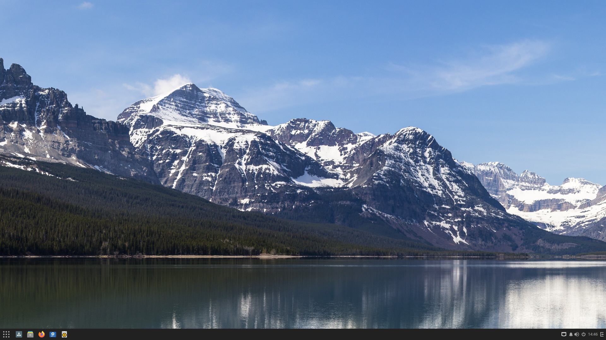
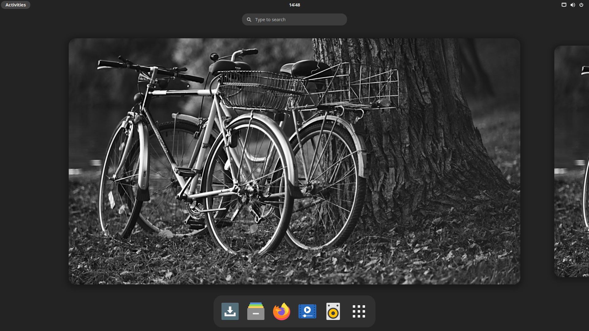
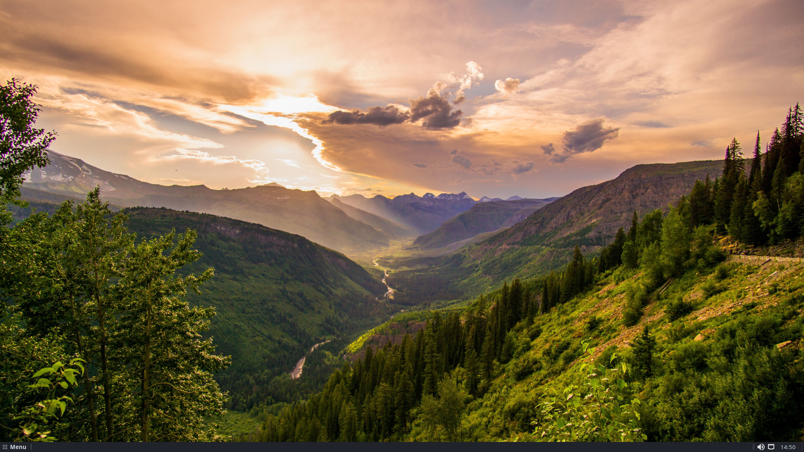
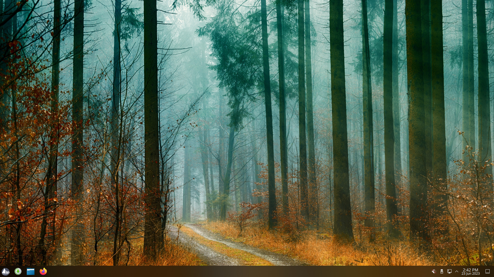

We are proud to announce the immediate availability of Solus 4.4, a new Solus 4 series release named _Harmony_. This release delivers new desktop environment updates, software stacks, and hardware enablement.

<!--more-->

## General

### Default Applications

All our editions feature:

- Firefox 114.0.1
- LibreOffice 7.5.3.2
- Thunderbird 102.12.0

For audio and video multimedia playback, we offer software out-of-the-box that caters specifically to our desired experience for each edition.

- Budgie, GNOME, and MATE editions all ship with Rhythmbox for audio playback, with the latest release of the Alternate Toolbar extension to provide a more modern user experience.
- Budgie and GNOME ship with Celluloid for video playback.
- MATE ships with VLC for video playback.
- Plasma ships with Elisa for audio playback and Haruna for video playback.

### Hardware and Kernel Enablement

This release of Solus ships with Linux kernel 6.3.8, enabling us to provide support for a broader range of hardware, such as:

- Secure Boot support. See our [documentation](https://help.getsol.us/docs/user/quick-start/installation/secure-boot) for enablement.
- AMD Radeon RX 7600, 7900 XT, and 7900 XTX cards.
- Intel Arc cards
- NVIDIA 40 series cards
- Support for laptops defaulting their NVMe controllers to RAID mode
- Support for laptops with ATH11K wifi
- Better support for various light sensors and accelerometers

Additionally, we continue to refine our kernel configuration, and this release features changes such as:

- [zram](https://wiki.archlinux.org/title/Zram) enabled by default out of the box providing a better user experience for devices with low amount of memory (< 3GB)
- Enable `CONFIG_NFT_FIB_INET` to allow Firewalld/nftables to work

Mesa has been upgraded to 23.0.3. This introduces various improvements, such as:

- Nouveau 3D support for NVIDIA 30 series GPUs
- Improvements to Zink driver
- RADV Vulkan mesh shaders
- RADV ray-tracing changes
- Optimizations for Intel Arc / DG2 graphics

## Budgie

Solus ships with the latest 10.7 series release of the Budgie Desktop environment, [10.7.2](https://blog.buddiesofbudgie.org/budgie-10-7-2/). This features GNOME 43 stack support alongside all the fixes and quality-of-life improvements listed below. We welcome you to check out the full release notes from Buddies of Budgie listed above.

The Budgie edition of Solus now ships with the Nemo file manager by default instead of Nautilus. We decided to make this change as, since our last release, Nautilus has been ported to GTK4 and libadwaita. Because of this, it no longer fits in with the look and feel of the rest of the desktop environment. Additionally, a few features that people relied on were removed without replacement, prompting the desire to find a familiar and feature-rich file manager alternative.

### Bug Fixes and Cleanup

- No longer reload the Budgie Menu during a AppIndex change when the menu is open
- Fix large fonts pushing the close button out of notification popups
- Notification pop-ups will no longer steal focus
- Notifications should no longer cause screen flickering when in a full-screen application

### Quality-of-life Improvements

- New widget API for Raven
- New application indexer for Budgie Menu and Run Dialog
- New power dialog for session management
- Dual-GPU support in Budgie Menu when launching applications
- Quick XDG directory access in Budgie Menu
- Buttons for settings added to Budgie Menu
- New Budgie Screenshot application
- Notifications will now fade in and out upon showing and closing
- When a window leaves full screen mode, Budgie will now show a notification popup to alert the user that there are notifications that they didn't see
- Notification sounds are now supported
- The Media Player widget now has a more compact design
- You can now click on the widget header icons for sound output and input to mute the respective device
- New usage monitor widget for Raven

Upstream release notes can be found [here](https://blog.buddiesofbudgie.org).

## GNOME

Solus 4.4 GNOME Edition ships with the latest GNOME 43 series release, 43.5.

### Defaults Changes

- Enabled Dark Mode by default
- Changed the default shell theme to Adwaita
- Changed the default GTK theme to Adwaita-Dark

### Bug Fixes, Cleanup & Quality-of-life Improvements

- The styling of GNOME’s system UI has been updated.
- A redesigned system status menu, which allows quickly changing commonly used settings. The new design also makes it easy to see the status of your settings at a glance.
- A new global dark UI style preference was added.
- Refreshed look and feel of the Settings app.
- Redesigned screenshot experience.
- The ability to install websites to the desktop, as apps.
- File indexing in Tracker has been dramatically improved, with faster startup times and reduced memory usage.
- Some of the animations in the Activities Overview have been optimized, so that they are smoother.
- Improvements in how full-screen apps are rendered will result in reduced energy consumption for video playback and increased frame rates for games.
- The Files app has received multiple improvements since its port to GTK4.
- Boxes, GNOME’s virtual machine app, has a redesigned preferences view and has better support for modern UEFI operating systems.
- The Calendar, Contacts and Calls apps have all been enhanced.

Upstream release notes can be found [here](https://release.gnome.org/)

## MATE

Solus 4.4 MATE Edition ships with the latest MATE 1.27 series release, 1.27.1.

### ⚠️ Planned deprecation of the MATE Edition 😱

As we implement our strategy for 4.5, including the adoption of PipeWire and Wayland where feasible, we have been evaluating the current state of the desktop landscape. In particular, we have looked at how various projects have implemented these solutions. In doing so, it has become clear that Wayland has continued to mature as more projects work to phase out X.Org support and collaborate on modern solutions for important aspects of the desktop experience. These include: Color Management, High Dynamic Range (HDR), and Variable Refresh Rate (VRR) support.

After evaluating MATE, we have concluded that it does not have a credible and active Wayland strategy, with the project itself effectively being on life support. As such, we have decided to sunset the MATE Edition. Hence, Solus 4.4 will be the last release to ship a MATE edition ISO. For the time being, we will continue to support the actual MATE packages in order to ensure that our users will be able to update their existing MATE installations.

**Going forward, to serve users looking for a simple, lightweight GTK-based desktop experience, we will instead ship an edition with Xfce in the near future.** Xfce sees considerably more development than MATE and has a viable Wayland strategy. Work on building out the Xfce stack has already started and will begin landing in the unstable repo shortly after the 4.4 release.

The reality is that, at some point in the not-too-distant future, we will need to deprecate and remove the MATE packages from Solus. We would like to stress, however, that we are working to provide a seamless upgrade path from MATE to Xfce for those users with an existing MATE installation. You can expect to see more information on this topic soon.

### Defaults Changes

- Changed the default GTK theme to Qogir-Dark.

### Bug Fixes and Cleanup

- The MATE 1.27 series upstream changes include reliability and accessibility fixes plus small bug fixes and translation updates.
- The Solus MATE edition now uses `xorg-driver-input-libinput` instead `xorg-driver-input-evdev` to make keyboard layouts other than en_US actually work in Xorg in both the greeter and the MATE desktop session.
- Added qxl video driver by default to bring the MATE edition to parity with our other editions re. virtualization video driver support.

Upstream release notes can be found [here](https://github.com/mate-desktop/mate-desktop/releases)

## Plasma

Solus 4.4 Plasma Edition ships with the latest Plasma Desktop 5.27.5, KDE Frameworks 5.106.0, KDE Gear 23.04.2, and, the KDE branch for QT 5.15.9, which brings many new features. Some highlights:

- Many new look and feel customization options to allow you to personalize your Plasma experience.
- Improved gesture support for touchpads, and touchscreens.
- Support for floating panels.
- Overview View - Use this to manage all your desktops and applications. (Win + w)
- Touch Mode - Support for touchscreen displays.
- Big Screen Mode - A new mode for using Plasma with your TV.
- Associate a fingerprint with a user and use it to unlock your session (but, not login).
- Improved window tiling support and support for custom window tiling layouts.
- System Settings will now highlight which settings have been changed.
- Much improved multi-monitor support, these setups will now work much more reliably.
- System widgets such as Clipboard, Network, Bluetooth and Audio have been much improved.
- Many new Krunner features, such as currency conversion and showing the time in another timezone.

Upstream release notes for Plasma since Solus 4.3 can be found here:

- [Plasma 5.23.0](https://kde.org/announcements/plasma/5/5.23.0/)
- [Plasma 5.24.0](https://kde.org/announcements/plasma/5/5.24.0/)
- [Plasma 5.25.0](https://kde.org/announcements/plasma/5/5.25.0/)
- [Plasma 5.26.0](https://kde.org/announcements/plasma/5/5.26.0/)
- [Plasma 5.27.0](https://kde.org/announcements/plasma/5/5.27.0/)

### Defaults Changes

- Improvements to the SolusDark and SolusLight themes.
- Replaced the default application launcher with Kickoff.
- Replaced the default system monitor to System Monitor from KSysGuard.
- Enabled the Wayland Session to be available out of the box.

## Download

To download our latest Editions, you can go to our [Download](/download) page, where direct links and torrents are available!

## Thank You

A big thank-you to our backers on OpenCollective who provided us with valuable beta testing for this release. We are also thankful for the ongoing financial support. If you are interested in funding Solus, helping us cover ongoing project expenses and opening the door to direct financial compensation for developer work, consider supporting us on [Open Collective](https://opencollective.com/getsolus)

If you are interested in other ways of getting involved, we encourage you to check out our dedicated [documentation](https://help.getsol.us/docs/user/contributing/getting-involved) on doing so!

## Future

In our last blog post ["A New Voyage"](/2023/04/18/a-new-voyage), we talked about the challenges Solus has faced, and the steps we took to right the ship. Our next blog post will be an update on our efforts to expand the Solus Staff to include some familiar community members, as well as a more general update on the state of Solus and the move to Wayland, PipeWire, and Xfce.
