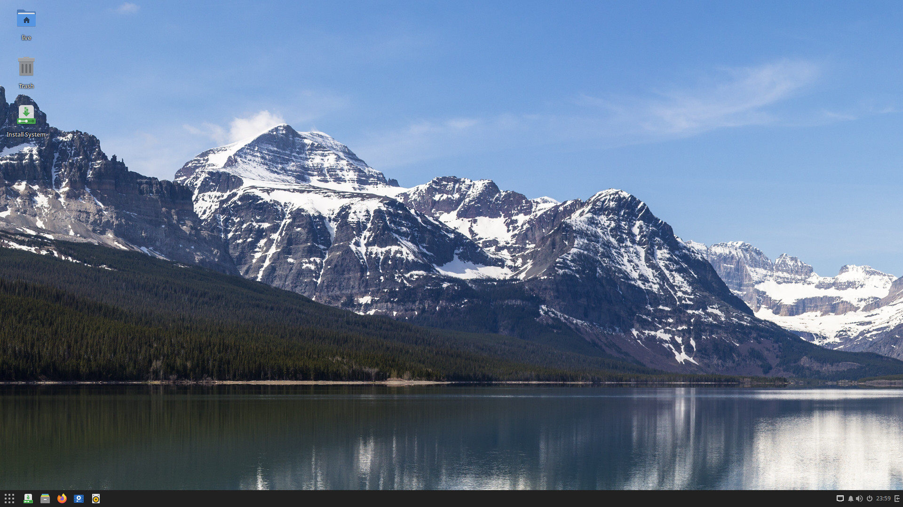
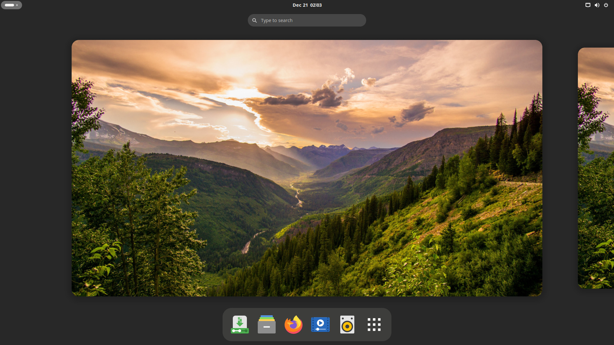
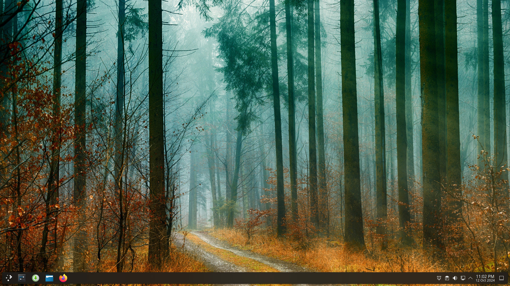
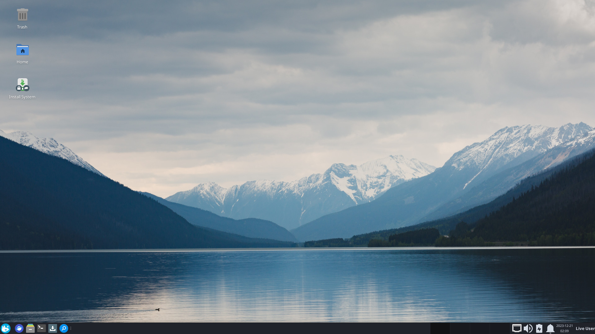

---
authors:
- image: https://avatars.githubusercontent.com/u/23007135?v=4
  link: https://github.com/DavidJHarder
  name: David Harder
categories:
- news
- releases
date: "2024-10-14"
featuredimage: /solus-4.6-featured.jpg
title: Solus 4.6 Released
url: /2024/10/14/solus-4-6-released
---

The Solus team is proud to announce the release of Solus 4.6 _Convergence_. This refresh brings the usual collection of Desktop Environment updates, kernel enhancements, and increased hardware support.

Note that the file names of the ISOs is slightly different than they used to be. Each file now has the release channel and date that the ISO was generated in the name.

## General

### Default applications

All our editions feature:

- Firefox 131.0.3
- LibreOffice 24.2.5.2
- Thunderbird 128.3.1

For audio and video multimedia playback, we offer software out-of-the-box that caters specifically to our desired experience for each edition.

- Budgie and GNOME editions ship with Rhythmbox for audio playback, with the latest release of the Alternate Toolbar extension to provide a more modern user experience.
- Budgie and GNOME ship with Celluloid for video playback.
- XFCE ships with Parole for multimedia playback.
- Plasma ships with Elisa for audio playback and Haruna for video playback.

### Usr-merge

- Over the summer, the Solus team has been tackling the [Usr-Merge conundrum](https://getsol.us/2024/09/04/usr-merge/); read Evan's excellent blog post for the full story. We have now reached the end of Stage 3 on our rollout plan: All users with an updated system now have a Usr-Merge'd system. Any users that create a fresh installation with today's ISOs will also have a merged system. We expect stage 4 to complete Soon™️.

As a reminder, the Usr-Merge brings Solus in line with the compatibility efforts being spearheaded by Fedora and other distributions. More urgently, *systemd* requires the filesystem be merged for version 255. Additionally, the Usr-Merge is a necessary (though not sufficient) condition for Solus to adopt Serpent tooling in the future.

### Experimental Software Centers

We continue to ship *solus-sc* (Solus Software Center) as the default graphical package manager, but close watchers of Solus development know that we have had experimental support for GNOME Software and KDE Discover included in our repository for many months now.

These software centers let users update software distributed by the Solus repositories, as before, *and* install and manage Flatpaks for third-party packages. Flathub is configured as a Flatpak remote by default.

Curious Budgie, GNOME and XFCE users can install *gnome-software*, while Plasma users should install *discover*.

### Kernels and Mesa

This release of Solus ships with Linux kernel 6.10.13. For those needing an LTS kernel, we provide 6.6.54.

Our `linux-current` kernel no longer includes AppArmor patches; see [this](https://getsol.us/2024/07/15/dropping-apparmor-kernel-patches/) prior blog post. Dropping the patches reduces the kernel maintenance workload. Snaps now run in partial confinement, and our preferred source of third-party applications continues to be Flatpaks. The patches are still included with our LTS kernel branch.

Mesa has been upgraded to 24.2.3. The [24.2.0](https://docs.mesa3d.org/relnotes/24.2.0.html) release introduced a few new features:

- VK_KHR_dynamic_rendering_local_read on RADV
- VK_EXT_legacy_vertex_attributes on lavapipe, ANV, Turnip and RADV
- VK_MESA_image_alignment_control on RADV
- VK_EXT_shader_replicated_composites on ANV, dozen, hasvk, lavapipe, nvk, RADV, and Turnip
- VK_KHR_maintenance5 on v3dv
- VK_KHR_maintenance7 on RADV
- VK_EXT_depth_clamp_zero_one on v3dv
- GL_ARB_depth_clamp on v3d
- Defaulting to a new shader cache implementation, reducing filesystem overhead.

This, and newer releases, have also shipped many bug fixes.

The full upstream release notes are [here](https://docs.mesa3d.org/relnotes/24.2.3.html).

## Budgie

Solus ships with [Budgie 10.9.2](https://blog.buddiesofbudgie.org/budgie-10-9-2-released/), the latest release of the Budgie Desktop. The mature 10.9.x series brings some small improvements, and builds on Budgie's reputation for stability and polish.

### Default applications

With this Solus release, the Budgie edition now uses some different default applications. As most GNOME apps have been ported to GTK 4 and libadwaita, the Budgie experience has had to shift to achieve a consistent look and feel. Where applicable, we are now using [XApps](https://linuxmint-developer-guide.readthedocs.io/en/latest/xapps.html) in place of GNOME apps. XApps are generic applications for GTK-based desktop environments.

- XReader has replaced Evince
- XViewer has replacecd Eye of GNOME
- Engrampa has replaced File Roller

Upstream release notes can be found [here](https://blog.buddiesofbudgie.org).

## GNOME

Solus 4.6 GNOME Edition ships with GNOME 46.5.

### Added Features

- Global Search
- Enhanced files app
- Upgraded online accounts, now with OneDrive support
- Remote login with RDP

### Bug Fixes, cleanup & quality-of-life improvements

- Settings improvements
- Accessibility improvements

Upstream release notes can be found [here](https://release.gnome.org/46/)

## Plasma

Solus 4.6 Plasma Edition ships with the latest Plasma Desktop, KDE Frameworks, KDE Gear, and the KDE branch for QT. The most notable change is the introduction of Plasma 6. If you're looking for Wayland, Plasma still has you covered.

Upstream release notes:

- [Plasma 6.1.5](https://kde.org/announcements/plasma/6/6.1.5/)
- [KDE Gear 24.08.1](https://kde.org/announcements/gear/24.08.1/)
- [KDE Frameworks 6.6.0](https://kde.org/announcements/frameworks/6/6.6.0/)
- [QT 6.7.3](https://code.qt.io/cgit/qt/qtreleasenotes.git/about/qt/6.7.3/release-note.md)
- [sddm 0.21.0](https://github.com/sddm/sddm/blob/v0.21.0/ChangeLog)

## XFCE

We continue to call our XFCE Desktop a *beta* experience, though we have been shipping this desktop since the release of Solus 4.5.

The XFCE edition includes:

- XFCE version 4.18
- Mousepad 0.6.2
- Parole 4.18.1
- Ristretto 0.13.2
- Thunar 4.18.11
- Whiskermenu 2.8.3

Since Solus 4.5, we've added the following to our default XFCE experience:

- Engrampa has replaced File Roller
- XReader is now the default PDF reader
- The keyboard layout switcher plugin is now installed by default

While not installed by default, a couple of other XFCE-related packages have been added since our last release:

- xfdashboard
- xfce4-battery-plugin
- xfce4-clipman-plugin

## Known Issues

- [Plasma ISO requires creation of a kwallet key file before connecting to a network](https://github.com/getsolus/packages/issues/1429)
- When running `eopkg check`, linux-current and linux-lts may show as broken. These are false positives, and can be disregarded.
- Users with the proprietary NVIDIA drivers and the 6.10 kernel may experience a black screen or errors on a black screen after waking the system from sleep.
- [Sometimes there is no image when booting GNOME in a VM](https://github.com/getsolus/packages/issues/1107)
- [GNOME sometimes boots to black screen and X cursor in VM](https://github.com/getsolus/packages/issues/1548)

## Download

Go to our [Download](/download) page and select direct download or torrent. Happy installing!

## Thank you

Solus infrastructure is funded solely through voluntary contributions to our [Open Collective](https://opencollective.com/getsolus). We are grateful to everyone who has joined us there.

Our open collective backers get access to testing ISOs between formal releases. For more information, [click here](https://opencollective.com/getsolus#category-CONTRIBUTE).

Thanks also to all of you who have helped build the Solus community; we love all your contributions! We encourage anyone who want to join the wider Solus community to check out the dedicated [Getting Involved](https://help.getsol.us/docs/user/contributing/getting-involved) page on our Help Center.

## Past and future

It has now been over a year and a half since the team relaunched Solus. 2023 saw us complete numerous migrations as we upgraded our infrastructure, while 2024 has been a year moving through much calmer waters.

Looking forward, our next goal is to make a release with the latest Linux kernel, GNOME 47, and the latest Plasma and XFCE versions. In addition, we want to begin the epoch process alluded to in the Usr-Merge blog post so that we can safely enable a Python 3 version of `eopkg` by default, as well as removing compatibility symbolic links that were added pre-Usr-Merge.

We are excited to see what the future has in store. Keep your eye on our [forums](https://discuss.getsol.us) and [Mastodon](https://fosstodon.org/@Solus) for the latest Solus news. We'll see you again soon.
