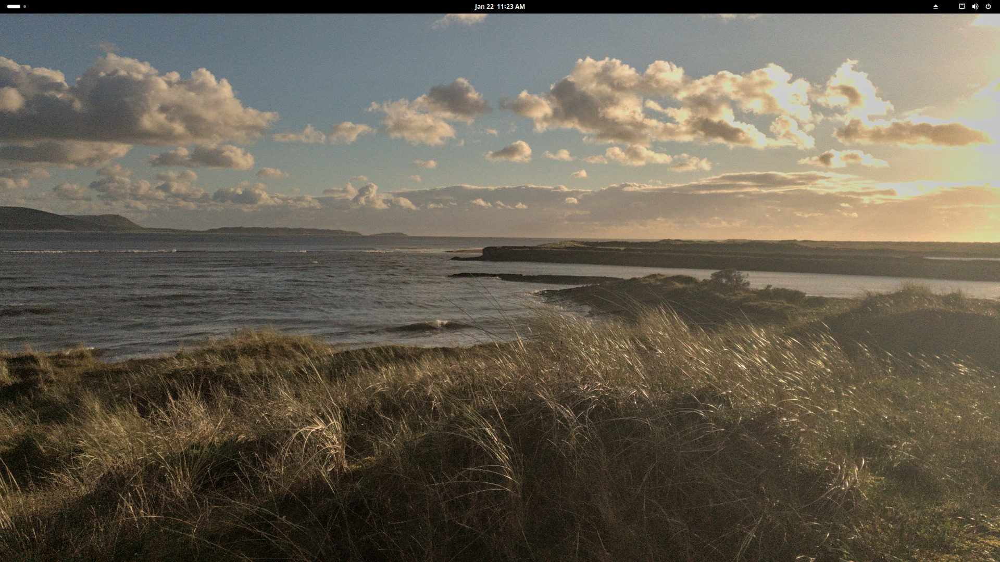
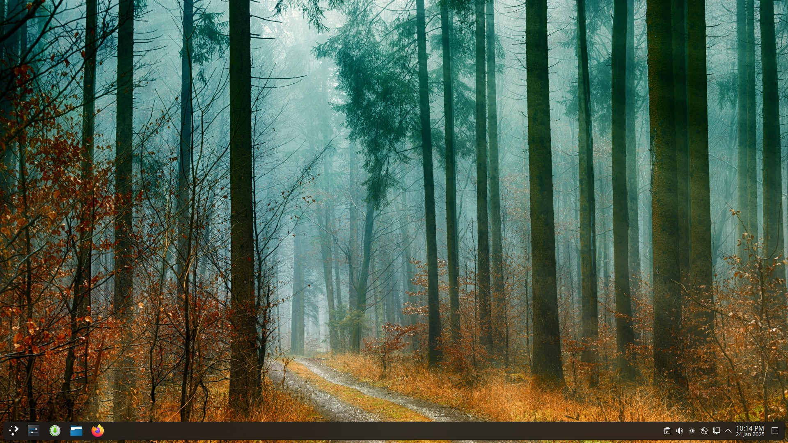
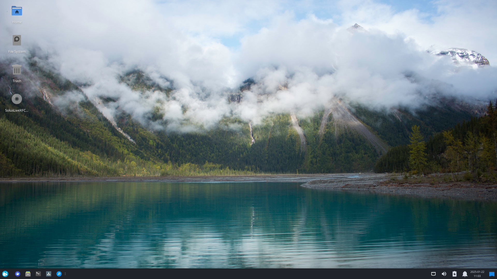

New Year, new ISOs! We are proud to announce our latest release: Solus 4.7 _Endurance_. This release focuses on updating our editions, and refreshing the default kernels. We've called this release _Endurance_ to highlight our promise to users that we will continue to deliver timely updates to keep their systems stable and beautiful.

## General

### Default applications

All our editions feature:

- Firefox 134.0.2
- LibreOffice 24.8.4.2
- Thunderbird 128.6.0

For audio and video multimedia playback, we offer software out-of-the-box that caters specifically to our desired experience for each edition.

- Budgie and GNOME editions ship with Rhythmbox for audio playback, with the latest release of the Alternate Toolbar extension to provide a more modern user experience.
- Budgie and GNOME ship with Celluloid for video playback.
- Xfce ships with Parole for multimedia playback.
- Plasma ships with Elisa for audio playback and Haruna for video playback.

### Try a new Software Center

We encourage you to try one of the new Software Centers as a replacement for _solus-sc_ (Solus Software Center). A new software center gets you out-of-the-box support for Flatpaks, and better app descriptions through [Appstream metadata support](https://www.freedesktop.org/software/appstream/docs/chap-Quickstart.html).

Our contributors and staff have been hard at work adding and fixing the `metainfo.xml` files used for Appstream support. Our goal is for every packaged GUI application to have a working `metainfo.xml` file, so that the software centers can show users all kinds of information about an app before they decide to install it.

Curious Budgie, GNOME and Xfce users can install _gnome-software_, while Plasma users should install _discover_.

## Better initial support for new NVIDIA cards

Our ISO images now include firmware support for more NVIDIA GPUs out-of-the-box. Some users with 4000 series cards were seeing black screens when trying to install Solus; this should now be fixed.

### Kernels and Mesa

Solus now ships Linux kernel `6.12.9`. For those who need an LTS kernel, we provide `6.6.70`. We plan to move to the `6.12.x` kernel series for LTS; if you are using the LTS kernel now, please try the `6.12.x` kernel so we can address any issues that may arise from the switch before it becomes mandatory.

Mesa has been upgraded to 24.3.3. See the [24.3.0](https://docs.mesa3d.org/relnotes/24.3.0.html) notes for new features, the full release notes are [here](https://docs.mesa3d.org/relnotes/24.3.3.html).

## Budgie

Solus ships with [Budgie 10.9.2](https://blog.buddiesofbudgie.org/budgie-10-9-2-released/), the latest release of the Budgie Desktop. The mature 10.9.x series brings some small improvements, and builds on Budgie's reputation for stability and polish.

Upstream release notes can be found [here](https://blog.buddiesofbudgie.org).

## GNOME

Solus GNOME Edition ships with GNOME 47.3, an update to the GNOME 47 _Denver_ series.

### Features Added in GNOME 47

- Accent Colors
- Enhanced Small Screen Support
- Screen Capture Hardware Encoding
- Faster, More Accurate GTK Rendering
- New Open and Save File Dialogs

Upstream release notes can be found [here](https://release.gnome.org/47/).

## Plasma

Solus 4.7 Plasma Edition ships with the latest Plasma Desktop, KDE Frameworks, KDE Gear, and the KDE branch for QT.

Upstream release notes:

- [Plasma 6.2.5](https://kde.org/announcements/plasma/6/6.2.5/)
- [KDE Gear 24.12.1](https://kde.org/announcements/gear/24.12.1/)
- [KDE Frameworks 6.10.0](https://kde.org/announcements/frameworks/6/6.10.0/)
- [QT 6.8.1](https://code.qt.io/cgit/qt/qtreleasenotes.git/about/qt/6.8.1/release-note.md)
- [sddm 0.21.0](https://github.com/sddm/sddm/blob/v0.21.0/ChangeLog)

## Xfce

Our Xfce experience has been updated to version 4.20. This is a big milestone for the Xfce project: It brings _very_ experimental support for Wayland. You can take the tour of the latest release [here](https://xfce.org/about/tour420).

The Xfce edition includes:

- Xfce version 4.20
- Mousepad 0.6.3
- Parole 4.18.2
- Ristretto 0.13.2
- Thunar 4.20.1
- Whiskermenu 2.8.3

## Known Issues

- [Plasma ISO requires creation of a kwallet key file before connecting to a network](https://github.com/getsolus/packages/issues/1429).
- When running `eopkg check`, `linux-current` and `linux-lts` may show as broken. These are false positives, and can be disregarded.
- [Sometimes there is no image when booting GNOME in a VM](https://github.com/getsolus/packages/issues/1107).
- [GNOME sometimes boots to black screen and X cursor in VM](https://github.com/getsolus/packages/issues/1548) This appears to be an upstream bug.

We will keep an up to date list of [known issues for 4.7 on the forums](https://discuss.getsol.us/d/11310-known-issues-47).

## Download

Go to our [Download](/download) page and select direct download or torrent. Happy installing!

## Thank you

This release I would like to highlight the work done by our newly-minted Solus Cleanup Crew ™. This wonderful group has been working through a series of tasks that require a particular kind of dedication. As an example, take a look at the [homepage task](https://github.com/getsolus/packages/issues/411). More than a year ago, we started a clean-up of one particular field in the files that define our packages. Now, we're very close to finishing that task, which required editing ~2,300 packages. You can follow their work in the [Contributor Round-ups](https://discuss.getsol.us/d/11271-contributor-roundup-2) we publish from time to time on our forum.

Thank you to everyone who supports our work financially through [Open Collective](https://opencollective.com/getsolus). We are grateful to all our backers. As a reminder, OpenCollective members get access to testing ISOs between formal releases. For more information, [click here](https://opencollective.com/getsolus#category-CONTRIBUTE).

## Future plans 

In keeping with our *Endurance* theme for this release, we are proud to have delivered another year of stable updates to all our users. We plan to mix in a few interesting changes with our next release, along with the usual updates; stay tuned.
