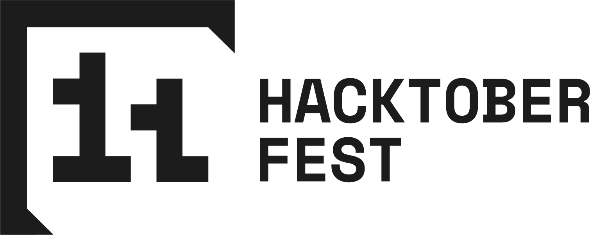

---
authors:
- image: https://avatars.githubusercontent.com/u/5157277?v=4
  link: https://github.com/EbonJaeger
  name: Evan Maddock
tags:
- news
date: 2025-10-01T12:40:32-04:00
title: "Hacktoberfest 2025"
url: "/2025/10/01/hacktoberfest-2025"
---

Heya folks! It's now October, and that means [Hacktoberfest](https://hacktoberfest.com)! It is an annual event that "encourages people to contribute to open source throughout October", while earning rewards. Hacktoberfest is an excellent way to start getting involved in Open Source, and many projects participate in the event. You can make contacts in different projects, get mentoring, and practice your skills. On top of that, you can get [cool badges](https://hacktoberfest.com/about/#rewards)!

# Our goals

We have two goals again this year. First, we have a lot of [open issues on our package repository](https://github.com/getsolus/packages/issues), and we would love to close some of them. There are currently three pinned issues that are a great place to start; you don't even need to have any programming experience.

- [appstream: Add metainfo to all packages containing a .desktop file](https://github.com/getsolus/packages/issues/1389)
- [Packages with insecure `http` or dead link as homepage](https://github.com/getsolus/packages/issues/5522)
- [Add monitoring.yaml to all packages in the repo](https://github.com/getsolus/packages/issues/4121)

If you're looking for something a bit more involved, we also have plenty of software that has been accepted for inclusion in the repository, but has not had anyone step up to package or maintain them. You can see them all [here](https://github.com/getsolus/packages/issues?q=sort%3Aupdated-desc%20is%3Aissue%20is%3Aopen%20label%3A%22State%3A%20Approved%22).

Our second goal is to slim down the number of [open issues](https://github.com/getsolus/help-center-docs/issues) on our documentation for the Help Center. Our documentation is written in Markdown, and you really don't need any programming knowledge to contribute. Improving our Help Center articles is a great way to help make Solus easier to use by the community.

# Getting involved

- [Register](https://hacktoberfest.com/auth/) on the Hacktoberfest website
- Read up on [what it is and how to participate](https://hacktoberfest.com/about/)
- Check out our [docs on packaging](https://help.getsol.us/docs/packaging)
- Join our [Matrix space](https://matrix.to/#/#solus:matrix.org), we use the Solus Packaging room to discuss packaging work.
- Find something(s) to work on
  - For development / bug triage: look in the [Solus Packages repository](https://github.com/getsolus/packages/issues)
  - We also need help with some issues in [our Help Center repository](https://github.com/getsolus/help-center-docs/issues)

    Anything labeled "Hacktoberfest", "Good First Issue", "Package Request" or "Help Wanted" is a good candidate for new folks (but don't feel limited to them)
- Do work and create pull requests in the Solus repositories
- At least four of your PRs / MRs need to be accepted and merged (across any and all projects which are participating) for you to complete Hacktoberfest

Happy hacking!
