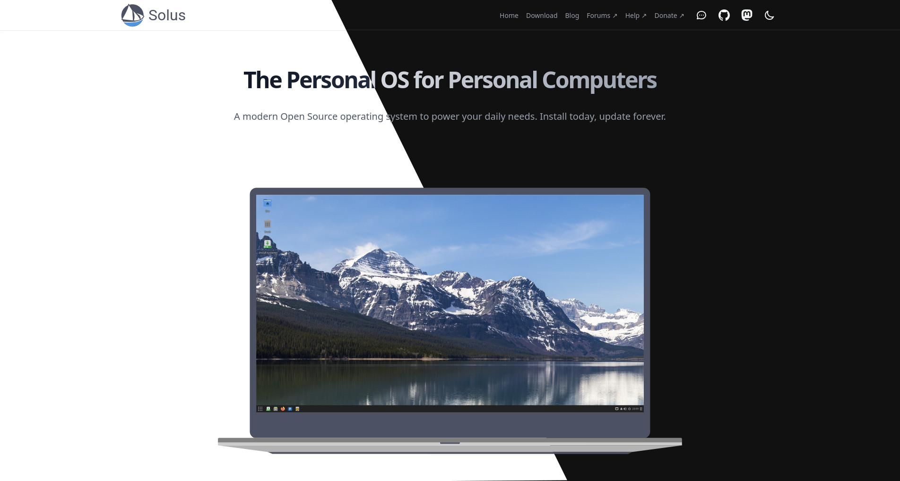

---
authors:
- image: https://avatars.githubusercontent.com/u/5157277?v=4
  link: https://github.com/EbonJaeger
  name: Evan Maddock
tags:
- news
date: 2025-11-22
title: "Unveiling Our New Website"
url: "/2025/11/22/unveiling-our-new-website"
---



Heya folks, we have some exciting news to share! Today, after many months of work, Solus has a new website! A *lot* of work has gone into this project, and we are all very excited to finally deploy it for everyone to use.

We've chosen to do away with the old custom Solus theme for Hugo, and adopt the [Hextra](https://imfing.github.io/hextra/) theme. It is a modern theme that supports blogs, documentation, and regular static pages. Importantly, Hextra is actively maintained, and has a good community and friendly developers.

## What's wrong with the old site?

You may be wondering why we decided to replace the old website. There are a few reasons.

First of all, the old site was created using something called "Solbit", which aimed to be a unified look and feel for both the main website, and the Help Center. Since we moved to Docusaurus for the Help Center, Solbit was only used for the main website. Now, this all sounds good in theory, but the reality is that Solbit was not easy to work with. To compound the matter, the website used a mishmash of Solbit and its own custom Hugo theme, making it even harder to do work on the site. Most of your time would be spent trying to find in which of three different places a component or style might be located, only to find that there are versions in multiple places and you chose the wrong one.

Second, information on the old website was spread out across multiple pages. Accessing some of the pages was also difficult; links to them were not obvious as they appeared in page content and not the navigation bar or footer.

Third, the blog was kind of brittle. We were limited in the formatting we could do on posts because of missing Markdown support. For example, we could not do code blocks in posts because it wasn't implemented.

## Goals

In taking a hard look at the old website, we came up with clear goals that we wanted to achieve. One thing we wanted to do was make the content of the entire website easier to access. It should be clear how to navigate to every page on the website. Next, we wanted to try to consolidate the information on the site. Users shouldn't have to go through three different pages to get the information they want. Third, there should be some sort of visual consistency across the website. Having a consistent look and feel makes the site look more professional and cohesive.

## In with the new

Now that we know the reasons for the change, what have we actually done? Frankly, a *lot*; there isn't a single page that wasn't touched, and most received a total redesign. Too much changed to list *everything*, and besides, part of the fun is exploring the new site to find the differences. Still, I'll talk about the highlights.

### Home page

Right off the bat, you'll notice that the home page is completely different. Users are greeted by a short, bold blurb about Solus, and a preview image front-and-center. The laptop image has been re-created by Malfisya, depicting a more modern laptop than the original site. Below that, prominent buttons to take you to the Help Center or download page, making them much more accessible. The rest of the page tells visitors about Solus.

### Editions

The editions page is where you go to download your preferred edition of Solus. We kept the old grid layout, but redesigned it to look more modern and appealing. Of all of the pages on the website, this one probably changed the least, if you can believe it.

### Technology

Our technology page has seen changes to better showcase the software and technology that Solus develops. It gives a lot more information about each project, without appearing cluttered and cramped like the old page. The page no longer lists software that we include in the repository, focusing only on software created by Solus.

### Blog

The index page for our blog posts is a bit simpler than the old site. It is largely unchanged from the stock Hextra blog page. The only difference is that we've added a button at the top for the RSS feed. Compared to the old blog page, you'll notice that there are no more preview images. There is [an upstream issue to add that support](https://github.com/imfing/hextra/issues/565), but it has not been done at the time of writing this post.

Blog posts now have a Table of Contents to make it easier to jump to sections in a post. They also support a broader range of Markdown, so we can more easily add images, and add real code blocks:

```rust
fn main() {
    println!("Hello, world!");
}
```

Posts can now have multiple authors listed, complete with avatars and links. On the old blog, only a single author could be listed, and they had to be defined elsewhere in a YAML file.

### Branding & Press

The branding and press pages both saw significant reworks. The press page now has a nicer layout, with proper spacing between sections to make it more accessible and readable.

My favorite change across the entire site has to be the new branding page. It now contains a lot more information about the Solus branding. We've included new sections on the colors we use, and our position on merchandise. This page, while being something that most of our visitors won't ever see, I feel best embodies what we wanted to achieve with this endeavor: making the information on our website clearer, more readable, and, I hope, visually pleasing.

## Closing words

We started work on the new website on May 1, 2025. It has been quite the journey to get here. When I started this project, I had basically 0 experience with making a Hugo website. Since then, I have learned a lot, both about Hugo, and about general design. Each page took multiple iterations before we landed on the designs we have now. As with any project, it is never truly finished, but we feel this one is now in a place where we can make it the Solus website. From all of us, we hope that you enjoy the new design, and we will see you for the next blog post.
