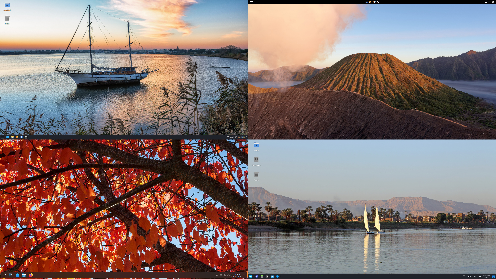
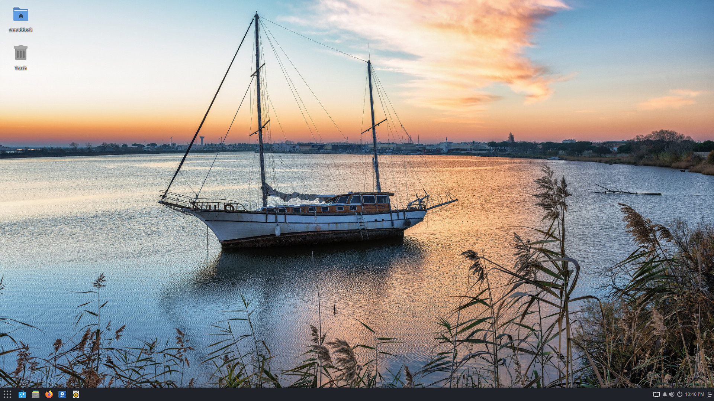
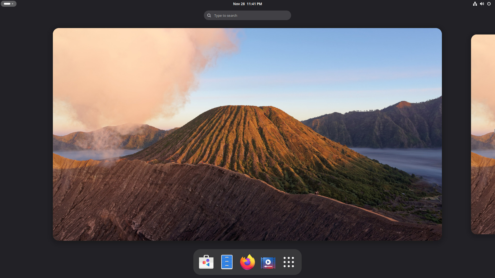
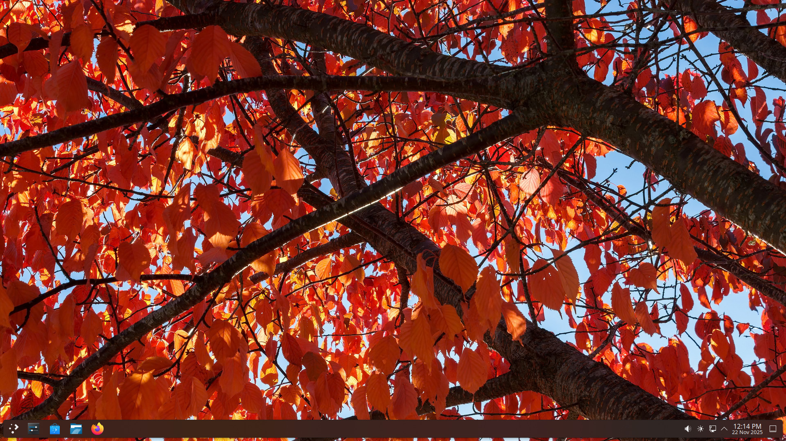
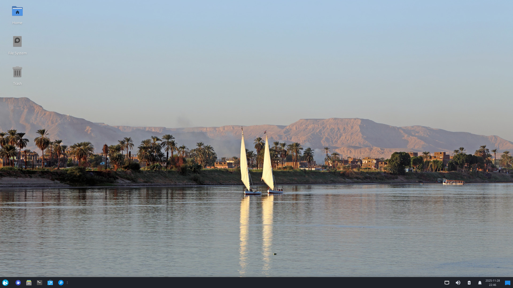

---
authors:
- image: https://avatars.githubusercontent.com/u/5157277?v=4
  link: https://github.com/EbonJaeger
  name: Evan Maddock
tags:
- news
- releases
date: '2026-04-18T10:00:00-04:00'
title: 'Solus 4.9 Released'
url: /2026/04/solus-4-9-released
---

It's time for the first Solus release of 2026! We've made some under-the-hood changes aimed at making it easier and more intuitive for users to manage their systems, and we've addressed some parts of the installation process. 

Welcome to Solus 4.9 *Serenity*! In a world filled with turbulence, we aim to provide a calm harbor. Read on to see what's new.

## What's new

### Service presets

We are now making use of systemd preset files to manage which services are enabled by default. We used to link services to a respective `target.wants` directory to make a service start automatically, but this has two issues: it causes systemd to not correctly show their status, and is slightly harder for us to manage. Preset files eliminate both of these problems.

### Privileged user group

For this release, we've changed the default privileged group from `sudo` to `wheel`. Most software assumes that the `wheel` group is the default sudo group, and we have to patch several packages to change it to use `sudo`. Switching to the usual `wheel` group means that maintaining these packages is easier for us, because we no longer have to worry about rebasing patches when software updates.

### Installation improvements

#### GRUB update

Solus now ships with GRUB 2.14 on legacy non-EFI systems. This version is notable in that GRUB now supports Argon2 encryption, meaning that systems can correctly be encrypted with LUKS2. That brings us to our Calamares changes.

#### Calamares update

The [Calamares](https://calamares.io) installer has been updated to the latest 3.4.2 version. An updated Calamares adds a couple of capabilities that the Solus configuration now takes advantage of.

Calamares 3.4.1 added an option for hybrid bootloader installation, meaning boot partitions are created for both `systemd-boot` and GRUB2, and one chainloads the other. We're leveraging this capability on legacy boot systems, eliminating a patch that we were carrying to achieve a similar result.

Now that we are on GRUB 2.14, we have changed the LUKS version used for disk encryption to version 2. Using LUKS2 is more secure than LUKS1, and also enables users to store their encryption key in the system's TPM, so partitions can be unlocked automatically.

#### EFI partition size

With this ISO, we are once again increasing the default size of the EFI boot partition. As time passes, the size of firmware modules, kernel modules, and NVIDIA packages continues to increase, and we want to remain ahead of these increasing storage requirements. Thus, the default recommended EFI partition size is now 2 GB.

## General

### Default applications

All our editions feature:

- Firefox 149.0.2
- LibreOffice 25.8.6.2
- Thunderbird 149.0.2

### Kernels and Mesa

Solus now ships with Linux kernel 6.18.21. While we also provide an LTS kernel, both branches are on the same version for the moment. Thanks to cooperation with [AerynOS](https://aerynos.com/), we are now also using the same set of patches and kernel configuration. For Solus users, this results in broader hardware enablement. To pair with the kernel, this release ships with Mesa 26.0.4.

## Budgie

Solus 4.9 Budgie Edition ships with [Budgie 10.9.4](https://github.com/BuddiesOfBudgie/budgie-desktop/releases/tag/v10.9.4). Not much has changed since the release of Solus 4.8, but expect big updates Soon™.


  With Budgie 10.10, coming to Solus **very soon**, Budgie will no longer support X11 at all, and will be *Wayland only*!


### New defaults

- Default terminal changed to [`ptyxis`](https://devsuite.app/ptyxis/).

## GNOME

Solus 4.9 GNOME Edition ships with GNOME 49.5, an update to the GNOME 49 Brescia series. This release comes with many bugfixes that will make your experience smoother. The full changelog can read be read [here](https://download.gnome.org/teams/releng/49.5/NEWS).


  With GNOME 50, coming to Solus **very soon**, GNOME will no longer support X11 at all, and will be *Wayland only*!


## Plasma

Solus 4.9 Plasma Edition ships with KDE Frameworks 6.24.0, KDE Plasma 6.6.4, and KDE Gear 25.12.3.


  With KDE Plasma 6.8, scheduled for release in October 2026, Plasma will no longer support X11 at all, and will be *Wayland only*! Users should try the Wayland session, and file issues so that it can be improved.


### Features added in KDE Plasma 6.6

- New and improved on-screen keyboard.
- Extract text from screenshots in Spectacle.
- Connect to a Wi-Fi network by scanning a QR code with the camera.
- Accessibility improvements and new accessibility settings.

Here are the upstream release notes:

- [KDE Frameworks 6.24.0](https://kde.org/announcements/frameworks/6/6.24.0/)
- [Plasma 6.6.4](https://kde.org/announcements/plasma/6/6.6.4/)
- [Gear 25.12.3](https://kde.org/announcements/gear/25.12.3/)

## Xfce

Solus 4.9 ships with all the latest Xfce 4.20 series software. Being a desktop environment that aims for a high degree of stability, there are not a lot of big changes since Solus 4.8.

## Download

Head on over to our [Download](/download) page to download the edition you wish to use. Happy installing!

## Thank you

We want to give a shout-out to all of our supporters on [OpenCollective](https://opencollective.com/getsolus). We are grateful to all of our backers who fund our work, and help us bring this Linux distribution to everyone. Solus could not operate without your help. Your donations pay for our server infrastructure and services like email. They also help reimburse contributors for long-term and complex package and development work. You can [become a backer](https://opencollective.com/getsolus#category-CONTRIBUTE) today for as little as $1 a month. Thank you.

*A previous version of this post was missing a warning about Budgie and X11. A warning has been added.*
